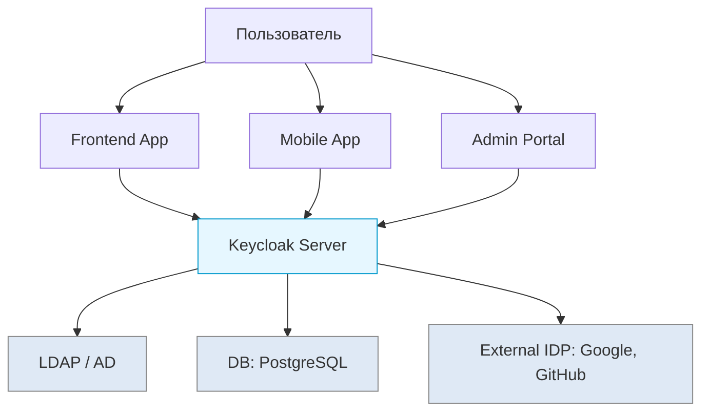
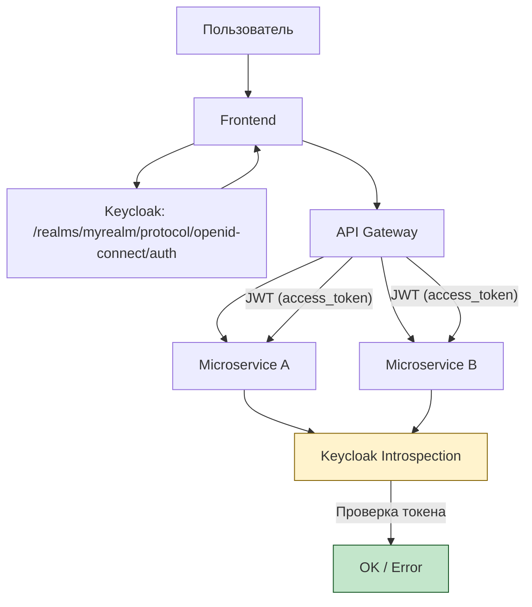

---
aliases:
  - Keycloak
  - Keycloak Server
---
# Keycloak
## ✅ Что такое **Keycloak**?

> **Keycloak** — это **open-source Identity and Access Management ([[IAM]]) сервер**, созданный Red Hat, который позволяет:
> - Реализовать **SSO**
> - Поддерживать **OAuth2**, **OpenID Connect**, **SAML**
> - Управлять **пользователями, ролями, клиентами**
> - Интегрироваться с LDAP, Active Directory
> - Настраивать **MFA**, **flow аутентификации**, **UI-темы**

> 🔥 Keycloak — это **ваш собственный Google Auth / Microsoft Entra ID**, но **вы управляете им сами**.

> cloak - плащ
---

### 🏗️ Архитектура Keycloak



---

### ✅ Ключевые возможности Keycloak

| Функция | Описание |
|--------|----------|
| **SSO** | Один вход — для всех приложений |
| **Identity Brokering** | Войти через Google, GitHub, Facebook |
| **User Federation** | Подключить LDAP или Active Directory |
| **Fine-grained Authorization** | Роли, группы, атрибуты |
| **Custom Login Pages** | Свои формы входа под бренд компании |
| **MFA / 2FA** | Поддержка TOTP, SMS, WebAuthn |
| **Account Console** | Пользователь может управлять своим профилем, сессиями, токенами |
| **Admin Console** | Администратор управляет всеми клиентами, пользователями, политиками |
| **APIs for Integration** | REST Admin API, адаптеры для Spring Boot, Quarkus, Node.js |

---

## ✅ Как Keycloak реализует SSO?

1. Пользователь заходит в `app1.company.com`
2. Приложение перенаправляет на `keycloak.company.com`
3. Пользователь вводит логин/пароль
4. Keycloak выдаёт **ID Token (JWT)** и **Access Token**
5. Пользователь переходит в `app2.company.com`
6. `app2` проверяет токен → **уже аутентифицирован**
7. Пользователь **не вводит пароль снова**

> ✅ **Токен хранится в браузере (sessionStorage)**  
> ✅ **Все приложения доверяют одному IdP (Keycloak)**

---

## ✅ Пример: Конфигурация клиента в Keycloak

```json
{
  "clientId": "frontend-app",
  "protocol": "openid-connect",
  "publicClient": true,
  "redirectUris": ["https://app.example.com/*"],
  "webOrigins": ["https://app.example.com"]
}
```

→ Это клиент, который может использовать **OIDC** для SSO

---

## ✅ Где используется Keycloak?

| Сценарий | Почему |
|----------|--------|
| ✅ Enterprise-системы | Централизованное управление доступом |
| ✅ Микросервисы | Все сервисы используют один IdP |
| ✅ Cloud-native приложения | Kubernetes + Istio + Keycloak = Zero Trust |
| ✅ MVP с быстрой аутентификацией | Запускаете за 5 минут |
| ✅ Вы не хотите зависеть от Google/Microsoft | Хостите Keycloak сами (on-prem, AWS, Kubernetes) |

---

## ✅ Почему именно Keycloak?

| Плюс | Объяснение |
|------|------------|
| ✅ **Open Source** | Бесплатно, можно модифицировать |
| ✅ **Легко интегрируется** | Адаптеры для Java, JS, Go, Python |
| ✅ **Самообслуживание** | DevOps может развернуть без помощи security-team |
| ✅ **Гибкие flow аутентификации** | Можно добавить шаг: «подтвердите email» или «введите код из SMS» |
| ✅ **Работает в Docker/Kubernetes** | Легко масштабировать |
| ✅ **Поддерживает OIDC, SAML, OAuth2** | Универсальный протокол |

---

## 🆚 Keycloak vs Другие IAM-решения

| Решение | Плюсы | Минусы |
|---------|-------|--------|
| **Keycloak** | ✅ Open source, ✅ self-hosted, ✅ гибкий UI | ❌ Нужно поддерживать |
| **Auth0** | ✅ Managed, ✅ отлично для стартапов | ❌ Дорого, vendor lock-in |
| **AWS Cognito** | ✅ Интеграция с AWS | ❌ Ограниченные фичи |
| **Microsoft Entra ID (Azure AD)** | ✅ Для MS-инфраструктуры | ❌ Сложно вне Azure |
| **Google Workspace** | ✅ Просто | ❌ Только для Google-экосистемы |

> ✅ **Keycloak — лучший выбор, если вы хотите контроль и независимость**

---

## ✅ Как Keycloak работает с микросервисами?



> ✅ **API Gateway** проверяет токен → **forward к микросервисам**

---

## ✅ Лучшие практики

| Практика | Объяснение |
|---------|------------|
| ✅ **Используйте HTTPS** | Обязательно — иначе токены утекают |
| ✅ **Настройте TLS между Keycloak и приложениями** | Даже внутри кластера |
| ✅ **Не храните пароли в Keycloak** | Если есть LDAP — делегируйте туда |
| ✅ **Включите MFA** | Для админов и чувствительных ролей |
| ✅ **Резервное копирование** | База данных Keycloak (PostgreSQL) должна бэкапиться |
| ✅ **Health checks** | `/auth/realms/master/.well-known/openid-configuration` |

---

## ✅ Финальный вывод

| SSO | Keycloak |
|-----|---------|
| ✅ **Концепция**: один вход — много сервисов | ✅ **Инструмент**, который эту концепцию реализует |
| ✅ **Стандарты**: OIDC, SAML, OAuth2 | ✅ Поддерживает все три |
| ✅ **Цель**: удобство и безопасность | ✅ **Цель**: контроль и масштабируемость |

> 🔑 **SSO — это *что*.**  
> **Keycloak — это *как*.**

---

## 💬 Цитата:

> _“With Keycloak, you can build your own Google-style authentication system.”_

---

## ✅ Итог: Когда использовать?

| Ваша ситуация | Рекомендация |
|---------------|--------------|
| ✅ У вас 3+ приложения | ✅ Внедряйте SSO |
| ✅ Хотите централизованную аутентификацию | ✅ Keycloak |
| ✅ Нет бюджета на Auth0/Cognito | ✅ Keycloak — open source |
| ✅ Работаете в on-premise | ✅ Keycloak идеален |
| ✅ Вам нужна простая регистрация | ❌ Keycloak сложнее, чем Firebase Auth |
| ✅ Вы строите платформу | ✅ Да — Keycloak как core |

---

## 📚 Где учиться дальше?

- [Официальная документация](https://www.keycloak.org/documentation.html)
- Book: *“Securing Applications with Keycloak”* — Bill Burke
- YouTube: *“Keycloak Explained”* — TechWorld with Nana
- GitHub: https://github.com/keycloak/keycloak

---

✅ **Keycloak — ваш шлюз к безопасности, масштабированию и SSO.**  
Учитесь — и вы перестанете писать аутентификацию вручную.

> 💡 **"Don’t roll your own auth. Use Keycloak."**