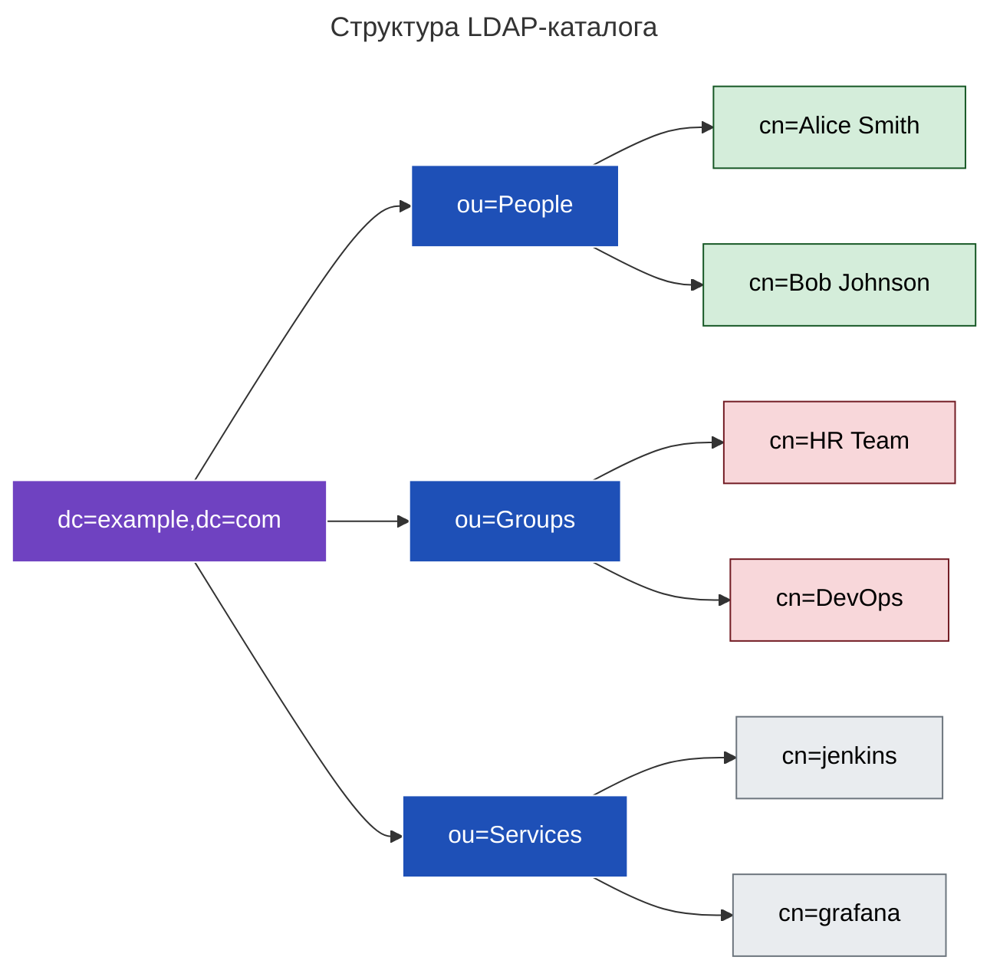
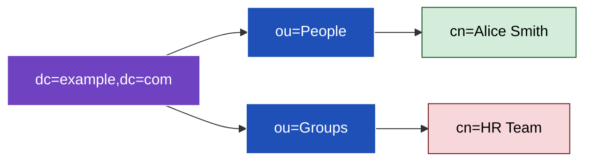

---
aliases:
  - Lightweight Directory Access Protocol
  - LDAP
  - Directory Information Tree
  - DIT
---
# Lightweight Directory Access Protocol
## LDAP

> **LDAP (Lightweight Directory Access Protocol)** — это **протокол для доступа к иерархическим каталогам**, содержащим информацию о пользователях, группах, устройствах и других ресурсах.
## LDAPS

**Всегда используйте LDAPS (LDAP over SSL/TLS).** Название расшифровывается как LDAP Secure. Это защищённая версия протокола LDAP, которая использует SSL/TLS для шифрования данных при передаче по сети.

### 💬 Простыми словами:
> Это **телефонная книга для сетей**: вы можете быстро найти, кто такой "Иван Петров", в какой он группе, какой у него email.

---

Пример: Directory Information Tree


---

## ✅ Зачем нужен LDAP?

| Цель | Объяснение |
|------|------------|
| ✅ **Централизованная аутентификация** | Один вход для всех систем (Windows, Linux, приложения) |
| ✅ **Управление пользователями** | Добавлять/удалять пользователей в одном месте |
| ✅ **Авторизация** | Кто имеет доступ к чему? |
| ✅ **Хранение метаданных** | Email, телефон, отдел, должность |
| ✅ **Интеграция с Active Directory** | LDAP — основа AD |

---

## ✅ Основные реализации LDAP

| Реализация | Описание |
|-----------|----------|
| **OpenLDAP** | Самая популярная open-source реализация |
| **Microsoft Active Directory** | Корпоративный стандарт (Windows-ориентированный) |
| **Apache Directory Server** | Java-based LDAP-сервер |
| **389 Directory Server** | От Red Hat (ранее Fedora Directory Server) |
| **FreeIPA** | Интегрированное решение (LDAP + Kerberos + DNS) |

---

## ✅ Основные понятия LDAP

### 1. **DIT (Directory Information Tree)**

> **DIT** — это **иерархическое дерево данных**, которое представляет всю структуру каталога.

- Корень → домены → организационные единицы → пользователи/группы
- Похоже на файловую систему: `/home/user/file.txt`

---

### 2. **Атрибуты (Attributes)**

> Каждая запись в LDAP состоит из **атрибутов** — пар "ключ-значение".

#### 💡 Пример записи пользователя:
```ldif
dn: cn=Alice Smith,ou=People,dc=example,dc=com
objectClass: inetOrgPerson
cn: Alice Smith
sn: Smith
mail: alice@example.com
userPassword: secret123
```

- `cn` = Common Name
- `sn` = Surname
- `mail` = Email
- `userPassword` = Пароль

> Атрибуты определяются **схемой (schema)**.

---

### 3. **RDN (Relative Distinguished Name)**

> **RDN** — это **уникальное имя объекта относительно его родителя**.

#### 💡 Пример:
- Для записи `cn=Alice Smith,ou=People,dc=example,dc=com`
- RDN = `cn=Alice Smith`

> RDN используется для построения полного пути.

---

### 4. **DN (Distinguished Name)**

> **DN** — это **полный путь к объекту в дереве**, уникальный во всём каталоге.

#### 💡 Пример:
```text
cn=Alice Smith,ou=People,dc=example,dc=com
```

- Это как полный путь к файлу: `/home/alice/profile.txt`

---

### 5. **CN (Common Name)**

> **CN** — это **человекочитаемое имя объекта**.

#### 💡 Используется для:
- Пользователей: `cn=Alice Smith`
- Групп: `cn=HR Team`
- Сервисов: `cn=jenkins`

---

### 6. **OU (Organizational Unit)**

> **OU** — это **контейнер для группировки объектов** (пользователей, групп, сервисов).

#### 💡 Примеры:
- `ou=People`
- `ou=Groups`
- `ou=IT`
- `ou=Finance`

> Аналог папки в файловой системе.

---

### 7. **DC (Domain Component)**

> **DC** — это **часть доменного имени**, используемая для построения корня дерева.

#### 💡 Пример:
- Домен: `example.com`
- DC: `dc=example,dc=com`

> Это корень LDAP-дерева.

---

### 8. **Корневой элемент (Root)**

> **Корень** — это **верхний уровень дерева**, обычно совпадает с доменом.

#### 💡 Пример:
```text
dc=example,dc=com
```

- Все остальные объекты находятся внутри этого корня.

---

## ✅ Визуализация: Структура LDAP



---

## ✅ Типичные objectClass

| objectClass | Назначение |
|-------------|------------|
| `top` | Базовый класс для всех объектов |
| `person` | Имя, фамилия |
| `organizationalPerson` | Расширение person |
| `inetOrgPerson` | Стандарт для пользователей (email, телефон) |
| `organizationalUnit` | Для OU |
| `groupOfNames` | Для групп (список member) |
| `simpleSecurityObject` | Для объектов с паролем |

---

✅ Способы аутентификации LDAP

|**LDAP Authentication**|**LDAP Signing NOT Configured**|**LDAP Signing Required**|**Port**|
|---|---|---|---|
|**Simple Bind**|✓|✗|389|
|**Simple Bind over SSL/TLS**|✓|✓|636|
|**Unsigned SASL**|✓|✗|389|
|**SASL over SSL/TLS**|✓|✓|636|
|**SASL + Built-in Encryption**|✓|✓|389|

---

## ✅ Финальный вывод

| Понятие | Что это? | Пример |
|---------|----------|--------|
| **DIT** | Дерево каталога | Вся структура |
| **DN** | Полный путь | `cn=Alice,ou=People,dc=example,dc=com` |
| **RDN** | Имя относительно родителя | `cn=Alice` |
| **CN** | Человекочитаемое имя | `Alice Smith` |
| **OU** | Организационная единица | `ou=IT` |
| **DC** | Компонент домена | `dc=example,dc=com` |
| **Атрибуты** | Данные объекта | `mail`, `userPassword` |

> 💬 _“LDAP is not magic. It’s a hierarchical phone book for your network.”_

