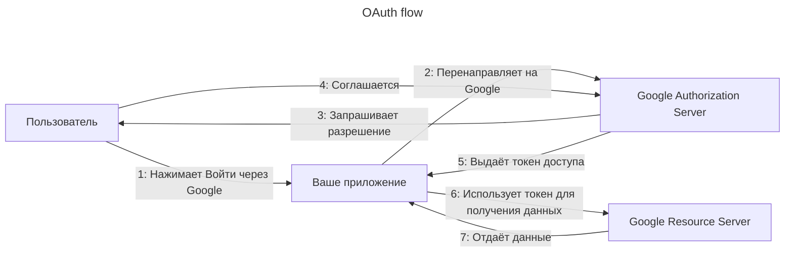
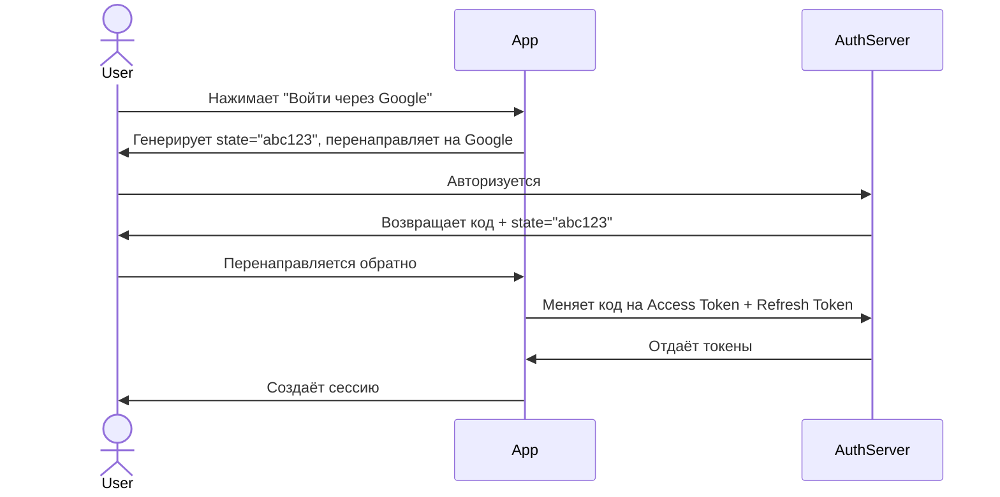
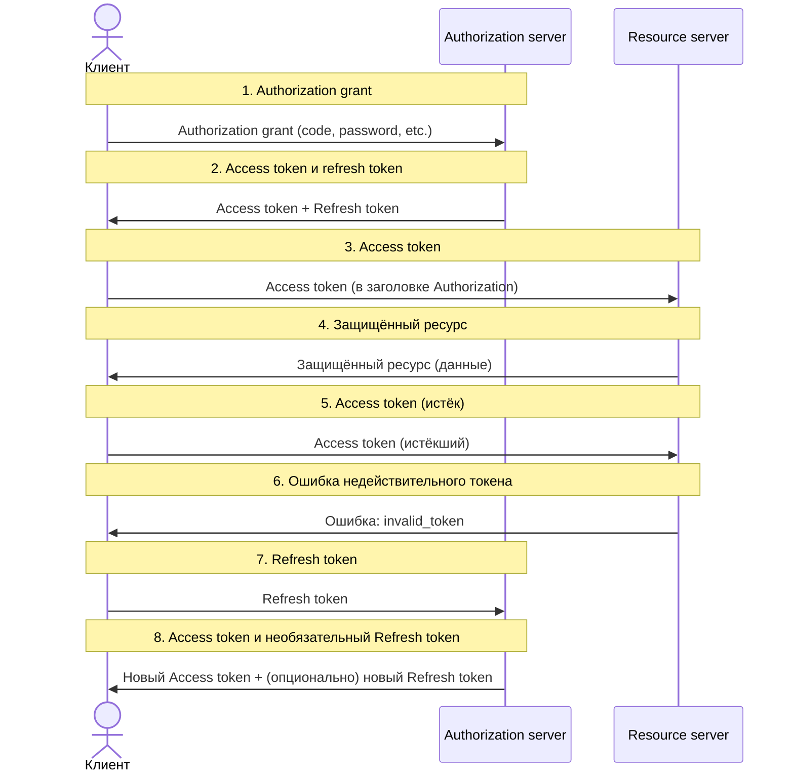

---
aliases:
  - OAuth2
  - OAuth
  - OAuth 2.0
---
# OAuth

✅ Что такое OAuth?

**OAuth (Open Authorization)** — это **протокол делегированной авторизации**, который позволяет приложению получить доступ к ресурсам пользователя **без хранения его пароля**.

💬 Простыми словами:
> «Я хочу, чтобы ваше приложение могло получить мои фотографии из Google, но не хранить мой пароль».

---

## ✅ Основные участники

| Участник | Роль |
|----------|------|
| **Resource Owner** | Пользователь (владелец данных) |
| **Client** | Ваше приложение (например, мобильное приложение) |
| **Authorization Server** | Сервис, который выдаёт токены (Google, Facebook, GitHub) |
| **Resource Server** | Сервис, который хранит данные (Google Photos, Facebook API) |

---

✅ Как работает OAuth 2.0?



🔁 По шагам:

1. **Пользователь** нажимает "Войти через Google"
2. **Ваше приложение** перенаправляет его на **Google**
3. **Google** спрашивает: «Разрешить этому приложению доступ к вашим данным?»
4. **Пользователь** соглашается
5. **Google** выдаёт **токен доступа** вашему приложению
6. **Ваше приложение** использует этот токен для получения данных из **Google API**


---

## ✅ 1. Access Token

> **Access Token** — это **временный токен**, который даёт приложению **доступ к защищённым ресурсам пользователя**.

### 🔧 Как работает:
- Вы получаете его от **Authorization Server** (например, Google)
- Передаёте его в заголовке при запросе к **Resource Server** (например, Google Photos API)

```http
GET /photos HTTP/1.1
Authorization: Bearer <access_token>
```

### ⏳ Срок жизни:
- Обычно **короткий**: от 5 минут до 1 часа
- После истечения — **нужно обновить**

### ✅ Зачем нужен:
- Позволяет **ограничить доступ по времени**
- Уменьшает риск утечки данных

---

## ✅ 2. Refresh Token

> **Refresh Token** — это **долгоживущий токен**, который позволяет **получить новый Access Token без повторного входа пользователя**.

### 🔧 Как работает:
- При первом входе вы получаете **и Access Token, и Refresh Token**
- Когда Access Token истекает → отправляете Refresh Token на **Authorization Server**
- Получаете **новый Access Token** (и иногда новый Refresh Token)

```http
POST /token HTTP/1.1
grant_type=refresh_token&refresh_token=<refresh_token>
```

### ⏳ Срок жизни:
- Может быть **дни, недели, месяцы**
- Иногда **бессрочный** (до отзыва)

### ✅ Зачем нужен:
- Пользователь **не должен вводить пароль каждый час**
- Позволяет **поддерживать сессию**

### ⚠️ Важно:
- **Храните Refresh Token безопасно** (в защищённом хранилище, не в localStorage!)
- Если утекает — злоумышленник может **обновлять доступ бесконечно**

---

## ✅ 3. Local State (или `state`)

> **Local State** — это **случайная строка**, которую ваше приложение генерирует **перед перенаправлением на Authorization Server**.

### 🔧 Как работает:
1. Ваше приложение генерирует `state = "abc123xyz"`
2. Перенаправляет пользователя на Google с параметром `state=abc123xyz`
3. Google возвращает пользователя обратно с тем же `state`
4. Ваше приложение **сравнивает** полученный `state` с исходным

### ✅ Зачем нужен:
- Защита от **CSRF-атак** (Cross-Site Request Forgery)
- Гарантия, что **ответ пришёл именно для вашего запроса**

### 💡 Пример:
```http
https://accounts.google.com/o/oauth2/auth?
  client_id=...
  redirect_uri=https://yourapp.com/callback
  state=abc123xyz
  scope=openid email
```

> Если `state` не совпадает → **отклоните запрос!**

---

## ✅ Сравнение: Access Token vs Refresh Token vs Local State

| Понятие | Назначение | Где используется | Срок жизни | Безопасность |
|---------|------------|------------------|------------|--------------|
| **Access Token** | Доступ к данным | Resource Server | Короткий (5–60 мин) | Передаётся в заголовке |
| **Refresh Token** | Обновление Access Token | Authorization Server | Долгий (дни/месяцы) | Хранится в секрете |
| **Local State** | Защита от CSRF | Authorization Server | Один раз | Генерируется случайно |

---

## ✅ Пример полного потока



222



---

## ✅ Финальный вывод

| Компонент | Что делает | Почему важен |
|----------|------------|---------------|
| **Access Token** | Даёт доступ к данным | Без него — нет API |
| **Refresh Token** | Обновляет доступ | Без него — пользователь вводит пароль каждые 60 минут |
| **Local State** | Защищает от атак | Без него — уязвимость к CSRF |

> 💬 _“Access Token is your key. Refresh Token is your spare key. Local State is your lock.”_

---

## 📚 Где учиться дальше?

- [OAuth 2.0 RFC 6749](https://datatracker.ietf.org/doc/html/rfc6749)
- [OWASP: OAuth Security Best Practices](https://owasp.org/www-project-web-security-testing-guide/)
- YouTube: *“OAuth 2.0 Explained”* — TechWorld with Nana

---

✅ **Теперь вы знаете:**  
Как работают токены и защита в OAuth — и почему все три компонента **критически важны**.

📌 Сохраните эту таблицу — она станет основой вашей безопасности.

> 🔐 _“Security is not a feature. It’s a foundation.”_

---

## ✅ Типы грантов (Grant Types)

| Грант                  | Когда использовать | Пример                         |
| ---------------------- | ------------------ | ------------------------------ |
| **Authorization Code** | Веб-приложения     | Сайт с входом через Google     |
| **Implicit**           | Устаревший         | Не рекомендуется               |
| **Client Credentials** | Машин-машин (M2M)  | Сервис → сервис                |
| **Password**           | Устаревший         | Не рекомендуется               |
| **Refresh Token**      | Обновление токена  | После истечения срока действия |

> 💡 **Authorization Code** — самый безопасный и популярный.


| Параметр                    | Code Grant                    | Implicit Grant                        | [[PKCE]]                                                                          |
| --------------------------- | ----------------------------- | ------------------------------------- | --------------------------------------------------------------------------------- |
| Подверженность атакам       | Подвержен атакам подмены кода | Подвержен атакам подмены кода         | Наиболее безопасен за счёт использования ещё одного кода проверки — code_verifier |
| Скорость обработки данных   | Средняя                       | Высокая                               | Средняя                                                                           |
| Сложность реализации        | Сложная                       | Простая                               | Сложная                                                                           |
| Предназначение              | Все типы приложений           | Одностраничные и мобильные приложения | Одностраничные и мобильные приложения                                             |
| Поддержка обновления токена | Поддерживает                  | Отсутствует                           | Поддерживает                                                                      |

---

## ✅ Преимущества/Недостатки OAuth

| Плюс/Минус         | Объяснение                                                   |
| ------------------ | ------------------------------------------------------------ |
| ✅ **Безопасность** | Пароль не передаётся и не хранится                           |
| ✅ **Удобство**     | Один вход на все сервисы                                     |
| ✅ **Гибкость**     | Можно выдать ограниченный доступ (только фото, только email) |
| ✅ **Стандарт**     | Поддерживается всеми крупными провайдерами                   |
| ❌ **Сложность**    | Требует регистрации приложения у провайдера                  |
| ❌ **Зависимость**  | Если Google упадёт — ваше приложение не сможет войти         |
| ❌ **Токены**       | Нужно управлять сроком действия, обновлением                 |

## ✅ Где используется OAuth?

| Сценарий | Пример |
|----------|--------|
| ✅ Вход через соцсети | Google, Facebook, GitHub |
| ✅ Интеграция с API | Salesforce, Dropbox, Slack |
| ✅ Мобильные приложения | Приложение запрашивает доступ к вашему профилю |
| ✅ Корпоративные системы | Вход в CRM через Azure AD |

---

## ✅ OAuth vs OpenID Connect

| Протокол           | Цель                                          |
| ------------------ | --------------------------------------------- |
| **OAuth 2.0**      | Авторизация («Дай мне доступ к данным»)       |
| **OpenID Connect** | Аутентификация («Докажи, что ты тот человек») |

> 💡 **[[OIDC|OpenID Connect]] — это расширение OAuth 2.0**, добавляющее аутентификацию.

# OAuth 2.0 vs JWT
## ✅ Краткий ответ: OAuth 2.0 vs JWT

| Аспект                   | **OAuth 2.0**                                            | **JWT**                                      |
| ------------------------ | -------------------------------------------------------- | -------------------------------------------- |
| **Что это?**             | Протокол авторизации                                     | Формат токена                                |
| **Цель**                 | Делегировать доступ к ресурсам (например, Google Photos) | Передавать данные в зашифрованном виде       |
| **Пример использования** | Вход через Google/Facebook                               | Авторизация в REST API                       |
| **Состоит из**           | Сервер авторизации, клиент, ресурсный сервер             | Заголовок, полезная нагрузка, подпись        |
| **Где используется**     | SaaS, мобильные приложения, веб-приложения               | REST API, микросервисы, мобильные приложения |
| **Плюсы**                | ✅ Безопасность, удобство, стандарт                       | ✅ Лёгкий, компактный, содержит данные        |
| **Минусы**               | ❌ Сложнее настроить                                      | ❌ Нельзя отозвать токен до истечения срока   |

---

## ✅ Как они работают вместе?

> ✅ **OAuth 2.0 часто использует JWT как токен доступа**

#### 💡 Пример:
1. Пользователь нажимает "Войти через Google"
2. Google (Authorization Server) выдаёт **токен в формате JWT**
3. Ваш сервис использует этот JWT для получения данных

---

## ✅ Когда что использовать?

| Сценарий                                          | Рекомендация                                   |
| ------------------------------------------------- | ---------------------------------------------- |
| ✅ Пользователь хочет войти через Google/Facebook  | ➤ **OAuth 2.0 + JWT**                          |
| ✅ Мобильное приложение получает доступ к API      | ➤ **OAuth 2.0 + JWT**                          |
| ✅ REST API между микросервисами                   | ➤ **JWT (или OAuth 2.0 с Client Credentials)** |
| ✅ Аутентификация без пароля (например, по токену) | ➤ **JWT**                                      |
| ✅ Интеграция с внешними сервисами                 | ➤ **OAuth 2.0**                                |

---

## ✅ Финальный вывод

> ✅ **OAuth 2.0 — это протокол**, который определяет, **как получить доступ**.  
> ✅ **[[JWT]] — это формат**, который определяет, **как выглядит токен**.

> 💬 _“OAuth 2.0 is the protocol. JWT is the token. They work together.”_

---

📌 Сохраните эту таблицу — она станет вашей **картой безопасности**.

✅ **Готово!**