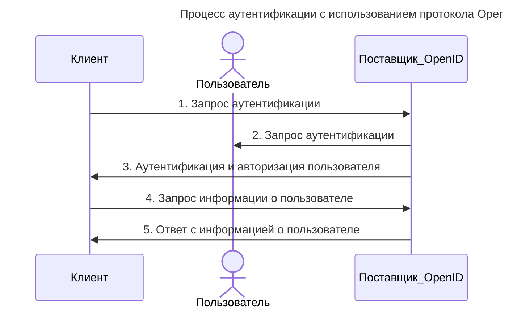

---
aliases:
  - OAuth
  - OIDC
  - OpenID Connect
---
OpenID Connect (OIDC) и [[OAuth]] 2.0 часто путают, но это **разные, хотя и тесно связанные, стандарты**. Ниже — чёткое сравнение по ключевым аспектам.

### Основная суть

- **OAuth 2.0** — протокол *авторизации* (делегирования доступа к ресурсам).  
  **Цель:** дать приложению доступ к API/данным пользователя *без передачи пароля*.  
  **Пример:** приложение просит у вас разрешение читать ваши фото в Google Фото.

- **OpenID Connect (OIDC)** — *надстройка над OAuth 2.0* для *аутентификации* (подтверждения личности).  
  **Цель:** позволить пользователю войти в приложение, используя учётную запись провайдера (Google, GitHub и т. п.).  
  **Пример:** кнопка «Войти через Google» в стороннем приложении.

### Ключевые различия

| Критерий                    | OAuth 2.0                                            | OpenID Connect (OIDC)                                         |
| --------------------------- | ---------------------------------------------------- | ------------------------------------------------------------- |
| **Основная задача**         | Авторизация (доступ к ресурсам)                      | Аутентификация (проверка личности) + авторизация              |
| **Что возвращает**          | *Access token* (для вызова API)                      | *ID token* (JWT с данными пользователя) + *access token*      |
| **Кто субъект**             | Приложение получает доступ к *ресурсам пользователя* | Приложение узнаёт *кто пользователь*                          |
| **Сценарии**                | Доступ к API (чтение почты, загрузка файлов)         | Вход в систему (технологии аутентификации, социальные логины) |
| **Токены**                  | Только `access_token` (и иногда `refresh_token`)     | `id_token` (JWT) + `access_token` + `refresh_token`           |
| **Пользовательские данные** | Необязательны (получаются отдельным запросом к API)  | Встроены в `id_token` (имя, email, sub и др.)                 |

### Как они работают вместе

1. **Приложение использует OIDC** (который базируется на OAuth 2.0):
   - Пользователь нажимает «Войти через Google».
   - Приложение перенаправляет его на сервер авторизации Google (по протоколу OAuth 2.0).
   - После согласия пользователя Google выдаёт:
     - `id_token` (JWT с данными пользователя: `sub`, `email`, `name`);
     - `access_token` (для вызова Google API, например, к календарю).
   - Приложение проверяет `id_token` (подпись, сроки действия) и «логинит» пользователя.

2. **Если бы использовалось только OAuth 2.0**:
   - Приложение получило бы только `access_token`.
   - Чтобы узнать, кто пользователь, пришлось бы делать дополнительный запрос к API (например, `GET /userinfo`).
   - Нет стандартного способа получить профиль пользователя — это зависит от провайдера.

### Важные компоненты OIDC

- **`id_token`** — JWT, содержащий:
  - `sub` (уникальный идентификатор пользователя);
  - `iss` (сервер, выдавший токен);
  - `aud` (кому предназначен токен);
  - `exp`, `iat` (сроки действия);
  - пользовательские поля (email, имя и т. п.).
- **`/userinfo` endpoint** — опциональный эндпоинт, откуда можно получить дополнительные данные о пользователе.
- **Discovery (`/.well-known/openid-configuration`)** — документ, описывающий параметры провайдера (URL эндпоинтов, поддерживаемые алгоритмы и т. д.).

### Когда что выбирать

- **Используйте OAuth 2.0**, если:  
  - Нужно дать приложению доступ к API (например, читать письма в Gmail).  
  - Не требуется знать личность пользователя — важен только доступ к ресурсам.

- **Используйте OIDC**, если:  
  - Нужно реализовать вход в систему (логин через Google/GitHub/etc.).  
  - Необходимо получить данные пользователя (email, имя) для персонализации.  
  - Требуется стандартизированный способ аутентификации (например, для SSO).

### Пример потока (упрощённо)

1. Пользователь кликает «Войти через Google».  
2. Приложение перенаправляет его на `https://accounts.google.com/o/oauth2/v2/auth` с параметрами:  
   - `response_type=code` (авторизационный код);  
   - `scope=openid email` (запрашиваем ID и email);  
   - `client_id`, `redirect_uri` и др.  
3. Google запрашивает согласие пользователя.  
4. После согласия Google возвращает `code` на `redirect_uri`.  
5. Приложение обменивает `code` на токены (`id_token`, `access_token`) через эндпоинт `/token`.  
6. Приложение проверяет `id_token` и логинит пользователя.

### Итог

- **OAuth 2.0** = «*Дайте приложению доступ к моим данным*».  
- **OIDC** = «*Войдите в это приложение, используя мою учётную запись Google*» + доступ к данным.  
- OIDC **не заменяет** OAuth 2.0, а **дополняет** его, добавляя стандартизированную аутентификацию.

___
# OIDC аутентификация

