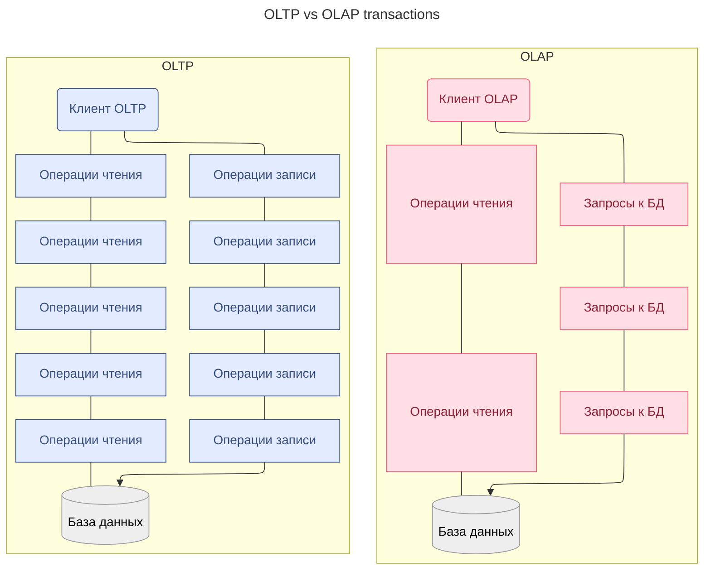
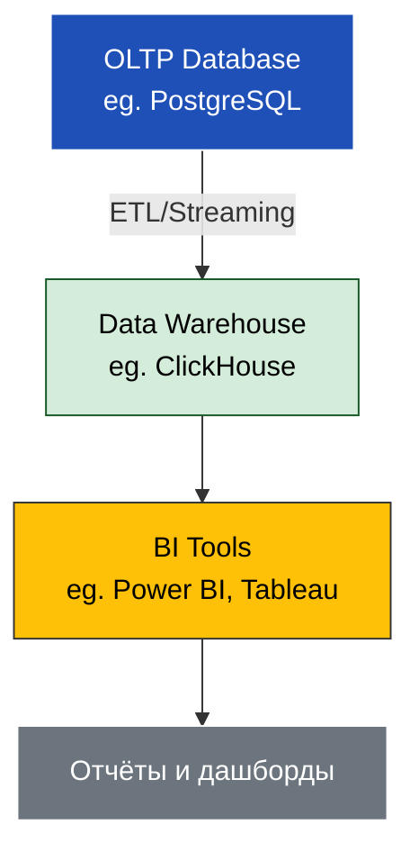

---
aliases:
  - OLTP
  - OLAP
  - Online Transaction Processing
  - Online Analytical Processing
---
# OLTP vs OLAP транзакции

**OLTP (Online Transaction Processing)** и **OLAP (Online Analytical Processing)** — это **две разные архитектуры баз данных**, каждая для своей задачи.
> ✅ **OLTP — для "делать"**  
> ✅ **OLAP — для "понимать"**
> 💬 _“OLTP is for the now. OLAP is for the past.”_

| Критерий                     | 🔹OLTP 🔹                        | 🔸OLAP🔸                                   |
| ---------------------------- | -------------------------------- | ------------------------------------------ |
| **Цель**                     | Добавить/обновить/удалить данные | Понять, что происходит, и принять решение  |
| **Запросы**                  | Короткие, частые, CRUD           | Длинные, редкие, сложные (аналитика)       |
| **Объём данных**             | Маленькие транзакции             | Большой (TB)                               |
| **Скорость**                 | Высокая (миллисекунды)           | Медленная (секунды–минуты)                 |
| **Нормализация**             | Высокая (3NF)                    | Низкая (денормализованная, Star Schema)    |
| **Количество пользователей** | Тысячи одновременно              | Несколько (аналитики, бизнес-аналитики)    |
| **Пример**                   | Создать заказ                    | "Какие товары продали больше всего за Q3?" |
| **БД**                       | PostgreSQL, MySQL, Oracle        | ClickHouse, Redshift, BigQuery             |
| **Используется**             | Веб-приложения, CRM, ERP         | BI, Data Science, Reporting                |
| **Масштабируемость**         | Горизонтальная (по серверам)     | Вертикальная (по мощности)                 |
схематично

**Вывод: реализация OLTP и OLAP процессинга над единым хранилищем данных является антипаттерном** т.к. процессы нацелены на взимоисключающие цели. Приводит к конфликту приоритетов: система не может одновременно оптимизировать и скорость мелких транзакций, и обработку массивных аналитических запросов

**Архитектура: Как они работают вместе?**

→ **OLTP** — для операций  
→ **OLAP** — для аналитики
→ **[[ELT]]/Streaming** — для передачи данных из OLTP в OLAP

---

## ✅ Что такое OLTP?

> **OLTP** — **онлайн-обработка транзакций**.  
> Система, которая обрабатывает **множество коротких, быстрых операций** (INSERT, UPDATE, DELETE).

💬 Примеры:
- Банковские транзакции
- Заказы в интернет-магазине
- Регистрация пользователей

---

## ✅ Что такое OLAP?

> **OLAP** — **онлайн-аналитическая обработка**.  
> Система для **сложных аналитических запросов** (SELECT с GROUP BY, JOIN, SUM, AVG).

💬 Примеры:
- Отчёты по продажам за месяц
- Анализ поведения пользователей
- Прогнозирование спроса

Данные для OLAP процессинга накапливаются в специальных хранилищах [[Data Warehouse]] (DW) путем ETL стриминга из OLTP хранилищ, eg. MS SQL.

---
