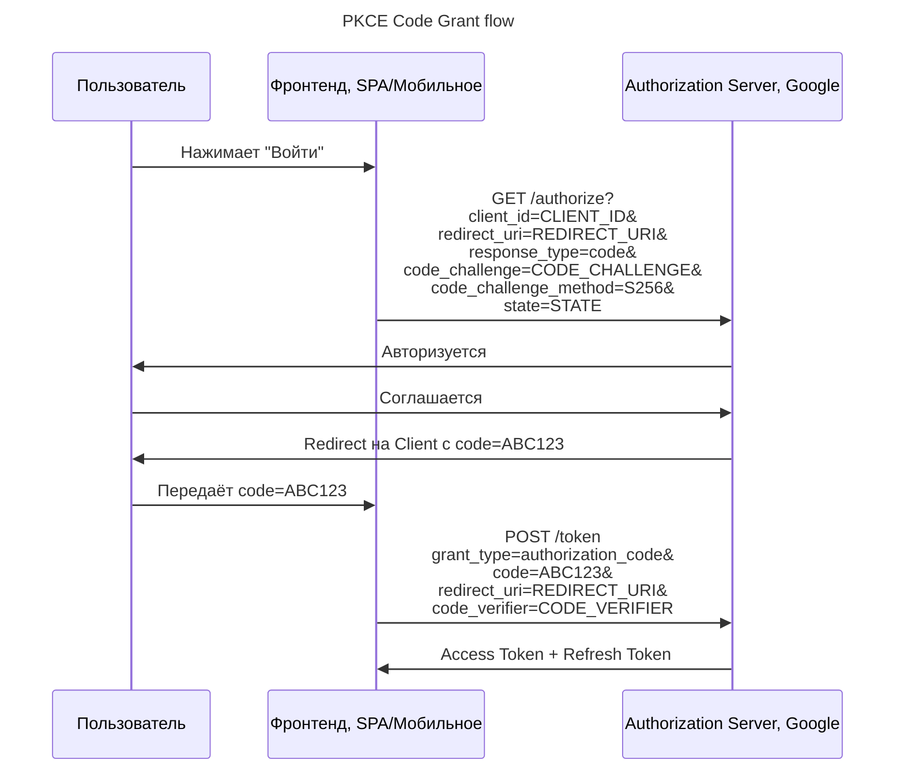

---
aliases:
  - code_challenge
  - code_verifier
  - PKCE
  - PKCE flow
  - Proof Key for Code Exchange
  - S256
  - Верификатор кода
  - Проверочный ключ
---

**PKCE (Proof Key for Code Exchange)** — это **расширение OAuth 2.0**, которое делает **Authorization Code Flow безопасным для SPA (Single‑Page Application) и мобильных приложений**.

---

## Что такое PKCE

**PKCE** — это **механизм защиты от атак "authorization code interception"** (перехват кода).

### Проблема

- В обычном Authorization Code Flow, если приложение работает **на фронтенде ([[spa]], мобильное)**, то **`client_secret` не может быть скрыт**.
- Злоумышленник может перехватить `authorization_code` и использовать его для получения `access_token`.

### Решение: PKCE

- При запросе кода генерируется **`code_verifier`** (случайная строка)
- Из него вычисляется **`code_challenge`** (хэш)
- `code_challenge` передаётся при запросе кода
- `code_verifier` передаётся при обмене кода на токен

→ Так злоумышленник **не может подделать запрос**, потому что у него нет `code_verifier`.

---

## PKCE Code Grant — Пошагово

---

## Ключевые компоненты

| Компонент | Описание |
|----------|----------|
| **code_verifier** | Длинная случайная строка (должна быть ≥ 43 символа) |
| **code_challenge** | Хэш `code_verifier` (обычно SHA-256) |
| **code_challenge_method** | Метод хэширования (`S256`, `plain`) |

> 💡 Обычно используется `S256` — SHA-256.

---

## Преимущества PKCE

| Плюс | Объяснение |
|------|------------|
| ✅ Безопасность | Защита от перехвата кода |
| ✅ Поддержка SPA | Используется в React, Vue, Angular |
| ✅ Поддержка мобильных приложений | Не требует `client_secret` |
| ✅ Совместимость | Работает с любым OAuth 2.0 сервером, поддерживающим PKCE |

---

## Где используется PKCE

| Сценарий | Пример |
|----------|--------|
| ✅ SPA (React, Vue, Angular) | Вход через Google/Facebook |
| ✅ Мобильные приложения | Авторизация в приложении |
| ✅ Single Page Apps | Любое веб-приложение без бэкенда |

---

## Финальный вывод

> ✅ **PKCE — это стандарт безопасности для OAuth 2.0 в SPA и мобильных приложениях.**
> ✅ Он решает проблему: **как защитить `authorization_code` без `client_secret`?**

> 💬 _"PKCE is the security layer that makes OAuth safe for frontend apps."_

---

✅ PKCE делает Authorization Code Flow безопасным для сценариев, где `client_secret` не может быть скрыт.

> 🔐 _"Security is not a feature. It's a foundation."_
