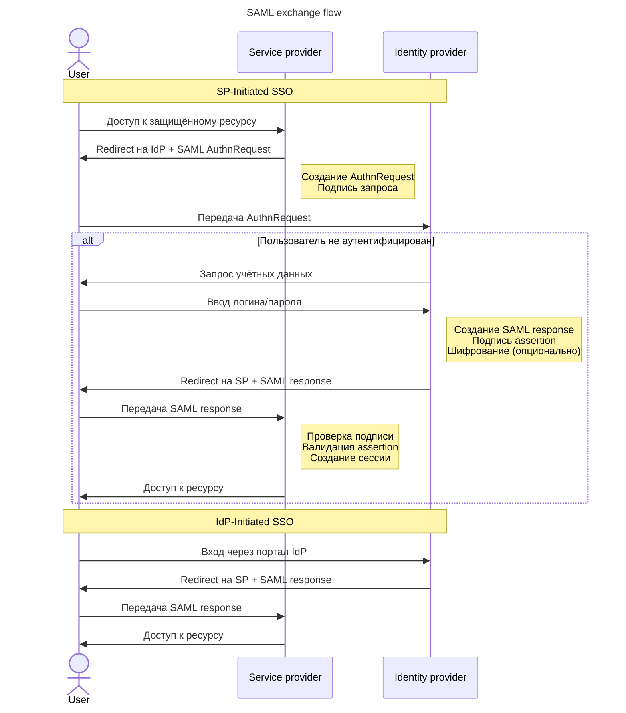

---
aliases:
  - SAML
  - Security Assertion Markup Language
---

# SAML

SAML (Security Assertion Markup Language, или язык разметки утверждений безопасности)

SAML (Security Assertion Markup Language, или язык разметки утверждений безопасности) — это XML-документ, который генерируется Identity Provider в отношении пользователя, предоставившего свои аутентификационные данные (креды).

**Протокол SAML** — это хорошее решение для ситуаций, когда необходимо центральное управление пользователями и при интеграции с legacy-системами в рамках корпоративного слияния, где требуется объединить разные системы аутентификации.

Аутентификация по SAML в целом состоит из следующих шагов:
1. Неизвестный клиент запрашивает доступ к провайдеру ресурса.
2. Если такой запрос не может быть предоставлен клиенту без аутентификации, провайдер перенаправляет клиента на провайдера идентификаций — Identity Provider.
3. Identity Provider идентифицирует и аутентифицирует пользователя.
4. На основании аутентификационных данных, которые предоставил пользователь, он генерирует документ — XML-assertion (XML-утверждение) — и отдаёт его клиенту в формате SAML. В этом документе указываются те утверждения, которые получилось проверить в отношении тех параметров, которые ожидает ресурс. Например, ресурсу, чтобы аутентифицировать пользователя, надо получить от сервера аутентификации email и уникальный ID. В SAML указывается значение того, что удалось подтвердить.
5. Клиент берёт XML и идёт с ним к ресурсу.
6. Ресурс читает XML, проверяет, что ему можно доверять (каждый XML подписан), аутентифицирует клиента и выдаёт свой access_token.
7. Клиент сохраняет access_token и использует его для работы с этим ресурсом.