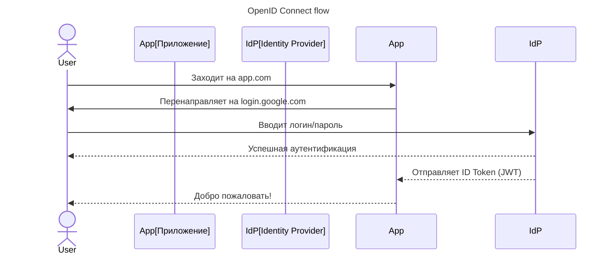

---
aliases:
  - Identity Provider
  - IdP
  - JWT
  - Keycloak
  - MFA
  - OAuth2
  - OIDC
  - OpenID Connect
  - Relying Party
  - SAML
  - Service Provider
  - Single Sign-On
  - SSO
  - Единый вход
  - Поставщик удостоверений
---

**Single Sign-On (SSO)** и **[[keycloak|Keycloak]]** — это два ключевых элемента современной аутентификации и авторизации.

Связка охватывает: **что такое SSO**, **как работает Keycloak**, **как они связаны** и **почему это важно для микросервисов, cloud-приложений и enterprise-систем**.

---

## Что такое Single Sign-On (SSO)

> **Single Sign-On (SSO)** — это механизм, при котором **пользователь вводит свои учётные данные один раз** и получает доступ к **множеству приложений без повторного входа**.

**Простыми словами**

> Пользователь заходит в Google → и автоматически входит в Gmail, YouTube, Drive, Docs — **без повторного ввода пароля**

> 🔑 Это **один вход — для многих сервисов**

---

### 🔧 Как работает SSO (на примере OpenID Connect)

### 🔹 Основные участники

| Роль | Пример |
|------|--------|
| **User (Пользователь)** | Человек, который хочет войти |
| **Service Provider (SP) / Relying Party** | Ваше приложение (`app.com`) |
| **Identity Provider (IdP)** | Сервер, который проверяет пользователя → `Google`, `Microsoft Entra ID`, `Okta`, `Keycloak` |

---

### Преимущества SSO

| Плюс | Объяснение |
|------|------------|
| ✅ **Один пароль для всех систем** | Не нужно запоминать 10+ логинов |
| ✅ **Безопасность** | Можно использовать MFA, централизованную политику паролей |
| ✅ **Проще администрирование** | При увольнении — отключить одного пользователя |
| ✅ **Единый контроль доступа** | RBAC, audit logs, compliance |
| ✅ **Поддержка стандартов** | OIDC, SAML, [[oauth|OAuth2]] |

---

## 🆚 Технологии SSO

| Протокол                  | Когда используется                                            |
| ------------------------- | ------------------------------------------------------------- |
| **OpenID Connect (OIDC)** | Современный стандарт поверх OAuth2. Используется в web/mobile |
| **[[SAML|SAML]]**              | Корпоративные системы, enterprise (например, SAP, Salesforce) |
| **OAuth2**                | Для API, мобильных приложений (не сам по себе SSO)            |
| **[[LDAP|LDAP]] / [[kerberos|Kerberos]]**       | Внутренние сети, Active Directory                             |

> ✅ **OIDC + OAuth2 — стандарт де-факто в 2025 году**

---
