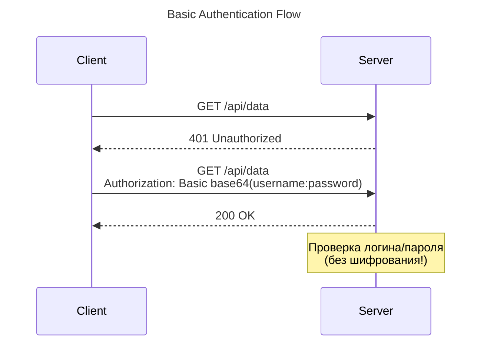
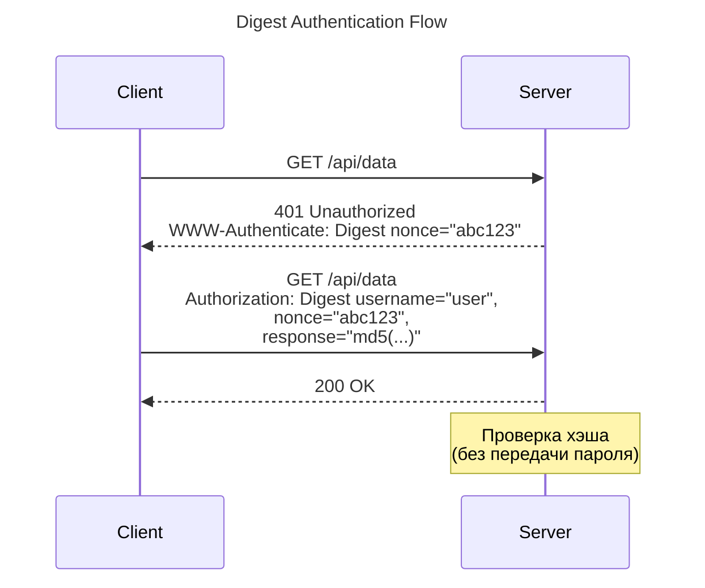
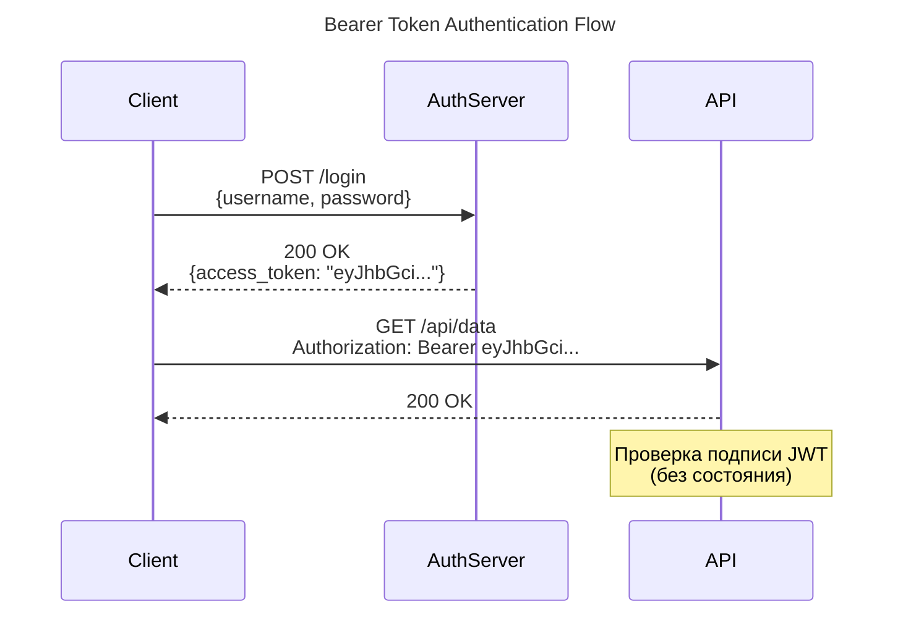
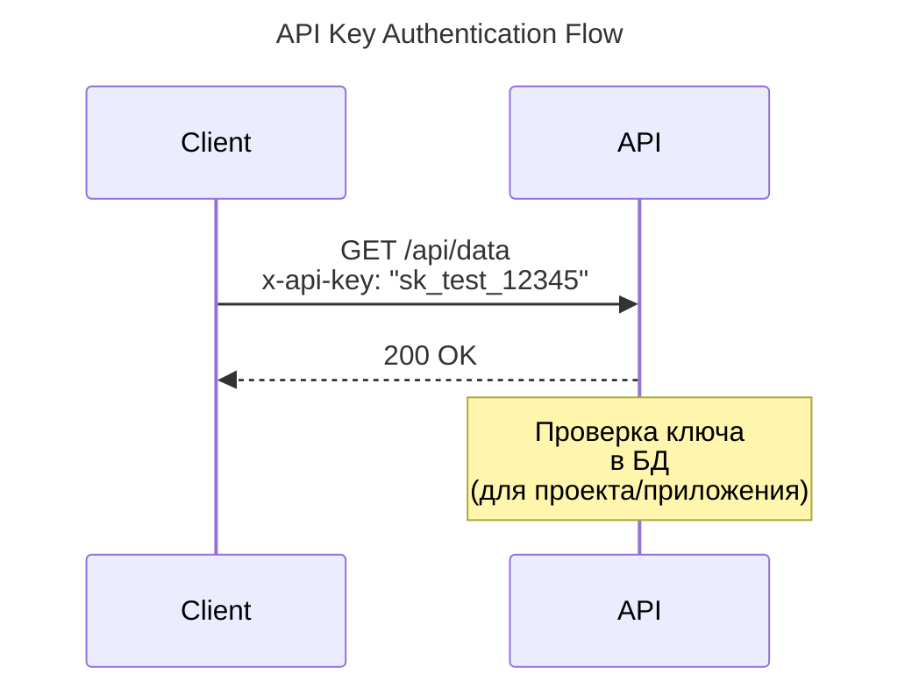
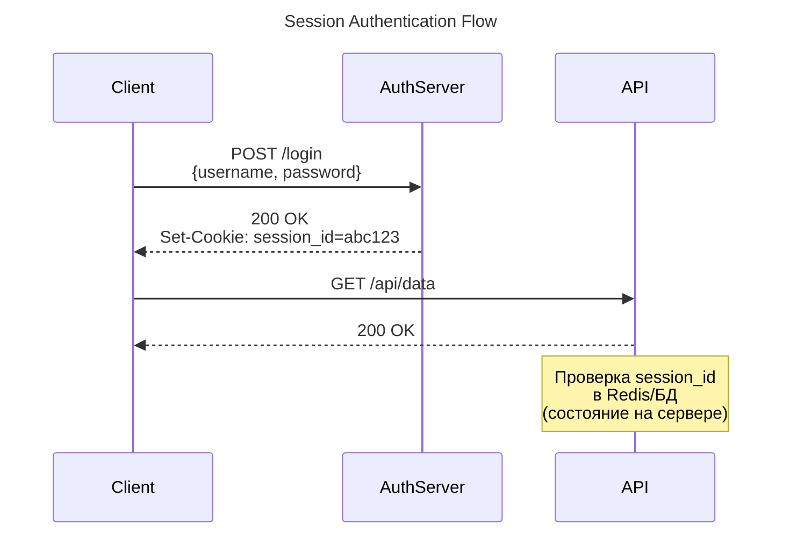

---
aliases:
  - authentication mechanisms
  - authentication methods
  - Authentication methods
  - authentication schemes
  - Authentication schemes
  - Authorization
  - authorization framework
  - Basic
  - Basic Auth
  - Bearer
  - Bearer Token
  - Cookies Auth
  - Digest
  - Digest Auth
  - HTTP authentication schemes
  - JWT
  - OAuth
  - Session Auth
  - механизмы аутентификации
  - способы аутентификации
  - схемы аутентификации
---
## Основные схемы аутентификации

Аутентификация — это процесс подтверждения того, что клиент (пользователь или система) является тем, за кого себя выдает. Выбор метода зависит от архитектуры приложения, требований к безопасности и типа клиентов (браузер, мобильное приложение, сервер).

| Схема Как работает                                                                                                 | State Защита                                                                 | Типичное применение                              |
| --------------------------------------------------------------------------------------------------------------------- | ------------------------------------------------------------------------------- | ------------------------------------------------ |
| **Basic Auth**  `login:password` в Base64 в каждом запросе                                                      | Stateless  Низкая (пароль в каждом запросе; только TLS)                   | Внутренние тулзы, dev, простые админки           |
| **Digest Auth**  Challenge–response: хеш пароля + nonce, пароль открыто не идёт                                 | Stateless  Средняя, устаревшая (MD5)                                      | Legacy-системы                                   |
| **API Key**  Статичный ключ в заголовке/query                                                                   | Stateless  Низкая–средняя (долгий срок жизни, нет контекста пользователя) | Server-to-server, публичные API, rate limiting   |
| **Bearer Token (JWT)**  Подписанный токен в `Authorization: Bearer`; проверка без БД                            | Stateless  Средняя–высокая (утечка токена = доступ; нужны TTL + TLS)      | REST API, микросервисы, SPA, мобильные           |
| **OAuth 2.0 / OIDC**  Access token от authorization server (Auth Code + PKCE и др.); OIDC добавляет ID token    | Stateless (проверка по JWKS)  Высокая                                     | SSO, «войти через Google», доступ третьих сторон |
| **Session (Cookies)**  Сервер создаёт сессию, клиент хранит cookie с session ID                                 | Stateful  Средняя–высокая (HttpOnly/Secure/SameSite + защита от CSRF)     | Веб-приложения с серверным UI                    |
| **mTLS**  Клиентский сертификат проверяется при TLS-хендшейке                                                   | Stateless (на уровне приложения)  Очень высокая                           | Service mesh, B2B, банки, IoT                    |
| **HMAC-подпись (SigV4)**  Запрос подписывается секретным ключом; секрет по сети не идёт; целостность запроса    | Stateless  Высокая                                                        | Облачные API (AWS), webhooks, платёжки           |
| **[[Kerberos\|Kerberos]] / SPNEGO / NTLM**  Тикет от KDC; сервис проверяет тикет без пароля                     | Зависит от KDC  Высокая внутри домена                                     | Корпоративный Windows/AD-интранет                |
| **SAML**  IdP выдаёт подписанный XML-assertion, браузер передаёт его SP                                         | Stateless на стороне SP  Средняя–высокая                                  | Enterprise SSO, старые корпоративные IdP         |
| **WebAuthn / FIDO2 / Passkeys**  Устройство подписывает challenge приватным ключом; ключ не покидает устройство | Stateless  Очень высокая, phishing-resistant                              | Passwordless-логин, стойкий MFA                  |
| **SCRAM**  Challenge–response с солёным хешем пароля (PBKDF2)                                                   | Stateless  Средняя–высокая                                                | MongoDB, Kafka, XMPP                             |
| **SSH public key**  Клиент доказывает владение приватным ключом подписью challenge                              | Stateless  Высокая                                                        | Доступ к серверам, Git по SSH                    |

**Basic Auth** — клиент шлёт `Authorization: Basic base64(login:password)`, сервер сверяет с хранилищем.

*Когда:* внутренние сервисы, админки, dev-стенды. Обязательно HTTPS. Не использовать для публичных API с пользовательскими паролями.

**Digest Auth** — сервер шлёт nonce, клиент возвращает хеш(пароль + nonce + данные запроса). Пароль не передаётся открыто.

*Когда:* практически никогда; только legacy. Заменён связкой Basic+TLS или токенами.

**API Key** — статичный секрет в `X-API-Key` или query-параметре; идентифицирует приложение/проект, а не пользователя.

*Когда:* интеграция сервис-сервис, публичные API (карты, погода), квотирование. Ключи ротировать, в браузер/мобилку не класть.

**Bearer Token (JWT)** — токен с claims и подписью; сервер проверяет подпись и сроки, не ходя в БД.

*Когда:* REST API, микросервисы, SPA/мобилки. Короткий TTL + refresh token, только HTTPS.

**OAuth 2.0 / OIDC** — клиент получает токены у authorization server; OIDC даёт ID token и профиль пользователя.

*Когда:* SSO, «войти через…», делегированный доступ третьих сторон к данным пользователя.

**Session (Cookies)** — после логина сервер хранит сессию (Redis/БД), клиент — cookie с её ID.

*Когда:* классические веб-приложения с серверным рендерингом. Обязательно HttpOnly/Secure/SameSite и CSRF-токены.

**mTLS** — обе стороны предъявляют сертификаты; аутентификация на транспортном уровне.

*Когда:* сервис-сервис в Kubernetes/service mesh, банковские и B2B-интеграции, IoT.

**HMAC-подпись** — подпись метода, пути, заголовков, тела и времени секретным ключом; сервер пересчитывает и сверяет.

*Когда:* API в стиле AWS, webhooks, платёжные системы — когда важна целостность запроса и нежелательно гонять секрет.

**Kerberos / SPNEGO / NTLM** — пользователь получает тикет у KDC (контроллера домена), сервис принимает тикет без пароля.

*Когда:* корпоративный интранет на Active Directory, прозрачный SSO в Windows-среде.

**SAML** — IdP подписывает XML-assertion, браузер POST-ит его сервису, тот проверяет подпись и создаёт сессию.

*Когда:* enterprise SSO и интеграции с Okta/AD FS и подобными IdP.

**WebAuthn / FIDO2 / Passkeys** — при регистрации создаётся пара ключей; логин = подпись challenge; приватный ключ не покидает устройство.

*Когда:* passwordless-вход, защита от фишинга, второй фактор.

**SCRAM** — клиент и сервер обмениваются challenge, пароль хранится как солёный хеш; устойчив к перехвату.

*Когда:* аутентификация на уровне протоколов и СУБД (MongoDB, Kafka, XMPP).

**SSH public key** — сервер проверяет подпись challenge приватным ключом, публичный ключ в `authorized_keys`.

*Когда:* доступ к серверам и Git по SSH.

**DPoP** — токен, привязанный к ключу клиента (proof-of-possession).

**HOBA** — HTTP Origin-Bound Authentication.

**WS-Security / SOAP-заголовки** — для SOAP-сервисов.

**OTP / TOTP / HOTP** — одноразовые коды (обычно как второй фактор).

---

### Мини-гид по выбору

- Веб-приложение с UI → **Session (Cookies)** или **OIDC**.
- Публичный REST API / микросервисы → **Bearer (JWT)** / **OAuth 2.0**.
- Интеграция сервис-сервис → **API Key**, **mTLS** или **HMAC-подпись**.
- Максимальная безопасность / B2B → **mTLS**, **WebAuthn**.
- Корпоративный SSO → **Kerberos/SPNEGO** или **SAML/OIDC**.
- Legacy → Basic/Digest, но лучше мигрировать на TLS+токены.

---

## HTTP схемы аутентификации

### Basic Authentication
> Базовая аутентификация

**Что это:** Простейший метод, при котором логин и пароль передаются в HTTP-заголовке `Authorization`.

- **Как работает:** Строка `username:password` кодируется в **Base64** (например, `admin:123` -> `YWRtaW46MTIz`) и отправляется в заголовке: `Authorization: Basic YWRtaW46MTIz`.
- **Для чего нужно:** Внутренние API, простые скрипты, IoT-устройства, вебхуки, где нет возможности реализовать сложные потоки (flows).
- **⚠️ Критически важно:** Base64 — это **не шифрование**, а просто кодирование. Basic Auth **обязательно** должен использоваться только поверх **HTTPS**, иначе любой перехватит трафик и увидит пароль в открытом виде.
- **Плюсы:** Максимально просто реализовать на клиенте и сервере.
- **Минусы:** Учетные данные передаются в *каждом* запросе. Если нет HTTPS — полностью небезопасно.

### Digest Authentication
> Дайджест-аутентификация

**Что это:** Попытка улучшить Basic Auth, чтобы не передавать пароль в открытом виде даже без HTTPS.

- **Как работает:** Использует механизм "вызов-ответ" (challenge-response). Сервер отправляет `nonce` (случайное число). Клиент хэширует (обычно MD5) пароль вместе с nonce, URL и методом запроса, и отправляет хэш. Сервер делает то же самое и сравнивает.
- **Для чего нужно:** Устаревшие корпоративные системы, IP-камеры, роутеры, где по каким-то причинам нельзя настроить HTTPS.
- **Плюсы:** Пароль никогда не передается по сети в явном виде. Защищает от Replay-атак (благодаря nonce).
- **Минусы:** **Метод устарел**. MD5 признан криптографически слабым. С появлением повсеместного HTTPS (и Let's Encrypt) необходимость в Digest Auth отпала. Сложен в реализации.

### Bearer Token Authentication
> Токены доступа / JWT / OAuth 2.0
> Bearer – носитель

**Что это:** Клиент передает токен (строку), который доказывает, что он авторизован. Токен выдается после успешного входа (например, через [[OAuth]] 2.0).

- **Как работает:** Заголовок `Authorization: Bearer <token>`. Токен может быть "непрозрачным" (opaque - случайная строка, которую сервер проверяет в БД) или **[[JWT]]** (JSON Web Token - зашифрованный JSON с данными пользователя и подписью).
- **Для чего нужно:** Современные SPA (React, Vue), мобильные приложения, микросервисная архитектура, предоставление доступа сторонним приложениям (OAuth: "Войти через Google").
- **Плюсы:**
    - **Stateless (без состояния):** Если используется JWT, серверу не нужно хранить сессии в памяти/БД, он просто проверяет криптографическую подпись. Идеально для масштабирования.
    - Токены имеют срок жизни (TTL) и скоупы (права доступа).
- **Минусы:** Токен нужно где-то безопасно хранить на клиенте. JWT нельзя отозвать до истечения срока его действия (без дополнительных ухищрений вроде blacklist).

### API Keys Authentication

**Что это:** Уникальная длинная случайная строка, которая идентифицирует **приложение или проект**, а не конкретного пользователя.

- **Как работает:** Передается в заголовке (например, `x-api-key: 12345abcde`), в query-параметре URL или в теле запроса.
- **Для чего нужно:** Server-to-Server (S2S) интеграции, идентификация разработчиков/приложений для Rate Limiting (ограничения запросов) и биллинга.
    - *Примеры:* OpenAI API, Google Maps API, Stripe, Telegram Bot API.
- **Плюсы:** Легко генерировать, отзывать и отслеживать, какое именно приложение делает запросы.
- **Минусы:** **Не подходит для аутентификации пользователей**. Если ключ "зашить" во фронтенд-код (JS в браузере), его украдут. API-ключи должны храниться только в секретах на бэкенде.

### Session Authentication
> Сессионная аутентификация / Cookies

**Что это:** Классический метод, при котором сервер хранит состояние (сессию) у себя, а клиенту выдает только ID сессии.

- **Как работает:** При логине сервер создает запись в БД/Redis (`session_id: user_123`) и отправляет клиенту `Set-Cookie: session_id=abc123`. Браузер автоматически подставляет эту куку во все последующие запросы.
- **Для чего нужно:** Классические веб-приложения с серверным рендерингом (SSR - Django, Ruby on Rails, PHP, Next.js), где фронтенд и бэкенд находятся на одном домене.
- **Плюсы:** Высокая безопасность. [[Cookie|куки]] можно настроить как `HttpOnly` (недоступны для JS, защита от XSS), `Secure` (только HTTPS) и `SameSite` (защита от CSRF). Сессию легко отозвать на сервере в один клик.
- **Минусы:** **Stateful (с состоянием)**. Сервер должен хранить сессии (проблема при горизонтальном масштабировании, нужен общий Redis). Плохо подходит для мобильных приложений и кросс-доменных запросов ([[cyberthreats|CORS]]).

---

### Сравнение

| Характеристика              | Basic Auth              | Digest Auth         | Bearer Token (JWT/OAuth)  | API Keys                  | Session (Cookies)          |
| :-------------------------- | :---------------------- | :------------------ | :------------------------ | :------------------------ | :------------------------- |
| **Что идентифицирует**      | Пользователя            | Пользователя        | Пользователя / Клиента    | Приложение / Проект       | Пользователя               |
| **Состояние (State)**       | Stateless               | Stateless           | Stateless (обычно)        | Stateless                 | **Stateful** (на сервере)  |
| **Где хранится на клиенте** | В коде/конфиге          | В коде/конфиге      | LocalStorage / Memory     | В коде/конфиге            | **Cookie** (автоматически) |
| **Безопасность без HTTPS**  | ❌ Катастрофа            | ⚠️ Средняя          | ❌ Плохая                  | ❌ Плохая                  | ❌ Плохая                   |
| **Защита от XSS**           | ❌                       | ❌                   | ❌ (если в LocalStorage)   | ❌                         | ✅ (если `HttpOnly`)        |
| **Масштабируемость**        | 🟢 Отличная             | 🟢 Отличная         | 🟢 Отличная (с JWT)       | 🟢 Отличная               | 🟡 Требует Redis/Shared DB |
| **Основной сценарий**       | Внутренние скрипты, IoT | Legacy-оборудование | SPA, Mobile, Микросервисы | Интеграции (S2S), биллинг | Классические веб-сайты     |

**🎯 Что и когда выбрать?**

1. **Делаете классический веб-сайт** (интернет-магазин, форум, админка на Django/Rails/Blade)?
    👉 **Session Auth (Cookies)**. Это самый безопасный и стандартный путь для браузеров.
2. **Делаете SPA (React/Vue) или Мобильное приложение**?
    👉 **Bearer Token (OAuth 2.0 / JWT)**. Клиент получает токен после логина и шлет его в заголовках.
3. **Делаете публичный API** (как OpenAI или Google Maps), чтобы другие разработчики подключались к вам?
    👉 **API Keys**. Выдавайте ключи в личном кабинете, чтобы лимитировать запросы и блокировать неплательщиков.
4. **Нужно быстро написать Python-скрипт** для парсинга внутреннего API или настроить вебхук?
    👉 **Basic Auth** (строго по HTTPS).
5. **Настраиваете старую IP-камеру** или корпоративный прокси-сервер?
    👉 **Digest Auth** (если HTTPS недоступен). В современном вебе его писать с нуля не нужно.

**💡 Золотое правило современной безопасности:**

Никогда не изобретайте свою криптографию. Используйте **HTTPS (TLS)** всегда и везде. Без HTTPS любой из перечисленных выше методов (кроме Digest, да и то с оговорками) будет скомпрометирован за секунды с помощью атаки Man-in-the-Middle (MITM).
