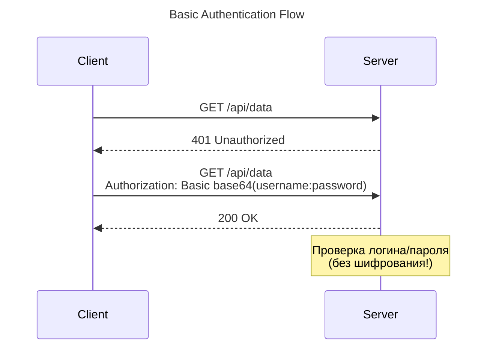
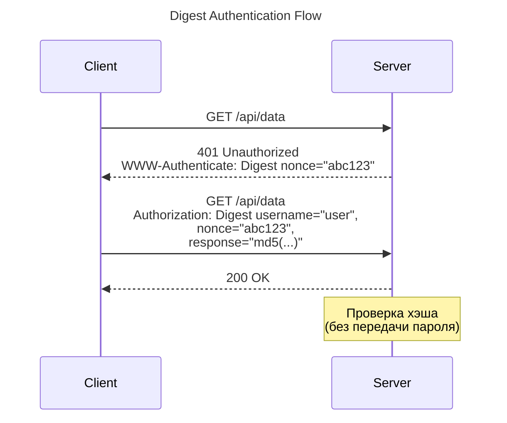
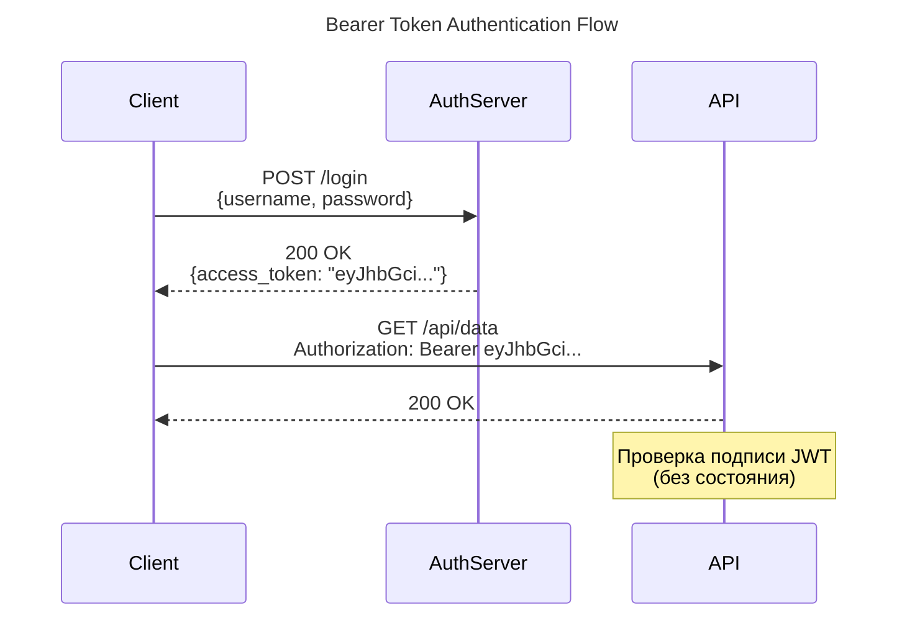
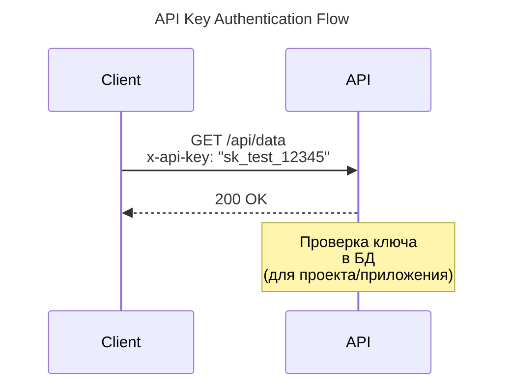
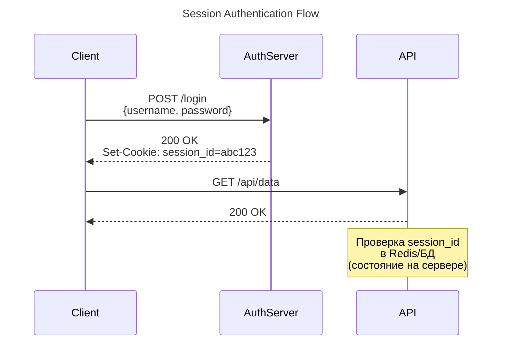

---
aliases:
  - Authentication methods
  - Authentication schemes
  - Basic
  - Digest
  - Bearer
  - authentication schemes
  - authentication methods
---
Аутентификация — это процесс подтверждения того, что клиент (пользователь или система) является тем, за кого себя выдает. Выбор метода зависит от архитектуры приложения, требований к безопасности и типа клиентов (браузер, мобильное приложение, сервер).

Ниже подробный разбор 5 основных методов аутентификации, их назначение и сравнение.

---

### 1. Basic Authentication (Базовая аутентификация)
**Что это:** Простейший метод, при котором логин и пароль передаются в HTTP-заголовке `Authorization`.
*   **Как работает:** Строка `username:password` кодируется в **Base64** (например, `admin:123` -> `YWRtaW46MTIz`) и отправляется в заголовке: `Authorization: Basic YWRtaW46MTIz`.
*   **Для чего нужно:** Внутренние API, простые скрипты, IoT-устройства, вебхуки, где нет возможности реализовать сложные потоки (flows).
*   **⚠️ Критически важно:** Base64 — это **не шифрование**, а просто кодирование. Basic Auth **обязательно** должен использоваться только поверх **HTTPS**, иначе любой перехватит трафик и увидит пароль в открытом виде.
*   **Плюсы:** Максимально просто реализовать на клиенте и сервере.
*   **Минусы:** Учетные данные передаются в *каждом* запросе. Если нет HTTPS — полностью небезопасно.

### 2. Digest Authentication (Дайджест-аутентификация)
**Что это:** Попытка улучшить Basic Auth, чтобы не передавать пароль в открытом виде даже без HTTPS.
*   **Как работает:** Использует механизм "вызов-ответ" (challenge-response). Сервер отправляет `nonce` (случайное число). Клиент хэширует (обычно MD5) пароль вместе с nonce, URL и методом запроса, и отправляет хэш. Сервер делает то же самое и сравнивает.
*   **Для чего нужно:** Устаревшие корпоративные системы, IP-камеры, роутеры, где по каким-то причинам нельзя настроить HTTPS.
*   **Плюсы:** Пароль никогда не передается по сети в явном виде. Защищает от Replay-атак (благодаря nonce).
*   **Минусы:** **Метод устарел**. MD5 признан криптографически слабым. С появлением повсеместного HTTPS (и Let's Encrypt) необходимость в Digest Auth отпала. Сложен в реализации.

### 3. Bearer Token Authentication (Токены доступа / JWT / OAuth 2.0)
> Bearer – носитель

**Что это:** Клиент передает токен (строку), который доказывает, что он авторизован. Токен выдается после успешного входа (например, через [[OAuth]] 2.0).
*   **Как работает:** Заголовок `Authorization: Bearer <token>`. Токен может быть "непрозрачным" (opaque - случайная строка, которую сервер проверяет в БД) или **[[JWT]]** (JSON Web Token - зашифрованный JSON с данными пользователя и подписью).
*   **Для чего нужно:** Современные SPA (React, Vue), мобильные приложения, микросервисная архитектура, предоставление доступа сторонним приложениям (OAuth: "Войти через Google").
*   **Плюсы:**
    *   **Stateless (без состояния):** Если используется JWT, серверу не нужно хранить сессии в памяти/БД, он просто проверяет криптографическую подпись. Идеально для масштабирования.
    *   Токены имеют срок жизни (TTL) и скоупы (права доступа).
*   **Минусы:** Токен нужно где-то безопасно хранить на клиенте. JWT нельзя отозвать до истечения срока его действия (без дополнительных ухищрений вроде blacklist).

### 4. API Keys (API-ключи)
**Что это:** Уникальная длинная случайная строка, которая идентифицирует **приложение или проект**, а не конкретного пользователя.
*   **Как работает:** Передается в заголовке (например, `x-api-key: 12345abcde`), в query-параметре URL или в теле запроса.
*   **Для чего нужно:** Server-to-Server (S2S) интеграции, идентификация разработчиков/приложений для Rate Limiting (ограничения запросов) и биллинга.
    *   *Примеры:* OpenAI API, Google Maps API, Stripe, Telegram Bot API.
*   **Плюсы:** Легко генерировать, отзывать и отслеживать, какое именно приложение делает запросы.
*   **Минусы:** **Не подходит для аутентификации пользователей**. Если ключ "зашить" во фронтенд-код (JS в браузере), его украдут. API-ключи должны храниться только в секретах на бэкенде.

### 5. Session Authentication (Сессионная аутентификация / Cookies)
**Что это:** Классический метод, при котором сервер хранит состояние (сессию) у себя, а клиенту выдает только ID сессии.
*   **Как работает:** При логине сервер создает запись в БД/Redis (`session_id: user_123`) и отправляет клиенту `Set-Cookie: session_id=abc123`. Браузер автоматически подставляет эту куку во все последующие запросы.
*   **Для чего нужно:** Классические веб-приложения с серверным рендерингом (SSR - Django, Ruby on Rails, PHP, Next.js), где фронтенд и бэкенд находятся на одном домене.
*   **Плюсы:** Высокая безопасность. [[Cookie|куки]] можно настроить как `HttpOnly` (недоступны для JS, защита от XSS), `Secure` (только HTTPS) и `SameSite` (защита от CSRF). Сессию легко отозвать на сервере в один клик.
*   **Минусы:** **Stateful (с состоянием)**. Сервер должен хранить сессии (проблема при горизонтальном масштабировании, нужен общий Redis). Плохо подходит для мобильных приложений и кросс-доменных запросов (CORS).

---

### 📊 Сравнительная таблица

| Характеристика | Basic Auth | Digest Auth | Bearer Token (JWT/OAuth) | API Keys | Session (Cookies) |
| :--- | :--- | :--- | :--- | :--- | :--- |
| **Что идентифицирует** | Пользователя | Пользователя | Пользователя / Клиента | Приложение / Проект | Пользователя |
| **Состояние (State)** | Stateless | Stateless | Stateless (обычно) | Stateless | **Stateful** (на сервере) |
| **Где хранится на клиенте** | В коде/конфиге | В коде/конфиге | LocalStorage / Memory | В коде/конфиге | **Cookie** (автоматически) |
| **Безопасность без HTTPS** | ❌ Катастрофа | ⚠️ Средняя | ❌ Плохая | ❌ Плохая | ❌ Плохая |
| **Защита от XSS** | ❌ | ❌ | ❌ (если в LocalStorage) | ❌ | ✅ (если `HttpOnly`) |
| **Масштабируемость** | 🟢 Отличная | 🟢 Отличная | 🟢 Отличная (с JWT) | 🟢 Отличная | 🟡 Требует Redis/Shared DB |
| **Основной сценарий** | Внутренние скрипты, IoT | Legacy-оборудование | SPA, Mobile, Микросервисы | Интеграции (S2S), биллинг | Классические веб-сайты |

---

### 🎯 Шпаргалка: Что и когда выбрать?

1.  **Делаете классический веб-сайт** (интернет-магазин, форум, админка на Django/Rails/Blade)?
    👉 **Session Auth (Cookies)**. Это самый безопасный и стандартный путь для браузеров.
2.  **Делаете SPA (React/Vue) или Мобильное приложение**?
    👉 **Bearer Token (OAuth 2.0 / JWT)**. Клиент получает токен после логина и шлет его в заголовках.
3.  **Делаете публичный API** (как OpenAI или Google Maps), чтобы другие разработчики подключались к вам?
    👉 **API Keys**. Выдавайте ключи в личном кабинете, чтобы лимитировать запросы и блокировать неплательщиков.
4.  **Нужно быстро написать Python-скрипт** для парсинга внутреннего API или настроить вебхук?
    👉 **Basic Auth** (строго по HTTPS).
5.  **Настраиваете старую IP-камеру** или корпоративный прокси-сервер?
    👉 **Digest Auth** (если HTTPS недоступен). В современном вебе его писать с нуля не нужно.

**💡 Золотое правило современной безопасности:**
Никогда не изобретайте свою криптографию. Используйте **HTTPS (TLS)** всегда и везде. Без HTTPS любой из перечисленных выше методов (кроме Digest, да и то с оговорками) будет скомпрометирован за секунды с помощью атаки Man-in-the-Middle (MITM).

---
Вот **sequence-диаграммы** для каждого метода аутентификации в формате **Mermaid**. Каждая диаграмма показывает ключевые шаги взаимодействия между клиентом и сервером.

---

## sequence
### 1. Basic Authentication

---

### 2. Digest Authentication

---

### 3. Bearer Token Authentication (JWT)

---

### 4. API Keys

---

### 5. Session Authentication (Cookies)

---

## 💡 Ключевые особенности визуализации

| Метод | Особенность диаграммы |
|-------|---------------------|
| **Basic Auth** | Показано отсутствие шифрования (безопасно только с HTTPS) |
| **Digest Auth** | Акцент на "nonce" и хэшировании (без передачи пароля) |
| **Bearer Token** | Отдельный AuthServer для выдачи токена |
| **API Keys** | Прямая проверка ключа на API-сервере |
| **Session Auth** | Использование куки и stateful-хранилище (Redis) |

---
