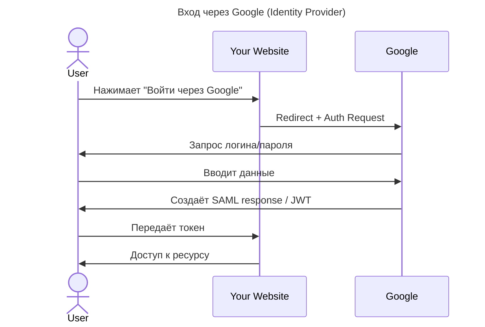

---
aliases:
  - Federated Identity
  - Identity Provider
  - IdP
  - JSON Web Token
  - JWT
  - Kerberos
  - OAuth 2.0
  - OpenID Connect
  - SAML
  - SAML Assertion
  - Service Provider
  - Single Sign-On
  - SP
  - SSO
  - единый вход
  - идентификация
  - федеративная идентификация
  - федеративный вход
---

## Федеративная идентификация

**Federated Identity (Федеративная идентификация)** — это система, позволяющая пользователям аутентифицироваться в одной системе (Identity Provider) и получать доступ к другим системам (Service Providers) без повторного входа.

**Простыми словами**
> Federated Identity — это обмен доверием между разными системами: пользователь аутентифицируется один раз → получает доступ ко всем связанным сервисам. «Я захожу в Google → могу сразу зайти на YouTube, Gmail, Drive — без повторного ввода пароля».

## Зачем нужна Federated Identity

| Цель | Объяснение |
|------|------------|
| ✅ Удобство для пользователей | Один вход — во все сервисы |
| ✅ Безопасность | Не нужно хранить пароли в каждом сервисе |
| ✅ Снижение нагрузки на IT | Меньше запросов «забыл пароль» |
| ✅ Интеграция с внешними сервисами | Вход через Facebook, Google, GitHub |
| ✅ Поддержка SSO (Single Sign-On) | Один вход — во всё |

## Как устроена федеративная идентификация

### Ключевые компоненты

| Компонент                   | Роль                                                                      |
| --------------------------- | ------------------------------------------------------------------------- |
| **Identity Provider (IdP)** | Сервис, который проверяет личность пользователя (Google, Microsoft, Okta) |
| **Service Provider (SP)**   | Сервис, который предоставляет ресурсы (ваш сайт, CRM, ERP)                |
| **User**                    | Пользователь                                                              |
| **Protocol**                | OAuth 2.0, OpenID Connect, SAML                                           |

## Пример: вход через Google

## Типичные протоколы

| Протокол | Используется для |
|----------|------------------|
| **SAML** | Корпоративные SSO (Active Directory, Okta) |
| **OAuth 2.0 + OpenID Connect** | Веб-приложения, SaaS, мобильные приложения |
| **Kerberos** | Локальные сети, Windows Active Directory |

## Форматы токенов

| Токен | Назначение |
|-------|------------|
| **JWT (JSON Web Token)** | Для передачи данных о пользователе (OpenID Connect) |
| **SAML Assertion** | XML-документ с данными о пользователе (SAML) |

## Где используется федеративная идентификация

| Сценарий | Пример |
|----------|--------|
| ✅ Веб-приложение | Вход через Google/Facebook/GitHub |
| ✅ Корпоративный портал | Вход в CRM, ERP, почту через единую точку |
| ✅ Облачные сервисы | Salesforce, Dropbox, Slack |
| ✅ Мобильные приложения | Авторизация через соцсети |

**Итог**
> **Federated Identity = Single Sign-On + Trust between systems**

Она позволяет:

- упростить вход для пользователей;
- увеличить безопасность;
- снизить нагрузку на IT.
