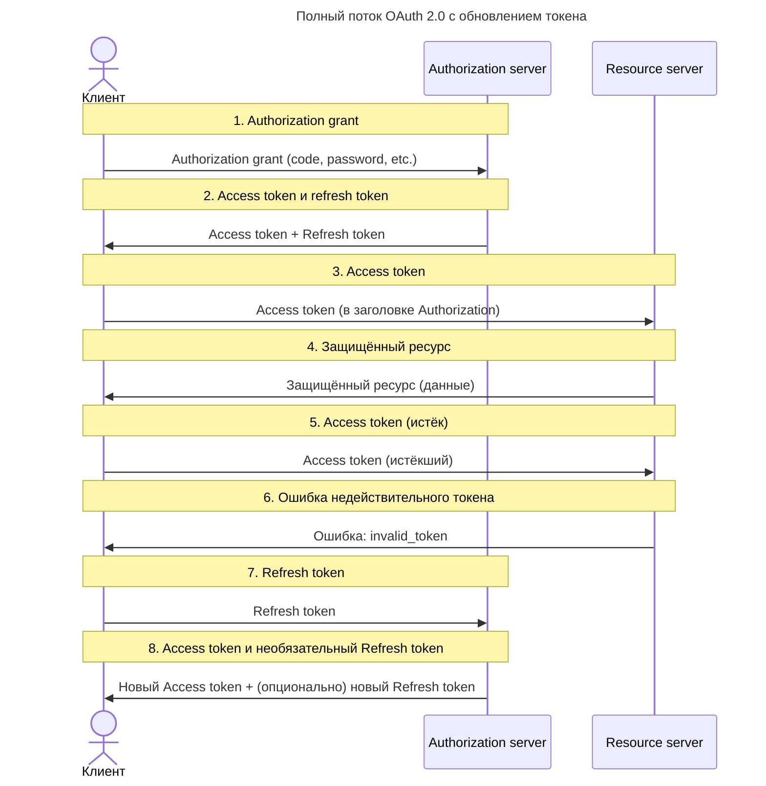

---
aliases:
  - Access Token
  - Authorization Code
  - Authorization Code Grant
  - Authorization Grant
  - Authorization Server
  - Client Credentials
  - Client Credentials Grant
  - Grant Types
  - Implicit Grant
  - JSON Web Token
  - JWT
  - OAuth
  - OAuth 2.0
  - OAuth2
  - OIDC
  - Open Authorization
  - OpenID Connect
  - Password Grant
  - PKCE
  - Refresh Token
  - Resource Owner
  - Resource Server
  - State
  - Делегированная авторизация
  - Токен доступа
  - Токен обновления
---

## OAuth 2.0: делегированная авторизация

**OAuth (Open Authorization)** — это **протокол делегированной авторизации**, который позволяет приложению получить доступ к ресурсам пользователя **без хранения его пароля**.

**Простыми словами:**

> «Я хочу, чтобы ваше приложение могло получить мои фотографии из Google, но не хранить мой пароль».

### Основные участники

| Участник | Роль |
|----------|------|
| **Resource Owner** | Пользователь (владелец данных) |
| **Client** | Приложение (например, мобильное приложение) |
| **Authorization Server** | Сервис, который выдаёт токены (Google, Facebook, GitHub) |
| **Resource Server** | Сервис, который хранит данные (Google Photos, Facebook API) |

---

### Принцип работы OAuth 2.0

**По шагам:**

1. **Пользователь** нажимает «Войти через Google».
2. **Приложение** перенаправляет его на **Google**.
3. **Google** спрашивает: «Разрешить этому приложению доступ к вашим данным?»
4. **Пользователь** соглашается.
5. **Google** выдаёт **токен доступа** приложению.
6. **Приложение** использует токен для получения данных из **Google API**.



---

### Access Token

> **Access Token** — это **временный токен**, который даёт приложению **доступ к защищённым ресурсам пользователя**.

**Как работает**

- Приложение получает его от **Authorization Server** (например, Google).
- Передаёт его в заголовке при запросе к **Resource Server** (например, Google Photos API).

**Запрос с Bearer-токеном:**

```http
GET /photos HTTP/1.1
Authorization: Bearer <access_token>
```

**Срок жизни**

- Обычно **короткий**: от 5 минут до 1 часа.
- После истечения — **нужно обновить**.

**Назначение**

- Позволяет **ограничить доступ по времени**.
- Уменьшает риск утечки данных.

---

### Refresh Token

> **Refresh Token** — это **долгоживущий токен**, который позволяет **получить новый Access Token без повторного входа пользователя**.

**Как работает**

- При первом входе приложение получает **и Access Token, и Refresh Token**.
- Когда Access Token истекает → приложение отправляет Refresh Token на **Authorization Server**.
- В ответ получает **новый Access Token** (и иногда новый Refresh Token).

**Запрос на обновление токена:**

```http
POST /token HTTP/1.1
grant_type=refresh_token&refresh_token=<refresh_token>
```

**Срок жизни**

- Может быть **дни, недели, месяцы**.
- Иногда **бессрочный** (до отзыва).

**Назначение**

- Пользователь **не должен вводить пароль каждый час**.
- Позволяет **поддерживать сессию**.

**Важно**

- **Храните Refresh Token безопасно** (в защищённом хранилище, не в localStorage!).
- Если он утечёт — злоумышленник сможет **обновлять доступ бесконечно**.

---

### Local State (state)

> **Local State** — это **случайная строка**, которую приложение генерирует **перед перенаправлением на Authorization Server**.

**Как работает**

1. Приложение генерирует `state = "abc123xyz"`.
2. Перенаправляет пользователя на Google с параметром `state=abc123xyz`.
3. Google возвращает пользователя обратно с тем же `state`.
4. Приложение **сравнивает** полученный `state` с исходным.

**Назначение**

- Защита от **CSRF-атак** (Cross-Site Request Forgery).
- Гарантия, что **ответ пришёл именно для этого запроса**.

**Пример**

```http
https://accounts.google.com/o/oauth2/auth?
  client_id=...
  redirect_uri=https://yourapp.com/callback
  state=abc123xyz
  scope=openid email
```

> Если `state` не совпадает → **отклоните запрос!**

---

### Сравнение токенов

| Понятие | Назначение | Где используется | Срок жизни | Безопасность |
|---------|------------|------------------|------------|--------------|
| **Access Token** | Доступ к данным | Resource Server | Короткий (5–60 мин) | Передаётся в заголовке |
| **Refresh Token** | Обновление Access Token | Authorization Server | Долгий (дни/месяцы) | Хранится в секрете |
| **Local State** | Защита от CSRF | Authorization Server | Один раз | Генерируется случайно |

**Финальный вывод**

| Компонент | Что делает | Почему важен |
|----------|------------|---------------|
| **Access Token** | Даёт доступ к данным | Без него — нет API |
| **Refresh Token** | Обновляет доступ | Без него — пользователь вводит пароль каждые 60 минут |
| **Local State** | Защищает от атак | Без него — уязвимость к CSRF |

> 💬 _"Access Token is your key. Refresh Token is your spare key. Local State is your lock."_

---

### Типы грантов (Grant Types)

| Грант | Когда использовать | Пример |
| ---------------------- | ------------------ | ------------------------------ |
| **Authorization Code** | Веб-приложения | Сайт с входом через Google |
| **Implicit** | Устаревший | Не рекомендуется |
| **Client Credentials** | Машин-машин (M2M) | Сервис → сервис |
| **Password** | Устаревший | Не рекомендуется |
| **Refresh Token** | Обновление токена | После истечения срока действия |

> 💡 **Authorization Code** — самый безопасный и популярный.

**Сравнение грантов:**

| Параметр | Code Grant | Implicit Grant | [[PKCE|PKCE]] |
| --------------------------- | ----------------------------- | ------------------------------------- | --------------------------------------------------------------------------------- |
| Подверженность атакам | Подвержен атакам подмены кода | Подвержен атакам подмены кода | Наиболее безопасен за счёт использования ещё одного кода проверки — code_verifier |
| Скорость обработки данных | Средняя | Высокая | Средняя |
| Сложность реализации | Сложная | Простая | Сложная |
| Предназначение | Все типы приложений | Одностраничные и мобильные приложения | Одностраничные и мобильные приложения |
| Поддержка обновления токена | Поддерживает | Отсутствует | Поддерживает |

---

### Преимущества и недостатки

| Плюс/Минус | Объяснение |
| ------------------ | ------------------------------------------------------------ |
| ✅ **Безопасность** | Пароль не передаётся и не хранится |
| ✅ **Удобство** | Один вход на все сервисы |
| ✅ **Гибкость** | Можно выдать ограниченный доступ (только фото, только email) |
| ✅ **Стандарт** | Поддерживается всеми крупными провайдерами |
| ❌ **Сложность** | Требует регистрации приложения у провайдера |
| ❌ **Зависимость** | Если Google упадёт — приложение не сможет войти |
| ❌ **Токены** | Нужно управлять сроком действия, обновлением |

---

### Сценарии использования OAuth

| Сценарий | Пример |
|----------|--------|
| ✅ Вход через соцсети | Google, Facebook, GitHub |
| ✅ Интеграция с API | Salesforce, Dropbox, Slack |
| ✅ Мобильные приложения | Приложение запрашивает доступ к профилю пользователя |
| ✅ Корпоративные системы | Вход в CRM через Azure AD |

---

### OAuth 2.0 vs OpenID Connect

| Протокол | Цель |
| ------------------ | --------------------------------------------- |
| **OAuth 2.0** | Авторизация («Дай мне доступ к данным») |
| **OpenID Connect** | Аутентификация («Докажи, что ты тот человек») |

> 💡 **[[oidc|OpenID Connect]] — это расширение OAuth 2.0**, добавляющее аутентификацию.

---

## OAuth 2.0 vs JWT

| Аспект | **OAuth 2.0** | **JWT** |
| ------------------------ | -------------------------------------------------------- | -------------------------------------------- |
| **Что это?** | Протокол авторизации | Формат токена |
| **Цель** | Делегировать доступ к ресурсам (например, Google Photos) | Передавать данные в зашифрованном виде |
| **Пример использования** | Вход через Google/Facebook | Авторизация в REST API |
| **Состоит из** | Сервер авторизации, клиент, ресурсный сервер | Заголовок, полезная нагрузка, подпись |
| **Где используется** | SaaS, мобильные приложения, веб-приложения | REST API, микросервисы, мобильные приложения |
| **Плюсы** | ✅ Безопасность, удобство, стандарт | ✅ Лёгкий, компактный, содержит данные |
| **Минусы** | ❌ Сложнее настроить | ❌ Нельзя отозвать токен до истечения срока |

### Совместная работа OAuth 2.0 и JWT

> ✅ **OAuth 2.0 часто использует [[JWT|JWT]] как токен доступа**.

**Пример**

1. Пользователь нажимает «Войти через Google».
2. Google (Authorization Server) выдаёт **токен в формате JWT**.
3. Сервис использует этот JWT для получения данных.

---

### Рекомендации по выбору

| Сценарий | Рекомендация |
| ------------------------------------------------- | ---------------------------------------------- |
| ✅ Пользователь хочет войти через Google/Facebook | ➤ **OAuth 2.0 + JWT** |
| ✅ Мобильное приложение получает доступ к API | ➤ **OAuth 2.0 + JWT** |
| ✅ REST API между микросервисами | ➤ **JWT (или OAuth 2.0 с Client Credentials)** |
| ✅ Аутентификация без пароля (например, по токену) | ➤ **JWT** |
| ✅ Интеграция с внешними сервисами | ➤ **OAuth 2.0** |

**Финальный вывод**

> ✅ **OAuth 2.0 — это протокол**, который определяет, **как получить доступ**.
> ✅ **[[JWT|JWT]] — это формат**, который определяет, **как выглядит токен**.

> 💬 _"OAuth 2.0 is the protocol. JWT is the token. They work together."_
