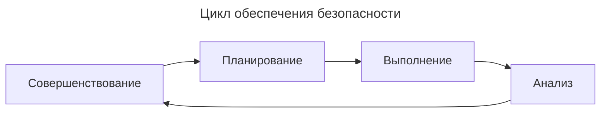
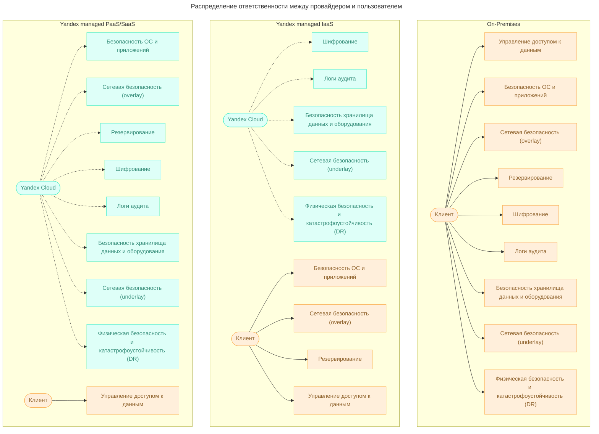
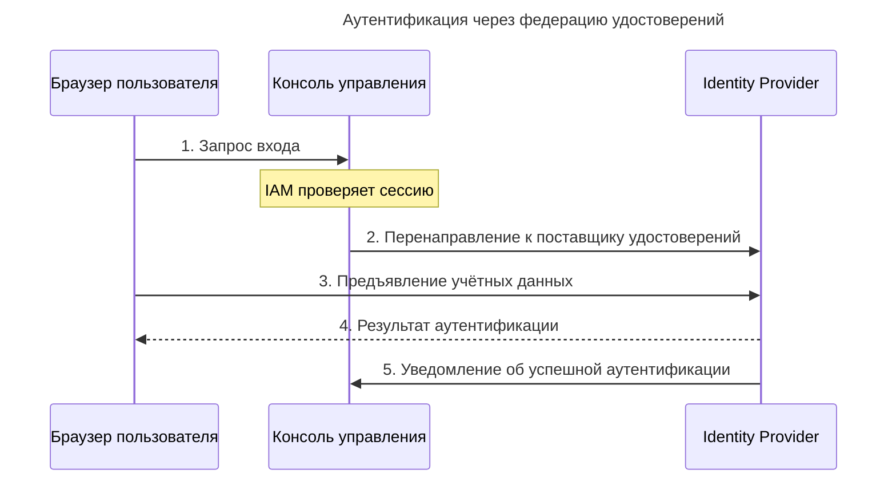
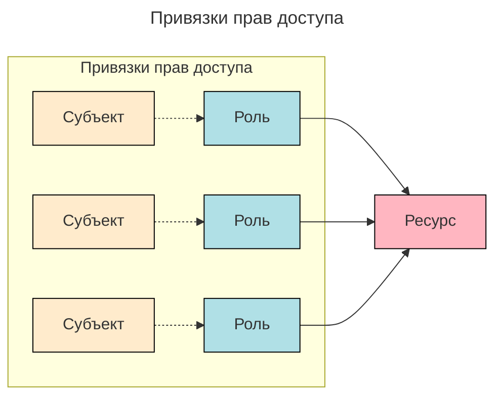
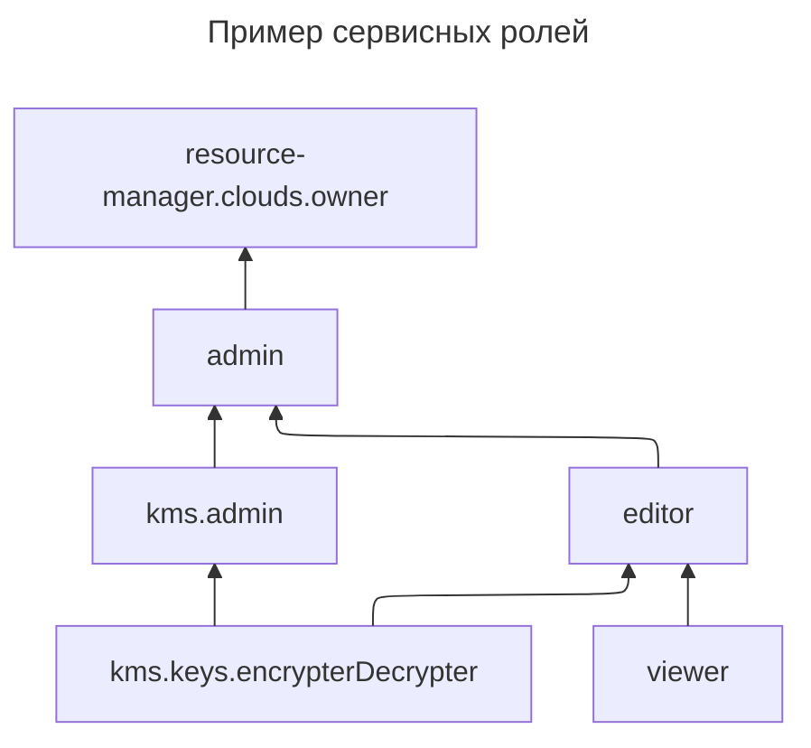
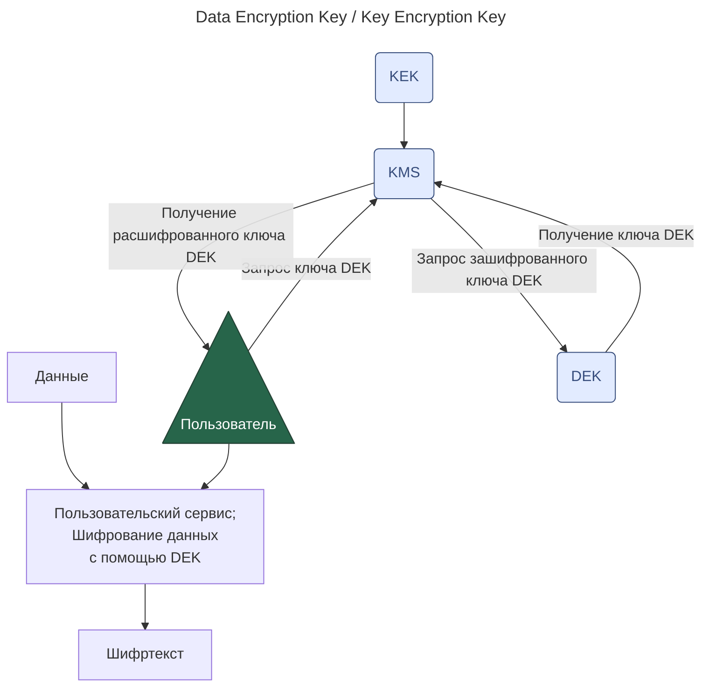

---
aliases:
  - 152-ФЗ
  - access bindings
  - admin
  - AES-128
  - AES-192
  - AES-256
  - API-ключи
  - asymmetric encryption
  - audit logs
  - authentication
  - authorization
  - authorized keys
  - availability
  - biometric data
  - BYOL
  - Certificate Manager
  - Certification Authority
  - Cloud Interconnect
  - confidentiality
  - credentials
  - data encryption
  - Data Encryption Key
  - data protection
  - DDoS
  - DDoS Protection
  - DDoS-атака
  - decryption
  - DEK
  - digital signature
  - Distributed Denial of Service
  - Domain Validation
  - DV
  - editor
  - encryption
  - encryption keys
  - envelope encryption
  - EV
  - Extended Validation
  - firewall
  - GDPR
  - General Data Protection Regulation
  - HTTP
  - HTTPS
  - HyperText Transfer Protocol Secure
  - IAM
  - IAM token
  - IAM-токен
  - Identity and Access Management
  - identity federation
  - Identity Provider
  - IdP
  - integrity
  - IPSec
  - ISMS
  - ISO IEC 27000
  - ISO IEC 27001
  - ISO IEC 27017
  - ISO IEC 27018
  - KEK
  - Key Encryption Key
  - Key Management Service
  - KMS
  - load balancer
  - Lockbox
  - Marketplace
  - Message Queue
  - NAT
  - Network Address Translation
  - network security
  - OAuth token
  - OAuth-токен
  - Object Storage
  - OpenVPN
  - Organization Validation
  - OV
  - Pay as you go
  - Payment Card Industry Data Security Standard
  - PCI DSS
  - pentest
  - personal data
  - primitive roles
  - private key
  - public key
  - RBAC
  - Role Based Access Control
  - secrets
  - Secure Socket Layer
  - security groups
  - service account
  - service roles
  - shared responsibility
  - SSL
  - static access keys
  - symmetric encryption
  - TLS
  - TLS certificate
  - TLS-сертификат
  - Transport Layer Security
  - viewer
  - Virtual Private Network
  - VPN
  - vulnerability
  - WAF
  - Web Application Firewall
  - Yandex Cloud
  - Yandex ID
  - Yandex Monitoring
  - Yandex.Cloud
  - авторизация
  - авторизованные ключи
  - асимметричное шифрование
  - асимметричные алгоритмы шифрования
  - аутентификация
  - балансировщик нагрузки
  - биометрические данные
  - ГОСТ Р 57580
  - ГОСТ Р 57580.1-2017
  - группы безопасности
  - доступность
  - защита данных
  - инструменты обеспечения безопасности
  - ключи шифрования
  - конфиденциальность
  - логи аудита
  - межсетевой экран
  - модель разделяемой ответственности
  - открытый ключ
  - пентест
  - персональные данные
  - поставщик удостоверений
  - приватный ключ
  - привязки прав доступа
  - примитивные роли
  - принцип наименьших привилегий
  - разделяемая ответственность
  - расшифрование
  - секреты
  - сервисные аккаунты
  - сервисные роли
  - сервисный аккаунт
  - сетевая безопасность
  - симметричное шифрование
  - система управления информационной безопасностью
  - статические ключи доступа
  - СУИБ
  - удостоверения
  - уязвимость
  - федерация удостоверений
  - целостность
  - цифровая подпись
  - шифрование
  - шифрование данных
---

## Принципы безопасности информационных систем

Принципы безопасности информационных систем сводятся к защите конфиденциальности, целостности и доступности информации.

**Конфиденциальность** — доступ к информации должны иметь только те, кто на это уполномочен.

**Целостность** — защита данных от несанкционированного изменения или удаления; если такое всё-таки произошло, должна быть возможность восстановить данные.

**Доступность** — владелец информации или тот, для кого она предназначена, имеет к ней надёжный бесперебойный доступ. Например, нужно уметь защищаться от распределённой сетевой атаки (**DDoS, Distributed Denial of Service**), направленной на то, чтобы вывести из строя веб-ресурс.

Обеспечение безопасности — это не разовое мероприятие, а **постоянный процесс**, основанный на следующих принципах:

- планирование технических и организационных мер с учётом имеющихся рисков и угроз;
- выполнение этих мер;
- мониторинг и анализ функционирования системы;
- совершенствование применяемых инструментов защиты.

Цикл обеспечения безопасности:

### Модель разделяемой ответственности

> [!info] Разделяемая ответственность — shared responsibility

В безопасность работы в облаке вносят вклад и облачный провайдер, и пользователь. Это и есть разделяемая ответственность.

Схема распределения ответственности в разных моделях облачных сервисов:

---

## Законодательство о защите данных

Чтобы получать и обрабатывать персональные данные, необходимо соблюдать требования [Федерального закона №152-ФЗ](http://www.consultant.ru/document/cons_doc_LAW_61801/).

Исходя из положений законодательства, персональные данные могут быть четырёх категорий:

- **специальные**: например национальность, политические взгляды, состояние здоровья;
- **биометрические**: фото, отпечатки пальцев;
- **общедоступные**: например ФИО, дата рождения, номер телефона;
- **иные**: например, какие покупки делал конкретный человек в интернет-магазине.

По закону на оператора возлагается ряд обязанностей. В частности, он должен:

- заранее чётко сформулировать цели обработки персональных данных и действовать в соответствии с этими целями;
- обрабатывать персональные данные только после получения согласия на это от субъектов (например, от сотрудников компании или пользователей приложения);
- обеспечить защиту персональных данных от незаконного доступа;
- хранить персональные данные российских граждан на серверах, расположенных на территории России.

Согласно постановлению, защита персональных данных должна осуществляться дифференцированно. Для этого вводятся понятия **типа угрозы** и **уровня защищённости**. Угрозы делятся на три типа:

- **первый** — угрозы, связанные с уязвимостями в системном ПО;
- **второй** — угрозы, связанные с уязвимостями в прикладном ПО;
- **третий** — угрозы, не связанные с ПО.

При работе с пользователями из стран Европейского союза необходимо учитывать требования регламента **GDPR** ([General Data Protection Regulation](https://gdpr-info.eu/)) — закона о защите персональных данных, действующего во всех странах ЕС.

---

## Стандарты безопасности

В отличие от требований законодательства, нарушение которых грозит санкциями и штрафами, стандарты безопасности — это правила и практики, которые подавляющее большинство экспертов считает эффективными.

### Стандарты серии ISO IEC 27000

Документы этой серии определяют, как правильно создать систему управления информационной безопасностью (**СУИБ**).

**Стандарт ISO IEC 27001** содержит требования к СУИБ. Он определяет, как её правильно внедрять, поддерживать и совершенствовать.

**Стандарт ISO IEC 27017** включает практические рекомендации по обеспечению информационной безопасности для облачных провайдеров. Эти рекомендации дополняют требования, изложенные в стандарте ISO IEC 27001.

**Стандарт ISO IEC 27018** содержит практические рекомендации по защите персональных данных при их обработке провайдерами облачных сервисов.

### PCI DSS

PCI DSS (Payment Card Industry Data Security Standard) содержит основные требования для защиты данных держателей платёжных карт.

### ГОСТ Р 57580.1-2017

Для обеспечения безопасности банковских и финансовых операций существует и национальный российский стандарт — ГОСТ Р 57580. Его требованиям должны соответствовать все кредитные и некредитные финансовые организации.

---

## Инструменты обеспечения безопасности

### Контроль доступа

Для управления доступом используется **сервис IAM** (Identity and Access Management).

### Шифрование данных

С помощью **сервиса KMS** (Key Management Service) можно:

- создавать ключи шифрования и управлять ими;
- использовать ключи в популярных библиотеках;
- шифровать и расшифровывать данные небольшого объёма;
- организовывать криптографическую защиту больших объёмов данных с использованием схемы [envelope encryption](https://cloud.yandex.ru/docs/kms/concepts/envelope).

**Сервис Lockbox** помогает защитить секреты — любую информацию, которую нужно хранить в тайне. Это могут быть, например, логины и пароли или ключи сервисного аккаунта.

### Сетевая безопасность

Для управления входящим трафиком используется **балансировщик нагрузки**. Он позволяет снизить риски для безопасности, поскольку уменьшает поверхность атаки и ограничивает трафик на виртуальные машины только необходимыми протоколами. Балансировщик может быть интегрирован с **сервисом DDoS Protection** для защиты от DDoS-атак.

Чтобы управлять исходящим трафиком, виртуальным машинам рекомендуется предоставлять доступ в интернет через **NAT** (Network Address Translation) — механизм преобразования сетевых адресов, который работает в качестве сетевого шлюза или прокси-сервера.

Контроль над всеми видами трафика обеспечивается **группами безопасности**. Этот инструмент — фактически набор правил получения и отправки трафика — позволяет управлять доступом виртуальных машин к ресурсам, расположенным в облаке или в интернете.

Безопасный доступ к облачной инфраструктуре можно обеспечить с помощью виртуальных каналов **VPN** (Virtual Private Network). Для этого на отдельной виртуальной машине настраивают VPN-сервер или используют готовые образы VPN-серверов из Marketplace.

Выделенное сетевое соединение между локальной инфраструктурой и ресурсами в облаке организуют при помощи **сервиса Cloud Interconnect**. Такое соединение надёжнее, быстрее и безопаснее подключения через интернет.

### Мониторинг доступности ресурсов

Одним из принципов информационной безопасности является обеспечение доступности ресурсов. Для этих целей предназначен **сервис Yandex Monitoring**.

### Внешнее сканирование безопасности

Чтобы убедиться в том, что система хорошо защищена, её можно проверить на наличие уязвимостей. Для этого проводят внешний поиск уязвимостей (**пентесты**).

Внешнее сканирование безопасности может проводиться как самим пользователем, так и привлечённым подрядчиком. В любом случае делать это нужно по согласованию с Yandex Cloud и в соответствии с правилами организации сканирования.

### Marketplace

Необходимые инструменты обеспечения безопасности можно найти в [Marketplace](https://cloud.yandex.ru/marketplace?categories=security). В нём размещено несколько комплексных систем защиты ресурсов, межсетевых экранов, в том числе для веб-приложений (**WAF, Web Application Firewall**), образы для развёртывания серверов удалённого доступа OpenVPN и IPSec VPN.

ПО в Marketplace в основном платное. Оплата производится по моделям Pay as you go или BYOL. В первом случае тарифицируется только время фактического использования ПО, во втором — понадобится приобрести у поставщика ПО собственную лицензию.

---

## Сервис авторизации IAM

Доступ к ресурсам Yandex Cloud реализован тремя типами аккаунтов.

1. **Тип 1. Учётная запись Яндекс ID.** Единый аккаунт для всех сервисов Яндекса, в котором хранятся личные данные пользователей и выполняется их аутентификация и авторизация. При успешной аутентификации Яндекс ID устанавливает в браузере пользователя cookie на домене верхнего уровня `yandex` и использует токены для проверки аутентификации.
   1. **IAM-токен** — информация для авторизации, подписанная секретным ключом IAM.
   2. При работе в интерфейсе командной строки (CLI) на компьютере пользователя сохраняется OAuth-токен Яндекс ID.
2. **Тип 2. Федерация удостоверений.** Удостоверения (credentials) — это информация об атрибутах пользователей, таких как логин или адрес электронной почты, и способах аутентификации. При использовании федерации удостоверений они хранятся не у облачного провайдера, а у третьей доверенной стороны — поставщика удостоверений (IdP, Identity Provider).

Поток аутентификации через федерацию удостоверений:

1. **Тип 3. Сервисные аккаунты.** Операции с облаком можно выполнять не только под пользовательскими аккаунтами, но и через сервисные аккаунты — специальный тип аккаунтов, которые используются для доступа к ресурсам Yandex Cloud от имени приложений. Также под сервисными аккаунтами могут выполнять операции облачные функции и сервисы, запущенные в виртуальных машинах. Аутентификацию сервисного аккаунта можно выполнять тремя способами:
   1. **Авторизованные ключи.** Используются для получения IAM-токена с помощью открытого и секретного ключа.
   2. **API-ключи.** Используются в некоторых сервисах для упрощённой аутентификации вместо IAM-токена. Могут пригодиться для работы с сервисами SpeechKit, Vision и Translate.
   3. **Статические ключи доступа.** Необходимы при использовании AWS-совместимых сервисов, например в Object Storage или Message Queue.

### Ролевая модель доступа (RBAC)

Каждому пользователю можно назначить определённую роль для доступа к тому или иному ресурсу. **Роль** — это набор разрешений, которые описывают допустимые операции над ресурсом.

Роли на ресурс назначаются в виде списка связей «роль — субъект». Такие связи называются привязками прав доступа (access bindings), их можно добавлять и удалять, то есть контролировать права доступа к ресурсу.

Схема привязок прав доступа:

В реализованной в Yandex Cloud ролевой модели имеется два типа ролей: **примитивные** (общие для всех сервисов) и **сервисные** (выдаются только на один сервис). **Сервисные роли** зависят от специфики каждого отдельного сервиса и могут назначаться на объекты, для которых эти роли предназначены. Некоторые сервисные роли назначаются на ресурс (например, на ключ шифрования в сервисе KMS), а некоторые — только на контейнер, в котором размещены ресурсы (например, роль `compute.admin` назначается на каталог или облако).

К **примитивным ролям** относятся:

1. `viewer` — позволяет просматривать информацию о ресурсе или список ресурсов, если назначена на каталог;
2. `editor` — позволяет управлять ресурсами: создавать, изменять и удалять объекты;
3. `admin` — позволяет управлять ресурсами и правами доступа к ним.

Пример сервисных ролей:

---

## Принципы построения сетей

### Доступность ресурсов

Прежде всего, сеть должна надёжно выполнять свои функции — в том числе обеспечивать высокую доступность ресурсов.

### Периметр безопасности

Следующий принцип построения сетей — создание периметра безопасности. Идея заключается в том, чтобы предусмотреть минимально необходимое количество точек выхода в интернет и обеспечить их защиту.

### Принцип наименьших привилегий

Третий элемент обеспечения сетевой безопасности в облаке — реализация принципа наименьших привилегий. Этот принцип требует, чтобы каждый ресурс в облаке был связан только с теми ресурсами в облаке или интернете, которые необходимы для его корректной работы.

---

## Сервис Certificate Manager

### TLS-сертификаты

При передаче данных в интернете важна их защита. Для этого используется протокол **HTTPS** (HyperText Transfer Protocol Secure) — по сути, комбинация из протокола передачи данных прикладного уровня HTTP и криптографического протокола транспортного уровня SSL (Secure Socket Layer). Современная версия SSL-протокола называется TLS (Transport Layer Security), однако сама аббревиатура SSL стала настолько привычной, что её часто употребляют до сих пор.

При использовании TLS-протокола информация передаётся внутри зашифрованной сессии:

1. Браузер обращается к защищённому сайту (серверу) и запрашивает у него идентификационную информацию.
2. Сервер отправляет в ответ копию своего TLS-сертификата.
3. Браузер проверяет сертификат по списку доверенных центров сертификации. Если всё в порядке, то браузер создаёт, шифрует и отправляет серверу ключ симметричного шифрования для предстоящей сессии передачи данных.
4. Сервер расшифровывает ключ и направляет браузеру подтверждение, после чего все передаваемые между ними данные шифруются этим ключом.

Чтобы использовать протокол HTTPS, на сайте (сервере) должен быть установлен TLS-сертификат — небольшой файл, в котором обычно содержится следующая информация:

- доменное имя, для которого выпущен сертификат;
- лицо (юридическое или физическое) либо устройство, для которого он выпущен;
- серийный номер сертификата выдавшего центра сертификации;
- цифровая подпись центра сертификации;
- дата выдачи и срок действия сертификата;
- публичный ключ (приватный ключ находится на сервере и никуда не передаётся; эта пара ключей нужна для шифрования симметричного ключа, который используется в сессии передачи данных).

TLS-сертификаты выдают центры сертификации (**Certification Authority**), которые подписывают запросы на сертификат и могут проверять информацию о владельце сайта. В зависимости от глубины такой проверки выпускаемые сертификаты бывают нескольких типов.

Самые надёжные — сертификаты с расширенной проверкой (**EV, Extended Validation**) и с проверкой организации (**OV, Organization Validation**). При выпуске таких сертификатов проверяется юридическое и физическое существование запрашивающей организации и её право на домен, а для EV-сертификатов — ещё и соответствие её деятельности представленным документам.

Для сертификатов с проверкой домена (**DV, Domain Validation**) всё проще — проверяется только право собственности на домен. Зато этот тип сертификата могут получить не только юридические, но и физические лица.

### Ключи шифрования KMS

Чтобы сохранить чувствительную информацию закрытой от тех, для кого она не предназначена, нужно прежде всего грамотно настроить к ней доступ. Следующий уровень защиты — шифрование хранящихся и передаваемых данных. Это поможет сохранить их конфиденциальность и целостность, даже если в систему кто-то несанкционированно проник.

Существуют **симметричные** и **асимметричные** алгоритмы шифрования. В симметричных данные шифруются и расшифровываются одним и тем же ключом. Асимметричные методы построены на использовании двух ключей: открытого и закрытого (секретного). Открытый ключ нужен для шифрования, а закрытый — для расшифрования. Данные устойчивы к атакам методом перебора, если они зашифрованы с использованием ключа длиной не менее 128 бит для симметричных алгоритмов и не менее 1024 бит для асимметричных. Сами алгоритмы при этом, естественно, должны быть современными и актуальными.

На надёжность защиты влияет не только длина ключа. Важно и то, где и как хранятся ключи. Это считается одним из наиболее уязвимых мест систем защиты, основанных на шифровании.

Пусть есть единое хранилище данных, к которому обращаются несколько сервисов. Для защиты данных используется симметричная криптография (она намного быстрее и требует меньше вычислительных ресурсов), значит, у каждого сервиса должен быть доступ к ключу шифрования.

Более надёжный вариант — зашифровать ключ шифрования данных (**DEK, Data Encryption Key**) с помощью ещё одного ключа (**KEK, Key Encryption Key**). Теперь даже если злоумышленник и найдёт на взломанном сервере зашифрованный ключ DEK, то расшифровать данные в хранилище он сможет далеко не сразу. Подобная схема защиты называется **envelope encryption**.

Чтобы использовать такую схему, нужно решить две проблемы: где хранить ключ KEK, чтобы минимизировать вероятность его компрометации, и как безопасно пользоваться открытой версией ключа DEK. Для этого используется специальный сервис **KMS**, который:

- надёжно хранит ключ KEK и никуда его не передаёт;
- после получения запроса расшифровывает зашифрованный ключ DEK и отправляет его пользователю.

Схема envelope encryption:

Открытый ключ DEK должен использоваться только во время выполнения операций шифрования и расшифрования данных, а после завершения этих операций его нужно сразу уничтожить.

KMS нужен для того, чтобы генерировать ключи шифрования. Сделать это можно через консоль управления, с помощью CLI, а также REST или gRPC API. Сервис поддерживает симметричное шифрование с алгоритмами AES-128, AES-192 и AES-256 (число в названии алгоритма обозначает длину ключа в битах).

У созданного в сервисе ключа есть следующие параметры:

- **идентификатор** — уникален в рамках всего Yandex Cloud и используется для работы с ключами с помощью SDK, API и CLI;
- **название** — может быть не уникально и используется для работы с ключами с помощью CLI (только если в каталоге есть лишь один ключ с таким названием);
- **используемый алгоритм шифрования**;
- **период ротации** — промежуток времени между автоматической сменой ключа;
- **статус** — состояние ключа (`Creating`, `Active` или `Inactive`).
