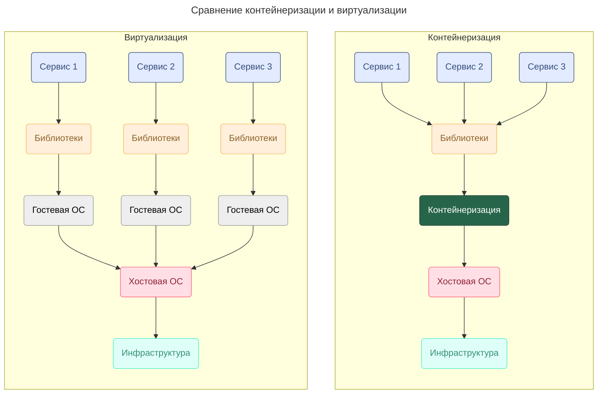

---
aliases:
  - Container
  - Container Registry
  - Containerization
  - Docker
  - Docker Hub
  - Docker image
  - Docker pull
  - Docker push
  - Docker run
  - Docker-образ
  - Dockerfile
  - ENTRYPOINT
  - FROM
  - Guest OS
  - Host OS
  - Nginx
  - NGINX
  - RUN
  - Ubuntu
  - Virtual machine
  - Virtualization
  - Yandex Cloud
  - Yandex Container Registry
  - виртуализация
  - виртуальная машина
  - гостевая ОС
  - контейнер
  - контейнеризация
  - образ
  - репозиторий Docker-образов
  - хостовая ОС
---

## Виртуализация и контейнеризация



Контейнеры выигрывают по сравнению с виртуальными машинами тем, что:

- не требуют развертывания полноценной ОС для среды приложения
- контейнеры изолированы
- контейнеры быстрее [[orchestration|оркестрировать]], чем виртуальные машины
- экономия ресурсов железа

## Docker

[[Docker|Docker]] работает так: приложение упаковывается со всеми зависимостями — библиотеками, интерпретаторами, файлами — в Docker-образ и отправляется в репозиторий (хранилище). Чтобы развернуть приложение, нужно скачать из репозитория образ и создать из него контейнер на рабочем сервере.

Хранилища Docker-образов бывают публичными и приватными. Самое известное публичное хранилище — это Docker Hub. В Yandex Cloud удобно использовать собственное хранилище облака — `Yandex Container Registry`.

### Создание образа

Пример `Dockerfile` для образа с ОС Ubuntu и веб-сервером NGINX:

```dockerfile
FROM ubuntu:latest
RUN apt-get update -y
RUN apt-get install -y nginx
ENTRYPOINT ["nginx", "-g", "daemon off;"]
```

Каждая инструкция создаёт новый слой образа, и эти слои накладываются друг на друга. В конце задаётся команда — исполняемый файл, который запускается при старте Docker-контейнера.

### Создание контейнера

Основные команды для работы с репозиторием:

```bash
# положить образ в репозиторий
docker push my-image
# взять образ из репозитория и запустить
docker pull my-image
docker run my-image
```

---

[[yandex-container-registry|Yandex Container Registry]]
