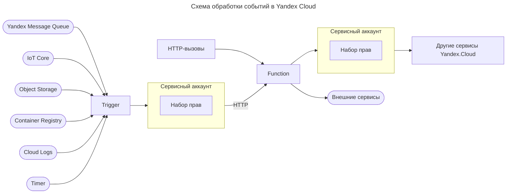

---
aliases:
  - Cloud Functions
  - Cloud Logs
  - Container Registry
  - FaaS
  - FIFO
  - Function as a Service
  - Function-as-a-Service
  - Integration
  - IoT Core
  - Message Queue
  - Object Storage
  - PaaS
  - Platform as a Service
  - Platform-as-a-Service
  - Scaling
  - Serverless
  - Serverless Functions
  - Serverless platform
  - serverless-функции
  - Trigger
  - Yandex Cloud
  - Yandex Cloud Functions
  - Yandex Message Queue
  - ycloud
  - бессерверные вычисления
  - интеграции
  - масштабирование
  - очереди сообщений
  - триггеры
---

## Serverless-подход

Чтобы запустить приложение, нужно арендовать виртуальную машину определённой мощности, настроить на ней операционную систему и развернуть среду исполнения своего кода. Чтобы записывать и читать данные в БД, нужно определить, сколько потребуется CPU, какой будет нужен объём памяти и жёсткого диска. Ресурсы приходится оплачивать вне зависимости от того, используются они или нет.

**Serverless platform** предоставляет доступ к вычислительным ресурсам облака: серверы или виртуальные машины не арендуются, сети не настраиваются. Оплата происходит посекундно за фактическое использование ресурсов.

Использование serverless-сервисов при разработке приложений даёт следующие преимущества:

1. Позволяет разработчикам сфокусироваться на работе над кодом: больше не нужно разворачивать, настраивать и обслуживать какую-либо инфраструктуру (серверы, виртуальные машины, контейнеры).
2. Часто даёт возможность снизить операционные расходы по сравнению с запуском приложений на виртуальной машине или в средах контейнерной виртуализации — за счёт более эффективного распределения мощностей провайдером.
3. Позволяет минимизировать риски непредсказуемости спроса — в случае как переоценки, так и недооценки будущей нагрузки.

## Yandex Cloud Functions

Базовым сервисом для serverless-разработки в Yandex Cloud является **Yandex Cloud Functions**. Он относится к категории ==Function-as-a-Service (FaaS)== — одному из видов Platform as a Service (PaaS): платформой Cloud Functions пользуется клиент, в то время как её обслуживанием занимается провайдер. Главная задача Cloud Functions — исполнить программный код, написанный на одном из поддерживаемых языков программирования.

### Serverless-функции

Вместо организации среды приложения можно создать так называемую **serverless-функцию**. Это программа, предназначенная для решения какой-то одной простой задачи. Код программы упаковывается в изолированный контейнер и выполняется на вычислительных ресурсах дата-центра облачной платформы.

Yandex Cloud Functions следует общей концепции бессерверных вычислений и позволяет запускать код в виде функции в безопасном, отказоустойчивом и автоматически масштабируемом окружении без создания и обслуживания виртуальных машин.

#### Триггеры

---

[[yandex-serverless-integrations]]

## Очереди сообщений

Очереди используются внутри программ при взаимодействии потоков и в организации больших систем, где взаимодействуют несколько программ или сервисов. В таких системах очереди помогают решать проблемы интеграции приложений, их отказоустойчивости и масштабирования, например:

- надёжной передачи данных и команд между компонентами;
- обработки данных от множества устройств IoT;
- обработки событий, по которым должна быть вызвана функция.

### Виды очередей

Существует два распространённых типа очередей: FIFO и стандартная. Стандартные очереди поддерживают сравнительно большое количество вызовов API в секунду (отправка, принятие или удаление сообщения).

[[yandex-message-queue]]
