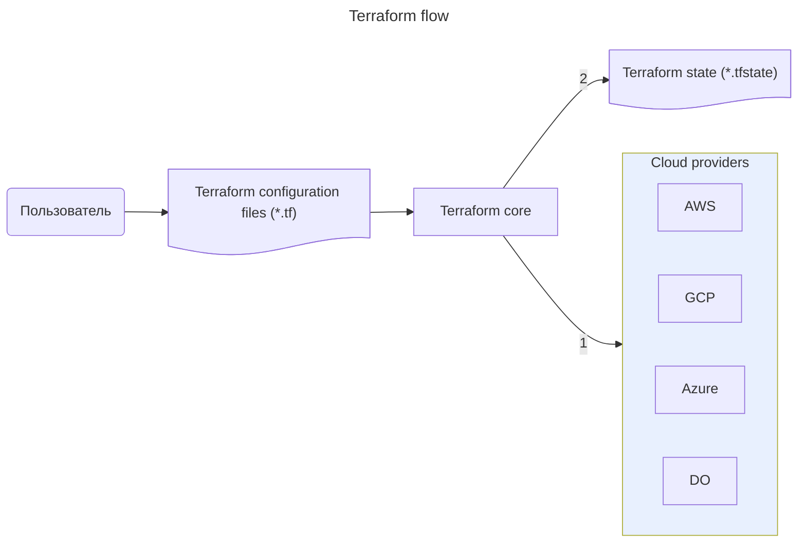

---
aliases:
  - HCL
  - HashiCorp
  - IaC
  - Infrastructure as Code
  - Packer
  - Terraform
  - Yandex Cloud
  - specification
  - state
  - tfstate
  - variable
  - terraform apply
  - terraform destroy
  - terraform init
  - terraform plan
  - инфраструктура как код
---
## Terraform — Infrastructure as Code

Terraform — инструмент управления инфраструктурой как кодом: один файл спецификации позволяет автоматически развернуть из него готовую инфраструктуру.

- Terraform реализует декларативное управление инфраструктурой.
  - **Ansible** ([[ansible]]) реализует императивное управление инфраструктурой.
- Спецификации Terraform можно упаковать в образы виртуальной машины при помощи [[packer]].



---

## Спецификации Terraform

Terraform, как и Packer, разработан компанией HashiCorp. Облачные провайдеры, в том числе Yandex Cloud, поддерживают спецификации Terraform. Спецификации пишутся на языке HCL и хранятся в файлах формата `.tf`. Файлов может быть несколько: при запуске Terraform просматривает все файлы в директории и воспринимает их как единую спецификацию.

**Пример описания провайдера**

```hcl
terraform {
  required_providers {
    yandex = {
      source = "yandex-cloud/yandex"
    }
  }
}

provider "yandex" {
  token     = "<OAuth-токен>"
  cloud_id  = "<идентификатор_облака>"
  folder_id = "<идентификатор_каталога>"
  zone      = "<зона_доступности_по_умолчанию>"
}
```

**Переменные**

Значения параметров либо задаются в спецификации, либо передаются в качестве **переменных**, чтобы адаптировать спецификацию под конкретные задачи.

```hcl
variable "folder-id" {
  type = string
}

provider "yandex" {
  token     = "<OAuth-токен>"
  cloud_id  = "<идентификатор_облака>"
  folder_id = var.folder-id
  zone      = "<зона_доступности_по_умолчанию>"
}
```

**Структура спецификации**

Спецификация состоит из описания **ресурсов**: ВМ, сетей, подсетей и т. д. Ресурсы можно связывать друг с другом.

```hcl
resource "yandex_compute_instance" "vm-1" {
  ...
}

resource "yandex_vpc_network" "network-1" {
  ...
}

resource "yandex_vpc_subnet" "subnet-1" {
  ...
}
```

---

## Использование спецификаций Terraform

Инфраструктура разворачивается в три этапа:

1. `terraform init` — инициализирует провайдеров, указанных в файле спецификации.
2. `terraform plan` — запускает проверку спецификации. Если есть ошибки — появятся предупреждения. Если ошибок нет, отобразится список элементов, которые будут созданы или удалены.
3. `terraform apply` — запускает развёртывание инфраструктуры.

Если инфраструктура больше не нужна, её можно удалить командой `terraform destroy`.
