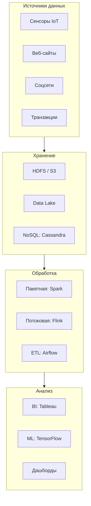

---
aliases:
  - Big Data
---
## 📊 Что такое Big Data? Полное руководство для новичков

---

### 🔍 Что такое Big Data?

**Big Data** — это **огромные объёмы структурированных, полуструктурированных и неструктурированных данных**, которые невозможно эффективно обрабатывать традиционными методами (например, Excel или обычные СУБД).

> 💡 **Ключевая идея**:  
> Речь не о размере в гигабайтах, а о **сложности обработки** — скорость поступления, разнообразие форматов, необходимость анализа в реальном времени.

---

### 🌪️ Пять «V» Big Data (характеристики)

| Буква | Название | Что означает | Пример |
|-------|----------|--------------|--------|
| **Volume** | Объём | Терабайты–петабайты данных | 1 млн пользователей × 100 событий/день × 1 КБ = 100 ГБ/день |
| **Velocity** | Скорость | Данные поступают быстро и непрерывно | Транзакции в банке: 10 000 операций/секунду |
| **Variety** | Разнообразие | Разные форматы: текст, видео, логи, JSON | Логи серверов + соцсети + медицинские изображения |
| **Veracity** | Достоверность | Неточности, шум, неполнота | Опечатки в формах, боты в соцсетях |
| **Value** | Ценность | Полезность после анализа | Из логов → обнаружение мошенничества |

> ⚠️ Некоторые добавляют **6-е V — Variability** (непостоянство объёма: пик нагрузки в чёрную пятницу).

---

### 🎯 Зачем нужен Big Data? (Бизнес-ценность)

| Цель | Как достигается | Реальный пример |
|------|-----------------|-----------------|
| **Персонализация** | Анализ поведения → рекомендации | Netflix: «Вам может понравиться…» |
| **Прогнозирование** | Машинное обучение на исторических данных | Банк: прогноз дефолта по кредиту |
| **Оптимизация** | Анализ операционных данных | Логистика: оптимальные маршруты доставки |
| **Обнаружение аномалий** | Анализ в реальном времени | Банк: блокировка подозрительной транзакции за 200 мс |
| **Инновации** | Анализ неструктурированных данных | Медицина: диагностика по МРТ с помощью AI |

> 💡 **Главный вывод**:  
> Big Data превращает «сырые» данные в **решения**, которые экономят деньги, повышают продажи или спасают жизни.

---

### ⚙️ Как работает архитектура Big Data?

Типичная система состоит из **4 слоёв**:



#### 🔹 Слой 1: Источники данных
- **Структурированные**: транзакции в БД, Excel
- **Полуструктурированные**: логи, JSON, XML
- **Неструктурированные**: видео, изображения, текст

#### 🔹 Слой 2: Хранение
- **Data Lake** — «озеро» сырых данных (без схемы)
- **Data Warehouse** — очищенные данные для аналитики
- **NoSQL БД** — для гибких схем (MongoDB, Cassandra)

#### 🔹 Слой 3: Обработка
- **Пакетная (Batch)**: Spark, Hive — для исторических данных
- **Потоковая (Stream)**: Flink, Kafka Streams — для реального времени
- **Гибридная**: Lambda/Kappa архитектура

#### 🔹 Слой 4: Анализ
- **BI-инструменты**: Tableau, Power BI
- **Машинное обучение**: Python (scikit-learn), TensorFlow
- **Визуализация**: дашборды, алерты

---

### 🛠️ Ключевые технологии (стек)

| Категория | Инструменты | Для чего |
|-----------|-------------|----------|
| **Хранение** | HDFS, Amazon S3, Delta Lake | Масштабируемое хранение |
| **Обработка** | Apache Spark, Flink | Анализ больших объёмов |
| **Потоки** | Apache Kafka, Pulsar | Передача данных в реальном времени |
| **Оркестрация** | Airflow, Prefect | Управление пайплайнами |
| **Каталог данных** | DataHub, Amundsen | Поиск и документация |
| **Облако** | AWS, GCP, Azure | Готовые сервисы (EMR, BigQuery) |

> 💡 **Совет новичку**:  
> Начните с **облачных сервисов** (например, AWS Glue + S3 + Athena) — не нужно настраивать кластеры вручную.

---

### 🏥 Примеры из жизни

| Отрасль | Задача | Технологии | Результат |
|---------|--------|------------|-----------|
| **Ритейл** | Прогноз спроса | Spark ML + исторические продажи | Снижение избытка товара на 15% |
| **Медицина** | Анализ МРТ | TensorFlow + GPU-кластер | Выявление опухолей с точностью 94% |
| **Финансы** | Обнаружение мошенничества | Kafka + Flink (stream processing) | Блокировка транзакции за 50 мс |
| **Транспорт** | Оптимизация маршрутов | Геоданные + графовые алгоритмы | Экономия топлива 12% |
| **Сельское хозяйство** | Мониторинг урожая | Дроны + спутниковые снимки | Повышение урожайности на 20% |

---

### 🚀 Как начать пользоваться Big Data? (Пошагово)

#### Шаг 1: Определите бизнес-задачу
❌ Плохо: «Хочу внедрить Big Data»  
✅ Хорошо: «Хочу снизить отток клиентов на 10% за счёт анализа поведения»

#### Шаг 2: Соберите данные
- Определите источники (логи, БД, API)
- Оцените объём и скорость поступления
- Начните с одного источника (не пытайтесь собрать всё сразу)

#### Шаг 3: Выберите инструменты (для старта)
| Ваш уровень | Рекомендация |
|-------------|--------------|
| **Новичок** | Облако: AWS S3 + Athena (SQL-запросы без настройки) |
| **Средний** | Локально: Docker + Spark + Jupyter Notebook |
| **Команда** | Платформа: Databricks или Snowflake |

#### Шаг 4: Постройте простой пайплайн
```
Источник → Хранение (S3) → Обработка (Spark) → Визуализация (Tableau)
```

#### Шаг 5: Измеряйте ценность
- Не количество обработанных ТБ, а **бизнес-метрики**:
  - Снижение оттока
  - Рост конверсии
  - Сокращение времени принятия решений

---

### ⚠️ Распространённые ошибки

| Ошибка | Последствие | Как избежать |
|--------|-------------|--------------|
| «Собираем все данные на всякий случай» | Хранилище превращается в свалку | Собирайте данные под конкретную задачу |
| «Нам нужен кластер из 100 серверов» | Избыточные затраты | Начните с облака по модели «плати за использование» |
| «Аналитики сами разберутся» | Данные не используются | Вовлекайте бизнес с первого дня |
| «Главное — технологии» | Игнорирование качества данных | 80% усилий — очистка и валидация данных |

---

### ✅ Итог: когда вам НУЖЕН Big Data?

| Ситуация | Нужен ли Big Data? |
|----------|-------------------|
| Обрабатываете < 10 ГБ данных в день | ❌ Нет — используйте обычную БД |
| Нужен анализ в реальном времени (миллисекунды) | ✅ Да — потоковая обработка |
| Данные в разных форматах (видео + логи + транзакции) | ✅ Да — нужна гибкая архитектура |
| Прогнозирование на основе машинного обучения | ✅ Да — требуется большой объём для обучения |
| Просто храните архивные данные | ❌ Нет — достаточно холодного хранилища |

> 💬 **Главное правило**:  
> **Не гонитесь за технологиями. Начинайте с проблемы — и только потом ищите инструмент.**

---

### 📚 С чего начать обучение?

1. **Основы SQL** — для запросов к данным
2. **Python + Pandas** — для анализа небольших наборов
3. **Apache Spark** — для масштабирования
4. **Облако (AWS/GCP)** — для практики без настройки железа
5. **Одна бизнес-задача** — например, «анализ поведения пользователей сайта»

> 🌐 **Бесплатные ресурсы**:  
> - [Databricks Academy](https://academy.databricks.com/)  
> - [Google Cloud Skills Boost](https://www.cloudskillsboost.google/)  
> - [Kaggle Learn](https://www.kaggle.com/learn)

---

✅ **Big Data — это не про технологии. Это про то, как превратить данные в решения, которые меняют бизнес.**