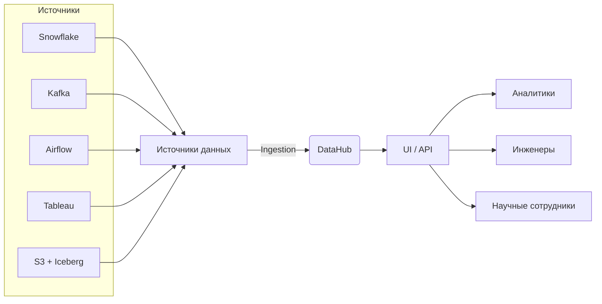

---
aliases:
  - DataHub
---
Конечно! **DataHub** — это **современная платформа управления метаданными (metadata platform)** с открытым исходным кодом, разработанная компанией **LinkedIn** и выпущенная как open-source проект в 2020 году.

> 💡 **Главная цель DataHub**: превратить хаос метаданных в **единый, поископригодный, надёжный каталог данных**, который помогает командам **находить, понимать, доверять и управлять** своими данными.

---

## 🎯 Зачем нужен DataHub? (Проблемы, которые он решает)

В современных организациях данные разбросаны по десяткам систем:
- Хранилища: Snowflake, BigQuery, Redshift
- Озера: S3, ADLS с Iceberg/Delta
- Потоки: Kafka, Pulsar
- BI: Tableau, Power BI, Looker
- ETL: Airflow, dbt

**Без централизованного каталога** возникают проблемы:

| Проблема | Как DataHub помогает |
|---------|----------------------|
| «Где найти таблицу `user_events`?» | 🔍 **Поиск по имени, описанию, тегам** |
| «Кто владеет этой таблицей?» | 👤 **Владельцы и эксперты** |
| «Можно ли доверять этим данным?» | ✅ **Качество данных, рейтинги, проверки** |
| «Что изменится, если я удалю эту колонку?» | 🧩 **Lineage (происхождение данных)** |
| «Какие отчёты используют этот датасет?» | 📊 **Использование в BI и дашбордах** |

---

## 🧩 Ключевые возможности DataHub

### 1. **Универсальный каталог**
- Поддерживает **100+ источников**: СУБД, озера, потоки, BI, ETL.
- Единое пространство имён: `prod.dwh.fact_sales`.

### 2. **Поиск и обнаружение**
- Полноценный **поисковик** (как Google для данных).
- Фильтры по: типу, владельцу, тегам, частоте использования.

### 3. **Lineage (Происхождение данных)**
- Визуализация **потока данных**:  
  `Kafka → Spark → Iceberg → Trino → Tableau`
- Ответ на вопрос: **«Откуда берутся эти данные?»**

### 4. **Управление качеством**
- Интеграция с **Great Expectations**, **dbt tests**.
- Отображение **статуса качества** (зелёный/красный).

### 5. **Сотрудничество**
- Комментарии, рейтинги, запросы на доступ.
- Уведомления об изменениях.

### 6. **Политики и безопасность**
- Интеграция с **LDAP/SSO**.
- RBAC (ролевой доступ): кто может редактировать, просматривать.

### 7. **Автоматизация**
- **Ingestion Framework**: автоматическая загрузка метаданных из источников.
- Webhooks и события для CI/CD.

---

## 🌐 Архитектура DataHub

- **GMS (Generic Metadata Service)** — ядро хранения.
- **MAE (Metadata Change Events)** — шина событий.
- **Frontend** — React-приложение.

---

## 🆚 DataHub vs другие каталоги

| Система | Отличие |
|--------|--------|
| **Amundsen** (тоже от LinkedIn) | Упрощённый предшественник DataHub |
| **Apache Atlas** | Акцент на безопасности и governance, сложнее в использовании |
| **AWS Glue Catalog** | Только для AWS, без lineage и collaboration |
| **Alation** | Коммерческий продукт, дороже, закрытый |

> 💡 **DataHub — наиболее современный, гибкий и open-source вариант**.

---

## 💡 Типичные сценарии использования

1. **Onboarding нового аналитика**  
   → Он заходит в DataHub, находит нужные таблицы, видит владельца, качество, примеры использования.

2. **Изменение схемы таблицы**  
   → Инженер видит **lineage**, понимает, какие дашборды сломаются, согласовывает изменения.

3. **Аудит данных**  
   → Compliance-команда проверяет, где используются PII-данные, через теги и lineage.

4. **Мониторинг качества**  
   → При падении качества данных — автоматическое уведомление владельцу.

---

## ⚙️ Технологический стек

- **Backend**: Java, Kafka, Elasticsearch, MySQL/PostgreSQL
- **Frontend**: React, TypeScript
- **Развёртывание**: Docker, Kubernetes, Helm
- **Интеграции**: Python SDK, REST API, GraphQL

---

## 🎯 Итог

> **DataHub — это «Google для данных» вашей компании.**  
> Он отвечает на ключевые вопросы:
> - Где мои данные?
> - Кто ими владеет?
> - Насколько им можно доверять?
> - Как они используются?

Без подобной платформы **data mesh**, **data fabric** и даже простая **аналитика** становятся крайне неэффективными.

---

Хочешь пример **настройки ingestion из Kafka** или **интеграции с dbt**? Напиши — подготовлю! 😊