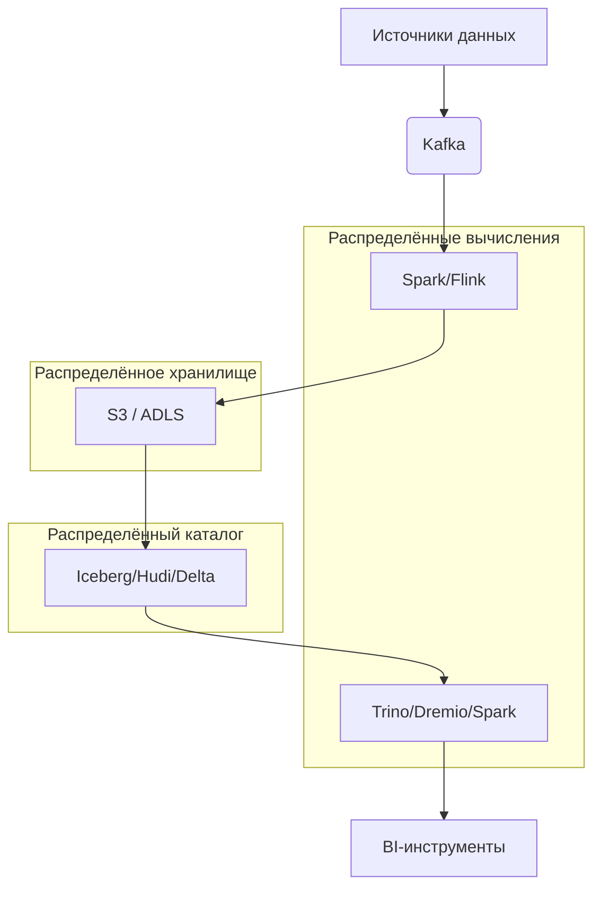

---
aliases:
  - Распределённая архитектура данных
  - Распределeнная архитектура данных
  - Distributed Data Architectures
---
> Distributed Data Architectures
> Распределённая архитектура данных
> [[Data Mesh]] – частный пример

Конечно! **Распределённая архитектура данных** — это подход к проектированию систем хранения, обработки и анализа данных, при котором **данные и вычисления распределяются между множеством узлов (серверов)**, работающих совместно как единое целое.

> 💡 Цель: **масштабируемость, отказоустойчивость, производительность и географическая доступность**.

---

## 🎯 Зачем она нужна?

### Проблемы монолитных систем:
- **Ограниченная масштабируемость**: один сервер = предел CPU/RAM/диска.
- **Единая точка отказа**: падение сервера → недоступность данных.
- **Высокая latency** для пользователей из других регионов.
- **Не справляется с big data**: терабайты/петабайты не помещаются на один диск.

### Решение — распределённость:
- Данные **разделены** между узлами → растёт объём и пропускная способность.
- Узлы **дублируют** данные → отказоустойчивость.
- Вычисления **параллельны** → высокая скорость обработки.
- Кластеры можно размещать **в разных регионах** → низкая задержка.

---

## 🧱 Ключевые принципы

| Принцип | Описание |
|--------|----------|
| **Шардирование (Sharding)** | Данные делятся по ключу (например, `user_id % 16`) между узлами |
| **Репликация (Replication)** | Каждый фрагмент данных хранится на нескольких узлах (обычно 3) |
| **Согласованность (Consistency)** | Гарантии актуальности данных (strong, eventual, causal) |
| **Отказоустойчивость** | Система продолжает работать при выходе узлов |
| **Горизонтальное масштабирование** | Добавление новых узлов → рост мощности |

---

## 🌐 Примеры распределённых систем

### 1. **Hadoop HDFS**
- **Что**: Распределённая файловая система.
- **Как**: Файлы делятся на блоки (128 МБ), блоки реплицируются на 3 узла.
- **Зачем**: Хранение petabyte-данных для аналитики.

### 2. **Apache Cassandra**
- **Что**: NoSQL-база данных.
- **Как**: Данные шардируются по токену, реплицируются в кластере.
- **Зачем**: Высокая доступность, линейное масштабирование, low-latency.

### 3. **Apache Kafka**
- **Что**: Распределённая платформа потоковой передачи событий.
- **Как**: Топики делятся на партиции, партиции реплицируются.
- **Зачем**: Обработка миллионов событий в секунду.

### 4. **Google Spanner**
- **Что**: Глобально распределённая SQL-база.
- **Как**: Данные реплицируются между дата-центрами, используется TrueTime API.
- **Зачем**: Strong consistency + глобальная доступность.

### 5. **Amazon S3**
- **Что**: Объектное хранилище.
- **Как**: Объекты автоматически реплицируются в регионе (и между регионами).
- **Зачем**: Надёжное хранение файлов с 99.999999999% durability.

### 6. **Snowflake / BigQuery**
- **Что**: Cloud-хранилища данных.
- **Как**: Вычисления и хранение разделены, масштабируются независимо.
- **Зачем**: Мгновенный запуск аналитики без управления инфраструктурой.

---

## 📊 Типичная архитектура Data Lakehouse

→ Все компоненты — **распределённые**, работают параллельно.

---

## ⚠️ Вызовы распределённой архитектуры

| Проблема | Решение |
|---------|--------|
| **Сетевые задержки** | Размещение узлов в одном дата-центре |
| **Согласованность vs доступность** | Выбор модели CAP (например, eventual consistency) |
| **Сложность отладки** | Централизованный логгинг, трассировка (OpenTelemetry) |
| **Стоимость** | Эффективное управление ресурсами (Kubernetes, autoscaling) |

---

## 💡 Когда использовать?

| Сценарий | Нужна распределённость? |
|---------|--------------------------|
| Приложение с 100 пользователями | ❌ Нет |
| Микросервисы с shared DB | ⚠️ Возможно |
| Big Data аналитика (TB+) | ✅ Да |
| High-load сервис (10K+ RPS) | ✅ Да |
| Глобальное приложение | ✅ Да |

---

## 🎯 Итог

> **Распределённая архитектура данных — это основа современных high-scale систем.**  
> Она позволяет:
> - Хранить **петабайты** данных
> - Обрабатывать **миллионы запросов в секунду**
> - Гарантировать **доступность 99.99%+**
> - Работать **в любом регионе мира**

Без неё невозможны такие сервисы, как Google, Facebook, Netflix, Amazon.

---

Хочешь пример **настройки распределённого кластера Spark** или **сравнение Cassandra vs DynamoDB**? Напиши — подготовлю! 😊