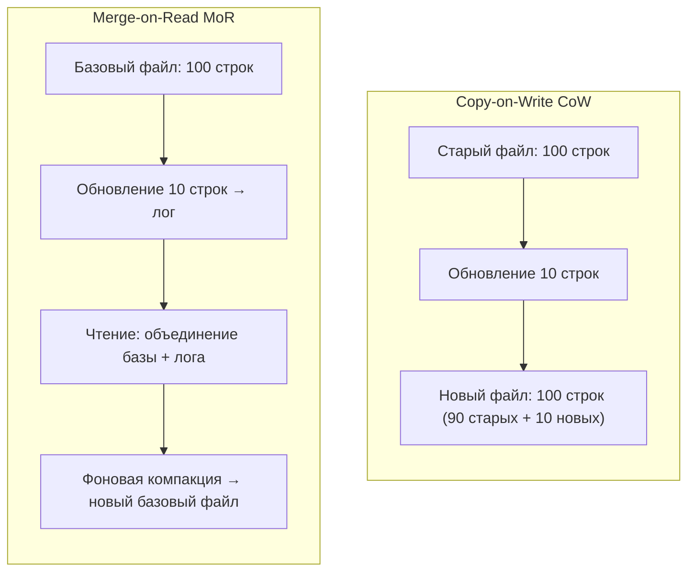
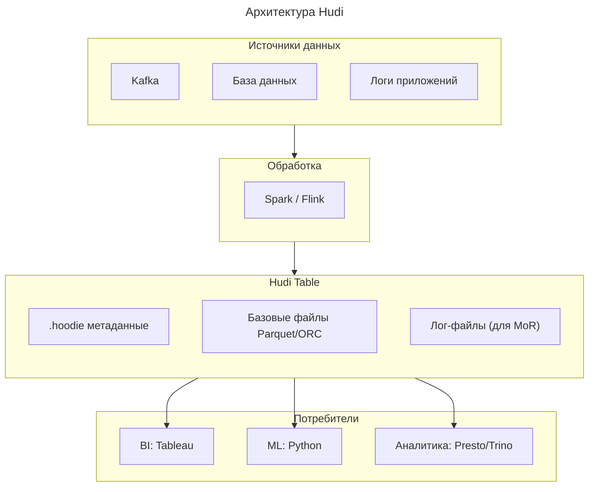

---
aliases:
  - Apache Hudi
  - Hudi
  - Hadoop Upserts Deletes and Incrementals
---
## 🚀 Что такое Apache Hudi?

**Apache Hudi** (Hadoop Upserts Deletes and Incrementals) — это **фреймворк с открытым исходным кодом** для управления данными в **озёрах данных ([[Data Lake|Data Lakes]])**, который превращает статичное озеро в **динамическую, транзакционную систему** с поддержкой:

- **Upserts** (обновление существующих записей)
- **Удалений**
- **Инкрементальной обработки**
- **Временных путешествий (time travel)**
- **ACID-транзакций**

> 💡 **Ключевая идея**:  
> *«Data Lake + транзакции = управляемое озеро данных»*  
> Hudi добавляет «мозги» к объектному хранилищу (S3, ADLS, GCS), позволяя обрабатывать данные как в базе данных, но с масштабируемостью озера.

---

## 🔍 Зачем нужен Hudi? Проблемы классических Data Lake

| Проблема классического озера | Как решает Hudi |
|-----------------------------|-----------------|
| **Нет обновлений/удалений** — только добавление файлов | Поддержка **upsert/delete** на уровне строк |
| **Маленькие файлы** — тысячи мелких файлов после частых записей | Автоматическая **компакция** (маленькие → большие файлы) |
| **Нет изоляции транзакций** — читатели видят частичные данные | **ACID-гарантии**: читатели видят только завершённые транзакции |
| **Полная перезапись** для обновления — дорого и медленно | **Инкрементальные обновления** только затронутых данных |
| **Нет временных версий** — нельзя вернуться к состоянию на вчера | **Time travel** — запрос данных на любой момент времени |

---

## 🧩 Ключевые концепции Hudi

### 1. Типы таблиц

| Тип | Описание | Когда использовать |
|-----|----------|-------------------|
| **Copy-on-Write (CoW)** | Обновление = перезапись всего файла | Чтение-ориентированные сценарии, редкие обновления |
| **Merge-on-Read (MoR)** | Обновление = запись в лог + фоновая компакция | Запись-ориентированные сценарии, частые обновления |



### 2. Индексы (для быстрых upsert)

| Тип индекса      | Скорость поиска | Память  | Использование                              |
| ---------------- | --------------- | ------- | ------------------------------------------ |
| **Bloom Filter** | Быстро          | Низкая  | По умолчанию, для больших таблиц           |
| **Global Bloom** | Быстро          | Средняя | Когда запись может быть в любом партиционе |
| **Simple**       | Медленно        | Низкая  | Для маленьких таблиц                       |
| **HBase**        | Очень быстро    | Высокая | Для экстремальных нагрузок                 |

### 3. Временные путешествия (Time Travel)

```sql
-- Запрос данных на конкретный момент времени
SELECT * FROM hudi_table 
  TIMESTAMP AS OF '2024-06-01 10:00:00'
  WHERE order_id = 123;
```

→ Полезно для:
- Аудита изменений
- Отладки ошибок
- Восстановления после ошибочных обновлений

---

## 🏗️ Архитектура Hudi



### 🔹 Структура таблицы в хранилище:

```
s3://my-bucket/orders/
├── .hoodie/                  ← Метаданные Hudi (транзакции, индексы)
│   ├── 20240601100000.commit
│   ├── 20240601100500.commit
│   └── hoodie.properties
├── 2024/06/01/              ← Партиции
│   ├── 000001-000-000.parquet  ← Базовые файлы (CoW)
│   └── 000001-000-001.log      ← Лог-файлы (MoR)
└── _hoodie_partition_path=...  ← Метаданные партиций
```

---

## 💻 Пример: Запись данных с upsert (на Spark)

```scala
import org.apache.hudi.QuickstartUtils._
import org.apache.hudi.DataSourceWriteOptions._
import org.apache.hudi.config.HoodieWriteConfig._
import org.apache.spark.sql.SaveMode._

// 1. Создаём данные
val dataGen = new DataGenerator()
val inserts = spark.read.json(Seq(toJson(dataGen.generateInserts(10))).toDS())

// 2. Записываем как таблицу Hudi
inserts.write.format("hudi")
  .options(Map(
    "hoodie.table.name" -> "orders",
    "hoodie.datasource.write.recordkey.field" -> "order_id",    // Первичный ключ
    "hoodie.datasource.write.partitionpath.field" -> "datestr",  // Партиция
    "hoodie.datasource.write.precombine.field" -> "ts",          // Поле для разрешения конфликтов
    "hoodie.datasource.write.table.type" -> "COPY_ON_WRITE",    // CoW или MERGE_ON_READ
    "hoodie.datasource.write.operation" -> "upsert"              // upsert/delete/bulk_insert
  ))
  .mode(Overwrite)  // Или Append для инкрементальной записи
  .save("s3://my-bucket/orders/")

// 3. Обновляем существующие записи (upsert)
val updates = spark.read.json(Seq(toJson(dataGen.generateUpdates(5))).toDS())
updates.write.format("hudi")
  .options(getQuickstartWriteConfigs)  // Те же настройки
  .mode(Append)
  .save("s3://my-bucket/orders/")
```

---

## 🆚 Сравнение: Hudi vs Delta Lake vs Iceberg

| Критерий                      | **Apache Hudi**                         | **[[Delta Lake]]**                             | **Apache [[Iceberg]]**               |
| ----------------------------- | --------------------------------------- | ---------------------------------------------- | ------------------------------------ |
| **Upsert/Delete**             | ✅ Отличная поддержка                    | ✅ Хорошая                                      | ⚠️ Ограниченная (требует перезаписи) |
| **Инкрементальная обработка** | ✅ Встроенная (`hoodie.streamer`)        | ⚠️ Через Structured Streaming                  | ✅ Через `changelog`                  |
| **Компакция**                 | ✅ Автоматическая                        | ✅ Ручная (`OPTIMIZE`)                          | ✅ Ручная                             |
| **Временные путешествия**     | ✅ Да                                    | ✅ Да                                           | ✅ Да                                 |
| **Интеграция с потоками**     | ✅ Отличная (встроенная поддержка Kafka) | ⚠️ Через Spark Streaming                       | ⚠️ Ограниченная                      |
| **Поддержка вендоров**        | ✅ AWS, GCP, Azure                       | ✅ Databricks (проприетарная оптимизация)       | ✅ AWS, Snowflake, Dremio             |
| **Лицензия**                  | ✅ Apache 2.0 (полностью открытая)       | ✅ Apache 2.0 + проприетарные фичи в Databricks | ✅ Apache 2.0                         |
| **Сложность настройки**       | Средняя                                 | Низкая (в экосистеме Databricks)               | Средняя                              |

> 💡 **Когда выбрать Hudi**:  
> ➤ Если нужны **частые upsert/delete** (например, обновление профилей пользователей)  
> ➤ Если важна **инкрементальная обработка** из потоков (Kafka → Hudi)  
> ➤ Если нужна **полностью открытая** экосистема без привязки к вендору

---

## 🌐 Реальные сценарии использования

| Сценарий | Как работает | Преимущество Hudi |
|----------|--------------|-------------------|
| **CDC из базы данных** | Debezium → Kafka → Spark → Hudi | Обновления в реальном времени без полной перезаписи |
| **Персонализация** | События клика → обновление профиля в Hudi | Быстрые upsert для тысяч пользователей в секунду |
| **Финансовая отчётность** | Ежедневные транзакции → инкрементальное обновление | Аудит через time travel: «какие данные были 1 января?» |
| **Машинное обучение** | Обучение на свежих данных из Hudi | Инкрементальная выборка только новых записей |

---

## 🛠️ Интеграции

| Инструмент | Поддержка | Примечание |
|------------|-----------|------------|
| **Spark** | ✅ Полная | Основная платформа для записи/чтения |
| **Flink** | ✅ Полная | Для потоковой записи (streaming upsert) |
| **Hive** | ✅ Чтение | Через `hudi-hadoop-mr` |
| **Presto/Trino** | ✅ Чтение | Начиная с версии 0.270+ |
| **AWS Athena** | ✅ Чтение | Поддержка с 2021 года |
| **Databricks** | ✅ Чтение | Поддержка с версии 10.4+ |
| **dbt** | ⚠️ Ограниченная | Через кастомные адаптеры |

---

## ✅ Преимущества Hudi

| Преимущество | Объяснение |
|--------------|------------|
| **Транзакционность в озере** | ACID без перехода на дорогостоящую базу данных |
| **Экономия хранилища** | Только изменённые данные перезаписываются |
| **Скорость чтения** | Компакция устраняет проблему маленьких файлов |
| **Инкрементальная обработка** | Потребители читают только новые данные с последней точки |
| **Открытый стандарт** | Нет привязки к вендору, можно мигрировать между облаками |

---

## ⚠️ Ограничения

| Ограничение | Обходное решение |
|-------------|------------------|
| **Сложность настройки** | Использовать управляемые сервисы (AWS EMR, Databricks) |
| **Перегрузка метаданных** | Для очень больших таблиц (>100 ТБ) — настраивать партиционирование |
| **Ограниченная поддержка в некоторых инструментах** | Использовать только проверенные интеграции (Spark, Flink, Presto) |
| **Требует планирования партиций** | Неправильное партиционирование → деградация производительности |

---

## 💬 Итог

> **Apache Hudi — это «мост» между традиционными базами данных и современными озёрами данных**:  
> - Сохраняет **масштабируемость и дешевизну** объектного хранилища  
> - Добавляет **транзакционность, обновления и инкрементальную обработку**

> 💡 **Когда использовать**:  
> ➤ Для сценариев с **частыми обновлениями** (профили пользователей, транзакции)  
> ➤ Для **потоковой интеграции** (Kafka → озеро)  
> ➤ Когда нужна **полностью открытая** экосистема без привязки к вендору

> ❌ **Когда не использовать**:  
> ➤ Для статичных данных без обновлений (просто используйте Parquet)  
> ➤ Для синхронных запросов с низкой задержкой (лучше использовать базу данных)

---

✅ **Hudi превращает пассивное озеро данных в активную, управляемую платформу для аналитики и машинного обучения.**