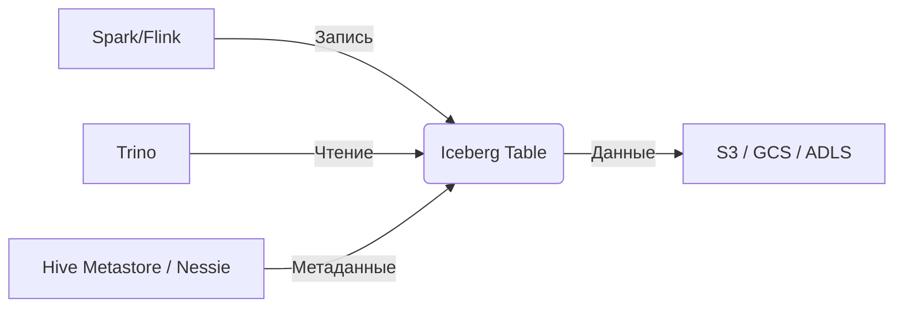

---
aliases:
  - Apache Iceberg
  - Iceberg
---
Конечно! **Apache Iceberg** — это **открытый формат таблиц для аналитических систем**, предназначенный для работы с **масштабными данными в объектных хранилищах** (S3, GCS, ADLS и др.). Он решает ключевые проблемы традиционных "озер данных" (data lakes), превращая их в **lakehouse** — гибрид озера и склада данных.

> 💡 Iceberg — это **не СУБД**, а **формат метаданных и данных**, который делает объектное хранилище **надёжным, согласованным и SQL-совместимым**.

---

## 🎯 Проблемы классического Data Lake

В традиционном data lake данные хранятся как файлы (Parquet, CSV) в S3:
```
s3://bucket/sales/year=2024/month=05/day=10/data.parquet
```

### Проблемы:
1. **Нет ACID-транзакций** → конкурентные записи ломают данные.
2. **Медленные запросы** → нужно сканировать тысячи файлов.
3. **Нет time travel** → нельзя откатиться к предыдущей версии.
4. **Сложная схема** → изменение схемы (например, добавление колонки) требует перезаписи всех данных.
5. **Нет изоляции** → разработчик может случайно испортить продакшен-данные.

---

## 🧊 Как Iceberg решает эти проблемы?

Iceberg добавляет **уровень метаданных** поверх файлов:

```
s3://bucket/sales/
├── data/                 ← Файлы данных (Parquet/ORC)
└── metadata/
    ├── v1.metadata.json  ← Версия 1
    ├── v2.metadata.json  ← Версия 2
    └── snap-123456789.avro ← Снимок (snapshot)
```

### Ключевые возможности:

| Возможность | Как работает |
|------------|--------------|
| **ACID-транзакции** | Изменения атомарны: либо всё записалось, либо ничего |
| **Time Travel** | Можно читать данные на любой момент времени: `SELECT * FROM sales AT '2024-05-01'` |
| **Эволюция схемы** | Добавлять/удалять колонки без перезаписи данных |
| **Скрытие партиций** | Пользователь пишет `WHERE date = '2024-05-01'`, Iceberg сам находит нужные файлы |
| **Конкурентная запись** | Несколько процессов могут писать одновременно (оптимистичная блокировка) |
| **Поддержка SQL** | Полная совместимость с Spark, Trino, Flink, Hive |

---

## 🧩 Архитектура Iceberg

### 1. **Файлы данных**
- Хранятся в Parquet, ORC или Avro.
- Неизменяемы (immutable).

### 2. **Метаданные**
- **Manifest files**: список файлов данных + статистика (min/max значения).
- **Metadata files**: JSON-файлы с описанием таблицы, схемой, партициями.
- **Snapshots**: указывают на конкретную версию таблицы.

> 🔁 При обновлении создаётся **новый snapshot**, старые остаются для time travel.

---

## 🌐 Интеграции

Iceberg поддерживается всеми современными движками:

| Движок | Поддержка |
|--------|-----------|
| **Apache Spark** | ✅ Полная (чтение, запись, DDL) |
| **Trino/Presto** | ✅ Чтение, запись, time travel |
| **Flink** | ✅ Streaming-запись |
| **Hive** | ⚠️ Ограниченная |
| **Dremio, Snowflake, BigQuery** | ✅ Через connectors |

---

## 📊 Пример использования

### Создание таблицы (Spark SQL):
```sql
CREATE TABLE prod.db.sales (
    id BIGINT,
    product STRING,
    price DECIMAL(10,2),
    event_time TIMESTAMP
)
USING iceberg
PARTITIONED BY (days(event_time));
```

### Time Travel:
```sql
-- Данные на 1 мая 2024
SELECT * FROM sales TIMESTAMP AS OF '2024-05-01';

-- Или по номеру снимка
SELECT * FROM sales VERSION AS OF 12345;
```

### Эволюция схемы:
```sql
-- Добавить колонку без перезаписи
ALTER TABLE sales ADD COLUMN category STRING;
```

---

## 🔍 Преимущества Iceberg

| Преимущество | Объяснение |
|-------------|------------|
| **Производительность** | Manifest-файлы с min/max позволяют пропускать ненужные файлы (predicate pushdown) |
| **Надёжность** | ACID гарантирует целостность даже при сбоях |
| **Гибкость** | Работает с любым объектным хранилищем |
| **Совместимость** | Единый формат для Spark, Trino, Flink |
| **Изоляция** | Можно использовать с Nessie для ветвления (dev/prod) |

---

## 🆚 Iceberg vs Delta Lake vs Hudi

| Критерий | Iceberg | Delta Lake | Hudi |
|---------|---------|------------|------|
| **Открытость** | ✅ Apache 2.0 | ❌ Часть Databricks | ✅ Apache 2.0 |
| **SQL-поддержка** | ✅ Trino, Spark, Flink | ❌ Только Spark (частично Trino) | ⚠️ Ограниченная |
| **Time Travel** | ✅ | ✅ | ✅ |
| **Branching** | ✅ (с Nessie) | ❌ | ⚠️ |
| **Производительность** | 🔥 Лучше при большом числе файлов | Хорошо | Хорошо |

> 💡 Iceberg — лучший выбор для **мультидвижковых** (multi-engine) сред.

---

## 🛠️ Типичная архитектура с Iceberg



---

## ⚠️ Ограничения

- **Сложность**: требует понимания метаданных.
- **Хранение метаданных**: нужно выбрать каталог (Hive Metastore, Nessie, JDBC).
- **Обучение**: команда должна освоить новые концепции.

---

## 💡 Заключение

> **Apache Iceberg — это "операционная система" для data lake.**  
> Он превращает неструктурированное озеро файлов в **надёжную, согласованную и высокопроизводительную таблицу**, доступную через SQL.

Если вы строите **lakehouse**, Iceberg — один из лучших выборов благодаря:
- Открытости
- Поддержке множества движков
- Мощным возможностям (time travel, эволюция схемы, ACID)

---

Хочешь пример **настройки Iceberg с Nessie и Spark** или **миграции с Hive-партиций на Iceberg**? Напиши — подготовлю! 😊