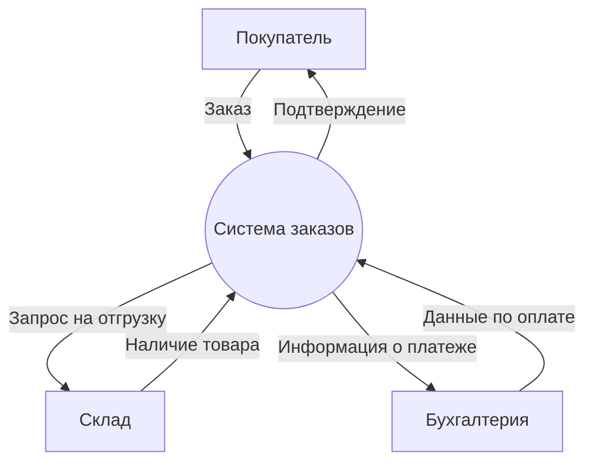
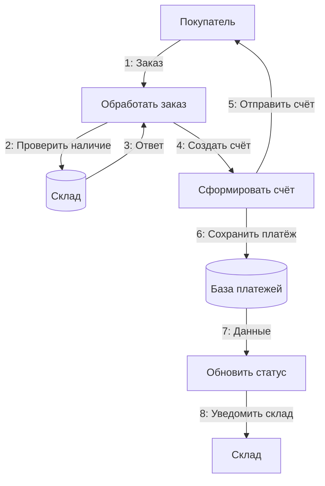

---
aliases:
  - DFD
  - Data Flow Diagram
---
**Data Flow Diagram (DFD)** — это **графическая модель**, которая показывает, как данные перемещаются через систему: откуда приходят, как обрабатываются, куда уходят.

---

## ✅ Что такое Data Flow Diagram (DFD)?

> **DFD** — это диаграмма потоков данных, используемая в анализе и проектировании систем.  
> Она фокусируется на **данных**, а не на реализации.

### 💬 Простыми словами:
> «Кто даёт данные → что с ними делает система → кому отдаёт результат»

---

## ✅ Основные элементы DFD

| Элемент | Обозначение | Описание |
|--------|-------------|----------|
| **Внешняя сущность (External Entity)** | Квадрат | Источник или получатель данных (пользователь, другая система) |
| **Процесс (Process)** | Круг или прямоугольник со скруглёнными углами | Действие, которое преобразует входные данные в выходные |
| **Хранилище данных (Data Store)** | Открытый прямоугольник | Место хранения данных (база, файл) |
| **Поток данных (Data Flow)** | Стрелка | Направление движения данных |

---

## ✅ Уровни DFD

| Уровень | Название | Описание |
|--------|----------|----------|
| **0** | Контекстная диаграмма | Общая картина: система ↔ внешние сущности |
| **1** | Диаграмма 1-го уровня | Разбивка системы на основные процессы |
| **2+** | Детализация | Глубокая проработка каждого процесса |

---

## ✅ Пример 1: Контекстная диаграмма (Уровень 0)

> 💡 Это **уровень 0**: система как чёрный ящик.

---

## ✅ Пример 2: Уровень 1 — Система заказов

> 💡 Здесь видны **процессы**, **хранилища** и **потоки**.

---

## ✅ Пример 3: DFD для онлайн-магазина (текстовый)

### Уровень 0:
- Внешние сущности: Покупатель, Платёжная система, Склад
- Система: Интернет-магазин

### Уровень 1:
1. **Принять заказ** ← Покупатель
2. **Проверить оплату** → Платёжная система
3. **Проверить наличие** → Склад
4. **Отправить подтверждение** → Покупатель
5. **Обновить базу** → Хранилище заказов

---

## ✅ Когда использовать DFD?

| Сценарий | Почему полезен |
|----------|----------------|
| ✅ Анализ существующей системы | Понять, как данные движутся |
| ✅ Проектирование новой системы | Спроектировать потоки до кода |
| ✅ Аудит безопасности | Найти уязвимости в потоках |
| ✅ Обучение команды | Визуализировать бизнес-логику |

---

## ✅ Отличие от других диаграмм

| Диаграмма | Фокус | DFD отличается тем, что... |
|-----------|-------|----------------------------|
| **UML Use Case** | Пользовательские сценарии | Не показывает данные, только действия |
| **Sequence Diagram** | Временная последовательность | Показывает объекты, а не потоки данных |
| **ERD** | Структура БД | Показывает таблицы, а не процессы |
| **DFD** | **Потоки данных** | **Фокус на данных, а не на реализации** |

---

## ✅ Советы по созданию DFD

1. **Начинайте с уровня 0** — общая картина.
2. **Используйте глаголы** для процессов: "Обработать", "Проверить", "Сохранить".
3. **Не смешивайте уровни** — каждый уровень должен быть самодостаточным.
4. **Проверяйте баланс** — входы/выходы должны совпадать между уровнями.
5. **Избегайте циклов** — данные должны двигаться линейно.

---

## ✅ Финальный вывод

> ✅ **DFD — это карта данных**:  
> Она показывает, **как информация течёт через систему**, без деталей реализации.

> 💬 _“If you can’t draw the data flow, you don’t understand the system.”_

---

Проблемы подхода:
1. Потоки данных слишком сложные. Реализовать сложное движение данных в нескольких системах может быть непросто.
2. Обеспечение соответствия. Поддерживать потоки данных в соответствии с нормами конфиденциальности тоже непросто. Для этого необходим строгий контроль и документирование.
3. Мониторинг в режиме реального времени. Организациям необходимы инструменты для мониторинга потоков данных в режиме реального времени. Только так можно оперативно обнаруживать проблемы и реагировать на них.

Для решения этих задач организации используют специализированные инструменты, которые позволяют автоматизировать управление потоками данных. Один из таких инструментов — это  Apache [[NiFi]].