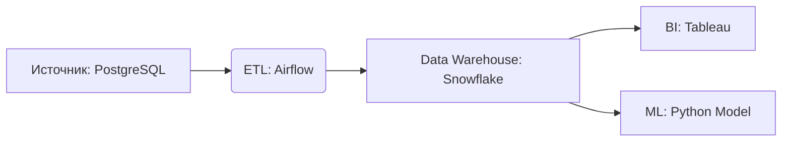

---
aliases:
  - Data Flow Management
  - Управление потоками данных
---
## ✅ Что такое Data Flow Management?

> Это **управление жизненным циклом данных**, включая:
- Источники (базы данных, API, файлы)
- Трансформации ([[ETL]]/ELT, очистка, агрегация)
- Назначения (Data Warehouse, [[КИС|BI]], ML-модели)
- Мониторинг, безопасность, качество

### 💬 Простыми словами:
> «Как данные попадают из Excel в ваш дашборд — и как убедиться, что они правильные?»

---

## ✅ Основные компоненты

| Компонент | Роль |
|----------|------|
| **Источники данных** | БД, API, логи, IoT-устройства |
| **Конвейеры (Pipelines)** | ETL/ELT, Spark, Airflow |
| **Хранилища** | Data Lake, Data Warehouse, базы данных |
| **Потребители** | BI-инструменты, ML-модели, приложения |
| **Метаданные** | Описание данных: откуда, когда, как изменялись |
| **Качество данных** | Валидация, профилирование, мониторинг |
| **Безопасность** | Шифрование, маскировка, управление доступом |
| **Оркестрация** | Планирование, запуск, восстановление |

---

## ✅ Цели Data Flow Management

| Цель | Объяснение |
|------|------------|
| ✅ **Целостность данных** | Данные не теряются, не дублируются |
| ✅ **Качество данных** | Данные точны, полны, актуальны |
| ✅ **Производительность** | Потоки работают быстро и надёжно |
| ✅ **Безопасность** | Данные защищены от утечек |
| ✅ **Аудит и соответствие** | Можно отследить происхождение данных (data lineage) |
| ✅ **Масштабируемость** | Система растёт вместе с объёмами данных |

---

## ✅ Пример: Простой поток данных

[[Data Flow Diagram]]

> 🔍 **Data Flow Management** отвечает за:
- Как часто запускать ETL?
- Что делать при ошибке?
- Как проверить качество данных?
- Кто может читать данные?

---

## ✅ Инструменты Data Flow Management

| Категория | Инструменты |
|----------|-------------|
| **Оркестрация** | Apache Airflow, Prefect, Dagster |
| **ETL/ELT** | dbt, Fivetran, Talend, Informatica |
| **Data Quality** | Great Expectations, Soda, Monte Carlo |
| **Lineage & Catalog** | Apache Atlas, DataHub, Amundsen |
| **Security** | Apache Ranger, AWS IAM, HashiCorp Vault |
| **Monitoring** | Prometheus, Grafana, Datadog |

---

## ✅ Отличие от смежных понятий

| Понятие | Отличие |
|--------|---------|
| **Data Governance** | Управление политиками, ролями, стандартами |
| **Data Engineering** | Построение инфраструктуры для потоков |
| **Data Flow Management** | **Контроль за самими потоками**: от источника до потребителя |

> 💡 **Data Flow Management = Data Engineering + Data Governance + Monitoring**

---

## ✅ Когда это критично?

| Сценарий | Почему важно |
|----------|--------------|
| ✅ Финансовые отчёты | Ошибка в потоке → неверные цифры → штрафы |
| ✅ ML-модели | Грязные данные → плохая модель |
| ✅ GDPR/CCPA | Нужно знать, где хранятся персональные данные |
| ✅ Реальное время | Задержка в потоке → потеря клиентов |

---

## ✅ Финальный вывод

> ✅ **Data Flow Management** — это **"операционная система" для данных**:  
> Она обеспечивает, чтобы данные **двигались правильно, безопасно и качественно**.

> 💬 _“Data is the new oil. Data Flow Management is the pipeline that delivers it.”_

---

## 📚 Где учиться дальше?

- Book: *“Designing Data-Intensive Applications”* — Martin Kleppmann  
- [Apache Airflow Docs](https://airflow.apache.org/)  
- [dbt Docs](https://docs.getdbt.com/)  
- YouTube: *“Data Flow Management Explained”* — TechWorld with Nana

---

✅ **Теперь вы знаете:**  
Что такое Data Flow Management — и почему он **критически важен** для современных данных.

📌 Сохраните эту таблицу — она станет вашей **картой управления данными**.

> 📊 _“Without flow management, data becomes chaos.”_