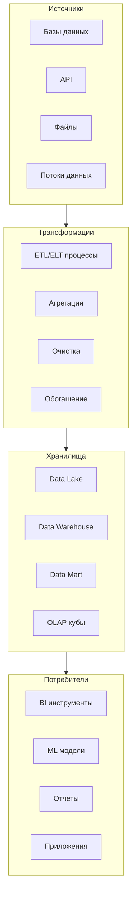
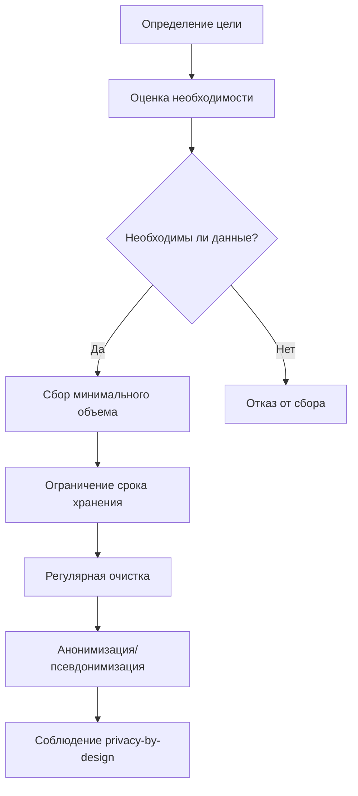
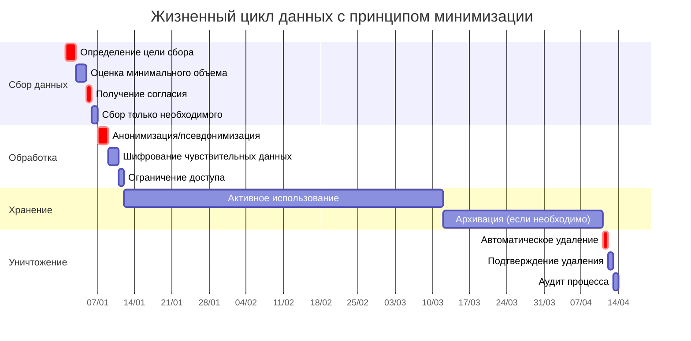
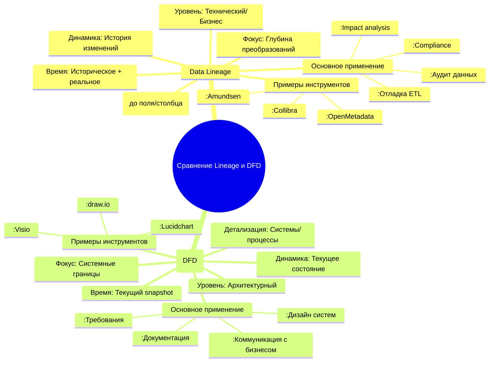
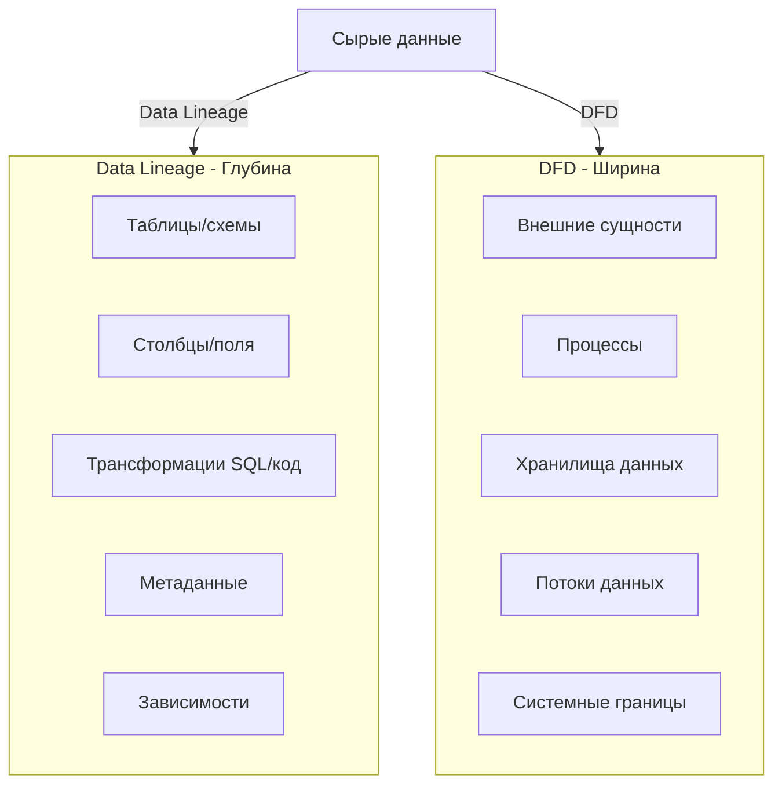
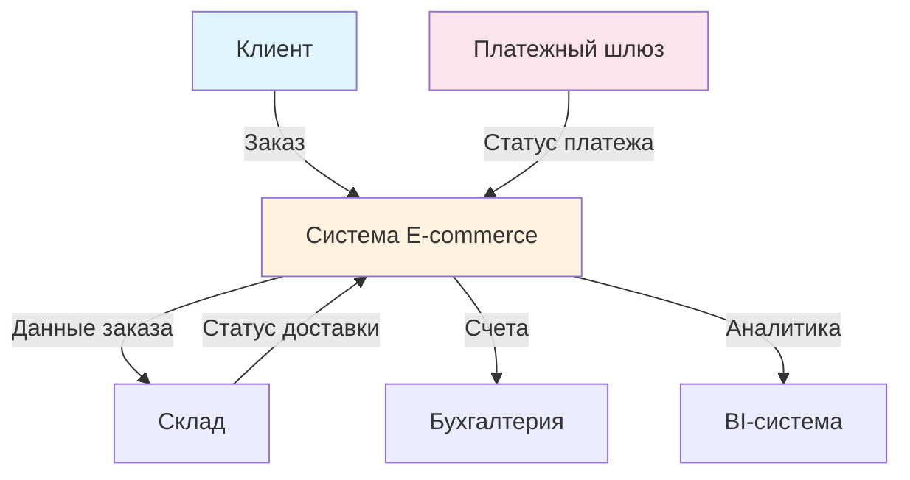
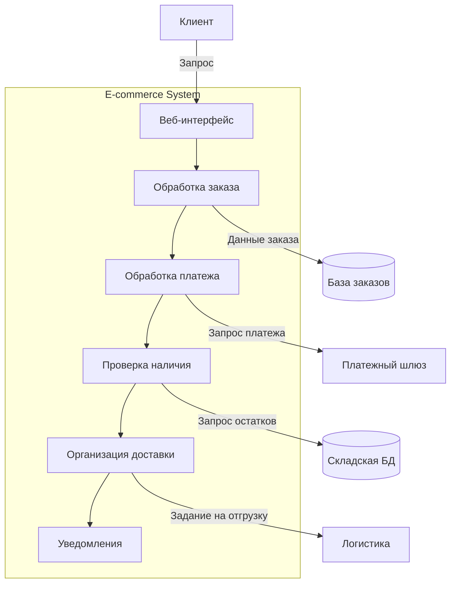
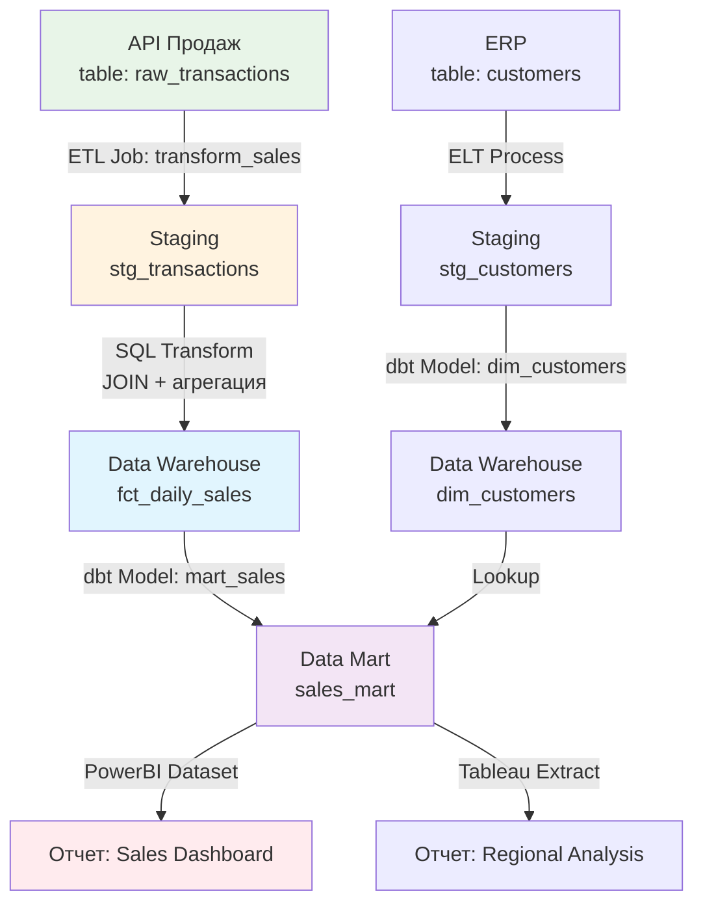
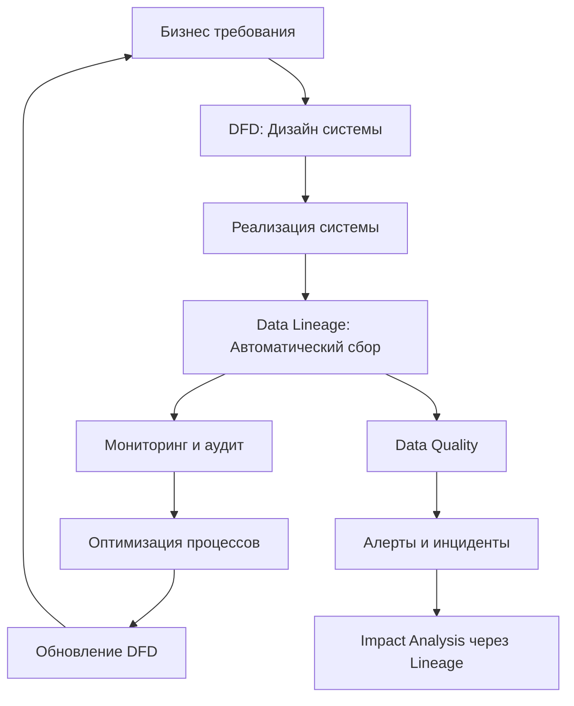

---
aliases:
  - Data Minimization
  - Data Lineage
---
# Data Lineage и Data Minimization

## 📊 Data Lineage (Линия данных/Происхождение данных)

### **Что это?**
**Data Lineage** — это визуальное представление пути данных от источника до конечной точки потребления, показывающее **как данные движутся, трансформируются и используются** в организации.

### **Основные компоненты**


### **Ключевые аспекты**

#### **1. Уровни Data Lineage**
```yaml
Технический уровень:
  - Схемы баз данных
  - SQL запросы
  - ETL/ELT пайплайны
  - Метаданные таблиц
  
Бизнес-уровень:
  - Бизнес-термины
  - KPI и метрики
  - Отчеты и дашборды
  - Регламенты качества
  
Операционный уровень:
  - Время выполнения
  - Использование ресурсов
  - SLA/SLO
  - Мониторинг качества
```

#### **2. Типы Lineage**
```python
class DataLineageTypes:
    # Прямой lineage (forward) - от источника к потребителю
    def forward_lineage(self, source_table):
        return f"{source_table} → трансформации → конечные отчеты"
    
    # Обратный lineage (backward) - от потребителя к источнику
    def backward_lineage(self, report):
        return f"{report} ← использованные данные ← исходные таблицы"
    
    # Сквозной lineage (end-to-end)
    def end_to_end_lineage(self):
        return "источник → промежуточные шаги → конечное потребление"
    
    # Операционный lineage
    def operational_lineage(self):
        return "время выполнения, ресурсы, зависимости между заданиями"
```

### **Пример реализации**
```sql
-- Хранение lineage информации
CREATE TABLE data_lineage (
    lineage_id UUID PRIMARY KEY,
    source_system VARCHAR(100),
    source_table VARCHAR(200),
    target_system VARCHAR(100),
    target_table VARCHAR(200),
    transformation_logic TEXT,  -- SQL, код трансформации
    transformation_tool VARCHAR(50),  -- dbt, Airflow, Spark
    business_owner VARCHAR(100),
    data_steward VARCHAR(100),
    last_refresh TIMESTAMP,
    quality_score DECIMAL(3,2),
    dependencies JSONB  -- Связи с другими элементами
);

-- Пример lineage для отчета продаж
INSERT INTO data_lineage VALUES (
    '123e4567-e89b-12d3-a456-426614174000',
    'ERP_SYSTEM',
    'raw_sales',
    'ANALYTICS_DWH',
    'dim_sales_fact',
    'SELECT * FROM raw_sales WHERE status = "completed"',
    'Apache Airflow',
    'Sales Department',
    'data_engineer_1',
    '2024-01-15 10:30:00',
    0.95,
    '{"depends_on": ["raw_customers", "raw_products"]}'
);
```

### **Инструменты для Data Lineage**
```yaml
open_source:
  - OpenMetadata: Полный стек управления данными
  - Amundsen: Data discovery и lineage от Lyft
  - Marquez: Открытый lineage сервис
  - DataHub: Платформа метаданных от LinkedIn
  
commercial:
  - Collibra: Управление данными и governance
  - Alation: Data catalog с lineage
  - Informatica: ETL + lineage
  - Microsoft Purview: Для Azure экосистемы
  
cloud_native:
  - AWS Glue Data Catalog: Для AWS стека
  - Google Data Catalog: Для GCP
  - Azure Data Catalog: Интеграция с Microsoft
```

## 🛡️ Data Minimization (Минимизация данных)

### **Что это?**
**Data Minimization** — принцип обработки данных, согласно которому следует **собирать, хранить и обрабатывать только минимально необходимый объем данных**, требуемый для достижения конкретной цели.

### **Основные принципы**


### **Стратегии минимизации**

#### **1. Минимизация при сборе**
```python
class DataCollectionMinimization:
    
    def collect_only_necessary(self, user_data):
        """Собираем только необходимые данные"""
        minimal_data = {}
        
        # Для регистрации: только email и пароль
        if self.purpose == "registration":
            minimal_data = {
                'email': user_data.get('email'),
                'password_hash': self.hash_password(user_data.get('password'))
            }
        
        # Для заказа: адрес доставки и платежная информация
        elif self.purpose == "order_processing":
            minimal_data = {
                'shipping_address': user_data.get('address'),
                'payment_token': user_data.get('payment_token'),  # Не храним полные данные карты!
                'order_items': user_data.get('items')
            }
        
        # Удаляем всё лишнее
        return self.remove_sensitive_fields(minimal_data)
    
    def implement_opt_in(self):
        """Опциональный сбор данных"""
        return {
            'required_fields': ['email', 'password'],
            'optional_fields': {
                'phone_number': False,  # Только если пользователь согласен
                'marketing_emails': False,
                'location_data': False
            }
        }
```

#### **2. Минимизация при хранении**
```sql
-- Хранение только необходимых данных
CREATE TABLE users_minimized (
    user_id UUID PRIMARY KEY,
    email_hash CHAR(64),  -- Хеш вместо оригинального email
    account_created DATE,
    last_login TIMESTAMP,
    is_active BOOLEAN
    -- НЕ храним: полное имя, дата рождения, адрес, телефон
);

-- Отдельная таблица для чувствительных данных (если абсолютно необходимо)
CREATE TABLE user_sensitive_data (
    user_id UUID REFERENCES users_minimized(user_id),
    encrypted_full_name BYTEA,  -- Зашифровано
    encrypted_phone BYTEA,
    access_log TEXT[],  -- Кто и когда обращался
    PRIMARY KEY (user_id)
);

-- Автоматическое удаление старых данных
CREATE POLICY delete_old_data ON user_activity
    FOR DELETE
    USING (activity_date < CURRENT_DATE - INTERVAL '90 days');
```

#### **3. Минимизация при обработке**
```python
from datetime import datetime, timedelta

class DataProcessingMinimization:
    
    def process_in_memory_without_storage(self, data):
        """Обработка без постоянного хранения"""
        # Анализ в реальном времени без сохранения сырых данных
        real_time_stats = self.calculate_statistics(data)
        
        # Сохраняем только агрегированные результаты
        self.save_aggregated_results(real_time_stats)
        
        # Удаляем исходные данные
        del data
        
    def implement_data_masking(self, sensitive_data):
        """Маскирование чувствительных данных"""
        return {
            'credit_card': self.mask_credit_card(sensitive_data['card_number']),
            'email': self.mask_email(sensitive_data['email']),
            'phone': self.mask_phone(sensitive_data['phone'])
        }
    
    def mask_credit_card(self, card_number):
        return f"****-****-****-{card_number[-4:]}"
    
    def mask_email(self, email):
        local, domain = email.split('@')
        return f"{local[0]}***@{domain}"
```

### **Пример GDPR требований для минимизации**
```yaml
gdpr_minimization_requirements:
  purpose_limitation:
    description: "Данные собираются только для конкретных, явных и законных целей"
    example: "Email для регистрации, а не для рассылки без согласия"
  
  data_minimization_principle:
    description: "Данные должны быть адекватными, релевантными и ограниченными необходимым"
    implementation:
      - collect_only_necessary: true
      - pseudonymization: true
      - anonymization_where_possible: true
  
  storage_limitation:
    description: "Данные хранятся не дольше, чем необходимо"
    retention_periods:
      user_account_data: "Пока аккаунт активен + 30 дней"
      transaction_data: "7 лет (законные требования)"
      logs: "90 дней"
      analytics_data: "2 года (анонимизированные)"
  
  privacy_by_design:
    description: "Приватность встроена в дизайн систем"
    practices:
      - default_privacy_settings
      - minimal_data_collection
      - end_to_end_encryption
      - regular_data_purges
```

### **Технические подходы к минимизации**

#### **Анонимизация данных**
```python
import hashlib
import json
from cryptography.fernet import Fernet

class DataAnonymization:
    
    def __init__(self):
        self.key = Fernet.generate_key()
        self.cipher = Fernet(self.key)
    
    def pseudonymize(self, identifier):
        """Псевдонимизация - заменяем идентификаторы на псевдонимы"""
        # Обратимое преобразование
        salt = "company_specific_salt"
        return hashlib.sha256(f"{identifier}{salt}".encode()).hexdigest()[:20]
    
    def anonymize(self, data):
        """Анонимизация - необратимое удаление идентификаторов"""
        anonymized = data.copy()
        
        # Удаляем прямые идентификаторы
        anonymized.pop('name', None)
        anonymized.pop('email', None)
        anonymized.pop('phone', None)
        anonymized.pop('ip_address', None)
        
        # Обобщаем косвенные идентификаторы
        if 'age' in anonymized:
            anonymized['age_group'] = self.get_age_group(anonymized.pop('age'))
        
        if 'zip_code' in anonymized:
            anonymized['region'] = self.get_region(anonymized.pop('zip_code'))
        
        return anonymized
    
    def differential_privacy(self, dataset, epsilon=0.1):
        """Дифференциальная приватность - добавление статистического шума"""
        import numpy as np
        
        noisy_dataset = []
        for record in dataset:
            noisy_record = record.copy()
            
            # Добавляем шум Лапласа к числовым значениям
            for key in ['age', 'salary', 'purchase_amount']:
                if key in noisy_record:
                    scale = 1.0 / epsilon
                    noise = np.random.laplace(0, scale)
                    noisy_record[key] += noise
            
            noisy_dataset.append(noisy_record)
        
        return noisy_dataset
```

#### **Жизненный цикл данных с минимизацией**


### **Практическая реализация в компании**
```python
class DataMinimizationFramework:
    
    def __init__(self):
        self.data_classification = {
            'public': 'Нет ограничений',
            'internal': 'Только сотрудники',
            'confidential': 'Только уполномоченные лица',
            'restricted': 'Особые меры защиты',
            'personal': 'GDPR/PII данные'
        }
    
    def data_retention_policy(self):
        return {
            'user_profile_data': {
                'retention_period': 'Пока активен + 90 дней',
                'minimization_action': 'Анонимизация после удаления аккаунта'
            },
            'transaction_data': {
                'retention_period': '7 лет (законное требование)',
                'minimization_action': 'Архивация после 1 года'
            },
            'server_logs': {
                'retention_period': '90 дней',
                'minimization_action': 'Удаление IP адресов через 30 дней'
            },
            'analytics_data': {
                'retention_period': '2 года',
                'minimization_action': 'Агрегация до анонимных метрик'
            }
        }
    
    def implement_minimization(self):
        return """
        1. Data Mapping: Что собираем и зачем?
        2. Classification: Классификация данных по чувствительности
        3. Retention Rules: Политики хранения для каждого класса
        4. Access Controls: Кто имеет доступ?
        5. Monitoring: Регулярный аудит и очистка
        6. Documentation: Документирование процессов
        """
```

## 📊 Сравнение Data Lineage и Data Minimization

| **Аспект** | **Data Lineage** | **Data Minimization** |
|------------|------------------|----------------------|
| **Основная цель** | Прозрачность и отслеживаемость данных | Защита приватности и снижение рисков |
| **Фокус** | Как данные движутся и трансформируются | Какие данные собирать и как долго хранить |
| **Ключевой принцип** | Полная прослеживаемость | Сбор только необходимого минимума |
| **Регуляторное значение** | Помогает соответствовать требованиям аудита | Требуется GDPR, CCPA, LGPD |
| **Техническая реализация** | Метаданные, графы зависимостей, каталоги данных | Анонимизация, шифрование, политики хранения |
| **Бизнес-ценность** | Улучшение качества данных, доверие | Снижение рисков, соответствие законам |
| **Когда важно** | При сложных ETL процессах, миграциях | При работе с PII, в регулируемых отраслях |

## 🎯 Ключевые выводы

### **Data Lineage важно для:**
- Понимания происхождения данных
- Отладки проблем с качеством данных
- Управления воздействием изменений
- Соответствия регуляторным требованиям

### **Data Minimization важно для:**
- Защиты приватности пользователей
- Снижения поверхности атаки
- Соблюдения законов о защите данных
- Оптимизации хранения и обработки

### **Идеальный подход:**
```yaml
modern_data_governance:
  combine_both: true
  implementation:
    - start_with_lineage: "Понять какие данные у вас есть"
    - then_minimize: "Удалить всё ненужное"
    - monitor_continuously: "Регулярный аудит и очистка"
    - document_everything: "Для аудита и соответствия"
```

**Оба подхода дополняют друг друга**: Data Lineage помогает понять, какие данные у вас есть, а Data Minimization — решить, какие из них действительно нужно хранить и обрабатывать.


---

# vs

# Data Lineage vs Data Flow Diagram: Сравнение и отличия

## 🎯 Основные отличия



## 📊 Детальное сравнение

### **1. Цели и назначение**

#### **Data Lineage**
```yaml
primary_goals:
  - "Отслеживание происхождения данных"
  - "Понимание преобразований между источниками и назначениями"
  - "Аудит и соответствие регуляторным требованиям"
  - "Impact analysis при изменениях"
  - "Отладка проблем качества данных"

characteristics:
  detail_level: "Гранулярный (до уровня поля/колонки)"
  temporal_aspect: "Исторический + реальное время"
  audience: "Инженеры данных, аналитики, data stewards"
  automation: "Частично/полностью автоматизирован"
```

#### **Data Flow Diagram (DFD)**
```yaml
primary_goals:
  - "Визуализация потоков данных в системе"
  - "Документирование архитектуры"
  - "Коммуникация между техническими и бизнес-командами"
  - "Выявление узких мест и оптимизация"
  - "Планирование системной интеграции"

characteristics:
  detail_level: "Системный/процессный"
  temporal_aspect: "Текущий snapshot"
  audience: "Архитекторы, бизнес-аналитики, разработчики"
  automation: "Ручное создание (редко автоматизирован)"
```

### **2. Уровни абстракции**



### **3. Примеры визуализации**

#### **Data Flow Diagram (DFD Level 0 - Контекстная диаграмма)**


#### **Data Flow Diagram (DFD Level 1 - Детализация процессов)**


#### **Data Lineage (Техническая детализация)**


### **4. Практические примеры**

#### **Пример Data Lineage в SQL**
```sql
-- Система хранения lineage
CREATE TABLE data_lineage_detail (
    lineage_id UUID PRIMARY KEY,
    source_system VARCHAR(50),
    source_table VARCHAR(100),
    source_column VARCHAR(100),
    transformation_type VARCHAR(50),
    transformation_logic TEXT,
    target_system VARCHAR(50),
    target_table VARCHAR(100),
    target_column VARCHAR(100),
    business_glossary_term VARCHAR(200),
    data_quality_score DECIMAL(3,2),
    last_updated TIMESTAMP,
    lineage_path JSONB  -- Полный путь преобразований
);

-- Пример конкретного lineage
INSERT INTO data_lineage_detail VALUES (
    '550e8400-e29b-41d4-a716-446655440000',
    'CRM_SYSTEM',
    'contacts',
    'email_address',
    'data_cleansing',
    'TRIM(LOWER(email_address))',
    'ANALYTICS_DWH',
    'dim_customers', 
    'email',
    'Customer Email Address',
    0.98,
    CURRENT_TIMESTAMP,
    '{
        "path": [
            {"system": "CRM", "table": "contacts", "column": "email_address"},
            {"process": "daily_etl_job", "transformation": "cleanse_email"},
            {"system": "DWH", "table": "stg_customers", "column": "email"},
            {"process": "dbt_model", "model": "dim_customers"},
            {"system": "DWH", "table": "dim_customers", "column": "email"}
        ]
    }'
);
```

#### **Пример DFD в текстовом формате**
```yaml
# DFD документация для системы
dfd_level: 0
system_name: "E-commerce Platform"
external_entities:
  - name: "Customer"
    interactions: ["place_order", "view_products", "make_payment"]
    
  - name: "Payment Gateway"
    interactions: ["process_payment", "refund_transaction"]
    
  - name: "Warehouse System"
    interactions: ["check_inventory", "update_stock", "ship_order"]

data_stores:
  - name: "Product Catalog"
    type: "Database"
    contents: ["product_info", "pricing", "inventory"]
    
  - name: "Order Database"
    type: "Database" 
    contents: ["orders", "customer_info", "payment_details"]
    
  - name: "Analytics Warehouse"
    type: "Data Warehouse"
    contents: ["sales_facts", "customer_dimensions"]

processes:
  - id: "1.0"
    name: "Process Order"
    description: "Receive and validate customer order"
    inputs: ["order_details"]
    outputs: ["order_confirmation", "inventory_check"]
    
  - id: "2.0"
    name: "Handle Payment"
    description: "Process payment through gateway"
    inputs: ["payment_info"]
    outputs: ["payment_status", "invoice"]
```

## 🛠️ Инструменты и технологии

### **Data Lineage инструменты**
```yaml
automatic_discovery:
  - OpenMetadata: "Открытая платформа с автоматическим lineage"
  - DataHub: "Метаданные + lineage от LinkedIn"
  - Amundsen: "Data discovery с lineage"
  - Marquez: "Open source lineage для Airflow и Spark"
  
manual_tools:
  - Collibra: "Управление данными с lineage"
  - Alation: "Data catalog"
  - Informatica: "ETL + lineage capabilities"
  
cloud_native:
  - AWS Glue Data Catalog: "Lineage для AWS стека"
  - Azure Purview: "Microsoft решение"
  - Google Data Catalog: "GCP экосистема"
```

### **DFD инструменты**
```yaml
diagram_tools:
  - draw.io: "Бесплатный онлайн инструмент"
  - Lucidchart: "Облачные диаграммы"
  - Microsoft Visio: "Классическое решение"
  - PlantUML: "Текстовое описание диаграмм"
  
architecture_tools:
  - ArchiMate: "Стандарт для архитектурных диаграмм"
  - Enterprise Architect: "Полный lifecycle"
  - Structurizr: "Диаграммы как код"
  
collaboration:
  - Miro: "Онлайн доски"
  - Mermaid: "Диаграммы в Markdown"
  - Diagrams.net: "Интеграция с GitHub"
```

## 📋 Сравнительная таблица

| **Критерий** | **Data Lineage** | **Data Flow Diagram** |
|-------------|-----------------|----------------------|
| **Основная цель** | Отслеживание происхождения и преобразований данных | Визуализация потоков данных между системами |
| **Уровень детализации** | **Гранулярный** (таблицы, столбцы, преобразования) | **Системный** (системы, процессы, хранилища) |
| **Временной аспект** | Исторический + реальное время | Текущий snapshot (как есть / как будет) |
| **Автоматизация** | **Высокая** (автоматическое обнаружение) | **Низкая** (ручное создание) |
| **Целевая аудитория** | Инженеры данных, аналитики, data stewards | Архитекторы, бизнес-аналитики, разработчики |
| **Использование в SDLC** | Для мониторинга и отладки существующих систем | Для проектирования новых систем |
| **Регуляторное значение** | **Критично** для compliance (GDPR, SOX) | Важно для документации требований |
| **Пример вопроса** | "Откуда взялось это значение в отчете?" | "Как данные перемещаются между CRM и ERP?" |
| **Обновление** | Частое (при изменениях данных) | При изменениях архитектуры |
| **Инструменты** | OpenMetadata, Collibra, DataHub | Visio, Lucidchart, draw.io |

## 🔄 Интеграция обоих подходов

### **Комплексный подход к управлению данными**


### **Пример совместного использования**
```python
class DataGovernanceFramework:
    """
    Framework, объединяющий DFD и Data Lineage
    """
    
    def design_system_with_dfd(self, requirements):
        # Шаг 1: Дизайн системы с DFD
        dfd = self.create_data_flow_diagram(requirements)
        
        # Документируем ожидаемые потоки данных
        expected_data_flows = self.extract_expected_flows(dfd)
        
        return {
            'dfd_diagram': dfd,
            'expected_flows': expected_data_flows,
            'system_boundaries': self.define_boundaries(dfd)
        }
    
    def implement_with_lineage_tracking(self, system_design):
        # Шаг 2: Реализация с lineage tracking
        implemented_system = self.deploy_system(system_design)
        
        # Автоматически собираем lineage
        actual_lineage = self.capture_data_lineage(implemented_system)
        
        # Сравниваем ожидаемое (DFD) с фактическим (Lineage)
        compliance_report = self.compare_expected_vs_actual(
            system_design['expected_flows'],
            actual_lineage
        )
        
        return {
            'system': implemented_system,
            'actual_lineage': actual_lineage,
            'compliance_report': compliance_report
        }
    
    def monitor_and_optimize(self, system_with_lineage):
        # Шаг 3: Непрерывный мониторинг
        monitoring_data = {
            'data_quality_metrics': self.calculate_quality_metrics(),
            'performance_metrics': self.calculate_performance(),
            'anomalies': self.detect_anomalies(system_with_lineage['actual_lineage'])
        }
        
        # Обновляем DFD на основе фактических данных
        updated_dfd = self.update_dfd_based_on_lineage(
            system_with_lineage['actual_lineage']
        )
        
        return {
            'monitoring': monitoring_data,
            'updated_dfd': updated_dfd,
            'optimization_recommendations': self.generate_recommendations()
        }
```

## 🎯 Когда что использовать?

### **Используйте Data Lineage когда:**
```yaml
use_cases:
  - "Нужно понять, откуда взялись данные в отчете"
  - "Требуется соответствие GDPR/SOX/HIPAA"
  - "Отладка проблем с качеством данных"
  - "Оценка impact изменений в ETL процессах"
  - "Автоматическая документация потоков данных"
  
scenarios:
  - "Аудитор запрашивает происхождение финансовых данных"
  - "Ошибка в отчете - нужно найти источник проблемы"
  - "Планирование миграции данных между системами"
  - "Data governance и управление метаданными"
```

### **Используйте DFD когда:**
```yaml
use_cases:
  - "Проектирование новой системы или модуля"
  - "Документирование существующей архитектуры"
  - "Объяснение системы бизнес-пользователям"
  - "Выявление узких мест в архитектуре"
  - "Планирование системной интеграции"
  
scenarios:
  - "Кик-офф нового проекта - объяснение архитектуры"
  - "Обучение новых разработчиков системе"
  - "Выбор технологий для интеграции систем"
  - "Оптимизация производительности системы"
```

## 💡 Ключевые выводы

1. **DFD и Data Lineage — это не "или/или"**, а **комплементарные подходы**
2. **DFD** — для дизайна и высокоуровневого понимания системы
3. **Data Lineage** — для детального отслеживания и аудита данных
4. **Идеальный workflow**:
   - Начинайте с DFD для дизайна
   - Реализуйте систему с lineage tracking
   - Используйте lineage для валидации DFD
   - Обновляйте DFD на основе реального lineage

5. **Современные организации** используют оба подхода для полного контроля над данными — от архитектурного дизайна до гранулярного аудита.