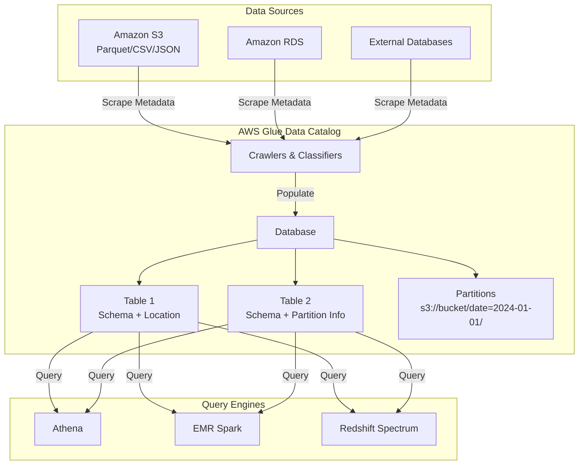
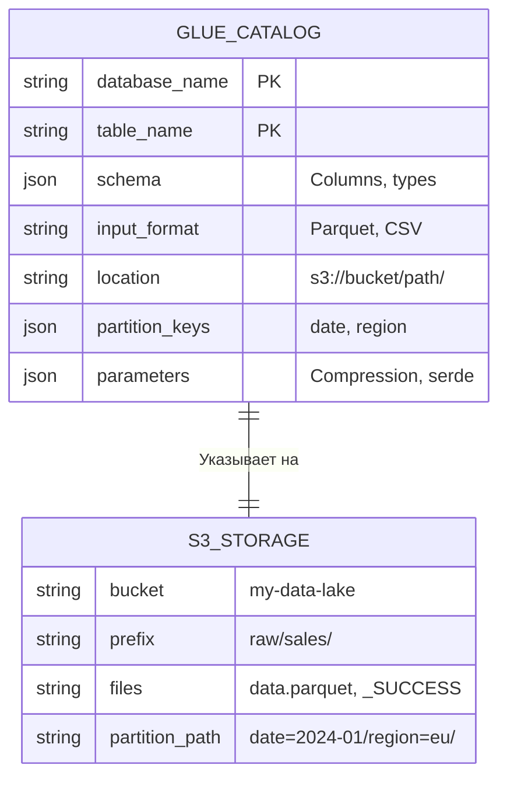
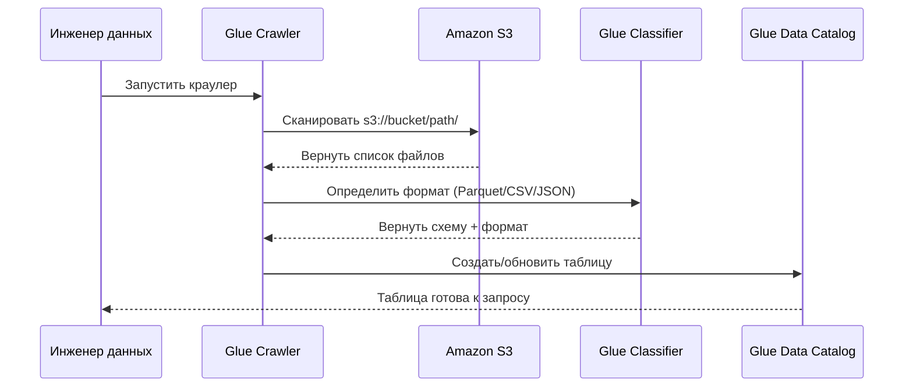
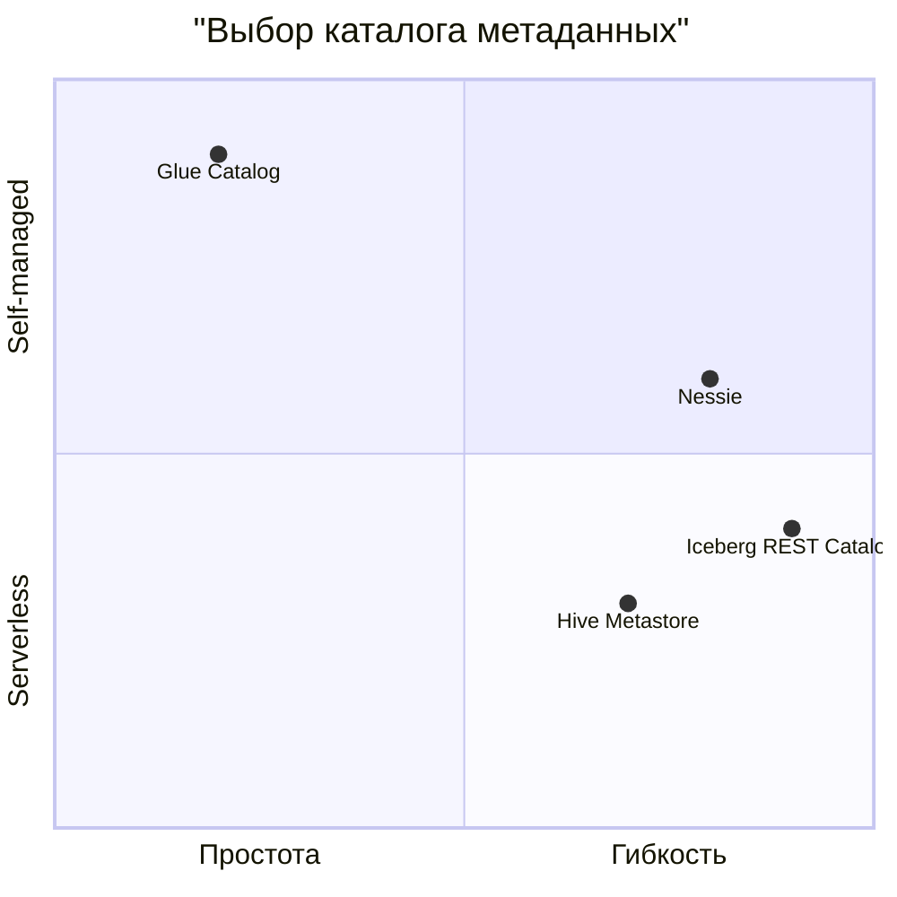
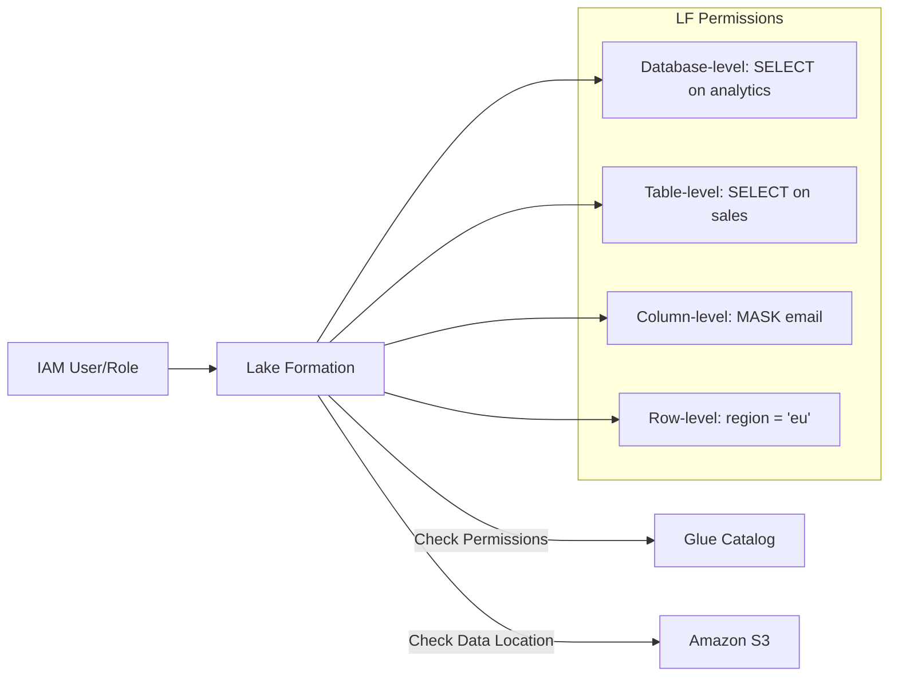

# AWS Glue [[Data Catalog]]: Каталог метаданных для объектного хранилища

**AWS Glue Data Catalog** — это полностью управляемый сервис метаданных, который выступает в роли **централизованного репозитория** для хранения информации о данных в вашем дата-лейке (преимущественно в Amazon S3).

Проще говоря: если S3 хранит сами файлы (данные), то Glue Catalog хранит **схему, структуру и метаданные** об этих файлах, позволяя обращаться к ним как к таблицам в базе данных.

> 📌 **Ключевая аналогия:** Glue Data Catalog — это «мозг» вашего Data Lake, который знает, где лежат данные, в каком они формате и как их интерпретировать.

---

## 🔹 Архитектура и компоненты



### Основные сущности каталога:

| Сущность | Описание | Аналог в SQL |
|----------|----------|--------------|
| **Catalog** | Корневой контейнер метаданных (один на аккаунт/регион) | — |
| **Database** | Логическая группа таблиц | `DATABASE` |
| **Table** | Метаданные о структуре данных: схема, формат, расположение в S3 | `TABLE` |
| **Partition** | Физическое разделение данных для ускорения запросов | `PARTITION BY` |
| **Storage Descriptor** | Информация о формате данных (Parquet, CSV), сжатии, сериализаторе | — |

---

## 🔹 Как Glue Catalog работает с S3

Важно понимать: **Glue Catalog не хранит данные**, только метаданные.



```
note right of GLUE_CATALOG
	Каталог знает:
	• Какие колонки в таблице
	• Где физически лежат файлы
	• Как их читать (формат)
	• Как фильтровать (партиции)
end note
```

### Пример: Таблица в Glue → Файлы в S3

**Метаданные в Glue Catalog:**
```json
{
  "TableName": "sales_raw",
  "DatabaseName": "analytics",
  "StorageDescriptor": {
    "Location": "s3://my-datalake/raw/sales/",
    "InputFormat": "org.apache.hadoop.hive.ql.io.parquet.MapredParquetInputFormat",
    "OutputFormat": "org.apache.hadoop.hive.ql.io.parquet.MapredParquetOutputFormat",
    "SerdeInfo": {
      "SerializationLibrary": "org.apache.hadoop.hive.ql.io.parquet.serde.ParquetHiveSerDe"
    },
    "Columns": [
      {"Name": "order_id", "Type": "string"},
      {"Name": "amount", "Type": "decimal(10,2)"},
      {"Name": "order_date", "Type": "date"}
    ]
  },
  "PartitionKeys": [
    {"Name": "year", "Type": "string"},
    {"Name": "month", "Type": "string"}
  ]
}
```

**Физическая структура в S3:**
```
s3://my-datalake/raw/sales/
├── year=2024/
│   ├── month=01/
│   │   ├── data_part1.parquet
│   │   └── data_part2.parquet
│   └── month=02/
│       └── data_part3.parquet
└── year=2025/
    └── month=01/
        └── data_part4.parquet
```

---

## 🔹 Заполнение каталога: Crawlers и классификаторы

**AWS Glue Crawler** — это сервис, который автоматически сканирует источники данных и создаёт/обновляет таблицы в каталоге.



### Пример конфигурации краулера (Python SDK):

```python
import boto3

glue = boto3.client('glue')

glue.create_crawler(
    Name='sales-crawler',
    Role='AWSGlueServiceRole',
    DatabaseName='analytics',
    Targets={'S3Targets': [{'Path': 's3://my-datalake/raw/sales/'}]},
    SchemaChangePolicy={
        'UpdateBehavior': 'UPDATE_IN_DATABASE',  # Обновлять схему при изменениях
        'DeleteBehavior': 'LOG'  # Логировать удалённые партиции
    },
    RecrawlPolicy={'RecrawlBehavior': 'CRAWL_EVERYTHING'}  # Полное сканирование
)
```

---

## 🔹 Использование: Запросы через Athena, Spark, Redshift

После того как метаданные в каталоге, вы можете запрашивать данные в S3 **без загрузки в БД**.

### Пример 1: Amazon Athena (SQL)

```sql
-- Создать базу (логически, в каталоге)
CREATE DATABASE IF NOT EXISTS analytics;

-- Создать таблицу по метаданным из Glue
CREATE EXTERNAL TABLE analytics.sales (
    order_id STRING,
    amount DECIMAL(10,2),
    customer_id STRING
)
PARTITIONED BY (year STRING, month STRING)
STORED AS PARQUET
LOCATION 's3://my-datalake/raw/sales/';

-- Добавить партиции (или использовать msck repair table)
MSCK REPAIR TABLE analytics.sales;

-- Запрос с партиционным фильтром (быстро!)
SELECT 
    customer_id, 
    SUM(amount) as total
FROM analytics.sales
WHERE year = '2024' AND month = '03'
GROUP BY customer_id;
```

### Пример 2: Apache Spark (PySpark)

```python
from pyspark.sql import SparkSession

spark = SparkSession.builder \
    .config("spark.sql.catalogImplementation", "hive") \
    .enableHiveSupport() \
    .getOrCreate()

# Чтение через Glue Catalog
df = spark.table("analytics.sales") \
    .filter("year = '2024' AND month = '03'") \
    .groupBy("customer_id") \
    .agg({"amount": "sum"})

df.show()
```

### Пример 3: Прямой доступ к метаданным через Boto3

```python
import boto3

glue = boto3.client('glue')

# Получить схему таблицы
response = glue.get_table(
    DatabaseName='analytics',
    Name='sales'
)

table = response['Table']
print(f"Location: {table['StorageDescriptor']['Location']}")
print(f"Columns: {[c['Name'] for c in table['StorageDescriptor']['Columns']]}")
print(f"Partitions: {[p['Name'] for p in table.get('PartitionKeys', [])]}")

# Получить список партиций
partitions = glue.get_partitions(
    DatabaseName='analytics',
    TableName='sales',
    MaxResults=100
)
```

---

## 🔹 Сравнение с другими каталогами метаданных

| Характеристика | AWS Glue Catalog | Hive Metastore (Self-managed) | Nessie | Apache Iceberg Catalog |
|---------------|------------------|-------------------------------|--------|------------------------|
| **Управление** | Полностью управляемый (Serverless) | Self-hosted или EMR | Управляемый / Self-hosted | Зависит от реализации |
| **Хранилище** | DynamoDB + S3 (внутри AWS) | RDS / Derby / PostgreSQL | Git-like backend (DynamoDB, BigQuery) | S3 + JDBC / REST / DynamoDB |
| **Транзакции** | ❌ Нет (eventual consistency) | ❌ Нет | ✅ Да (branch/merge, time travel) | ✅ Да (через формат таблицы) |
| **Версионирование** | ❌ Нет | ❌ Нет | ✅ Ветвление, теги, история | ✅ Snapshot isolation |
| **Интеграция** | Athena, EMR, Redshift, Lake Formation | Spark, Hive, Presto | Spark, Trino, Dremio | Spark, Flink, Trino, Spark |
| **Безопасность** | IAM + Lake Formation | Sentry / Ranger | IAM + fine-grained access | IAM + catalog-level policies |
| **Стоимость** | $1/мес за базу + $0.50/1000 запросов | Стоимость инфраструктуры | Зависит от бэкенда | Бесплатно (опенсорс) |



---

## 🔹 Интеграция с современными форматами таблиц

Glue Catalog поддерживает **современные табличные форматы**, что критично для реализации паттернов Data Lakehouse.

### Поддерживаемые форматы:

| Формат | Поддержка в Glue | Особенности |
|--------|-----------------|-------------|
| **Apache Iceberg** | ✅ Нативная (с 2022) | Время-путешествие, скрытые партиции, ACID |
| **Apache Hudi** | ✅ Через Spark/Hive | Upserts, incremental pulls |
| **Delta Lake** | ⚠️ Через Spark connector | ACID, time travel (требует Delta Runtime) |

### Пример: Создание Iceberg таблицы через Glue + Athena

```sql
-- В Athena с поддержкой Iceberg
CREATE TABLE analytics.sales_iceberg (
    order_id STRING,
    amount DECIMAL(10,2),
    order_date DATE
)
PARTITIONED BY (bucket(16, order_id), truncate(10, customer_id))
LOCATION 's3://my-datalake/iceberg/sales/'
TBLPROPERTIES (
    'table_type'='ICEBERG',
    'format'='parquet',
    'write_compression'='snappy'
);
```

> ⚠️ Для работы с Iceberg в Glue Catalog требуется включить **Iceberg support** в настройках базы данных и использовать совместимые движки (Athena Engine v3, EMR 6.9+).

---

## 🔹 Безопасность и управление доступом

### 1. **IAM-политики** (базовый уровень)

```json
{
  "Effect": "Allow",
  "Action": [
    "glue:GetTable",
    "glue:GetPartitions",
    "athena:StartQueryExecution"
  ],
  "Resource": [
    "arn:aws:glue:us-east-1:123456789012:table/analytics/sales",
    "arn:aws:athena:us-east-1:123456789012:workgroup/*"
  ]
}
```

### 2. **AWS Lake Formation** (fine-grained access)



**Пример гранулярного доступа:**
```python
# Разрешить доступ только к определённым колонкам
lakeformation.grant_permissions(
    Principal={'DataLakePrincipalIdentifier': 'arn:aws:iam::123:user/analyst'},
    Resource={'Table': {'DatabaseName': 'analytics', 'Name': 'sales'}},
    Permissions=['SELECT'],
    PermissionsWithGrantOption=[],
    ColumnNames=['order_id', 'amount']  # Только эти колонки!
)
```

---

## 🔹 Лучшие практики

### ✅ Рекомендации по структуре

```mermaid
flowchart TD
    Raw["📁 raw/<source>/<table>/"]
    Cleaned["📁 cleaned/<domain>/<table>/"]
    Curated["📁 curated/<business_unit>/<subject>/"]
    
    Raw -->|ETL| Cleaned
    Cleaned -->|Transform| Curated
    
    note right of Raw
        • Исходные данные
        • Неизменяемые
        • Партиция по дате загрузки
    end note
    
    note right of Curated
        • Бизнес-готовые данные
        • Оптимизированы для запросов
        • Партиция по бизнес-ключам
    end note
```

### ✅ Оптимизация производительности

1. **Партиционирование**: Всегда используйте партиции по часто фильтруемым полям (`date`, `region`).
2. **Сжатие**: Используйте `Snappy` для Parquet/ORC — баланс скорости и размера.
3. **Размер файлов**: Цельтесь в 128-256 MB на файл (избегайте мелких файлов).
4. **MSCK REPAIR**: Автоматически синхронизируйте партиции после загрузки данных.
5. **Crawler Schedule**: Запускайте краулеры по расписанию, а не при каждом изменении.

### ✅ Управление жизненным циклом

```python
# Автоматическая архивация старых партиций
def archive_old_partitions(database, table, retention_days=90):
    glue = boto3.client('glue')
    
    # Получить партиции
    partitions = glue.get_partitions(DatabaseName=database, TableName=table)
    
    for p in partitions['Partitions']:
        partition_date = parse_partition_date(p['Values'])  # Ваша логика
        if (datetime.now() - partition_date).days > retention_days:
            # Удалить из каталога
            glue.batch_delete_partition(
                DatabaseName=database,
                TableName=table,
                PartitionsToDelete=[{'Values': p['Values']}]
            )
            # Удалить файлы из S3 (отдельная операция)
            delete_s3_prefix(p['StorageDescriptor']['Location'])
```

---

## 🔹 Ограничения и известные проблемы

| Ограничение | Решение / Обход |
|-------------|----------------|
| **Нет транзакций** | Используйте Iceberg/Hudi для ACID-операций |
| **Eventual consistency** | Подождите ~1 мин после записи перед чтением, или используйте `MSCK REPAIR` |
| **Лимит 100к партиций на таблицу** | Перепроектируйте схему партиционирования (менее гранулярно) |
| **Стоимость при частых запросах** | Кэшируйте метаданные на стороне Spark (`spark.sql.hive.metastore.cacheTTL`) |
| **Нет версионирования схемы** | Храните DDL-скрипты в Git, используйте Nessie для управления изменениями |

---

## 🎯 Когда использовать Glue Data Catalog?

### ✅ Используйте Glue Catalog, если:
- Вы строите **дата-лейк на AWS** с данными в S3.
- Вам нужен **серверлес-подход** без управления инфраструктурой.
- Вы используете **Athena, EMR или Redshift Spectrum** для аналитики.
- Вам достаточно **базовой безопасности** через IAM или вы готовы внедрить Lake Formation.
- Вы работаете с **традиционными форматами** (Parquet, CSV) или Iceberg.

### ❌ Рассмотрите альтернативы, если:
- Вам нужны **транзакции и версионирование** → **Nessie + Iceberg**.
- Вы в **мульти-клаудной среде** → **Apache Hive Metastore** или **Iceberg REST Catalog**.
- Вам нужен **полный контроль** над метаданными → **самостоятельный Hive Metastore**.
- Вы работаете с **высокодинамичными данными** и частыми изменениями схемы → **Nessie** с ветвлением.

---

## 🔹 Краткая шпаргалка

```bash
# Создать базу данных
aws glue create-database --database-input '{"Name":"analytics"}'

# Создать таблицу (упрощённо)
aws glue create-table \
  --database-name analytics \
  --table-input '{"Name":"sales","StorageDescriptor":{"Location":"s3://...",...}}'

# Запустить краулер
aws glue start-crawler --name sales-crawler

# Запросить через Athena
aws athena start-query-execution \
  --query-string "SELECT * FROM analytics.sales LIMIT 10" \
  --query-execution-context "Database=analytics" \
  --result-configuration "OutputLocation=s3://query-results/"

# Получить метаданные таблицы
aws glue get-table --database-name analytics --name sales
```

> 🎯 **Главное правило:** Используйте Glue Data Catalog как **единый источник истины о структуре данных** в вашем дата-лейке. Комбинируйте его с современными форматами (Iceberg) и инструментами управления версиями (Nessie), если вам нужны транзакции и продвинутое управление изменениями.