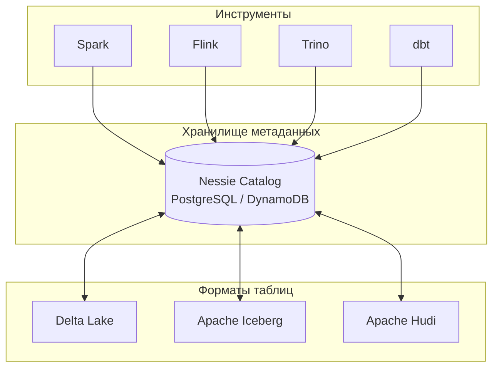

---
aliases:
  - Nessie
---
## ❄️ Что такое Nessie?

**Nessie** — это **система управления версиями для таблиц в озёрах данных (Data Lakehouse)**, разработанная компанией Dremio. Она предоставляет **Git-подобный интерфейс** для управления данными: ветки, теги, коммиты, слияния — но применительно к таблицам в форматах **Delta Lake, Apache Iceberg и Apache Hudi**.

> 💡 **Простыми словами**:  
> *«Nessie — это Git для ваших данных. Вы можете создавать ветки экспериментов, откатываться к прошлым версиям таблиц и безопасно сливать изменения — как в коде, но для данных.»*

---

## 🔑 Зачем нужен Nessie? (Проблемы, которые решает)

| Проблема без Nessie | Решение через Nessie |
|---------------------|----------------------|
| **Нет изоляции экспериментов** — все изменения сразу попадают в продакшен | Создание **веток** для тестирования без влияния на основные данные |
| **Сложный откат** — чтобы вернуть данные на вчера, нужно ручное восстановление из бэкапа | **Временные путешествия** на любой коммит за секунды |
| **Конфликты при совместной работе** — два аналитика одновременно меняют одну таблицу | **Слияние веток** с разрешением конфликтов (как в Git) |
| **Нет аудита изменений** — сложно понять, кто и когда изменил данные | Полная **история коммитов** с авторами и сообщениями |
| **Рискованные миграции схемы** — изменение структуры таблицы может сломать отчёты | Тестирование миграций в **изолированной ветке** перед слиянием |

---

## 🧩 Как работает Nessie? (Ключевые концепции)



### 🔹 Основные сущности:

| Сущность | Аналог в Git | Описание |
|----------|--------------|----------|
| **Коммит (Commit)** | `git commit` | Фиксация изменений в таблицах (добавление/удаление строк, изменение схемы) |
| **Ветка (Branch)** | `git branch` | Изолированная линия разработки (например, `feature/experiment-abc`) |
| **Тег (Tag)** | `git tag` | Неизменяемая метка для важных версий (например, `release-v1.0`) |
| **Слияние (Merge)** | `git merge` | Объединение изменений из одной ветки в другую |
| **Каталог (Catalog)** | `.git/` | Хранилище метаданных (в БД: PostgreSQL, DynamoDB, In-memory) |

---

## 💻 Примеры использования на практике

### 🔹 1. Создание ветки для эксперимента

```sql
-- Создаём ветку из основной (main)
CALL nessie.create_branch('experiment-pricing', 'main');

-- Переключаемся на ветку
CALL nessie.set_reference('experiment-pricing');

-- Меняем данные (например, тестируем новую ценовую модель)
UPDATE sales SET price = price * 0.9 WHERE category = 'premium';

-- Фиксируем изменения
CALL nessie.commit('Тест скидки 10% для премиум-товаров');
```

→ Эксперимент **не влияет** на продакшен-данные в ветке `main`.

---

### 🔹 2. Откат к предыдущей версии

```sql
-- Смотрим историю коммитов
CALL nessie.log();

-- Откатываемся к конкретному коммиту
CALL nessie.rollback('abc123def456');
```

→ Полезно при ошибочных обновлениях или загрязнении данных.

---

### 🔹 3. Слияние изменений после тестирования

```sql
-- Переключаемся на основную ветку
CALL nessie.set_reference('main');

-- Сливаем изменения из экспериментальной ветки
CALL nessie.merge('experiment-pricing', 'main', 'Слияние успешного эксперимента по скидкам');
```

→ Изменения попадают в продакшен только после проверки.

---

### 🔹 4. Временные путешествия (Time Travel)

```sql
-- Запрос данных на момент 1 июня 2024
SELECT * FROM sales 
  AT TIMESTAMP '2024-06-01 00:00:00'
  WHERE region = 'EMEA';

-- Или по хэшу коммита
SELECT * FROM sales 
  AT COMMIT 'abc123def456';
```

→ Идеально для аудита, отладки и восстановления.

---

## 🆚 Nessie vs Встроенные системы версий (Delta/Iceberg)

| Критерий | **Nessie** | **Delta Lake / Iceberg (встроенные)** |
|----------|------------|---------------------------------------|
| **Уровень управления** | **Глобальный каталог** для множества таблиц | **Локальный** для каждой таблицы |
| **Ветки** | ✅ Поддержка веток и слияний | ❌ Только линейная история (теги + временные путешествия) |
| **Изоляция** | ✅ Полная изоляция веток | ⚠️ Частичная (через временные таблицы) |
| **Атомарность** | ✅ Атомарные коммиты для **нескольких таблиц** | ⚠️ Только для одной таблицы |
| **Инструменты** | Работает с любым форматом (Delta, Iceberg, Hudi) | Привязан к конкретному формату |
| **Сложность** | Выше (требует отдельного сервиса) | Ниже (встроен в формат) |

> 💡 **Ключевое преимущество Nessie**:  
> Возможность **атомарно обновить несколько таблиц** в рамках одного коммита — критично для согласованности данных в аналитике.

---

## 🛠️ Интеграции и поддержка

| Инструмент | Поддержка | Пример конфигурации |
|------------|-----------|---------------------|
| **Apache Spark** | ✅ Полная | `spark.sql.catalog.nessie.uri=http://nessie:19120` |
| **Trino/Presto** | ✅ Полная | `iceberg.catalog.nessie.uri=http://nessie:19120` |
| **Flink** | ✅ Полная | `table.catalog.nessie.uri: http://nessie:19120` |
| **dbt** | ✅ Через адаптеры | `+schema: nessie.main` |
| **Dremio** | ✅ Нативная | Встроен в платформу |
| **Delta Lake** | ✅ | Требует `io.delta:delta-core` + Nessie connector |
| **Apache Iceberg** | ✅ | Официальная поддержка через `nessie-iceberg` |
| **Apache Hudi** | ⚠️ Экспериментальная | Через кастомные адаптеры |

---

## 🏥 Реальные сценарии использования

| Сценарий | Как работает |
|----------|--------------|
| **A/B-тестирование моделей ML** | Ветка `experiment-model-v2` → обучение → сравнение метрик → слияние при успехе |
| **Безопасные миграции схемы** | Ветка `schema-migration` → тестирование запросов → слияние после валидации |
| **Регуляторная отчётность** | Тег `quarterly-report-q2-2024` → фиксация состояния данных на дату отчёта |
| **Отладка проблем в продакшене** | `AT TIMESTAMP` → анализ данных на момент сбоя → выявление корневой причины |
| **Совместная работа аналитиков** | Каждый работает в своей ветке → слияние через код-ревью |

---

## ✅ Преимущества Nessie

| Преимущество | Объяснение |
|--------------|------------|
| **Изоляция экспериментов** | Тестирование без риска для продакшена |
| **Согласованность нескольких таблиц** | Атомарные коммиты для связанных таблиц (продажи + возвраты) |
| **Полный аудит** | Кто, когда и зачем изменил данные |
| **Быстрый откат** | Восстановление за секунды, а не часы |
| **Открытый стандарт** | Не привязан к вендору, работает с разными форматами |

---

## ⚠️ Ограничения

| Ограничение | Как обойти |
|-------------|------------|
| **Требует отдельного сервиса** | Использовать управляемый сервис (Dremio Cloud) или контейнеризацию |
| **Дополнительная сложность** | Для простых сценариев достаточно встроенных возможностей Iceberg/Delta |
| **Нет поддержки транзакций в реальном времени** | Не заменяет OLTP-базы данных |
| **Экспериментальная поддержка Hudi** | Использовать для продакшена только с Delta/Iceberg |

---

## 💬 Итог

> **Nessie — это «управление версиями как услуга» для озёр данных**:  
> - Превращает хаотичные изменения данных в **управляемый процесс**  
> - Добавляет **изоляцию, аудит и безопасность** к аналитическим рабочим нагрузкам  
> - Работает как **единый каталог** для всех форматов таблиц (Delta, Iceberg, Hudi)

> 💡 **Когда использовать**:  
> ➤ При совместной работе нескольких команд над одним озером данных  
> ➤ Для безопасного тестирования изменений перед продакшеном  
> ➤ Когда нужна атомарность изменений для нескольких таблиц  

> ❌ **Когда не использовать**:  
> ➤ Для простых сценариев с одной таблицей и одним пользователем  
> ➤ Если достаточно встроенных возможностей Iceberg/Delta (теги + time travel)

---

✅ **Nessie — не замена форматам таблиц, а надстройка, которая добавляет к ним мощные возможности управления версиями на уровне всего озера данных.**