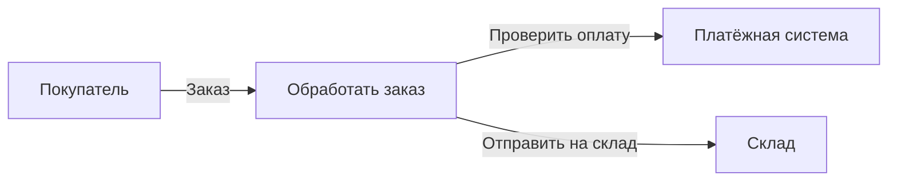
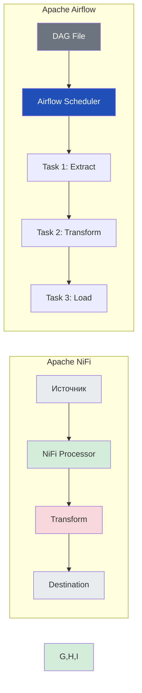

---
aliases:
  - Apache NiFi
  - NiFi
---
**Apache NiFi** и **Data Flow Diagram (DFD)** тесно связаны — но на разных уровнях: **концептуальном** и **исполнительном**.

---

## ✅ Что такое Apache NiFi?

> **Apache NiFi** — это **платформа с открытым исходным кодом** для **автоматизации потоков данных в реальном времени** между системами.

### 💬 Простыми словами:
> «NiFi — это визуальный конструктор ETL/ELT-процессов, где вы соединяете блоки, как в Lego».

---

## ✅ Основные возможности NiFi

| Возможность | Описание |
|------------|----------|
| **Визуальный редактор** | Drag-and-drop интерфейс для построения потоков |
| **Более 500 процессоров** | Готовые блоки для работы с файлами, БД, Kafka, HTTP и др. |
| **Мониторинг в реальном времени** | Видно, сколько данных прошло, ошибки, задержки |
| **Безопасность** | TLS, авторизация, аудит |
| **Масштабируемость** | Кластер из нескольких узлов |
| **Data Provenance** | Полная история каждого фрагмента данных |

---

## ✅ Как NiFi связан с DFD?

| Аспект         | Data Flow Diagram ([[Data Flow Diagram\|DFD]])                    | Apache NiFi                                                  |
| -------------- | ----------------------------------------------------------------- | ------------------------------------------------------------ |
| **Уровень**    | Концептуальный (анализ, проектирование)                           | Исполнительный (реализация, запуск)                          |
| **Цель**       | Понять, как данные движутся через систему                         | Автоматизировать эти потоки                                  |
| **Элементы**   | Процессы, внешние сущности, хранилища                             | Processors, Connections, Controllers                         |
| **Инструмент** | Ручной рисунок / UML-диаграмма                                    | Веб-интерфейс NiFi                                           |
| **Пример**     | "Система получает заказ → проверяет оплату → отправляет на склад" | Реальный поток: `GetHTTP → EvaluateJSON → PutDatabaseRecord` |

> 💡 **NiFi — это реализация DFD в коде.**

---

## ✅ Пример: DFD → NiFi

### 🔹 DFD (уровень 1):

### 🔹 NiFi Flow:
1. **Processor**: `ListenHTTP` — принимает заказ
2. **Processor**: `InvokeHTTP` — вызывает платёжную систему
3. **Processor**: `PutKafka` — отправляет сообщение на склад

→ То же самое, но **исполняемое**.

---

## ✅ Преимущества NiFi над ручным DFD

| Плюс | Объяснение |
|------|------------|
| ✅ **Автоматизация** | Не нужно писать код — всё визуально |
| ✅ **Мониторинг** | Видно, сколько данных обработано, ошибки |
| ✅ **Backpressure** | Автоматически останавливает поток при перегрузке |
| ✅ **Data Provenance** | Можно отследить любой фрагмент данных |
| ✅ **Гибкость** | Легко менять поток без перезапуска |

---

## ✅ Когда использовать NiFi?

| Сценарий | Почему NiFi? |
|----------|--------------|
| ✅ Интеграция систем | Подключить CRM к ERP без кода |
| ✅ IoT-данные | Собрать данные с датчиков → обработать → сохранить |
| ✅ ETL/ELT | Загрузить данные из CSV → очистить → загрузить в DW |
| ✅ Аудит данных | Отследить происхождение каждого фрагмента |

---

## ✅ Финальный вывод

> ✅ **DFD — это карта.**  
> ✅ **NiFi — это автомобиль, который едет по этой карте.**

> 💬 _“DFD shows the flow. NiFi makes it flow.”_

---

## 📚 Где учиться дальше?

- [Apache NiFi Official Site](https://nifi.apache.org/)
- [NiFi User Guide](https://nifi.apache.org/docs.html)
- YouTube: *“Apache NiFi Tutorial”* — TechWorld with Nana

---

✅ **Теперь вы знаете:**  
Как DFD и NiFi дополняют друг друга — от идеи до реализации.

📌 Сохраните эту таблицу — она станет вашей **картой потоков данных**.

> 📊 _“Design the flow. Automate the flow. Monitor the flow.”_

---

# Apache NiFi vs Apache [[Airflow]]

**Apache NiFi** и **Apache Airflow** — это два мощных open-source инструмента для управления потоками данных, но они решают **разные задачи**.

---

## ✅ Краткое сравнение

| Критерий | **Apache NiFi** | **Apache Airflow** |
|----------|------------------|---------------------|
| **Основное назначение** | **Перемещение и маршрутизация данных в реальном времени** | **Оркестрация рабочих процессов (workflows) по расписанию** |
| **Тип обработки** | **Stream-first** (потоковая), поддерживает batch | **Batch-first** (пакетная), ограниченная поддержка streaming |
| **Интерфейс** | Визуальный редактор (drag-and-drop) | DAG-файлы на Python + веб-интерфейс |
| **Модель данных** | FlowFile (данные + атрибуты) | Task → Operator → DAG |
| **Скорость реакции** | Миллисекунды | Минуты–часы |
| **Использование кода** | Минимальный код (готовые процессоры) | Требуется написание Python-кода |
| **Мониторинг** | В реальном времени (backpressure, очереди) | По завершении задач |
| **Data Provenance** | Встроенный трекинг каждого фрагмента данных | Нет (только логи задач) |
| **Безопасность** | TLS, RBAC, аудит | RBAC, но меньше возможностей |
| **Масштабируемость** | Горизонтальное масштабирование кластера | Требует внешнего executor (Celery, Kubernetes) |

---

## 🔍 Подробнее: Когда что использовать?

### 🚀 **Apache NiFi — когда нужно:**
- Передавать данные между системами **в реальном времени**
- Обрабатывать **IoT-данные**, логи, события
- Иметь **визуальный контроль** над каждым байтом
- Отслеживать **происхождение данных (data lineage)**
- Работать с **ограниченным кодом**

> 💡 Пример:  
> Собрать данные с датчиков → очистить → отправить в Kafka → сохранить в базу.

---

### 📅 **Apache Airflow — когда нужно:**
- Запускать **ETL/ELT-процессы по расписанию**
- Управлять **ML-обучением**, отчётами, аналитикой
- Иметь **сложную логику зависимостей** между задачами
- Интегрироваться с **Python-библиотеками**
- Использовать **CI/CD для DAG-файлов**

> 💡 Пример:  
> Каждую ночь: выгрузить данные из PostgreSQL → преобразовать в dbt → загрузить в Snowflake → отправить email.

---

## 🧩 Архитектурное сравнение

---

## ✅ Можно ли использовать вместе?

> **Да!** Это отличная практика:
- **NiFi** собирает и предварительно обрабатывает данные в реальном времени
- **Airflow** запускает аналитические задачи по расписанию на этих данных

> 💡 Пример:  
> NiFi → Kafka → Airflow (ежедневный отчёт)

---

## ✅ Финальный вывод

| | **Apache NiFi** | **Apache Airflow** |
|--|------------------|---------------------|
| **Философия** | «Данные должны течь» | «Задачи должны выполняться» |
| **Сильные стороны** | Реальное время, визуализация, data provenance | Планирование, сложные зависимости, Python |
| **Идеально для** | Data ingestion, IoT, streaming | ETL, ML, batch analytics |

> 💬 _“NiFi moves data. Airflow orchestrates work.”_

---

## 📚 Где учиться дальше?

- [Apache NiFi Docs](https://nifi.apache.org/docs.html)
- [Apache Airflow Docs](https://airflow.apache.org/docs/)
- Book: *“Data Engineering with Apache Airflow”* — Kunal Chaudhary
- YouTube: *“NiFi vs Airflow”* — TechWorld with Nana

---

✅ **Теперь вы знаете:**  
Когда выбирать NiFi, а когда — Airflow.  
А иногда — **оба сразу**!

📌 Сохраните эту таблицу — она станет вашей **картой оркестрации данных**.

> 📊 _“The right tool for the right flow.”_