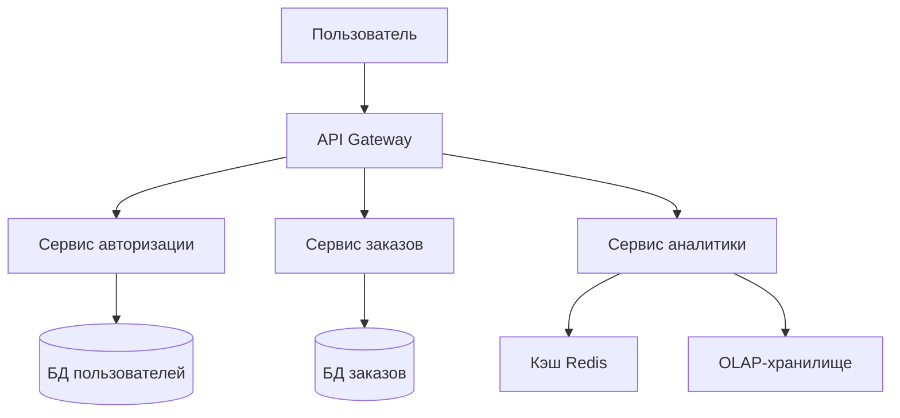

---
aliases:
  - стратегии миграции архитектуры
  - Architecture Migration Strategies
  - миграция архитектуры
  - Parallel Run
  - Branch by Abstraction
  - High-Level Design
  - HLD
  - BBA
---
# Architecture Migration Strategies – стратегии миграции архитектуры

|**Подход**|**Основная идея**|**Когда использовать**|**Влияние на риски и сложность использования**|
|---|---|---|---|
|**High-Level Design**|Применение широких архитектурных принципов. Например, проектирование с учётом домена, модульные границы|При концептуальной перестройке архитектуры|Уточняет долгосрочное видение, но может потребовать большего предварительного планирования|
|**Parallel Run**|Запуск старой и новой систем бок о бок|При проверке новой архитектуры без отключения старой|Снижает непосредственные риски, но удваивает операционные затраты на обслуживание|
|**Branch by Abstraction**|Постепенный перенос компонентов за слой абстракции|При постепенном рефакторинге конкретной подсистемы|Снижает риски за счёт изоляции изменений, сложность реализации регулируется небольшими приращениями|

---

Вот четкое сравнение трех концепций из разных областей разработки ПО — с акцентом на их **назначение, контекст применения и ключевые различия**:

---

## 🔷 1. Parallel Run (Параллельный запуск)
**Область**: Стратегия развертывания / миграции систем  
**Цель**: Снизить риски при переходе на новую систему через одновременную работу старой и новой версий.

### Как работает:


### Ключевые характеристики:
| Аспект | Описание |
|--------|----------|
| **Когда применяется** | Миграция критичных систем (банковские транзакции, биллинг), где недопустимы ошибки |
| **Продолжительность** | Недели–месяцы (пока не подтвердится корректность новой системы) |
| **Риски** | Удвоенная нагрузка на инфраструктуру, сложность синхронизации данных |
| **Выход из режима** | Отключение старой системы после валидации результатов новой |

> 💡 **Пример**: Банк запускает новый движок расчета процентов параллельно со старым. Все операции проходят через обе системы, результаты сравниваются ежедневно. После 30 дней без расхождений старая система отключается.

---

## 🔷 2. High-Level Design (HLD)
**Область**: Архитектурное проектирование  
**Цель**: Определить структуру системы на уровне компонентов, их взаимодействия и технологического стека.

### Что включает HLD:


### Ключевые характеристики:
| Аспект | Описание |
|--------|----------|
| **Уровень детализации** | Компоненты, интерфейсы, потоки данных — без реализации |
| **Аудитория** | Архитекторы, техлиды, DevOps, заказчики |
| **Документация** | Диаграммы (C4 model, UML), описание протоколов, выбор БД/очередей |
| **Не включает** | Алгоритмы, код, детали конфигурации |

> 💡 **Пример**: HLD для маркетплейса описывает: микросервисы (каталог, корзина, платежи), шину событий (Kafka), шардирование БД по регионам — но не SQL-запросы или классы на Java.

---

## 🔷 3. Branch by Abstraction (BBA)
**Область**: Техника рефакторинга / управление изменениями в коде  
**Цель**: Внедрить крупные изменения без долгоживущих веток в Git через абстрактный слой.

### Как работает:


### Пошаговый процесс:
1. **Создать абстракцию** (интерфейс/фасад) поверх старого кода
2. **Перенаправить клиентов** на абстракцию (без изменений поведения)
3. **Реализовать новую версию** за абстракцией
4. **Переключить тумблер** (флаг/конфиг) на новую реализацию
5. **Удалить старую реализацию и абстракцию** (опционально)

### Ключевые характеристики:
| Аспект | Описание |
|--------|----------|
| **Проблема решает** | «Вечные» ветки в репозитории, конфликты при слиянии |
| **Преимущество** | Все изменения в `main` — команда работает в единой кодовой базе |
| **Сложность** | Требует проектирования гибкой абстракции |
| **Альтернатива** | Фича-флаги (но без архитектурного разделения) |

> 💡 **Пример**: Миграция с `RestTemplate` на `WebClient` в Spring:
> ```java
> // Шаг 1: Создаем абстракцию
> public interface HttpClient {
>     <T> T get(String url, Class<T> responseType);
> }
> 
> // Шаг 2: Старая реализация
> public class RestTemplateClient implements HttpClient { ... }
> 
> // Шаг 3: Новая реализация
> public class WebClientAdapter implements HttpClient { ... }
> 
> // Шаг 4: Переключение через конфиг
> @Bean
> public HttpClient httpClient(@Value("${use-webclient:false}") boolean useWebClient) {
>     return useWebClient ? new WebClientAdapter() : new RestTemplateClient();
> }
> ```

---

## 📊 Сравнительная таблица

| Критерий | Parallel Run | High-Level Design | Branch by Abstraction |
|----------|--------------|-------------------|------------------------|
| **Уровень** | Операционный (развертывание) | Архитектурный | Кодовый (рефакторинг) |
| **Временной горизонт** | Недели–месяцы | Этап проектирования | Дни–недели |
| **Риски снижает** | Ошибки в продакшене | Архитектурные просчеты | Конфликты веток, регрессии |
| **Инструменты** | Двойная инфраструктура, валидаторы | Диаграммы, ADR, C4 model | Интерфейсы, флаги, рефакторинг |
| **Когда использовать** | Миграция критичных систем | Начало проекта / крупный редизайн | Замена компонентов без остановки разработки |

---

## 💡 Главное различие
- **Parallel Run** — про **безопасное внедрение в продакшен** (инфраструктурная стратегия).
- **HLD** — про **проектирование структуры системы** до написания кода (архитектурная деятельность).
- **Branch by Abstraction** — про **безопасное изменение кода** без изоляции команды (техника рефакторинга).

Эти концепции **не конкурируют**, а применяются на разных этапах жизненного цикла ПО:  
`HLD` → проектирование → `BBA` → рефакторинг → `Parallel Run` → деплой в продакшен.