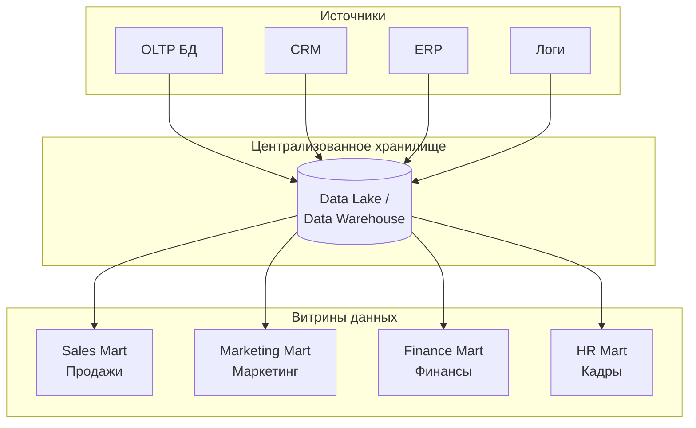
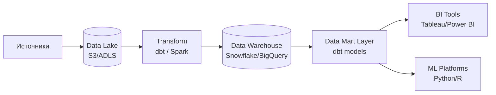

---
aliases:
  - Data Mart
  - витрина данных
---
## 📊 Что такое Data Mart (витрина данных)?

**Data Mart** — это **специализированное подмножество хранилища данных ([[Data Warehouse]])**, ориентированное на **конкретную бизнес-функцию, отдел или аналитическую задачу**.

> 💡 **Простыми словами**:  
> *«Если Data Warehouse — это центральный склад всей компании, то Data Mart — это отдельный прилавок для конкретного отдела (например, маркетинга или продаж).»*

---

## 🔑 Зачем нужен Data Mart?

| Проблема без Data Mart | Решение через Data Mart |
|------------------------|-------------------------|
| **Сложность запросов** — аналитики тратят время на сложные джойны в огромном хранилище | Предварительно агрегированные и денормализованные данные |
| **Медленные отчёты** — запросы к монолитному хранилищу тормозят | Оптимизированная структура под конкретные сценарии |
| **Высокая нагрузка на хранилище** — все отделы бьют по одному источнику | Разгрузка основного хранилища |
| **Сложность для бизнес-пользователей** — слишком много таблиц и связей | Простая, понятная структура «как в бизнесе» |

---

## 🧩 Типы Data Mart

| Тип | Источник данных | Плюсы | Минусы |
|-----|-----------------|-------|--------|
| **Независимый (Independent)** | Источники напрямую (без DW) | Быстро строится | Риск несогласованности с другими витринами |
| **Зависимый (Dependent)** | Из центрального Data Warehouse | Единая версия истины | Зависимость от качества и скорости обновления DW |
| **Гибридный (Hybrid)** | DW + прямые источники | Гибкость | Сложнее поддерживать согласованность |

> 💡 **Современный подход**:  
> Большинство компаний используют **зависимые витрины** — они строятся поверх централизованного озера данных или хранилища.

---

## 📦 Структура типичного Data Mart



### 🔹 Пример структуры витрины продаж:

| Таблица | Назначение | Пример колонок |
|---------|------------|----------------|
| `dim_customer` | Измерение: клиенты | `customer_id`, `name`, `segment`, `region` |
| `dim_product` | Измерение: товары | `product_id`, `name`, `category`, `price` |
| `dim_date` | Измерение: даты | `date`, `day`, `month`, `quarter`, `is_holiday` |
| `fact_sales` | Факты: продажи | `sale_id`, `customer_id`, `product_id`, `date`, `amount`, `quantity` |
| `agg_daily_sales` | Агрегаты: дневные продажи | `date`, `region`, `total_amount`, `orders_count` |

> 💡 **Ключевая особенность**:  
> Витрина часто использует **схему «звезда»** (Star Schema) — одна таблица фактов окружена измерениями.

---

## 💼 Реальные примеры использования

### 🛒 Пример 1: Витрина продаж для ритейла

```sql
-- Запрос аналитика: продажи по регионам за квартал
SELECT 
    d.region,
    SUM(f.amount) AS total_sales,
    COUNT(DISTINCT f.order_id) AS orders_count
FROM fact_sales f
JOIN dim_date dt ON f.date_id = dt.date_id
JOIN dim_customer d ON f.customer_id = d.customer_id
WHERE dt.quarter = 'Q2 2024'
GROUP BY d.region
ORDER BY total_sales DESC;
```

→ **Результат**: Отчёт за секунды вместо минут (благодаря предварительной агрегации).

---

### 📈 Пример 2: Витрина маркетинга для цифрового агентства

| Таблица | Данные |
|---------|--------|
| `fact_campaigns` | Расходы, показы, клики, конверсии по кампаниям |
| `dim_channels` | Каналы: Яндекс.Директ, ВКонтакте, Google Ads |
| `dim_audience` | Сегменты аудитории: новички, лояльные, отток |
| `agg_roi_by_channel` | Агрегированный ROI по каналам и дням |

→ **Использование**: Маркетологи строят дашборды в Tableau без помощи инженеров.

---

### 💰 Пример 3: Финансовая витрина для банка

| Сценарий | Как работает |
|----------|--------------|
| **Ежедневный отчёт по кассам** | Агрегация транзакций за день → готовая таблица `daily_cash_summary` |
| **Анализ мошенничества** | Обогащение транзакций данными о клиенте → витрина `fraud_analysis` |
| **Регуляторная отчётность** | Предварительно сформированные наборы данных под требования ЦБ |

---

## 🆚 Сравнение: Data Mart vs Data Warehouse vs Data Lake

| Критерий | **Data Lake** | **Data Warehouse** | **Data Mart** |
|----------|---------------|--------------------|---------------|
| **Объём данных** | Петабайты (сырые данные) | Терабайты (очищенные) | Гигабайты–Терабайты (агрегированные) |
| **Структура** | Неструктурированные + полуструктурированные | Структурированные (схема при записи) | Денормализованные (схема под запросы) |
| **Пользователи** | Инженеры данных, учёные | Аналитики, архитекторы | Бизнес-аналитики, менеджеры |
| **Скорость запросов** | Медленная | Средняя | Быстрая |
| **Стоимость** | Низкая (холодное хранилище) | Средняя | Низкая (маленький объём) |
| **Цель** | Хранение всего | Единая версия истины | Быстрая аналитика под задачу |

> 💡 **Аналогия**:  
> - **Data Lake** = Склад сырья (необработанная нефть)  
> - **Data Warehouse** = Нефтеперерабатывающий завод (бензин, дизель)  
> - **Data Mart** = АЗС у дома (готовый бензин в нужной ёмкости)

---

## 🛠️ Как строится современная витрина данных?

### Современный стек (2024):



### 🔹 Пример на **dbt** (data build tool):

```sql
-- models/marts/sales/fact_sales.sql
{{ config(materialized='table') }}

SELECT
    o.order_id,
    o.customer_id,
    c.customer_name,
    c.region,
    p.product_id,
    p.category,
    o.order_date,
    o.amount,
    o.quantity
FROM {{ ref('stg_orders') }} o
JOIN {{ ref('stg_customers') }} c ON o.customer_id = c.customer_id
JOIN {{ ref('stg_products') }} p ON o.product_id = p.product_id
WHERE o.status = 'completed'
```

→ Результат: готовая витрина `fact_sales` в хранилище, доступная для аналитиков.

---

## ✅ Преимущества Data Mart

| Преимущество | Объяснение |
|--------------|------------|
| **Скорость** | Предварительная агрегация → отчёты за секунды |
| **Простота** | Денормализованная структура → легко понять бизнес-пользователю |
| **Изоляция** | Сбой в одной витрине не влияет на другие |
| **Экономия ресурсов** | Меньше нагрузки на центральное хранилище |
| **Гибкость** | Можно быстро менять структуру под новые задачи отдела |

---

## ⚠️ Риски и ограничения

| Риск | Как избежать |
|------|--------------|
| **«Силосы данных»** — каждая витрина живёт своей жизнью | Использовать зависимые витрины поверх единого хранилища |
| **Несогласованность метрик** — разные витрины считают «выручку» по-разному | Единый словарь метрик (metrics layer) |
| **Дублирование логики** — одна и та же трансформация в нескольких витринах | Выносить общую логику в слой промежуточных моделей |
| **Устаревание данных** | Настроить регулярные инкрементальные обновления |

---

## 💬 Итог

> **Data Mart — это «готовая еда» для аналитиков**:  
> - Не нужно готовить (сложные джойны)  
> - Не нужно искать ингредиенты (таблицы в хранилище)  
> - Просто открой и ешь (строить отчёт)

> 💡 **Когда использовать**:  
> ➤ Когда отделу нужна **быстрая аналитика** без помощи инженеров  
> ➤ Для **специфических метрик**, не нужных другим командам  
> ➤ Чтобы **разгрузить** центральное хранилище от частых запросов  

> ❌ **Когда не использовать**:  
> ➤ Для хранения сырых данных (лучше Data Lake)  
> ➤ Как замену центральному хранилищу (риск несогласованности)  
> ➤ Для очень простых сценариев (одна таблица → не нужна витрина)

---

✅ **Современный подход**:  
Создавайте **зависимые витрины поверх озера данных** с помощью инструментов вроде **dbt** — это даёт скорость, согласованность и гибкость одновременно.