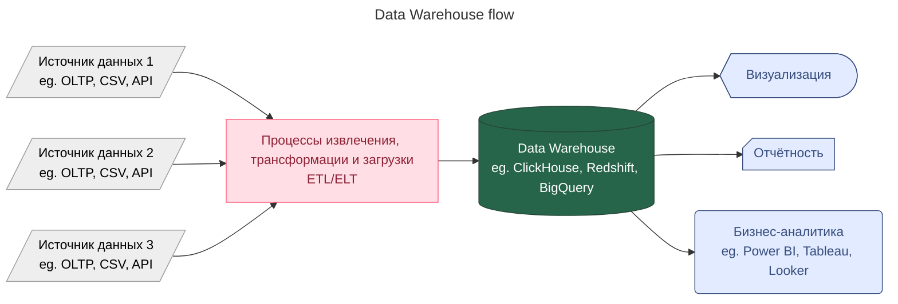
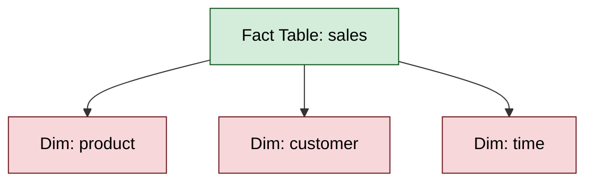
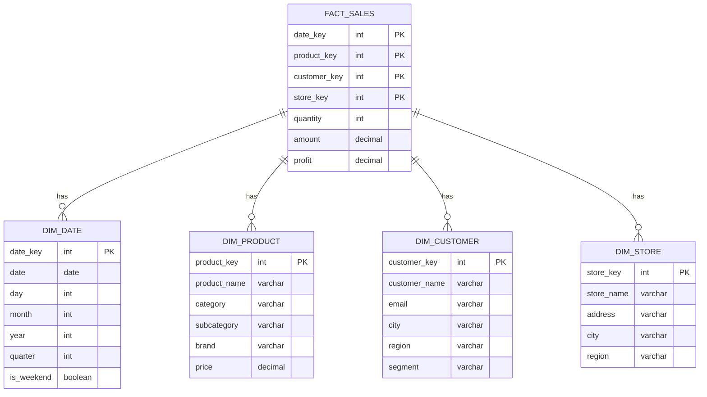
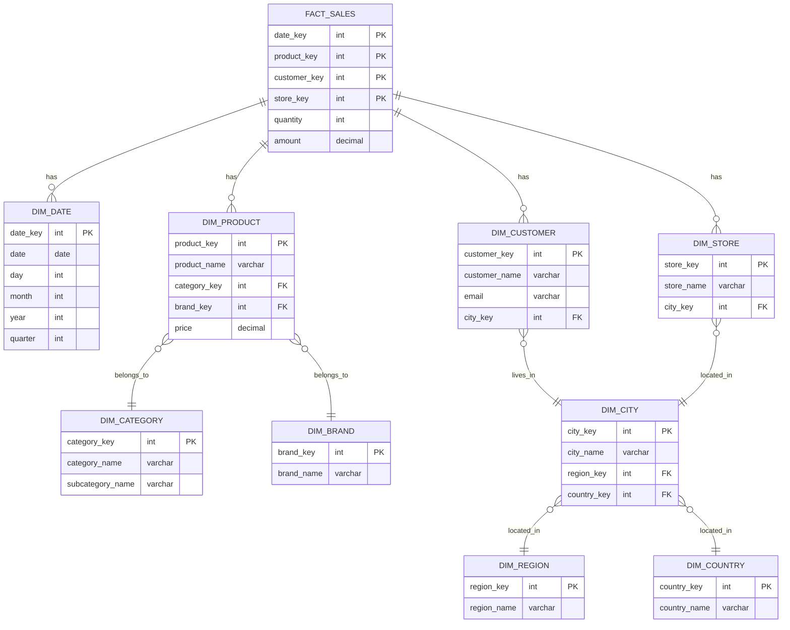
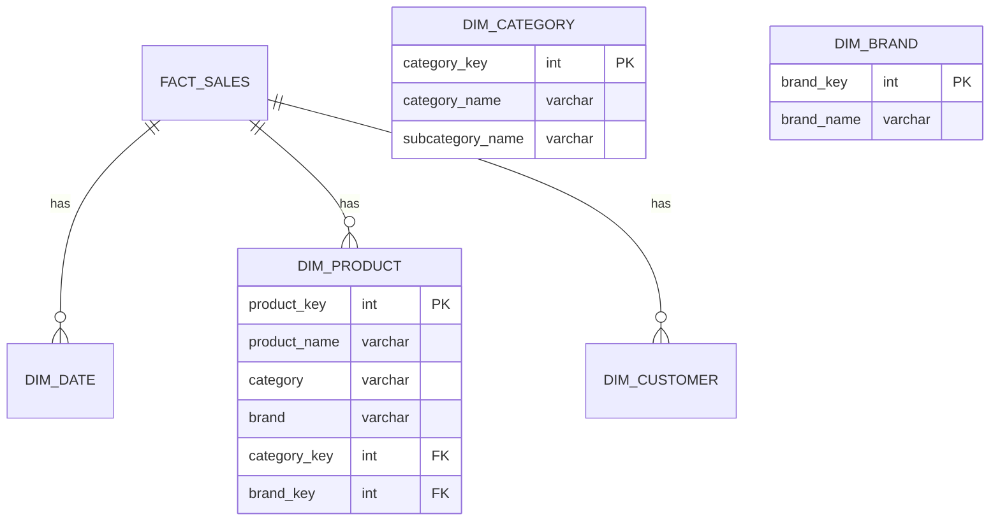

---
aliases:
  - Data Warehouse
  - DW
  - DWH
  - Snowflake Schema
  - Снежинка
  - Star Schema
  - Звезда
---
## ✅ Что такое Data Warehouse?

**Data Warehouse (DW)** — это **централизованное хранилище данных**, которое:
- Собирает данные из разных источников ([[OLTP]]-баз, файлов, API)
- Хранит их в **аналитически удобной форме**
- Позволяет быстро выполнять **сложные запросы и отчёты**

💬 Простыми словами:
> Это **"библиотека знаний"** компании — где собраны все данные за годы, чтобы можно было анализировать тренды, делать прогнозы и принимать решения.



---

## ✅ Зачем нужен Data Warehouse?

| Цель | Объяснение |
|------|------------|
| ✅ Аналитика | Отчёты: "Сколько мы продали за год?" |
| ✅ Прогнозирование | "Какой товар будет популярен в следующем месяце?" |
| ✅ Принятие решений | "Нужно ли увеличивать складские запасы?" |
| ✅ Интеграция данных | Связать данные из CRM, ERP, сайта, почты |
| ✅ Исторический анализ | "Как изменилась прибыль за 5 лет?" |

---

## ✅ Основные компоненты

| Компонент            | Роль                                     |
| -------------------- | ---------------------------------------- |
| **Источники данных** | [[OLTP]]-базы, Excel, CSV, API           |
| **ETL/ELT**          | Процесс загрузки и преобразования данных |
| **Data Warehouse**   | Само хранилище (например, ClickHouse)    |
| **BI-инструменты**   | Power BI, Tableau — для визуализации     |
| **Пользователи**     | Аналитики, бизнес-аналитики, руководство |

---

## ✅ Типичные технологии

| Компонент                          | Примеры                                                 |
| ---------------------------------- | ------------------------------------------------------- |
| **Data Warehouse**                 | ClickHouse, Amazon Redshift, Google BigQuery, Snowflake |
| **[[ELT]]**                        | Apache Airflow, Talend, Fivetran, dbt                   |
| **[[КИС\|BI]]** | Power BI, Tableau, Looker, Metabase                     |
| **Источники**                      | PostgreSQL, MySQL, Oracle, CSV, Kafka                   |

---

## ✅ Как работает Data Warehouse? (по шагам)

1. **Источник данных** → например, `sales_db`
2. **ETL-процесс** → извлекает данные, трансформирует (агрегирует, денормализует)
3. **Загружает в DW** → например, `sales_fact_table`
4. **BI-инструмент** → запрашивает данные, строит дашборд
5. **Аналитик** → видит график: "Продажи растут!"

---

## ✅ Формат данных в DW

> 📊 Чаще всего используется **Star Schema**:



- **Fact Table** — факты (продажи, заказы, события)
- **Dimension Tables** — атрибуты (продукт, клиент, дата)

---

## ✅ Преимущества Data Warehouse

| Плюс | Объяснение |
|------|------------|
| ✅ Быстрый доступ к данным | Оптимизирован под SELECT с GROUP BY |
| ✅ Надёжность | Данные не меняются после загрузки |
| ✅ Масштабируемость | Может хранить TB данных |
| ✅ Удобство аналитики | Поддержка SQL, BI-инструментов |
| ✅ Историческая целостность | Можно вернуться к данным за 5 лет |

---

## ✅ Недостатки

| Минус | Объяснение |
|-------|------------|
| ❌ Задержка | Данные приходят с задержкой (час–день) |
| ❌ Сложность | Требуется ETL, настройка, мониторинг |
| ❌ Стоимость | Высокая (особенно облачные решения) |
| ❌ Не для операций | Не подходит для CRUD-операций |

---

## ✅ Когда использовать Data Warehouse?

| Сценарий | Рекомендация |
|----------|--------------|
| ✅ Нужны отчёты по продажам | ➤ **Data Warehouse** |
| ✅ Нужна аналитика поведения пользователей | ➤ **Data Warehouse** |
| ✅ Нужно строить дашборд | ➤ **Data Warehouse + BI** |
| ✅ Нужно обновить статус заказа | ➤ **OLTP**, а не DW |
| ✅ Нужно хранить логи в реальном времени | ➤ **Контейнеры + ELK** или **Kafka + Druid** |

---

## ✅ Финальный вывод

> ✅ **Data Warehouse — это "мозг" компании**.  
> Он собирает данные из всех систем и делает из них **знания**.

> 💬 _“A data warehouse is not a place to store data. It’s a place to make decisions.”_

---
[[Data Lake]]

---
## 📊 Схемы архитектуры хранилища данных DWH

При проектировании хранилищ данных используются **два основных паттерна архитектуры**: **Звезда (Star Schema)** и **Снежинка (Snowflake Schema)**. Оба паттерна оптимизированы для **аналитических запросов**, а не для транзакционных операций.

---

## ⭐ Схема "Звезда" (Star Schema)

### 📌 Что это?

**Звезда** — это **денормализованная** модель данных, где:
- В центре находится **одна таблица фактов (Fact Table)**
- Вокруг — **таблицы измерений (Dimension Tables)**, каждая связана напрямую с таблицей фактов

> 💡 **Название**: Схема напоминает звезду — факты в центре, измерения расходятся лучами.

---

### 🏗️ Структура



---

### ✅ Преимущества Звезды

| Преимущество | Объяснение |
|--------------|------------|
| **Простота запросов** | Минимум JOIN'ов — только факты + измерения |
| **Высокая производительность** | Денормализация → меньше операций соединения |
| **Понятность для бизнеса** | Логичная структура, легко понять аналитикам |
| **Оптимизация для BI** | Идеальна для инструментов вроде Tableau, Power BI |

---

### ❌ Недостатки Звезды

| Недостаток | Объяснение |
|------------|------------|
| **Избыточность данных** | Повторяющиеся значения в измерениях (например, `region` в каждом городе) |
| **Большой размер** | Денормализация увеличивает объём хранилища |
| **Сложность обновлений** | Изменение значения в измерении требует обновления всех связанных строк |

---

## ❄️ Схема "Снежинка" (Snowflake Schema)

### 📌 Что это?

**Снежинка** — это **нормализованная** версия звезды, где таблицы измерений **разбиты на подтаблицы** для устранения избыточности.

> 💡 **Название**: Схема напоминает снежинку — факты в центре, измерения разветвляются на подуровни.

---

### 🏗️ Структура



---

### ✅ Преимущества Снежинки

| Преимущество | Объяснение |
|--------------|------------|
| **Меньше избыточности** | Нормализация устраняет дублирование данных |
| **Экономия места** | Меньше объём хранилища |
| **Легче обновлять** | Изменение значения в справочнике → обновление в одном месте |
| **Лучше для сложных иерархий** | Поддерживает многоуровневые отношения |

---

### ❌ Недостатки Снежинки

| Недостаток | Объяснение |
|------------|------------|
| **Сложнее запросы** | Больше JOIN'ов → сложнее писать и отлаживать |
| **Медленнее выполнение** | Больше операций соединения → ниже производительность |
| **Сложнее для бизнеса** | Требует понимания связей между таблицами |

---

## 🆚 Сравнение: Звезда vs Снежинка

| Критерий | **Звезда** | **Снежинка** |
|----------|------------|--------------|
| **Нормализация** | Денормализованная | Нормализованная |
| **Количество таблиц** | Меньше | Больше |
| **Количество JOIN'ов** | Меньше | Больше |
| **Производительность** | Выше | Ниже |
| **Объём хранилища** | Больше | Меньше |
| **Сложность запросов** | Проще | Сложнее |
| **Обновление данных** | Сложнее | Проще |
| **Понятность для бизнеса** | Выше | Ниже |
| **Использование в современных системах** | Чаще | Реже |

---

## 💻 Примеры запросов

### 🔹 Запрос к Звезде (простой):

```sql
SELECT 
    d.year,
    p.category,
    c.region,
    SUM(f.amount) AS total_sales
FROM fact_sales f
JOIN dim_date d ON f.date_key = d.date_key
JOIN dim_product p ON f.product_key = p.product_key
JOIN dim_customer c ON f.customer_key = c.customer_key
WHERE d.year = 2024
GROUP BY d.year, p.category, c.region;
```

→ **4 JOIN'а** — просто и быстро.

---

### 🔹 Запрос к Снежинке (сложнее):

```sql
SELECT 
    d.year,
    cat.category_name,
    reg.region_name,
    SUM(f.amount) AS total_sales
FROM fact_sales f
JOIN dim_date d ON f.date_key = d.date_key
JOIN dim_product p ON f.product_key = p.product_key
JOIN dim_category cat ON p.category_key = cat.category_key
JOIN dim_customer c ON f.customer_key = c.customer_key
JOIN dim_city city ON c.city_key = city.city_key
JOIN dim_region reg ON city.region_key = reg.region_key
WHERE d.year = 2024
GROUP BY d.year, cat.category_name, reg.region_name;
```

→ **7 JOIN'ов** — сложнее и медленнее.

---

## 🏥 Реальные сценарии использования

### ✅ Когда использовать **Звезду**:

| Сценарий | Почему Звезда? |
|----------|----------------|
| **Бизнес-аналитика** | Аналитики пишут простые запросы |
| **BI-дашборды** | Power BI, Tableau работают быстрее |
| **Агрегированные отчёты** | Денормализация ускоряет группировки |
| **Начальный этап** | Проще спроектировать и внедрить |

---

### ✅ Когда использовать **Снежинку**:

| Сценарий | Почему Снежинка? |
|----------|------------------|
| **Очень большие данные** | Экономия места критична |
| **Сложные иерархии** | Многоуровневые категории, география |
| **Частые обновления** | Нужно часто менять справочные данные |
| **Требования к нормализации** | Строгие правила целостности данных |

---

## 🛠️ Современный подход: Гибридная модель

На практике часто используют **гибридную модель**:



### 🔹 Принцип гибридной модели:
- **Часто используемые атрибуты** — денормализованы (в основной таблице)
- **Редко используемые / справочные** — нормализованы (в отдельных таблицах)

→ Получаем **лучшее из обоих миров**: скорость + экономию места.

---

## 📈 Тренды 2024: Что сейчас популярнее?

| Тренд                                          | Объяснение                                                                                     |
| ---------------------------------------------- | ---------------------------------------------------------------------------------------------- |
| **Звезда доминирует**                          | Современные облачные хранилища (Snowflake, BigQuery) дешевы → экономия места не критична       |
| **Витрины данных ([[Data Mart\|Data Marts]])** | Чаще используют звезду для бизнес-витрин                                                       |
| **Семантические слои**                         | Инструменты вроде Looker, dbt абстрагируют сложность → можно использовать снежинку под капотом |
| **[[Delta Lake]] / [[Iceberg]]**               | Открытые форматы позволяют гибко менять структуру → меньше привязанности к одному паттерну     |

---

## 💬 Итог

> **Звезда** — для **скорости и простоты**.  
> **Снежинка** — для **экономии места и нормализации**.

> 💡 **Современная рекомендация**:  
> Начинайте с **Звезды** — она проще, быстрее и лучше подходит для большинства бизнес-сценариев.  
> Переходите к **Снежинке** только если:
> - Объём данных критически велик
> - Есть строгие требования к нормализации
> - Часто обновляются справочные данные

---

✅ **Звезда — это стандарт де-факто для современных хранилищ данных. Снежинка — нишевое решение для специфических случаев.**

