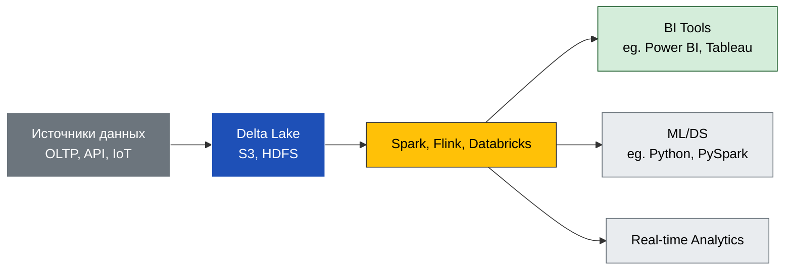

---
aliases:
  - Delta Lake
---
**Delta Lake** — это **открытый формат хранилища данных**, который добавляет **ACID-гарантии, схему и управление версиями** к [[Data Lake]].

---

## ✅ Что такое Delta Lake?

> **Delta Lake** — это **формат таблиц на основе [[Parquet]]**, который позволяет:
- Хранить данные в сыром виде (как Data Lake)
- Обеспечивать **ACID-транзакции**
- Поддерживать **смену схемы**
- Управлять **версиями данных**
- Выполнять **быстрые SQL-запросы**

💬 Простыми словами:
> Это **"Data Lake с гарантиями"** — как будто вы храните данные в S3, но можете делать `UPDATE`, `DELETE`, `MERGE` и не бояться потери данных.

---

## ✅ Зачем нужен Delta Lake?

| Цель | Объяснение |
|------|------------|
| ✅ ACID-гарантии | Никакие транзакции не потеряются |
| ✅ Схема | Можно определить структуру данных |
| ✅ Версионирование | Можно откатиться к предыдущей версии |
| ✅ Масштабируемость | До PB/TB данных |
| ✅ Быстрые запросы | Поддержка SQL, Spark, Presto |

---

## ✅ Архитектура Delta Lake



---

## ✅ Основные компоненты

| Компонент | Роль |
|----------|------|
| **Источники данных** | OLTP, Kafka, файлы, IoT |
| **Delta Lake** | Формат таблиц на S3/HDFS |
| **Обработка** | Spark, Flink, Databricks |
| **Аналитика** | Power BI, Tableau, ML |
| **Реальная аналитика** | Flink, Kafka |

---

## ✅ Как работает Delta Lake?

### 📁 Структура каталога:

```
/delta-table/
├── _delta_log/          ← журнал изменений
│   ├── 000000000000.json
│   ├── 000000000001.json
│   └── ...
├── data_00000.parquet   ← данные
├── data_00001.parquet
└── ...
```

→ `_delta_log` — это **журнал транзакций**. Каждое изменение записывается в него.

---

## ✅ Ключевые возможности

### 1. **ACID-транзакции**

```sql
-- Безопасный UPDATE
UPDATE delta_table SET amount = amount + 10 WHERE user_id = 123;
```

→ Даже если процесс упадёт — данные не повредятся.

---

### 2. **Смена схемы (Schema Evolution)**

```sql
-- Добавить новое поле
ALTER TABLE delta_table ADD COLUMN new_field STRING;
```

→ Не нужно перезагружать всё!

---

### 3. **Версионирование (Time Travel)**

```sql
-- Посмотреть данные за 1 день назад
SELECT * FROM delta_table VERSION AS OF 1;

-- Откатиться к версии
RESTORE TABLE delta_table TO VERSION AS OF 1;
```

→ Полезно для отладки и аудита.

---

### 4. **Очистка дубликатов (Deduplication)**

```sql
-- Удалить дубликаты
DELETE FROM delta_table WHERE id IN (
  SELECT id FROM (
    SELECT id, ROW_NUMBER() OVER (PARTITION BY id) as rn
    FROM delta_table
  ) WHERE rn > 1
);
```

---

### 5. **Мердж (Merge)**

```sql
-- Обновить или вставить данные
MERGE INTO delta_table AS target
USING source ON target.id = source.id
WHEN MATCHED THEN UPDATE SET *
WHEN NOT MATCHED THEN INSERT *;
```

→ Идеально для обновления данных из потока.

---

## ✅ Преимущества Delta Lake

| Плюс | Объяснение |
|------|------------|
| ✅ ACID-гарантии | Данные всегда целые |
| ✅ Схема | Можно определить структуру |
| ✅ Версионирование | Можно откатиться |
| ✅ Масштабируемость | До PB/TB данных |
| ✅ Быстрые запросы | Поддержка Spark, SQL |
| ✅ Гибкость | Поддерживает все типы данных |

---

## ✅ Недостатки

| Минус | Объяснение |
|-------|------------|
| ❌ Сложность | Требует знаний о Spark, SQL |
| ❌ Безопасность | Требуется управление доступом (IAM, ACL) |
| ❌ Качество данных | Нет автоматической проверки данных |

---

## ✅ Когда использовать Delta Lake?

| Сценарий | Рекомендация |
|----------|--------------|
| ✅ Нужно хранить все данные (логи, события, фото) | ➤ **Delta Lake** |
| ✅ Нужно делать быстрые отчёты | ➤ **Delta Lake** |
| ✅ Нужно делать ML/DS | ➤ **Delta Lake** |
| ✅ Нужно анализировать в реальном времени | ➤ **Delta Lake** |
| ✅ Нужны сложные отчёты с историей | ➤ **Delta Lake** |

---

## ✅ Финальный вывод

> ✅ **Delta Lake — это "[[Data Lake]] с сердцем"**.  
> Он **объединяет гибкость [[Data Lake]] и надёжность [[Data Warehouse]]**.

> 💬 _“Delta Lake is the future of data storage.”_

---

# Delta Lake vs Data Lakehouse

**Delta Lake** и **Data Lakehouse** — это **два разных понятия**, но они тесно связаны.

✅ Сравнение: Delta Lake vs Data Lakehouse

| Критерий           | **Delta Lake**                                 | **Data Lakehouse**                             |
| ------------------ | ---------------------------------------------- | ---------------------------------------------- |
| **Тип**            | Формат данных (файловый)                       | Архитектура системы                            |
| **Цель**           | Добавить [[ACID]] и управление к [[Data Lake]] | Объединить [[Data Lake]] + [[Data Warehouse]]  |
| **Примеры**        | Delta Lake, Iceberg, ORC                       | Databricks, Snowflake, BigQuery                |
| **Используется в** | Databricks, Spark, Flink                       | Databricks, Snowflake, Delta Lake              |
| **Связь**          | Delta Lake — часть Data Lakehouse              | Data Lakehouse — может использовать Delta Lake |
> 💡 **Delta Lake — это "один из способов реализовать Data Lakehouse"**.  
> Как **MySQL — это одна из баз данных для веб-приложения**.

---

## ✅ Когда что использовать?

| Сценарий                                  | Рекомендация                       |
| ----------------------------------------- | ---------------------------------- |
| ✅ Нужен формат для хранения данных с ACID | ➤ **Delta Lake**                   |
| ✅ Нужна платформа для аналитики, ML, BI   | ➤ **Data Lakehouse**               |
| ✅ Используете Databricks                  | ➤ **Delta Lake** (встроен)         |
| ✅ Используете Snowflake                   | ➤ **Snowflake** (своё "Lakehouse") |

---

## ✅ Финальный вывод

> ✅ **Delta Lake — это технология** (формат).  
> ✅ **Data Lakehouse — это архитектура** (система).

> 💬 _“Delta Lake is a format. Data Lakehouse is a system.”_

---