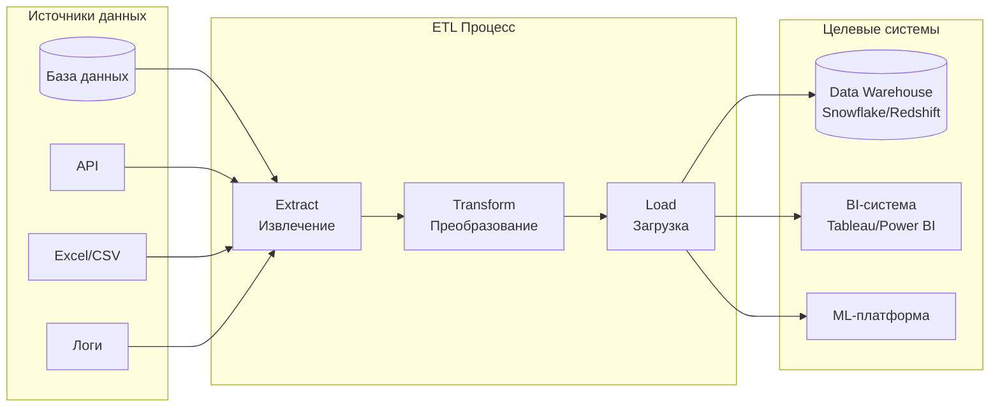

---
aliases:
  - ETL
  - Extract Transform Load
---
## 🔁 Что такое ETL (Extract, Transform, Load)?

**ETL** — это **процесс интеграции данных**, состоящий из трёх этапов:

| Этап | Что делает | Пример |
|------|------------|--------|
| **Extract (Извлечение)** | Сбор данных из разных источников | Базы данных, API, Excel, логи, файлы CSV |
| **Transform (Преобразование)** | Очистка, нормализация, агрегация данных | Удаление дубликатов, конвертация валют, расчёт метрик |
| **Load (Загрузка)** | Сохранение обработанных данных в целевую систему | Data Warehouse (Snowflake), Data Lake, BI-система |

> 💡 **Простыми словами**:  
> *«Собрать данные из разных мест → привести их к единому виду → положить в хранилище для аналитики»*

---

## 🎯 Для чего нужен ETL?

| Задача                            | Как решает ETL                                              |
| --------------------------------- | ----------------------------------------------------------- |
| **Интеграция разнородных данных** | Объединяет данные из 10+ источников в единый формат         |
| **Очистка «грязных» данных**      | Удаляет дубликаты, исправляет опечатки, заполняет пропуски  |
| **Создание единой картины**       | Формирует «единую версию истины» для отчётности             |
| **Подготовка к аналитике**        | Строит витрины данных (data marts) для бизнес-пользователей |
| **Соблюдение регламентов**        | Анонимизирует [[ПДн]] перед загрузкой в аналитику           |

---

## 📊 Визуализация процесса ETL



---

## 💻 Живой пример: ETL для интернет-магазина

### 📥 **1. Extract (Извлечение)**
```python
# Источник 1: База заказов (PostgreSQL)
orders = spark.read.jdbc(
    url="jdbc:postgresql://prod-db:5432/shop",
    table="orders",
    properties={"user": "etl_user", "password": "secret"}
)

# Источник 2: Логи кликов (Kafka)
clicks = spark.readStream.format("kafka") \
    .option("kafka.bootstrap.servers", "kafka:9092") \
    .option("subscribe", "user_clicks") \
    .load()

# Источник 3: Курсы валют (API)
exchange_rates = requests.get("https://api.exchangerate.host/latest?base=USD").json()
```

### 🔄 **2. Transform (Преобразование)**
```python
# Очистка: удаление отменённых заказов
clean_orders = orders.filter(orders.status != "cancelled")

# Нормализация: приведение валют к единой
clean_orders = clean_orders.withColumn(
    "amount_usd",
    when(col("currency") == "EUR", col("amount") * exchange_rates["rates"]["USD"])
    .otherwise(col("amount"))
)

# Агрегация: дневные продажи по категориям
daily_sales = clean_orders.groupBy("date", "category").agg(
    sum("amount_usd").alias("total_sales"),
    count("order_id").alias("orders_count")
)

# Обогащение: добавление данных о кликах
enriched = daily_sales.join(clicks, ["user_id", "date"], "left")
```

### 📤 **3. Load (Загрузка)**
```python
# Загрузка в Data Warehouse (Snowflake)
enriched.write.format("snowflake") \
    .options(
        sfURL="my-account.snowflakecomputing.com",
        sfUser="etl_service",
        sfPassword="***",
        sfDatabase="ANALYTICS",
        sfSchema="SALES"
    ) \
    .mode("append") \
    .saveAsTable("daily_sales_enriched")
```

---

## 🆚 ETL vs ELT: ключевые различия

| Критерий              | **ETL**                                | **[[ELT]]**                                          |
| --------------------- | -------------------------------------- | ---------------------------------------------------- |
| **Порядок**           | Извлечение → Преобразование → Загрузка | Извлечение → Загрузка → Преобразование               |
| **Где трансформация** | На отдельном сервере (ETL-движок)      | Внутри целевой системы (например, в Snowflake)       |
| **Скорость**          | Медленнее (трансформация до загрузки)  | Быстрее (загрузка «как есть»)                        |
| **Гибкость**          | Низкая (схема фиксируется заранее)     | Высокая (можно менять логику после загрузки)         |
| **Подходит для**      | Старые системы, сложные бизнес-правила | Современные облачные хранилища (Snowflake, BigQuery) |
| **Инструменты**       | Informatica, Talend, SSIS              | dbt, Fivetran, Matillion                             |

> 💡 **Современный тренд**:  
> Большинство компаний переходят на **ELT** благодаря мощи современных облачных хранилищ.  
> Но **ETL** остаётся актуальным для:
> - Систем с жёсткими требованиями к качеству данных
> - Сценариев с чувствительными данными (трансформация до загрузки = безопаснее)

---

## 🛠️ Популярные инструменты ETL

| Категория | Инструменты | Особенности |
|-----------|-------------|-------------|
| **Коммерческие** | Informatica PowerCenter, Talend, SSIS | Готовые коннекторы, поддержка, но дорого |
| **Облачные** | AWS Glue, Azure Data Factory, Google Dataflow | Масштабируются автоматически, оплата по использованию |
| **Open Source** | Apache NiFi, Apache Airflow + Spark, Singer | Гибкость, но требуют настройки |
| **Современные** | Fivetran (ELT), dbt (трансформация), Stitch | Фокус на простоте и скорости |

---

## 🏥 Реальные сценарии использования

| Сценарий | Как работает ETL |
|----------|------------------|
| **Финансовая отчётность** | Ежедневная выгрузка из 1С → нормализация → загрузка в хранилище → отчёт в Power BI |
| **Анализ поведения пользователей** | Сбор событий из мобильного приложения → очистка ботов → агрегация по сессиям → аналитика в Tableau |
| **Интеграция с партнёрами** | Приём заказов от партнёра в CSV → валидация → преобразование в внутренний формат → загрузка в ERP |
| **Машинное обучение** | Сбор исторических данных → фиче-инжиниринг → загрузка в обучающий датасет |

---

## ⚠️ Типичные проблемы ETL и решения

| Проблема | Решение |
|----------|---------|
| **Медленные загрузки** | Параллельная обработка, партиционирование, инкрементальные загрузки |
| **Неконсистентные данные** | Валидация на этапе Transform, DQ-правила (например, через Great Expectations) |
| **Сбои в середине процесса** | Транзакционность, точки сохранения (checkpoints), идемпотентность операций |
| **Сложность отладки** | Логирование каждого этапа, мониторинг через Airflow/Grafana |
| **Зависимости между задачами** | Оркестрация через DAG (Directed Acyclic Graph) в Airflow |

---

## ✅ Когда использовать ETL?

| Ситуация | Рекомендация |
|----------|--------------|
| Нужна **строгая валидация** данных перед загрузкой | ➤ **ETL** |
| Источники содержат **чувствительные данные** (ПДн) | ➤ **ETL** (очистка до попадания в хранилище) |
| Целевая система **слабая** (старый сервер) | ➤ **ETL** (вся нагрузка на ETL-сервер) |
| Нужна **максимальная скорость** загрузки | ➤ **ELT** |
| Используется **мощное облако** (Snowflake, BigQuery) | ➤ **ELT** |
| Требуется **гибкость** в изменении логики | ➤ **ELT** |

---

## 💬 Итог

> **ETL — это «кухня данных»**:  
> - **Извлечение** = закупка продуктов  
> - **Преобразование** = приготовление блюда  
> - **Загрузка** = подача на стол (аналитикам, бизнесу)

> 💡 **Главное правило**:  
> *«Не загружайте в хранилище то, что не прошло контроль качества»*

> 📌 **Современный подход**:  
> Используйте **гибридную модель** — базовые очистки в ETL, сложные трансформации в ELT (например, через **dbt** поверх данных в хранилище).

---

✅ **ETL остаётся фундаментом для качественной аналитики — даже в эпоху облаков и больших данных.**