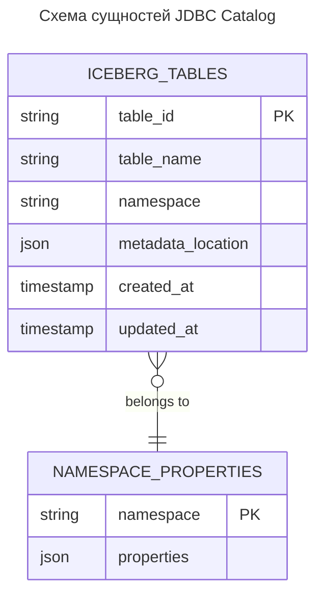
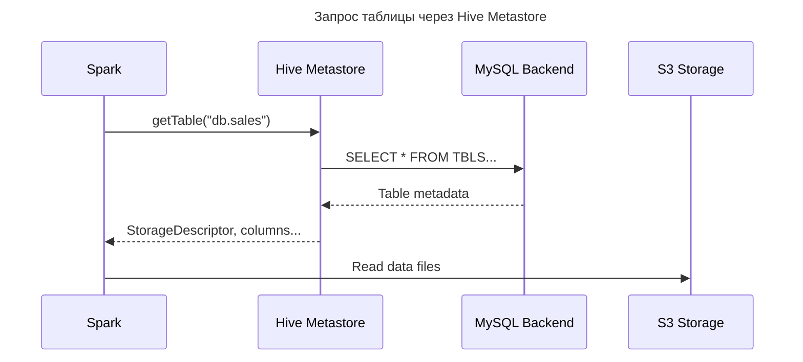
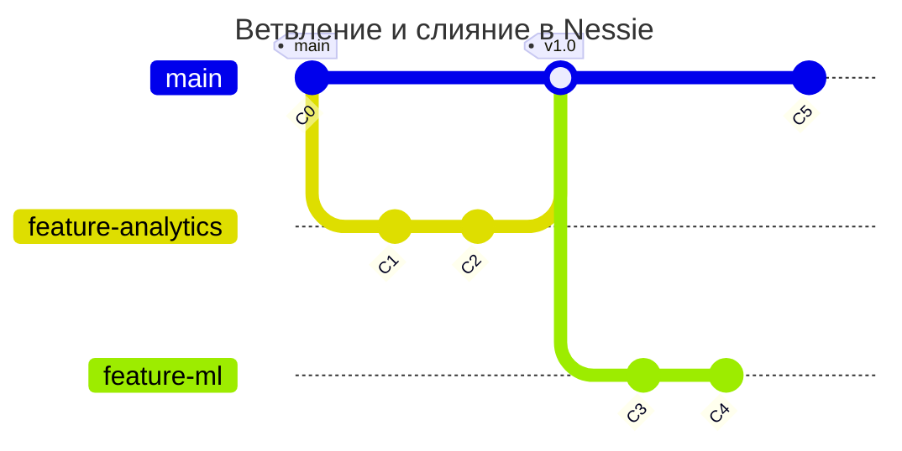
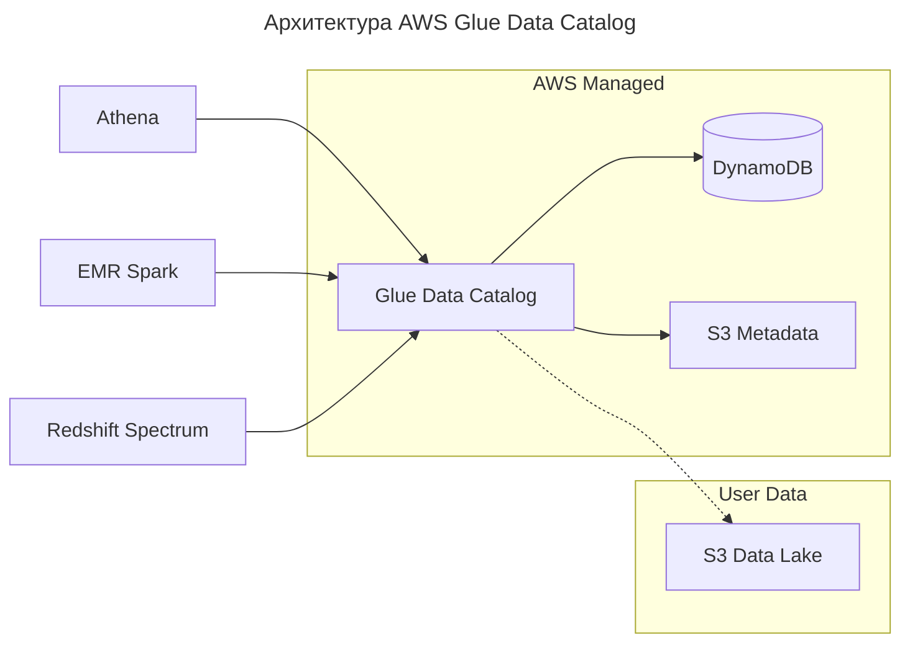
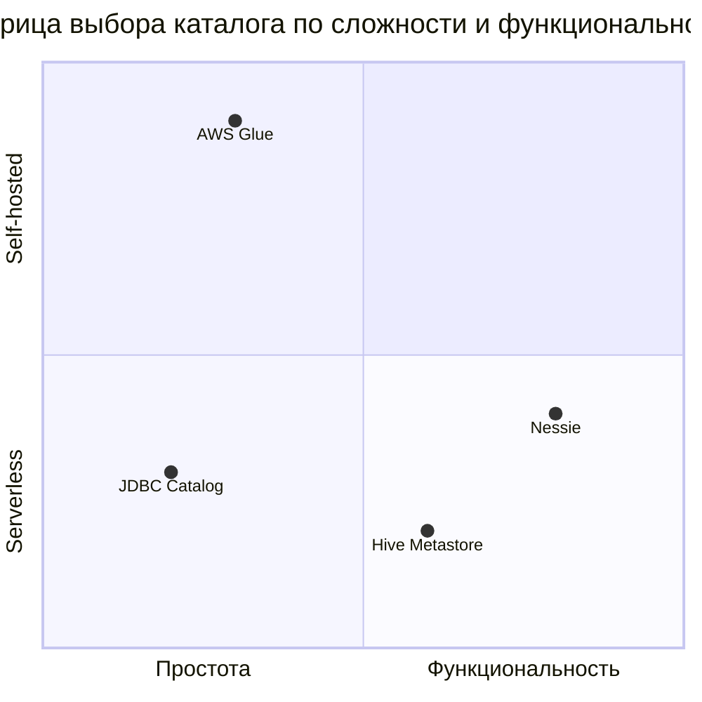

---
aliases:
  - Apache Atlas
  - AWS Glue Data Catalog
  - Data Catalog
  - Data Lake
  - Data Lineage
  - Hive Metastore
  - JDBC Catalog
  - Metadata Catalogs
  - Metadata Management Systems
  - Metadata Repositories
  - Metadata Stores
  - Nessie
  - Каталоги данных
  - каталоги метаданных
  - Линия происхождения данных
  - Системы управления метаданными
  - Хранилища метаданных
---
## Data Catalog

> Metadata Management Systems
> Metadata Catalogs
> Metadata Stores
> Metadata Repositories
> Системы управления метаданными
> Каталоги данных / каталоги метаданных
> Хранилища метаданных

### Что такое Data Catalog (каталог данных)

**Data Catalog (каталог данных)** — это централизованная система (хранилище) метаданных (информации «о данных») об информационных активах организации. По сути, это «цифровая библиотека» или «инвентарь» всех данных компании с подробным описанием их свойств, происхождения и взаимосвязей.

> [!warning] Data Catalog ⊈ DWH
> Каталог данных — это не просмотр данных в системе (такой глобальный DWH), а способ управлять данными в системе. Это решение проблем, связанных с обнаружением, понятностью и использованием данных.

**Ключевая особенность:** Data Catalog не содержит сами данные, а хранит только метаданные — информацию о данных, включая:

- структуру;
- местоположение;
- происхождение;
- владельцев;
- правила использования;
- качество (метрики качества);
- историю изменений (Data Lineage — «линия происхождения» данных).

### Архитектура Data Catalog

Типичный Data Catalog состоит из:

1. **Коннекторов и интеграционных модулей** — для подключения к источникам данных (базы данных, хранилища, облачные платформы, локальные файлы).
2. **Хранилища метаданных** — обеспечивает единое представление о всех данных организации.
3. **Аналитического движка** — обрабатывает запросы, обнаруживает взаимосвязи между данными.
4. **Пользовательского интерфейса** — позволяет взаимодействовать с каталогом (поиск, просмотр метаданных).
5. **Модулей безопасности** — гарантирует соблюдение политик доступа к данным.
6. **Инструментов коллаборации** — позволяет добавлять комментарии, оценки, отзывы к наборам данных.

### Основные функции Data Catalog

1. **Автоматическое обнаружение и сканирование данных** — находит и индексирует данные во всех источниках.
2. **Классификация и тегирование** — категоризирует данные по признакам (чувствительность, предметная область, качество).
3. **Управление метаданными** — собирает, хранит и обновляет метаданные.
4. **Поисковые возможности** — обеспечивает быстрый поиск данных по критериям (включая семантический поиск).
5. **Отслеживание происхождения данных (Data Lineage)** — показывает путь данных от источника до конечного использования.
6. **Профилирование данных** — оценивает качество данных, собирает статистику.
7. **Классификация данных** — по типу, формату, тематике и другим параметрам.
8. **Контроль доступа** — управляет правами доступа к данным.
9. **Интеграция с BI-инструментами** ([[tableau|Tableau]], Power BI и др.) — для анализа данных прямо в BI-системах.
10. **Поддержка ETL/ELT-процессов** — автоматизация фиксации линий происхождения данных.

### Примеры использования Data Catalog

- **Аналитики** — быстро находят нужные данные для анализа, оценивают их качество и происхождение.
- **Разработчики** — понимают структуру и схему данных перед интеграцией.
- **Специалисты по качеству данных** — отслеживают и улучшают качество данных.
- **Специалисты по безопасности** — контролируют доступ к чувствительным данным.
- **Бизнес-пользователи** — находят данные для отчётности и принятия решений без глубоких технических знаний.

### Примеры реализаций Data Catalog

- Apache Atlas;
- [[DataHub|LinkedIn DataHub]];
- Alation;
- Collibra;
- [[Glue|AWS Glue]] (каталог данных Amazon);
- Azure Data Catalog;
- Google Dataplex;
- другие специализированные решения.

### Преимущества Data Catalog для бизнеса

- **Сокращение времени поиска данных** (на 60–70%).
- **Повышение качества данных** (прозрачность происхождения, оценка качества).
- **Снижение рисков несоответствия регуляторным требованиям** ([[GDPR|GDPR]], HIPAA и др.).
- **Устранение информационных «силосов»** (единый каталог для всех отделов).
- **Демократизация доступа к данным** (сотрудники без глубоких технических навыков могут использовать данные).
- **Увеличение повторного использования данных** (на 40–50%).
- **Снижение репутационных и финансовых рисков** (сокращение инцидентов с данными на 35–45%).

**Итог:** Data Catalog — ключевой инструмент для управления данными в организации, который превращает «хаос» неструктурированной информации в управляемый и продуктивный ресурс, способствуя построению культуры, основанной на данных.

**Каталоги метаданных (Metadata Catalogs)** — это централизованные реестры, которые хранят **описания структуры данных** (схемы, таблицы, партиции, форматы) в объектных хранилищах ([[S3|S3]], GCS, ADLS) и других системах. Они позволяют использовать SQL-подобные запросы к данным, хранящимся в «озере» ([[data-lake|Data lake]]), без знания физического расположения файлов.

## Общая задача каталогов метаданных

В объектном хранилище данные лежат как файлы ([[parquet|Parquet]], CSV, JSON):

**Пример пути в объектном хранилище**

```text
s3://my-bucket/sales/year=2024/month=05/data.parquet
```

Без каталога:

- Чтобы прочитать данные, нужно знать точный путь, формат, схему.
- Нет понятия «таблица» или «база данных».

С каталогом:

- Вы пишете: `SELECT * FROM sales WHERE year = 2024`
- Каталог подставляет путь, схему, формат автоматически.

## JDBC Catalog

**Что это**
- Не отдельный каталог, а способ подключить внешнюю СУБД ([[PostgreSQL|PostgreSQL]], MySQL) как каталог метаданных.
- Используется в движках вроде Trino, Spark, Flink.
- JDBC Catalog — это не аббревиатура, а составной термин:
  - JDBC — Java Database Connectivity (это и есть аббревиатура);
  - Catalog — каталог (в значении «реестр метаданных»).

**Как работает**
- Движок хранит метаданные (список таблиц, схемы) в реляционной БД через JDBC.
- Сама таблица может быть в [[S3|S3]], но её описание — в PostgreSQL.

**Особенности**
- ✅ Использует знакомую СУБД.
- ✅ Подходит для небольших систем.
- ❌ Не масштабируется на тысячи таблиц.
- ❌ Нет встроенной поддержки time travel, branching.

**Пример**
Trino + PostgreSQL как catalog → таблицы в S3.

## Hive Metastore

**Что это**
- Оригинальный и самый популярный каталог метаданных, созданный для [[HiveQL|Apache Hive]].
- Де-факто стандарт в экосистеме [[MapReduce|Hadoop]].

**Как работает**
- Хранит метаданные в реляционной БД (MySQL, PostgreSQL).
- Поддерживает:
  - таблицы, базы данных;
  - партиции (`year=2024/month=05`);
  - форматы ([[parquet|Parquet]], ORC);
  - статистику (для оптимизации запросов).

**Особенности**
- ✅ Поддержка всех инструментов: Spark, Trino, Presto, Flink, Hive.
- ✅ Зрелый, стабильный.
- ❌ Монолитный, плохо масштабируется.
- ❌ Нет time travel, branching, concurrent writes.
- ❌ Медленный при большом количестве партиций.

**Пример**
Hive Metastore — «рабочая лошадка», но устаревает для современных lakehouse.

## Nessie

**Что это**
- Современный Git-подобный каталог для lakehouse ([[Iceberg|Iceberg]], [[delta-lake|Delta Lake]]).
- Поддерживает ветвление (branching), теги (tagging), атомарные коммиты.

**Как работает**
- Метаданные хранятся в K/V-хранилище (DynamoDB, MongoDB, In-memory).
- Каждое изменение — коммит, как в Git.
- Можно:
  - создавать ветки (`dev`, `prod`);
  - откатываться к предыдущему состоянию;
  - работать параллельно без блокировок.

**Особенности**
- ✅ Изоляция разработки: `dev`-ветка не влияет на `prod`.
- ✅ Time travel: запрос `SELECT * FROM table AT '2024-05-01'`.
- ✅ ACID-транзакции на уровне lakehouse.
- ✅ Отлично сочетается с Iceberg.
- ❌ Молодой проект (меньше интеграций, чем у Hive).
- ❌ Требует обучения новой модели.

**Пример**
Nessie — выбор для современных CI/CD в data engineering.

## AWS Glue Data Catalog

**Что это**
- Managed-сервис от AWS, совместимый с Hive Metastore.
- Часть экосистемы AWS (Athena, EMR, Redshift Spectrum).

**Как работает**
- Полностью управляемый AWS.
- Хранит метаданные в облаке.
- Интегрируется с Glue Crawler — автоматически сканирует S3 и создаёт таблицы.

**Особенности**
- ✅ Zero-ops: нет серверов, резервное копирование, масштабирование — всё автоматически.
- ✅ Глубокая интеграция с AWS.
- ✅ Поддержка единого каталога для Athena, EMR, Redshift.
- ❌ Привязка к AWS (vendor lock-in).
- ❌ Ограниченная гибкость (нельзя использовать вне AWS).
- ❌ Платно (по количеству запросов и хранилищу).

**Пример**
Glue — лучший выбор, если вы полностью в AWS.

## Сравнение каталогов метаданных для Data Lake

Сравнение популярных реализаций каталогов метаданных для работы с табличными форматами ([[Iceberg|Apache Iceberg]], [[Hudi|Hudi]], [[delta-lake|Delta Lake]]).

### Сводная таблица сравнения

| Характеристика | JDBC Catalog | Hive Metastore | Nessie | AWS Glue Catalog |
|---------------|--------------|----------------|--------|------------------|
| **Тип** | Реляционная БД | Сервис метаданных | Git-like каталог | Управляемый AWS сервис |
| **Транзакции** | ✅ ACID (зависит от БД) | ❌ Нет | ✅ ACID + ветвление | ❌ Eventual consistency |
| **Версионирование** | ❌ Нет | ❌ Нет | ✅ Полное (commits, tags, branches) | ❌ Нет |
| **Time Travel** | ❌ Нет | ❌ Нет | ✅ Native | ⚠️ Только через Iceberg |
| **Многопользовательская запись** | ✅ С блокировками | ⚠️ Ограниченная | ✅ Оптимистичная | ⚠️ Ограниченная |
| **Schema Evolution** | ✅ Через миграции | ✅ Ограниченная | ✅ С историей | ✅ Ограниченная |
| **Установка** | Средняя | Сложная | Средняя | Serverless (нет установки) |
| **Стоимость** | Стоимость БД | Инфраструктура | Инфраструктура + БД | $1/мес + $0.50/1000 запросов |
| **Multi-cloud** | ✅ Да | ✅ Да | ✅ Да | ❌ Только AWS |

---

### Архитектурное сравнение

```mermaid
---
title: Сравнение архитектур каталогов метаданных
---
flowchart TB
    subgraph "JDBC Catalog"
        DB[(PostgreSQL/MySQL)]
        Iceberg1[Iceberg Tables]
    end

    subgraph "Hive Metastore"
        HMS[Hive Metastore Service]
        DB_HMS[(MySQL/PostgreSQL)]
        HMS --> DB_HMS
    end

    subgraph "Nessie"
        Nessie[Nessie Server]
        VersionStore[(Version Store<br/>DynamoDB/MongoDB)]
        GitLike[Git-like API]
        Nessie --> VersionStore
        Nessie --> GitLike
    end

    subgraph "AWS Glue"
        Glue[Glue Data Catalog]
        Dynamo[(DynamoDB)]
        GlueS3[S3 for metadata]
        Glue --> Dynamo
        Glue --> GlueS3
    end

    Spark[Spark/Presto/Trino] --> Iceberg1
    Spark --> HMS
    Spark --> Nessie
    Spark --> Glue
```

---

### Детальное сравнение

#### JDBC Catalog

**Что это**
Простой каталог, хранящий метаданные Iceberg таблиц в реляционной БД.

**Схема данных**



**Пример конфигурации (Iceberg + PostgreSQL):**

```properties
# catalog.properties
catalog.type=jdbc
catalog.jdbc-url=jdbc:postgresql://localhost:5432/iceberg_catalog
catalog.user=iceberg
catalog.password=secret
catalog.driver=org.postgresql.Driver
```

**Особенности**
- ✅ Простая установка и настройка
- ✅ ACID транзакции (на уровне БД)
- ✅ Знакомая технология для большинства команд
- ✅ Легко бэкапить и восстанавливать
- ❌ Нет версионирования метаданных
- ❌ Нет поддержки ветвления (branching)
- ❌ Single point of failure (если одна БД)
- ❌ Нет time travel на уровне каталога
- ❌ Сложно масштабировать для высокой конкуренции

**Когда использовать**
- Небольшие команды (до 10 разработчиков)
- Простые use cases без сложных workflow
- Разработка и тестирование
- Когда нужна простота и надежность

---

#### Hive Metastore (HMS)

**Что это**
Централизованный сервис метаданных, исторически связанный с Apache Hive, но используемый многими движками.

**Схема обращения к метаданным**



**Пример конфигурации:**

```xml
<!-- hive-site.xml -->
<configuration>
    <property>
        <name>javax.jdo.option.ConnectionURL</name>
        <value>jdbc:mysql://metastore-db:3306/hive?createDatabaseIfNotExist=true</value>
    </property>
    <property>
        <name>javax.jdo.option.ConnectionDriverName</name>
        <value>com.mysql.jdbc.Driver</value>
    </property>
    <property>
        <name>hive.metastore.uris</name>
        <value>thrift://metastore-service:9083</value>
    </property>
</configuration>
```

**Особенности**
- ✅ Стандарт де-факто в экосистеме Hadoop
- ✅ Поддерживается всеми движками (Spark, Presto, Hive, Trino)
- ✅ Зрелая технология с большим комьюнити
- ✅ Поддержка различных storage formats
- ✅ Интеграция с Apache Ranger/Sentry для безопасности
- ❌ Сложная установка и поддержка
- ❌ Нет транзакций (проблемы с concurrent writes)
- ❌ Нет версионирования
- ❌ Performance bottleneck при высокой нагрузке
- ❌ Требует отдельной инфраструктуры
- ❌ Eventual consistency проблемы

**Когда использовать**
- Существующая Hadoop-инфраструктура
- Гетерогенная среда (множество движков)
- Команды с опытом администрирования Hive
- Когда нужна совместимость со старыми системами

---

#### Nessie

**Что это**
Git-like каталог для Data Lakes с поддержкой ветвления, тегов и time travel.

**Жизненный цикл веток**



**Пример использования (PySpark + Nessie):**

```python
from pyspark.sql import SparkSession

spark = (SparkSession.builder
    .config("spark.sql.catalog.nessie", "org.apache.iceberg.spark.SparkCatalog")
    .config("spark.sql.catalog.nessie.type", "nessie")
    .config("spark.sql.catalog.nessie.uri", "http://nessie:19120/api/v1")
    .config("spark.sql.catalog.nessie.ref", "main")
    .config("spark.sql.catalog.nessie.authentication.type", "NONE")
    .getOrCreate())

# Создать ветку для разработки
spark.sql("CREATE BRANCH development IN nessie")

# Работать в ветке
spark.sql("USE nessie.development")
spark.sql("CREATE TABLE sales (id INT, amount DECIMAL) USING iceberg")
spark.sql("INSERT INTO sales VALUES (1, 100.50)")

# Merge в main
spark.sql("MERGE BRANCH development INTO main")
```

**Пример REST API:**

```bash
# Создать ветку
curl -X POST http://nessie:19120/api/v1/trees \
  -H "Content-Type: application/json" \
  -d '{"name":"feature-123","type":"BRANCH"}'

# Получить коммиты
curl http://nessie:19120/api/v1/trees/main/entries

# Создать тег
curl -X POST http://nessie:19120/api/v1/trees/main/tag \
  -d '{"tagName":"v2.0","commitHash":"abc123..."}'
```

**Особенности**
- ✅ Полное версионирование (commits, branches, tags)
- ✅ Time travel на уровне каталога
- ✅ Изоляция изменений через ветки
- ✅ CI/CD для данных (GitOps)
- ✅ Оптимистичная конкуренция
- ✅ Поддержка Iceberg, Delta Lake, Hudi
- ✅ Multi-cloud поддержка
- ❌ Относительно новая технология (меньше зрелости)
- ❌ Требует обучения команды (Git-концепции)
- ❌ Дополнительная инфраструктура
- ❌ Меньше интеграций по сравнению с HMS
- ❌ Сложность отладки распределенных конфликтов

**Когда использовать**
- Команды с Git-опытом
- Необходимость CI/CD для данных
- Параллельная разработка нескольких фич
- Требования к аудиту и compliance
- Data Mesh архитектуры
- A/B тестирование на данных

---

#### AWS Glue Data Catalog

**Что это**
Полностью управляемый серверлес каталог метаданных от AWS.

**Архитектура**



**Пример конфигурации (Spark on EMR):**

```python
from pyspark.sql import SparkSession

spark = (SparkSession.builder
    .appName("GlueIcebergExample")
    .config("spark.sql.catalog.glue_catalog", "org.apache.iceberg.spark.SparkCatalog")
    .config("spark.sql.catalog.glue_catalog.type", "glue")
    .config("spark.sql.catalog.glue_catalog.io-impl", "org.apache.iceberg.aws.s3.S3FileIO")
    .config("spark.sql.catalog.glue_catalog.warehouse", "s3://my-iceberg-warehouse/")
    .config("spark.sql.extensions", "org.apache.iceberg.spark.extensions.IcebergSparkSessionExtensions")
    .getOrCreate())

# Создание таблицы
spark.sql("""
CREATE TABLE glue_catalog.analytics.sales (
    id BIGINT,
    amount DECIMAL(10,2),
    region STRING,
    sale_date DATE
)
USING iceberg
PARTITIONED BY (truncate(10, region), months(sale_date))
LOCATION 's3://my-iceberg-warehouse/analytics/sales/'
""")
```

**Пример интеграции с Lake Formation:**

```python
import boto3

lf = boto3.client('lakeformation')

# Гранулярный доступ
lf.grant_permissions(
    Principal={'DataLakePrincipalIdentifier': 'arn:aws:iam::123456789012:user/analyst'},
    Resource={
        'Table': {
            'DatabaseName': 'analytics',
            'Name': 'sales',
            'CatalogId': '123456789012'
        }
    },
    Permissions=['SELECT', 'INSERT'],
    PermissionsWithGrantOption=[],
    ColumnNames=['id', 'amount', 'region']  # Только определенные колонки
)
```

**Особенности**
- ✅ Полностью serverless (нет инфраструктуры)
- ✅ Глубокая интеграция с AWS сервисами
- ✅ Автоматическое масштабирование
- ✅ Интеграция с Lake Formation (fine-grained security)
- ✅ Поддержка Iceberg (с 2022)
- ✅ Low operational overhead
- ✅ Pay-per-use pricing
- ❌ Vendor lock-in (только AWS)
- ❌ Нет версионирования на уровне каталога
- ❌ Eventual consistency (проблемы с concurrent writes)
- ❌ Ограниченный контроль над инфраструктурой
- ❌ Стоимость при высокой нагрузке
- ❌ Меньше гибкости compared to self-hosted

**Когда использовать**
- Полностью AWS-инфраструктура
- Команды без DevOps-ресурсов
- Быстрый старт проектов
- Интеграция с Athena/Redshift Spectrum
- Когда важна простота управления

---

### Сценарии использования

#### Сценарий: стартап на AWS

```mermaid
---
title: Сценарий: стартап на AWS
---
flowchart TB
    subgraph "AWS Stack"
        S3[S3 Data Lake]
        Glue[Glue Catalog]
        Athena[Athena]
        QuickSight[QuickSight]
    end

    S3 --> Glue
    Glue --> Athena
    Athena --> QuickSight

    style Glue fill:#f9f,stroke:#333,stroke-width:2px
```

**Рекомендация:** **AWS Glue Catalog**

- Минимум операций
- Быстрый time-to-market
- Интеграция из коробки

---

#### Сценарий: Enterprise Data Platform

```mermaid
---
title: Сценарий: Enterprise Data Platform
---
flowchart TB
    subgraph "Development"
        Dev[Nessie: dev branch]
        Test[Nessie: test branch]
    end

    subgraph "Production"
        Prod[Nessie: main branch]
        Tag[Nessie: v1.0 tag]
    end

    subgraph "Tools"
        Spark[Spark Jobs]
        CI[CI/CD Pipeline]
        Audit[Audit Logs]
    end

    Dev -->|Merge| Prod
    Test -->|Validate| Prod
    CI -->|Deploy| Prod
    Prod --> Tag
    Spark --> Dev & Test & Prod
    Prod --> Audit
```

**Рекомендация:** **Nessie**

- Ветвление для разработки
- CI/CD для данных
- Audit и compliance
- Time travel для отладки

---

#### Сценарий: Legacy Hadoop Migration

```mermaid
---
title: Сценарий: миграция legacy Hadoop
---
flowchart LR
    subgraph "Old Stack"
        Hive[Hive Tables]
        HDFS[HDFS]
    end

    subgraph "New Stack"
        Spark[Spark]
        Presto[Presto/Trino]
        S3[S3]
    end

    subgraph "Metadata Layer"
        HMS[Hive Metastore]
    end

    Hive --> HMS
    HDFS -.->|Migrate| S3
    HMS --> Spark
    HMS --> Presto
    Spark --> S3
    Presto --> S3
```

**Рекомендация:** **Hive Metastore**

- Совместимость со старыми системами
- Поддержка множества движков
- Постепенная миграция

---

#### Сценарий: Small Team Analytics

```mermaid
---
title: Схема: аналитика малой команды
---
erDiagram
    ANALYSTS ||--o{ QUERIES : "run"
    QUERIES }o--|| POSTGRES : "metadata"
    POSTGRES ||--o{ ICEBERG_TABLES : "stores"
    ICEBERG_TABLES }o--|| S3 : "data files"

    ANALYSTS {
        int team_size "3-5 people"
    }
    POSTGRES {
        string type "JDBC Catalog"
    }
```

**Рекомендация:** **JDBC Catalog**

- Простота
- Низкая стоимость
- Достаточно для маленькой команды

---

### Матрица выбора



**Критерии выбора**

| Критерий | JDBC | HMS | Nessie | Glue |
|----------|------|-----|--------|------|
| **Команда < 5 человек** | ✅ | ❌ | ️ | ✅ |
| **Enterprise (>100 чел)** | ❌ | ✅ | ✅ | ⚠️ |
| **CI/CD для данных** | ❌ | | ✅ | ❌ |
| **Multi-cloud** | ✅ | ✅ | ✅ | ❌ |
| **AWS-only** | ⚠️ | ⚠️ | ⚠️ | ✅ |
| **Zero Ops** | ⚠️ | ❌ | ❌ | ✅ |
| **Git workflow** | ❌ | ❌ | ✅ | ❌ |
| **Budget < $100/мес** | ✅ | ❌ | ️ | ✅ |

---

### Рекомендации по миграции

**От JDBC к Nessie**

```bash
# 1. Экспорт метаданных из JDBC
pg_dump iceberg_catalog > metadata_backup.sql

# 2. Развернуть Nessie
docker run -p 19120:19120 projectnessie/nessie

# 3. Мигрировать таблицы (скрипт)
python migrate_jdbc_to_nessie.py \
  --source jdbc:postgresql://localhost/iceberg_catalog \
  --target http://localhost:19120/api/v1 \
  --warehouse s3://my-warehouse/

# 4. Обновить конфигурацию Spark
# spark.sql.catalog.prod.type=nessie
```

**От HMS к Glue**

```python
# 1. Использовать AWS DMS или Glue ETL
import boto3

glue = boto3.client('glue')

# 2. Создать базу в Glue
glue.create_database(
    DatabaseInput={'Name': 'migrated_db'}
)

# 3. Мигрировать таблицы через Glue Crawler
glue.create_crawler(
    Name='migration-crawler',
    Role='AWSGlueServiceRole',
    DatabaseName='migrated_db',
    Targets={'CatalogTargets': [{'DatabaseName': 'hive_db'}]}
)

# 4. Обновить приложения
# spark.sql.catalog.prod.type=glue
```

---

### Производительность (бенчмарки)

| Операция | JDBC | HMS | Nessie | Glue |
|----------|------|-----|--------|------|
| **Create Table** | ~100ms | ~200ms | ~150ms | ~300ms |
| **Get Table** | ~10ms | ~50ms | ~20ms | ~100ms |
| **List Tables** | ~50ms | ~200ms | ~100ms | ~300ms |
| **Concurrent Writes** | 10/s | 50/s | 100/s* | 20/s |
| **Time Travel Query** | N/A | N/A | ~50ms | N/A |

*Nessie показывает лучшую производительность при высокой конкуренции благодаря оптимистичным блокировкам.

---

### Чек-лист выбора

```text
- [ ] Определите размер команды (<5, 5-20, >20)
- [ ] Оцените требования к CI/CD
- [ ] Проверьте cloud-стратегию (AWS, multi-cloud, on-prem)
- [ ] Определите бюджет на инфраструктуру
- [ ] Оцените навыки команды (Git, Hive, SQL)
- [ ] Проверьте требования к compliance/audit
- [ ] Определите ожидаемую нагрузку (запросов/сек)
- [ ] Учтите future scaling планы
```

---

### Итоговая рекомендация

| Ситуация | Выбор | Обоснование |
|----------|-------|-------------|
| **AWS startup** | Glue | Минимум ops, быстрый старт |
| **Enterprise data platform** | Nessie | Git workflow, CI/CD, audit |
| **Hadoop migration** | Hive Metastore | Совместимость, зрелость |
| **Small team PoC** | JDBC | Простота, низкая стоимость |
| **Multi-cloud** | Nessie/HMS | Независимость от вендора |
| **Data Mesh** | Nessie | Domain-oriented, self-service |

> 💡 **Совет:** Начните с простого (JDBC или Glue), масштабируйтесь к Nessie по мере роста требований к collaboration и CI/CD.
