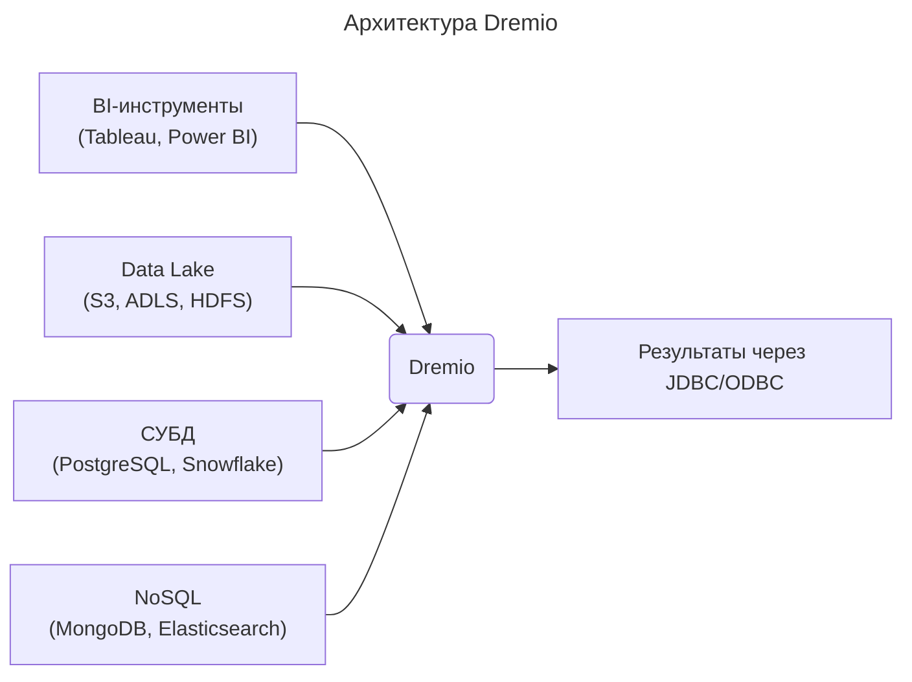

---
aliases:
  - Accelerator
  - Dremio
  - Reflection
  - Reflections
  - Semantic Layer
  - Виртуальный датасет
  - Озеро данных
  - Отражение
  - Семантический слой
---
## Dremio

**Dremio** — это **высокопроизводительная аналитическая платформа с открытым ядром**, предназначенная для **ускорения SQL-запросов к данным в озере ([[data-lake|data lake]])** и другим источникам. Она превращает «сырое» озеро данных в **быструю, SQL-совместимую систему аналитики** без необходимости перемещения или копирования данных.

> 💡 Dremio часто называют **«BI-движком для data lake»**.

---

## 🎯 Основные задачи Dremio

1. **Ускорение запросов** к [[parquet|Parquet]]/ORC/JSON в [[S3|S3]], ADLS, HDFS.
2. **Единый SQL-интерфейс** ко множеству источников (озеро, СУБД, NoSQL).
3. **Самообслуживание для аналитиков** — без участия инженеров.
4. **Виртуализация данных** — данные остаются на месте, Dremio только читает.

---

## 🧩 Как работает Dremio

### Архитектура



### Ключевые компоненты

| Компонент | Назначение |
|----------|------------|
| **Source** | Подключение к данным (S3, СУБД и др.) |
| **Reflection** | Материализованные агрегаты/проекции для ускорения |
| **Accelerator** | Автоматическое создание Reflections |
| **Semantic Layer** | Виртуальные датасеты, бизнес-логика, права |

---

## 🔥 Главные возможности

### Reflections — ускорение без ETL

- Аналог **материализованных представлений**.
- Dremio автоматически создаёт агрегаты или проекции:
  - **Aggregate Reflection**: суммы, средние по измерениям.
  - **Raw Reflection**: подмножество колонок/строк.
- Запросы перенаправляются на Reflection → **в 10–1000x быстрее**.

> 💡 Пример:
> Запрос `SELECT region, SUM(sales) FROM sales GROUP BY region`
> → выполняется за **секунды**, а не часы.

---

### Поддержка open-table formats

- **[[Iceberg|Apache Iceberg]]**, **[[delta-lake|Delta Lake]]**, **[[Hudi|Hudi]]** — нативная поддержка.
- Time travel, schema evolution — всё работает.

---

### Единый каталог

- Все таблицы из разных источников — в одном пространстве имён.
- Можно делать JOIN между S3 и [[PostgreSQL|PostgreSQL]]:

```sql
SELECT s.*, u.name
FROM s3.sales s
JOIN postgresql.users u ON s.user_id = u.id;
```

---

### Самообслуживание

- Аналитик может:
  - Создавать виртуальные датасеты (без SQL).
  - Настраивать бизнес-логику (например, `revenue = price * quantity`).
  - Делиться датасетами с коллегами.

---

### Интеграции

- **BI-инструменты**: [[tableau|Tableau]], Power BI, Looker (через JDBC/ODBC).
- **Источники данных**: 100+ (S3, Azure, GCS, HDFS, RDBMS, NoSQL).
- **Форматы**: Parquet, ORC, JSON, CSV, Excel.

---

## 🆚 Dremio vs другие системы

| Система | Отличие от Dremio |
|--------|-------------------|
| **Presto/Trino** | Только движок, нет ускорения (Reflections), нет самообслуживания |
| **Spark SQL** | Требует кластера, медленнее для интерактивных запросов |
| **Snowflake/Redshift** | Данные нужно **копировать** в их хранилище |
| **Starburst** | Presto-платформа, но без встроенного ускорения как у Dremio |

> 💡 **Dremio — это Presto + материализованные представления + UI для аналитиков**.

---

## 📊 Типичные сценарии использования

1. **Замена ETL-конвейеров** — вместо загрузки данных в DWH читаем напрямую из озера.
2. **Ускорение BI-отчётов** — Reflections делают отчёты мгновенными.
3. **Единая точка доступа** — аналитики не знают, где физически лежат данные.
4. **Анализ свежих данных** — нет задержки на ETL, данные в озере сразу доступны.

---

## ⚠️ Ограничения

- **Только чтение** — нельзя писать данные обратно в источники (кроме S3 через Iceberg).
- **Цена** — Enterprise-версия платная (Community Edition — бесплатно, но с ограничениями).
- **Обучение** — команда должна освоить концепцию Reflections.

---

## 💡 Заключение

> **Dremio — это «магический слой» над data lake**, который:
> - Делает его **быстрым** (как DWH)
> - Делает его **удобным** (как BI-инструмент)
> - **Не требует перемещения данных**

Если у вас есть **озеро данных**, но **BI-запросы медленные** — Dremio может стать решением.
