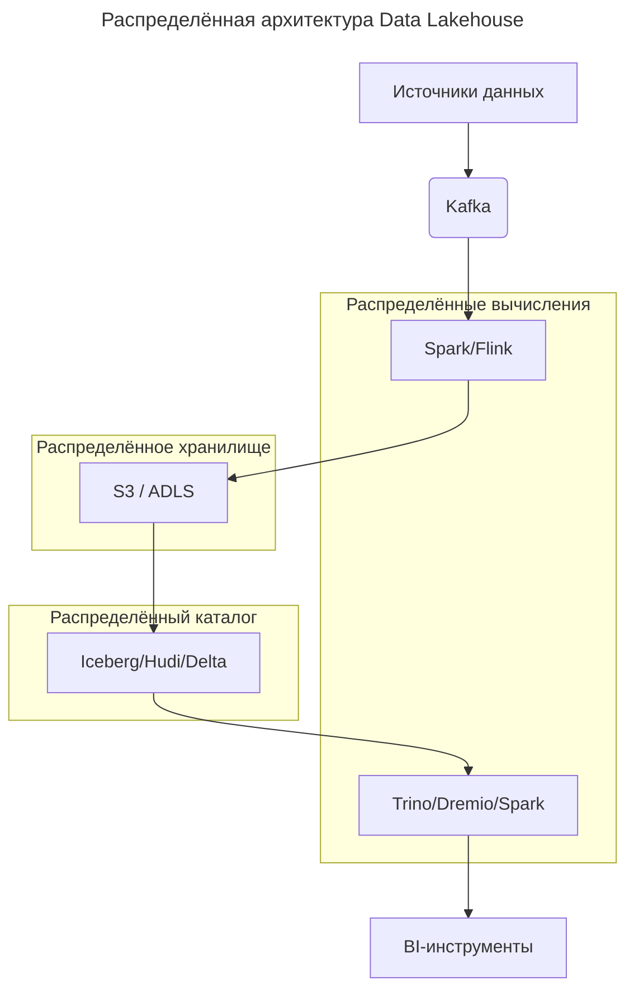

---
aliases:
  - Apache Cassandra
  - Apache Kafka
  - Distributed Data Architectures
  - Google Spanner
  - Hadoop HDFS
  - Sharding
  - распределённая архитектура данных
  - репликация
  - шардирование
---

**Распределённая архитектура данных** — это подход к проектированию систем хранения, обработки и анализа данных, при котором **данные и вычисления распределяются между множеством узлов (серверов)**, работающих совместно как единое целое.

[[data-mesh|Data Mesh]] — частный пример такого подхода.

> Цель: **масштабируемость, отказоустойчивость, производительность и географическая доступность**.

## Зачем она нужна?

### Проблемы монолитных систем

- **Ограниченная масштабируемость**: один сервер = предел CPU/RAM/диска.
- **Единая точка отказа**: падение сервера → недоступность данных.
- **Высокая latency** для пользователей из других регионов.
- **Не справляется с [[big-data|Big Data]]**: терабайты/петабайты не помещаются на один диск.

### Решение — распределённость

- данные **разделены** между узлами → растёт объём и пропускная способность;
- узлы **дублируют** данные → отказоустойчивость;
- вычисления **параллельны** → высокая скорость обработки;
- кластеры можно размещать **в разных регионах** → низкая задержка.

## Ключевые принципы

| Принцип | Описание |
|--------|----------|
| **Шардирование (Sharding)** | Данные делятся по ключу (например, `user_id % 16`) между узлами |
| **Репликация (Replication)** | Каждый фрагмент данных хранится на нескольких узлах (обычно 3) |
| **Согласованность (Consistency)** | Гарантии актуальности данных (strong, eventual, causal) |
| **Отказоустойчивость** | Система продолжает работать при выходе узлов |
| **Горизонтальное масштабирование** | Добавление новых узлов → рост мощности |

## Примеры распределённых систем

### 1. Hadoop HDFS

- **Что**: распределённая файловая система.
- **Как**: файлы делятся на блоки (128 МБ), блоки реплицируются на 3 узла.
- **Зачем**: хранение petabyte-данных для аналитики.

### 2. Apache Cassandra

- **Что**: NoSQL-база данных.
- **Как**: данные шардируются по токену, реплицируются в кластере.
- **Зачем**: высокая доступность, линейное масштабирование, low-latency.

### 3. Apache Kafka

- **Что**: распределённая платформа потоковой передачи событий.
- **Как**: топики делятся на партиции, партиции реплицируются.
- **Зачем**: обработка миллионов событий в секунду.

### 4. Google Spanner

- **Что**: глобально распределённая SQL-база.
- **Как**: данные реплицируются между дата-центрами, используется TrueTime API.
- **Зачем**: strong consistency + глобальная доступность.

### 5. Amazon S3

- **Что**: объектное хранилище.
- **Как**: объекты автоматически реплицируются в регионе (и между регионами).
- **Зачем**: надёжное хранение файлов с 99.999999999% durability.

### 6. Snowflake / BigQuery

- **Что**: cloud-хранилища данных.
- **Как**: вычисления и хранение разделены, масштабируются независимо.
- **Зачем**: мгновенный запуск аналитики без управления инфраструктурой.

## Типичная архитектура Data Lakehouse

Все компоненты — **распределённые**, работают параллельно.

## Вызовы распределённой архитектуры

| Проблема | Решение |
|---------|--------|
| **Сетевые задержки** | Размещение узлов в одном дата-центре |
| **Согласованность vs доступность** | Выбор модели [[CAP-theorem|CAP]] (например, eventual consistency) |
| **Сложность отладки** | Централизованный логгинг, трассировка ([[open-telemetry|OpenTelemetry]]) |
| **Стоимость** | Эффективное управление ресурсами (Kubernetes, autoscaling) |

## Когда использовать?

| Сценарий | Нужна распределённость? |
|---------|--------------------------|
| Приложение с 100 пользователями | Нет |
| [[microservice|Микросервисы]] с shared DB | Возможно |
| [[Big-Data|Big Data]] аналитика (TB+) | Да |
| High-load сервис (10K+ RPS) | Да |
| Глобальное приложение | Да |

## Итог

> **Распределённая архитектура данных — это основа современных high-scale систем.** Она позволяет:
> - хранить **петабайты** данных;
> - обрабатывать **миллионы запросов в секунду**;
> - гарантировать **доступность 99.99%+**;
> - работать **в любом регионе мира**.

Без неё невозможны такие сервисы, как Google, Facebook, Netflix, Amazon.
