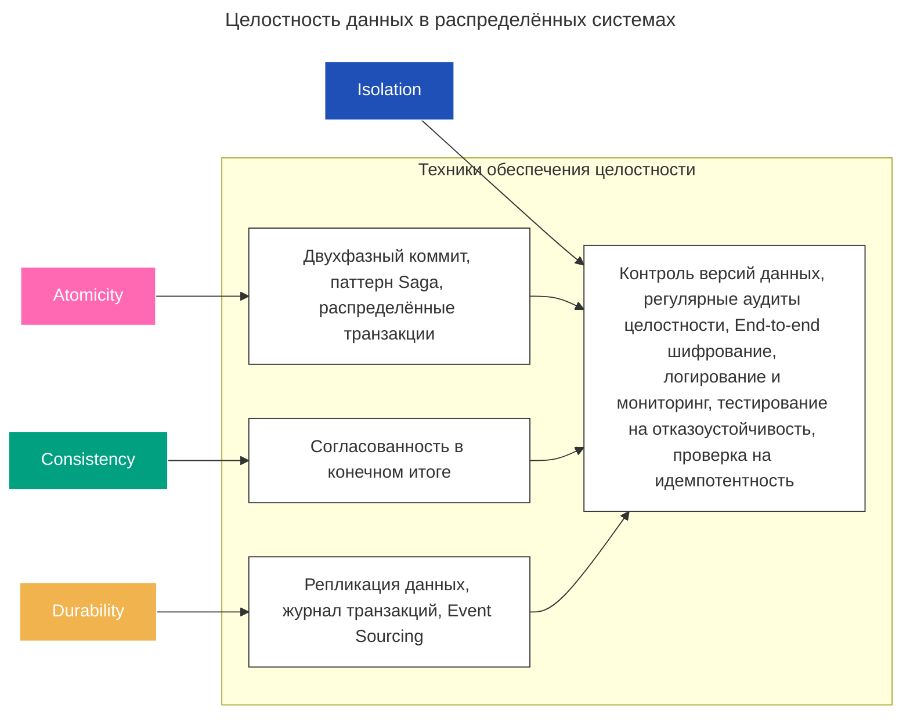
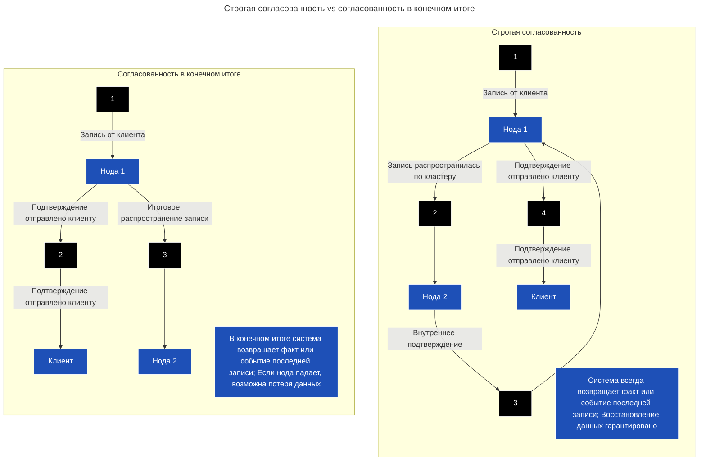

---
aliases:
  - CAP-теорема
  - CQRS
  - Distributed information systems
  - Event Sourcing
  - Eventual Consistency
  - Last write wins
  - LWW
  - saga
  - Strong Consistency
  - two-phase commit
  - двухфазный коммит
  - микросервисы
  - распределенные информационные базы
  - распределенные информационные системы
  - распределённые транзакции
  - согласованность в конечном итоге
  - строгая согласованность
---

## Распределённые информационные системы

### Целостность данных

### CAP-теорема

Главная проблема распределённых информационных систем — [[cap-theorem|CAP theorem]].

При проектировании распределённой информационной системы приходится выбирать компромисс. Главная дилемма состоит в том, что для улучшения доступности системы приходится снижать требования к целостности и надёжности.

В частности, приходится принимать:

- модель **Eventual Consistency** вместо **Strong Consistency**;
- механизмы, допускающие потерю данных:
    - например, LWW (Last Write Wins) как способ разрешения конфликтов.

**Eventual Consistency vs Strong Consistency**

### Распределённые транзакции

Когда операции охватывают несколько сервисов, обеспечение согласованности и целостности данных требует управления распределёнными транзакциями. Распределённые транзакции сложны из-за необходимости поддерживать свойства [[acid-consistency|acid-consistency]] (Atomicity, Consistency, Isolation, Durability) в различных сервисах.

Распределённые транзакции координируют выполнение операций в нескольких сервисах, чтобы гарантировать, что все части транзакции либо зафиксируются, либо откатятся вместе. Для решения этих задач существуют разные подходы.

**Паттерны распределённых транзакций**
- Способы обеспечить атомарность распределённых транзакций:
    - [[saga|Saga]]
    - [[two-phase-commit|Two-phase commit]]
- Способы компенсировать отсутствие атомарности распределённых транзакций:
    - [[event-sourcing|Event sourcing]]
    - [[CQRS|CQRS]]

### Принцип нулевой потери данных

**Принцип нулевой потери данных** предполагает, что данные ни при каких обстоятельствах не должны теряться или повреждаться. В контексте требований [[acid-consistency|acid-consistency]] эту концепцию можно связать с устойчивостью (Durability).
