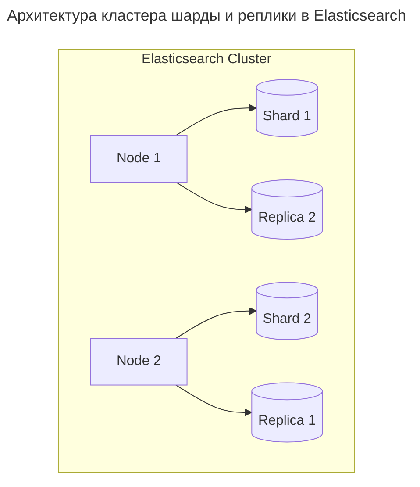

---
aliases:
  - Aggregations
  - Apache Lucene
  - Apache Solr
  - Archive Phase
  - AWS OpenSearch Service
  - ClickHouse
  - Cold Phase
  - Cold Storage
  - Data Stream
  - Data Streams
  - Document
  - Documents
  - Dynamic Mapping
  - EFK
  - Elastic Search
  - Elasticsearch
  - ElasticSearch
  - ELK
  - ES
  - Eventual consistency
  - Fluentd
  - Force Merge
  - Freeze
  - Frozen Archive Phase
  - Full-text search
  - Hot Phase
  - ILM
  - Index
  - Index Lifecycle Management
  - Index Template
  - Inverted Index
  - Kafka
  - Kafka Connect
  - Kibana
  - Logstash
  - Lucene
  - Mapping
  - Meilisearch
  - NLP
  - Node
  - Observability
  - OpenSearch
  - Replica
  - Replicas
  - REST API
  - RESTful API
  - Rollover
  - Search engine
  - Semistructured data
  - Shard
  - Shards
  - Shrink
  - SIEM
  - SLM
  - Snapshot Lifecycle Management
  - Stemming
  - Typesense
  - Warm Phase
  - X-Pack
  - агрегации
  - динамический маппинг
  - документ
  - индекс
  - маппинг
  - наблюдаемость
  - нода
  - обратный индекс
  - поисковый движок
  - полнотекстовый поиск
  - реплика
  - реплики
  - семиструктурированные данные
  - стемминг
  - узел
  - управление жизненным циклом индексов
  - шаблон индекса
  - шард
  - шарды
---

## Elasticsearch: распределённый поисковый движок

**Elasticsearch (ES)** — это распределённая документоориентированная база данных NoSQL с открытым исходным кодом, построенная на поисковой системе [Lucene](https://lucene.apache.org/) и предоставляющая RESTful API. Она позволяет быстро искать и анализировать большие объёмы данных, строить дашборды и хранить логи, метрики, события.

Она является частью **[[ELK|ELK]]/EFK стека**:

- **E**lasticsearch — хранение и поиск;
- **L**ogstash / **F**luentd — сбор и обработка;
- **K**ibana — визуализация.

### Индексация через обратный индекс (inverted index)

Как в книге:

> **"Где упоминается 'Elasticsearch'? → стр. 12, 45, 78"**

В ES:

```text
"login" → документы: 1, 5, 9
"Alice" → документы: 1, 10
"192.168.1.100" → документы: 1, 3
```

→ Поиск по миллионам записей занимает миллисекунды.

### Данные → JSON документы

Каждый объект — **JSON-документ**.

**Пример документа:**

```json
{
  "user": "Alice",
  "action": "login",
  "ip": "192.168.1.100",
  "timestamp": "2025-04-10T10:30:00Z"
}
```

→ Это не строка в таблице — это полноценный документ.

### Распределённость: Shards & Replicas

- Данные разбиваются на **shards** (части).
- Каждый shard может находиться на другом сервере.
- У каждого shard есть **replica** — копия для отказоустойчивости.
  - Если Node 1 упадёт → данные живы на Node 2.



---

### Основные возможности

| Функция | Объяснение |
| -------------------------------- | ---------------------------------------------------------------- |
| **Полнотекстовый поиск** | Поиск `ошибка авторизации` — ES находит все логи с этим текстом |
| **Аналитика в реальном времени** | Агрегации: `GROUP BY`, `SUM`, `AVG` — за секунды |
| **Масштабируемость** | Добавление ноды расширяет кластер автоматически |
| **Schema-free** | Поля можно добавлять без схемы — ES сам определяет тип (dynamic mapping) |
| **REST API** | Все операции через HTTP: `GET`, `POST`, `PUT`, `DELETE` |
| **Поддержка JSON** | Нативное хранение JSON |
| **High Availability** | Реплики + автоматическое восстановление |
| **Токены и анализаторы** | Поддержка русского языка, автокоррекция, stemming |

---

### Пример: запрос к Elasticsearch

**Поиск логина с агрегацией по IP:**

```json
// GET /logs/_search
{
    "query": {
        "match": {
            "message": "authentication failed"
        }
    },
    "aggs": {
        "by_ip": {
            "terms": {
                "field": "ip.keyword",
                "size": 10
            }
        }
    }
}
```

→ Вернёт:

- Все логи со словами `authentication failed`;
- Топ-10 IP-адресов, откуда шли попытки входа.

---

### Какие данные подходят для ES

| ✅ Подходит                                            | ❌ Не подходит                      |
| ----------------------------------------------------- | ---------------------------------- |
| Логи, события                                         | Транзакции (например, бухгалтерия) |
| Полнотекстовый поиск                                  | ACID-транзакции                    |
| Метрики, трейсы                                       | Частые UPDATE одной строки         |
| [[semistructured-data|Семиструктурированные данные]] | Связанные данные (JOIN'ы)          |
| Большие объёмы                                        | Системы, где важна целостность     |
| Time-series (логи)                                    |                                    |

---

### Ограничения

| Минус | Объяснение |
|-------|------------|
| ❌ **Нет JOIN** | Только денормализованные данные |
| ❌ **Не ACID** | Eventual consistency |
| ❌ **UPDATE медленный** | Перестраивает индекс |
| ❌ **Высокое потребление RAM** | Нужен SSD + много памяти |
| ❌ **Сложность управления** | Нужно понимать shards, replicas, refresh interval |

---

### Современные аналоги и замена

| Система | Когда использовать |
| ------------------------------ | ------------------------------------------------------------- |
| **[[open-search|OpenSearch]]** | Форк Elasticsearch после перехода Elastic в закрытую лицензию |
| **ClickHouse** | Для аналитики, если нужно быстрее и дешевле |
| **Meilisearch / Typesense** | Лёгкие альтернативы для поиска |
| **Apache Solr** | На Lucene, но сложнее масштабировать |

---

### Преимущества

| Плюс | Объяснение |
|------|------------|
| ✅ **Очень быстрый поиск** | Даже в терабайтах |
| ✅ **Распределённая** | Горизонтальное масштабирование |
| ✅ **Поддержка NLP** | Анализаторы, синонимы, стемминг |
| ✅ **REST API** | Легко интегрировать |
| ✅ **Kibana** | Мощная визуализация |
| ✅ **Интеграция с Kafka** | Logstash / Kafka Connect |
| ✅ **Автомасштабирование** | В облаке (AWS OpenSearch Service) |

---

**Финальный вывод**

| Elasticsearch — это... | Это не... |
|----------------------|-----------|
| ✅ **Поиск + аналитика в одном движке** | ❌ OLTP-база (как PostgreSQL) |
| ✅ **Инструмент для DevOps, аналитиков, security** | ❌ Главное хранилище денег или заказов |
| ✅ **Масштабируется до petabytes** | ❌ Не подходит для частых UPDATE |
| ✅ **Основа для observability** | ❌ Не делает JOIN между таблицами |

---

## Управление жизненным циклом индексов (ILM)

> **ILM** автоматизирует управление индексами: хранить логи 90 дней, первые 7 дней — на быстрых дисках, далее — на дешёвых. Elasticsearch делает это сам.

| Без ILM | С ILM |
| ----------------------- | ---------------------------- |
| Все данные — одинаковые | Разделены по цене и скорости |
| Ручное управление | Полностью автоматическое |
| Риск переполнения | Предсказуемое поведение |
| Высокая стоимость | Экономия до 60% |

### Индекс в Elasticsearch

**Индекс (index)** — это **логический контейнер**, в котором хранятся связанные документы (JSON), поддерживающие поиск и агрегации.

Простыми словами:

- Индекс = как "таблица" в SQL;
- Документ = как "строка";
- Но **не реляционная база** → нет JOIN'ов.

**Пример документа:**

```json
{
  "user": "Alice",
  "action": "login",
  "ip": "192.168.1.100",
  "timestamp": "2025-04-10T10:30:00Z"
}
```

→ Этот документ попадёт в индекс, например: `logs-2025.04.10`.

### Структура индекса

| Уровень | Описание |
| ------------ | ------------------------------------------------ |
| **Index** | Логическое имя (`logs-2025.04`) |
| **Shard** | Физическая часть индекса (можно на разных нодах) |
| **Replica** | Копия shard'а → отказоустойчивость |
| **Document** | JSON-объект |
| **Mapping** | Схема полей (аналог структуры таблицы) |

### Назначение индексов

| Причина | Объяснение |
| --------------------------- | --------------------------------------------- |
| **Быстрый поиск** | По миллионам документов за <1s |
| **Аналитика** | Aggregations, dashboard, SIEM |
| **Разделение данных** | `logs-*`, `metrics-*`, `audit-*` |
| **Управление сроком жизни** | ILM → старые данные удаляются или переносятся |

---

### Жизненный цикл индекса (Hot → Warm → Cold → Frozen → Delete)


- **Hot Phase**
  - Только что создан.
  - Активная запись и чтение.
  - На SSD, мощные ноды.
  - Высокая доступность.
- **Warm Phase**
  - Нет новых записей.
  - Редкое чтение.
  - Мигрируется на HDD.
  - Уменьшается количество реплик.
- **Cold Phase**
  - Почти не читается.
  - На дешёвых нодах.
  - Ещё можно запросить.
- **Frozen / Archive Phase (Cold Storage)**
  - Очень редкие запросы.
  - Может быть временно загружен.
  - Минимальное потребление RAM/CPU.
- **Delete**
  - Автоматическое удаление через 90 дней.

---

### Пример: ILM Policy

**Создание ILM policy:**

```json
PUT _ilm/policy/logs_policy
{
  "policy": {
    "phases": {
      "hot": {
        "actions": {
          "rollover": {
            "max_size": "50GB",
            "max_age": "7d"
          }
        }
      },
      "warm": {
        "min_age": "7d",
        "actions": {
          "forcemerge": {
            "max_num_segments": 1
          },
          "shrink": {
            "number_of_shards": 1
          }
        }
      },
      "cold": {
        "min_age": "30d",
        "actions": {
          "freeze": {}
        }
      },
      "delete": {
        "min_age": "90d",
        "actions": {
          "delete": {}
        }
      }
    }
  }
}
```

---

### Работа с шаблонами

**Шаг 1 — создайте Index Template:**

```json
PUT _index_template/logs_template
{
  "index_patterns": ["logs-*"],
  "template": {
    "settings": {
      "number_of_shards": 1,
      "number_of_replicas": 1,
      "index.lifecycle.name": "logs_policy"
    }
  }
}
```

**Шаг 2 — создайте первый индекс:**

```bash
PUT logs-000001
```

**Шаг 3 — выполните rollover:**

```bash
POST logs/_rollover
```

→ Если размер > 50 ГБ или возраст > 7 дней → создаётся `logs-000002`.

---

### Преимущества ILM

| Плюс | Объяснение |
| ------------------------------------- | ------------------------------------------- |
| ✅ **Снижение затрат** | Холодные данные → на дешёвые диски |
| ✅ **Автоматизация** | Не нужно руками удалять старые логи |
| ✅ **Производительность** | Горячие индексы — на SSD, холодные — на HDD |
| ✅ **Соответствие политикам хранения** | GDPR, PCI-DSS требуют удаления данных |
| ✅ **Предсказуемость** | Можно рассчитать объём, бюджет |

---

### Ограничения

| Минус | Объяснение |
|-------|------------|
| ❌ Требует управления | Нужно правильно настроить политики |
| ❌ Не все версии поддерживают Frozen Index | Только Enterprise |
| ❌ Сложность при ошибках | Неправильный rollover → потерянные данные |
| ❌ Shrink → только для read-only индексов | После перехода в warm |

---

### Когда использовать ILM

| Сценарий | Да / Нет |
| ---------------------------------- | ------------------------ |
| Логи сервисов | ✅ Да |
| Метрики, трейсы | ✅ Да |
| Бизнес-аналитика | ✅ Да |
| Временные данные (например, debug) | ✅ Через 7 дней — delete |
| Данные, которые нельзя терять | ⚠️ Используйте backup |
| Небольшой объём (<10 GB) | ❌ Можно обойтись без ILM |

---

### Лучшие практики

| Практика | Объяснение |
| ------------------------------ | ------------------------------------------------- |
| ✅ **Используйте data streams** | Для time-series данных (логи, метрики) |
| ✅ **Шаблоны + ILM policy** | Автоматически применяется ко всем новым индексам |
| ✅ **Rollover по size или age** | Чтобы не было слишком больших индексов |
| ✅ **Настраивайте min_age** | Чтобы не перемещать "горячий" индекс слишком рано |
| ✅ **Мониторьте состояние ILM** | `GET _ilm/explain` |
| ✅ **Делайте бэкапы** | Даже если есть replica |

---

### Команды для диагностики

| Команда | Что делает |
|--------|------------|
| `GET _cat/indices?v` | Все индексы и их размер |
| `GET _ilm/explain/logs-*` | Почему индекс не перешёл в WARM |
| `GET _slm/policy` | Status of Snapshot Lifecycle Management |
| `GET _nodes/stats/fs` | Использование дисков |
