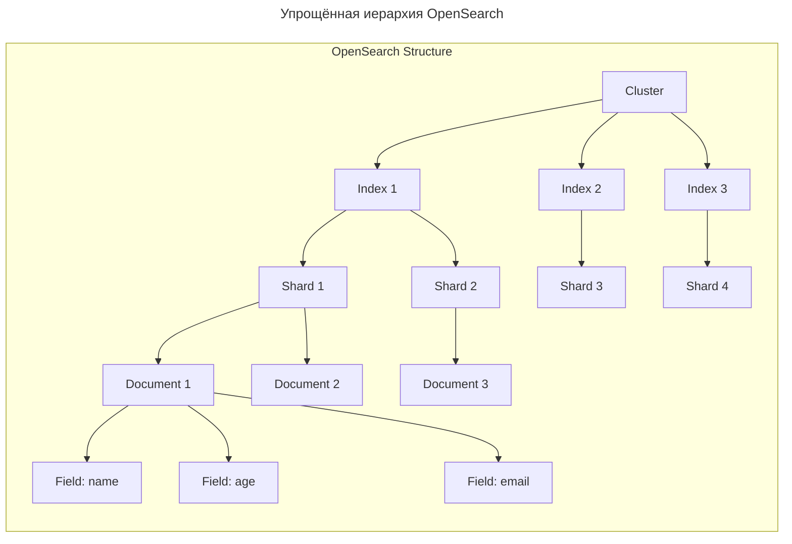
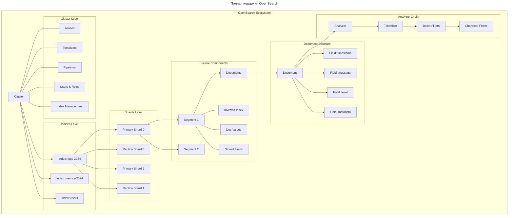
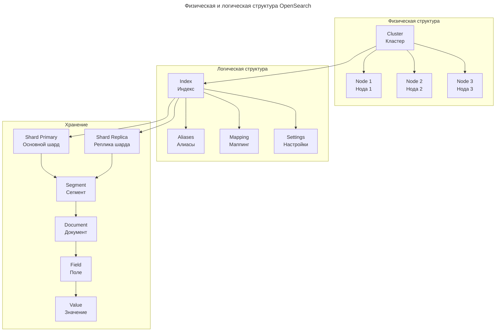
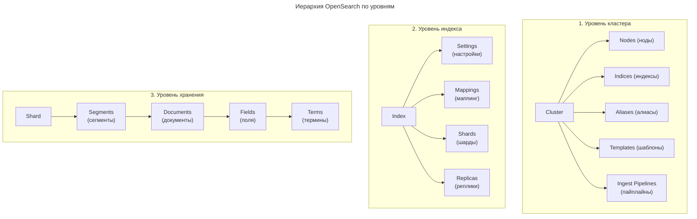

---
aliases:
  - Aggregations
  - Aliases
  - Analyzer
  - Character Filters
  - Cluster
  - Dev Tools
  - Doc Values
  - Document
  - Documents
  - Elastic Search
  - ElasticSearch
  - Field
  - Field Capabilities
  - Fields
  - Index
  - Index Management
  - Index Templates
  - Ingest Pipelines
  - Inverted Index
  - Lucene
  - Mapping
  - Node
  - Nodes
  - OpenSearch
  - Primary Shard
  - Primary Shards
  - Replica
  - Replicas
  - Segment
  - Segments
  - Settings
  - Shard
  - Shards
  - Stored Fields
  - Templates
  - Term
  - Terms
  - Token Filters
  - Tokenizer
  - Wildcard
  - агрегации
  - алиасы
  - анализатор
  - возможности полей
  - документ
  - документы
  - инвертированный индекс
  - индекс
  - инструменты разработчика
  - кластер
  - маппинг
  - настройки
  - нода
  - пайплайны
  - первичные шарды
  - поле
  - поля
  - псевдонимы
  - реплика
  - реплики
  - сегмент
  - сегменты
  - термины
  - токенизатор
  - узел
  - узлы
  - фильтры символов
  - фильтры токенов
  - шард
  - шарды
---
## Иерархия сущностей OpenSearch

Вот иерархия сущностей в OpenSearch в виде схемы Mermaid.

Упрощённая схема (для понимания):



**Более детальная иерархия**



**Визуальная схема с типами данных**



**Иерархия в формате списка**



**Пояснение иерархии**

1. **Cluster** — самый верхний уровень, группа нод
2. **Nodes** — серверы/процессы, работающие в кластере
3. **Indices** — логические контейнеры для данных (как базы данных в SQL)
4. **Shards** — физические части индекса (горизонтальное деление)
5. **Replicas** — копии шардов для отказоустойчивости
6. **Segments** — внутренние Lucene-сегменты для хранения данных
7. **Documents** — единицы данных (как строки в SQL)
8. **Fields** — поля в документах (как колонки в SQL)
9. **Terms** — инвертированные индексные записи

Это полная иерархия, от кластера до отдельных полей документа.

---

## Изучение базы данных

Для изучения структуры базы данных, индексов и документов в OpenSearch лучше всего использовать вкладку **Dev Tools** (Инструменты разработчика) в OpenSearch Dashboards.

Ниже приведен список основных типовых запросов, от общего к частному, которые помогут быстро разобраться в том, что хранится в кластере.

### Общая информация о кластере

Прежде чем смотреть данные, убедитесь, что кластер работает и вы понимаете его базовые параметры.

**Получить базовую информацию о кластере (версия, имя):**

```http
GET /
```

**Проверить состояние кластера (должно быть `green` или `yellow`):**

```http
GET /_cluster/health
```

### Список индексов

Самый полезный инструмент для первичного обзора — это API `_cat`. Он возвращает данные в табличном, удобном для чтения виде.

**Список всех индексов с размером, количеством документов и статусом:**

*(Флаг `?v` добавляет заголовки столбцов, `?h=...` позволяет выбрать конкретные столбцы)*

```bash
GET /_cat/indices?v&s=index
# все индексы на citadel*
GET /_cat/indices/citadel*?v&s=index
```

*На что смотреть:* Имя индекса, статус (`health`), количество документов (`docs.count`) и размер на диске (`store.size`).

**Список всех алиасов (псевдонимов) индексов:**

*(Часто приложения обращаются не к конкретному индексу, а к алиасу, который может объединять несколько индексов)*

```http
GET /_cat/aliases?v
```

**Список только "живых" (открытых) индексов, исключая системные (начинающиеся с точки):**

```http
GET /_cat/indices/*?v&s=index
```

### Структура и типы данных (Mapping)

Это самый важный этап для понимания структуры документов. Маппинг описывает, какие поля есть в документе и какого они типа (`text`, `keyword`, `integer`, `date`, `object` и т.д.).

**Получить полную схему (маппинг) конкретного индекса:**

*(Замените `<index_name>` на реальное имя, например `logs-*` или `users`)*

```http
GET /<index_name>/_mapping
```

**Получить маппинг сразу нескольких индексов или всех индексов по маске:**

```http
GET /*/_mapping
```

*Совет:* Если ответ слишком огромный, лучше смотреть маппинг конкретного индекса.

**Узнать тип конкретного поля (если вы знаете его название):**

```http
GET /<index_name>/_mapping/field/<field_name>
```

**Получить список всех полей, которые реально встречаются в документах индекса (Field Capabilities):**

*(Очень полезно, если маппинг динамический и в разных документах разные поля)*

```http
GET /<index_name>/_field_caps?fields=*
```

### Изучение документов

Чтобы понять структуру, иногда лучше просто посмотреть на пару реальных документов.

**Получить 2 случайных документа из индекса (чтобы не засорять экран):**

```http
GET /<index_name>/_search
{
  "size": 2
}
```

**Получить документы, отсортированные по дате (например, самые свежие):**

*(Предполагается, что поле даты называется `@timestamp` или `created_at`)*

```http
GET /<index_name>/_search
{
  "size": 3,
  "sort": [
    { "@timestamp": { "order": "desc" } }
  ]
}
```

**Посмотреть уникальные значения конкретного поля (агрегация):**

*(Полезно для полей типа `keyword`, чтобы понять, какие статусы, категории или типы там бывают)*

```http
GET /<index_name>/_search
{
  "size": 0,
  "aggs": {
    "unique_statuses": {
      "terms": {
        "field": "status.keyword",
        "size": 10
      }
    }
  }
}
```

*Важно:* Если поле имеет тип `text`, для агрегации нужно использовать его подполе `.keyword` (если оно настроено в маппинге).

### Настройки индекса (Settings)

Иногда нужно понять, как индекс настроен (количество шардов, анализаторы текста).

**Получить настройки конкретного индекса:**

```http
GET /<index_name>/_settings
```

**Получить и настройки, и маппинг одновременно:**

```http
GET /<index_name>
```

---

**Полезные советы при изучении**

1. **Используйте подстановочные знаки (wildcards):** Если вы не знаете точное имя индекса, используйте `*`. Например: `GET /logs-2023*/_mapping`.
2. **Обращайте внимание на типы `text` vs `keyword`:**
   - `text` используется для полнотекстового поиска (разбивается на токены/слова).
   - `keyword` используется для точного совпадения, фильтрации, сортировки и агрегаций (хранится как есть).
3. **Вложенные объекты:** Если вы видите в маппинге тип `nested` или `object`, помните, что запросы к таким полям требуют специального синтаксиса (`nested` query).
4. **Все запросы выше — только на чтение (Read-Only).** Они безопасны и не изменят ваши данные.

---

## Заголовки индексов

- `health`
- `status`
- `index`
- `uuid`
- `pri`
- `rep`
- `docs.count`
- `docs.deleted`
- `store.size`
- `pri.store.size`

Эти заголовки возвращаются командой `GET /_cat/indices` и дают полную картину состояния, структуры и размера каждого индекса в вашем кластере OpenSearch.

Вот подробная расшифровка каждого столбца.

### health

Показывает текущее состояние доступности индекса. Может принимать три значения:

- **`green`** — Всё отлично. Все первичные (primary) и все репликовые (replica) шарды активны и работают.
- **`yellow`** — Все первичные шарды работают, но **часть или все реплики недоступны**. Данные доступны для чтения и записи, но нет отказоустойчивости (если упадет нода с первичным шардом, данные могут стать недоступны).
- **`red`** — **Часть первичных шардов отсутствует**. Индекс работает не полностью, часть данных недоступна для поиска или записи. Требует немедленного вмешательства.

### status

Показывает, активен ли индекс для операций.

- **`open`** — Индекс открыт. Можно выполнять поиск, читать и писать данные.
- **`close`** — Индекс закрыт. Данные хранятся на диске, но операции чтения/записи недоступны. Закрытие старых индексов (например, архивных) экономит оперативную память кластера.

### index

Название индекса (например, `bti_users`, `logs-2023.10.24`). Именно это имя вы используете в URL при выполнении запросов (`GET /<index_name>/_search`).

### uuid

Внутренний системный идентификатор (UUID) индекса в кластере. Используется самим OpenSearch для служебных целей, при написании запросов он вам не нужен.

### pri

Количество **первичных (основных) шардов**, на которые разделен индекс.

- Первичные шарды содержат оригинальные данные.
- Если индекс маленький, `pri` обычно равен 1. Для больших индексов (миллионы документов) ставят 3, 5 или больше, чтобы распараллелить запись и поиск.

### rep

Количество **реплик для каждого первичного шарда**.

- Реплики — это полные копии первичных шардов.
- Они нужны для двух вещей: **отказоустойчивости** (если нода с первичным шардом упадет, реплика станет первичной) и **масштабирования чтения** (поисковые запросы распределяются между первичными шардами и их репликами).
- *Пример:* Если `pri = 2` и `rep = 1`, то всего в кластере создано 4 физических шарда (2 первичных + 2 реплики).

### docs.count

Общее (логическое) количество документов в индексе.

- *Важный нюанс:* В OpenSearch документы не удаляются и не обновляются мгновенно. При обновлении старый документ помечается как удаленный, а новый записывается рядом. Поэтому `docs.count` может временно показывать чуть больше документов, чем реальных бизнес-сущностей, до момента фоновой очистки (merge).

### docs.deleted

Количество документов, которые были помечены как удаленные (или устаревшие при обновлении), но **физически еще не стерты с диска**.

- OpenSearch использует механизм "soft delete". Физическое удаление происходит только во время фонового процесса слияния сегментов (segment merge). Если число здесь очень большое, это может замедлять поиск и занимать лишнее место на диске.

### store.size

Суммарный размер индекса на диске в удобочитаемом формате (kb, mb, gb, tb).

- Включает в себя **все шарды** (и первичные, и репликовые). То есть показывает, сколько физически места этот индекс занимает во всем кластере.

### pri.store.size

Размер на диске, занимаемый **только первичными шардами**.

- Это "чистый" объем ваших данных без учета реплик.
- Этот показатель наиболее точно отражает реальный объем информации, который вы загрузили в индекс.

---

**На что обратить внимание при анализе**

1. **Разница между `store.size` и `pri.store.size`**: Если у вас `rep = 1`, то `store.size` должен быть ровно в 2 раза больше `pri.store.size`. Если он сильно отличается, возможно, реплики "рассинхронизировались" или в кластере есть проблемы.
2. **Большое значение в `docs.deleted`**: Если вы массово обновляли или удаляли данные, и `docs.deleted` составляет значительный процент от `docs.count`, поиск может работать медленнее. Обычно OpenSearch сам справляется с этим (процесс force merge), но в редких случаях это требует ручного вмешательства.
3. **Статус `yellow`**: Самая частая причина — в кластере меньше нод, чем требуется для размещения реплик. Например, у вас 1 нода (сервер), а в индексе настроено `rep = 1`. OpenSearch не может разместить реплику на той же ноде, где лежит первичный шард (иначе теряется смысл отказоустойчивости), поэтому статус будет `yellow`. Решение: либо добавить ноды, либо временно выставить `rep = 0`.

---

## Первичные шарды

**Primary shards (первичные шарды)** — это основные физические разделы индекса, в которых хранятся оригинальные данные.

**Ключевые факты**

1. **Запись**: Все операции записи (добавление, обновление, удаление документов) всегда выполняются сначала в первичном шарде.
2. **Неизменяемость**: Их количество задается *строго при создании индекса* и не может быть изменено в дальнейшем (без полного пересоздания индекса).
3. **Распределение**: Они автоматически распределяются по разным узлам (нодам) кластера, что обеспечивает горизонтальное масштабирование и параллельную обработку запросов.

*Простая аналогия*: Если индекс — это большая книга, то первичные шарды — это её оригинальные главы, разложенные по разным столам (серверам) для удобства и скорости работы. Реплики (replicas) — это просто их полные копии для надежности.
