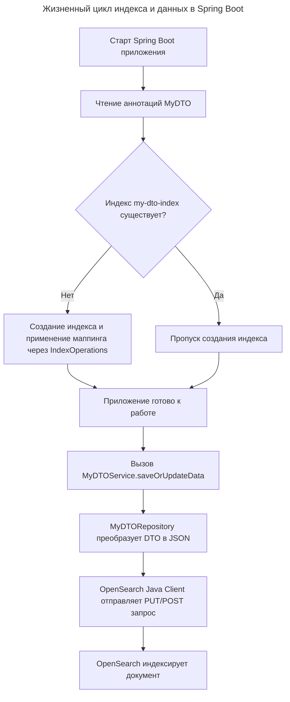

---
aliases:
  - "@Document"
  - "@Field"
  - "@Id"
  - Aliases
  - Controller
  - CRUD
  - CrudRepository
  - DTO
  - Entity
  - FieldType
  - Index
  - IndexOperations
  - liquibase-opensearch
  - Mapping
  - MyDTO
  - OpenSearch
  - OpenSearchClient
  - OpenSearchRepository
  - Reindex
  - Repository
  - REST API
  - Service
  - Spring Boot 3
  - Spring Data OpenSearch
  - spring-data-opensearch-starter
  - алиасы
  - индекс
  - контроллер
  - маппинг
  - переиндексация
  - репозиторий
  - сервис
  - сущность
---

## Интеграция Spring Boot 3 и OpenSearch для управления DTO

### Определение модели данных и аннотаций OpenSearch

Для привязки Java-класса к индексу OpenSearch используются аннотации из библиотеки Spring Data OpenSearch. Класс `MyDTO` помечается аннотацией `@Document`, а поля настраиваются с помощью `@Field` для явного указания типов маппинга.

Описание сущности MyDTO с маппингом полей

```java
import org.springframework.data.annotation.Id;
import org.springframework.data.elasticsearch.annotations.Document;
import org.springframework.data.elasticsearch.annotations.Field;
import org.springframework.data.elasticsearch.annotations.FieldType;

@Document(indexName = "my-dto-index")
public class MyDTO {
  @Id
  private String id;

  @Field(type = FieldType.Text, analyzer = "standard")
  private String description;

  @Field(type = FieldType.Keyword)
  private String status;

  // Геттеры и сеттеры опущены для краткости
}
```

### Настройка подключения в конфигурации Spring Boot

В файле `application.yml` указываются параметры подключения к кластеру OpenSearch. Spring Boot 3 автоматически настроит пул соединений и клиент на основе этих свойств.

Конфигурация подключения к OpenSearch

```yaml
spring:
  data:
    opensearch:
      uris: http://localhost:9200
      username: admin
      password: admin
      connection-timeout: 5s
```

### Создание репозитория для операций с данными

Для выполнения CRUD-операций создается интерфейс, наследующий `OpenSearchRepository`. Spring автоматически сгенерирует реализацию этого интерфейса во время старта приложения.

Интерфейс репозитория для MyDTO

```java
import org.springframework.data.opensearch.repository.OpenSearchRepository;
import java.util.List;

public interface MyDTORepository extends OpenSearchRepository<MyDTO, String> {
  List<MyDTO> findByStatus(String status);
}
```

### Инициализация индекса и сохранение документов

Создание индекса в OpenSearch может происходить автоматически при старте приложения или явно через `IndexOperations`. Сохранение и обновление данных осуществляется через методы репозитория.

Сервис для создания индекса и управления данными

```java
import org.springframework.data.opensearch.core.IndexOperations;
import org.springframework.data.opensearch.core.mapping.OpenSearchMappingContext;
import org.springframework.stereotype.Service;

@Service
public class MyDTOService {
  private final MyDTORepository repository;
  private final IndexOperations indexOps;

  public MyDTOService(MyDTORepository repository,
                      OpenSearchMappingContext mappingContext) {
    this.repository = repository;
    this.indexOps = mappingContext.indexOps(MyDTO.class);
  }

  public void initializeIndex() {
    if (!indexOps.exists()) {
      indexOps.create();
      indexOps.putMapping(indexOps.createMapping(MyDTO.class));
    }
  }

  public MyDTO saveOrUpdateData(MyDTO dto) {
    return repository.save(dto);
  }
}
```

### Архитектура взаимодействия компонентов

Процесс инициализации и изменения данных проходит через несколько слоев Spring Data, которые абстрагируют прямую работу с REST API OpenSearch.

Схема жизненного цикла индекса и документа



---

### План: индекс OpenSearch + Spring Boot 3

#### Шаг 1. Зависимости

В `pom.xml`:

```xml
<dependency>
    <groupId>org.opensearch.client</groupId>
    <artifactId>spring-data-opensearch-starter</artifactId>
    <version>1.6.0</version>
</dependency>
```

> Spring Boot 3 + JDK 17 поддерживаются. Стартер тянет `spring-data-opensearch` и `opensearch-java` клиент.

---

#### Шаг 2. Конфигурация подключения

`application.yml`:

```yaml
opensearch:
  uris: http://localhost:9200
  username: admin
  password: admin
```

Spring Boot автонастроит `OpenSearchClient` через стартер.

---

#### Шаг 3. Описание MyDTO

```java
@Document(indexName = "my_dto_index")
public class MyDTO {

    @Id
    private String id;

    @Field(type = FieldType.Text, name = "title")
    private String title;

    @Field(type = FieldType.Keyword, name = "category")
    private String category;

    @Field(type = FieldType.Integer, name = "priority")
    private Integer priority;

    @Field(type = FieldType.Date, name = "created_at")
    private Instant createdAt;

    // getters / setters
}
```

---

#### Шаг 4. Создание индекса при старте приложения

Spring Data OpenSearch **не создаёт индекс и mapping автоматически**. Делаем это вручную через `OpenSearchClient` при запуске:

```java
@Component
public class IndexInitializer {

    private final OpenSearchClient client;

    public IndexInitializer(OpenSearchClient client) {
        this.client = client;
    }

    @PostConstruct
    public void createIndexIfAbsent() throws IOException {
        String indexName = "my_dto_index";

        if (!client.indices().exists(b -> b.index(indexName)).value()) {
            client.indices().create(c -> c
                .index(indexName)
                .mappings(m -> m
                    .properties("title", p -> p.text(t -> t))
                    .properties("category", p -> p.keyword(k -> k))
                    .properties("priority", p -> p.integer(i -> i))
                    .properties("created_at", p -> p.date(d -> d))
                )
            );
        }
    }
}
```

> **Альтернатива**: вынести создание индекса в `liquibase-opensearch` changeLog, если хотите версионировать схему.

---

#### Шаг 5. Repository для CRUD-операций

```java
public interface MyDtoRepository extends CrudRepository<MyDTO, String> {
    List<MyDTO> findByCategory(String category);
    List<MyDTO> findByPriorityGreaterThan(Integer min);
}
```

---

#### Шаг 6. Сервис для изменения данных

```java
@Service
public class MyDtoService {

    private final MyDtoRepository repository;

    public MyDtoService(MyDtoRepository repository) {
        this.repository = repository;
    }

    public MyDTO save(MyDTO dto) {
        if (dto.getCreatedAt() == null) {
            dto.setCreatedAt(Instant.now());
        }
        return repository.save(dto);
    }

    public Optional<MyDTO> findById(String id) {
        return repository.findById(id);
    }

    public void deleteById(String id) {
        repository.deleteById(id);
    }

    public List<MyDTO> findByCategory(String category) {
        return repository.findByCategory(category);
    }
}
```

---

#### Шаг 7. REST-контроллер

```java
@RestController
@RequestMapping("/api/dto")
public class MyDtoController {

    private final MyDtoService service;

    public MyDtoController(MyDtoService service) {
        this.service = service;
    }

    @PostMapping
    public MyDTO create(@RequestBody MyDTO dto) {
        return service.save(dto);
    }

    @GetMapping("/{id}")
    public MyDTO get(@PathVariable String id) {
        return service.findById(id)
            .orElseThrow(() -> new ResponseStatusException(HttpStatus.NOT_FOUND));
    }

    @DeleteMapping("/{id}")
    public void delete(@PathVariable String id) {
        service.deleteById(id);
    }

    @GetMapping(params = "category")
    public List<MyDTO> byCategory(@RequestParam String category) {
        return service.findByCategory(category);
    }
}
```

---

#### Итоговая схема работы

| Слой | Компонент | Ответственность |
|------|-----------|-----------------|
| Схема индекса | `IndexInitializer` | Создаёт индекс + mapping при старте |
| Маппинг объектов | `MyDTO` + `@Field` | Связь полей Java ↔ полей OpenSearch |
| Доступ к данным | `MyDtoRepository` | CRUD + производные запросы |
| Бизнес-логика | `MyDtoService` | Валидация, заполнение полей |
| API | `MyDtoController` | HTTP-эндпоинты |

#### Что важно помнить

- **Mapping и аннотации нужно держать синхронизированными вручную.** `@Field(type = Text)` в Java и `properties("title", text)` в `IndexInitializer` описывают одно и то же — рассмотрите генерацию mapping из аннотаций, чтобы избежать расхождений.
- **Изменить тип поля после создания индекса нельзя.** При изменении `MyDTO` потребуется создать новый индекс и переиндексировать данные.
- Для production стоит использовать **aliases**: приложение пишет в `my_dto_index_v1`, а читает через alias `my_dto_index` — так можно бесшовно переключать версии схемы.
