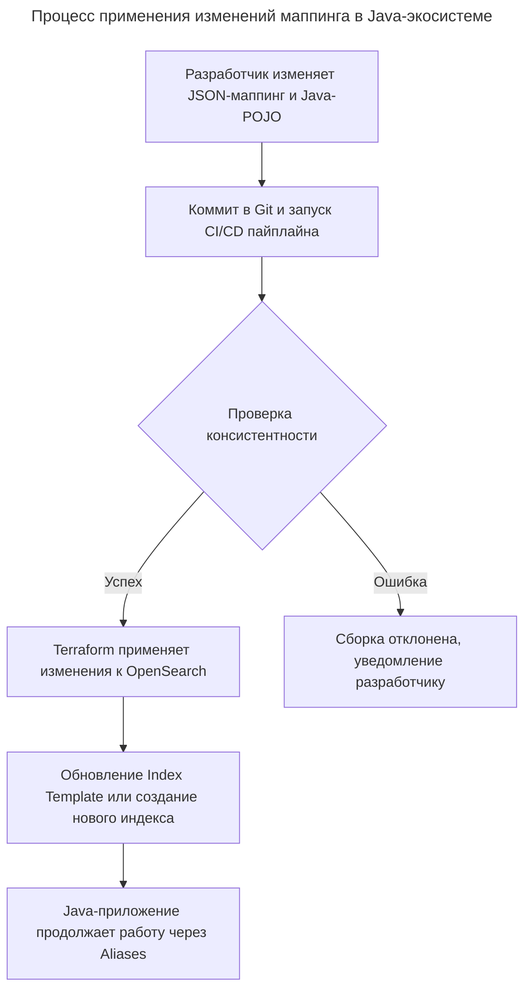

---
aliases:
  - "@Document"
  - "@Field"
  - "@FullTextField"
  - "@Id"
  - "@Indexed"
  - "@KeywordField"
  - "@Setting"
  - Aliases
  - CD
  - ChangeLog
  - CI
  - Code-First
  - CrudRepository
  - Flyway
  - Hibernate
  - Hibernate Search
  - IaC
  - Index Templates
  - Jackson
  - Java Client
  - JPA
  - Liquibase
  - liquibase-opensearch
  - Mapping
  - Migration
  - ODM
  - OpenSearch
  - OpenSearch Java Client
  - OpenSearchClient
  - ORM
  - POJO
  - Quarkus
  - Reindex
  - Repository
  - RestHighLevelClient
  - Schema-First
  - Spring Boot
  - Spring Data
  - Spring Data Elasticsearch
  - Spring Data OpenSearch
  - Terraform
  - алиасы
  - инфраструктура как код
  - маппинг
  - миграции
  - объектно-документный маппинг
  - переиндексация
  - шаблон индекса
---

## Синхронизация структуры Java-объектов и маппингов OpenSearch

В отличие от реляционных баз данных, где схема является строгим источником истины, в поисковых движках структура часто эволюционирует вместе с данными. Для управления консистентностью между Java-классами и маппингами OpenSearch используются два основных подхода.

Подход "Code-First" (Код как источник истины) предполагает генерацию маппинга на основе аннотаций в Java-классах. Это удобно для быстрой разработки, но ограничивает возможности тонкой настройки поисковых параметров (анализаторов, весов полей, настроек шардов).

Подход "Schema-First" (Схема как источник истины) предполагает хранение JSON-маппингов в отдельных файлах. Java-объекты маппятся на эти JSON-структуры с помощью библиотек сериализации (например, Jackson). Консистентность в этом случае обеспечивается за счет интеграционных тестов в CI/CD, которые проверяют, что сгенерированный из Java-объекта JSON строго соответствует эталонному файлу маппинга.

## Библиотеки объектно-документного маппинга

Прямых аналогов классических ORM (таких как Hibernate или JPA) для OpenSearch не существует, так как поисковые индексы не поддерживают строгие связи и транзакционность. Вместо них используются библиотеки объектно-документного маппинга (ODM) или клиентские обертки.

Основным стандартом в Java-экосистеме является Spring Data OpenSearch. Эта библиотека позволяет аннотировать Java-классы и автоматически преобразовывать их в документы OpenSearch.

Определение сущности с помощью Spring Data OpenSearch

```java
@Document(indexName = "products")
@Setting(shards = 1, replicas = 1)
public class Product {
  @Id
  private String id;

  @Field(type = FieldType.Text, analyzer = "russian")
  private String name;

  @Field(type = FieldType.Keyword)
  private String category;
}
```

Для проектов без Spring используется официальный OpenSearch Java Client. Он работает на более низком уровне абстракции и использует Jackson для преобразования POJO в JSON, требуя явного описания маппингов в виде JSON-файлов или программных построителей (builders).

## Инструменты миграции и версионирования схемы

Универсального и широко принятого аналога Liquibase или Flyway, специально созданного для OpenSearch и отслеживающего состояние миграций в служебной таблице, в Java-экосистеме не существует. Это связано с тем, что OpenSearch сам по себе не предназначен для хранения служебных метаданных миграций.

Для решения этой задачи применяются следующие альтернативы.

Инфраструктура как код (IaC) с использованием Terraform. Это наиболее рекомендуемый подход для продакшена. Маппинги хранятся в Git, а Terraform-провайдер для OpenSearch применяет изменения, отслеживая состояние в файле `terraform.tfstate`.

Описание индекса и маппинга через Terraform

```hcl
resource "opensearch_index" "products" {
  name               = "products"
  number_of_shards   = 1
  number_of_replicas = 1

  index_mapping = file("src/main/resources/mappings/products.json")
}
```

Написание собственного раннера миграций. Разработчики создают утилиту на Java, которая при старте приложения или в рамках CI/CD пайплайна читает JSON-файлы маппингов из ресурсов (classpath), сравнивает их с текущим состоянием индекса через OpenSearch API и применяет изменения (создает новые индексы, использует Reindex и Aliases).

Использование встроенных Index Templates. Вместо управления миграциями на стороне приложения, логика эволюции схемы закладывается в сам OpenSearch. Шаблоны индексов позволяют задать правила автоматического создания индексов и их маппингов при поступлении новых данных, что снижает необходимость в ручных миграциях.

## Архитектура управления схемой в Java-проекте

На практике зрелые Java-проекты комбинируют инструменты для обеспечения полной консистентности и автоматизации развертывания изменений схемы.

Схема взаимодействия компонентов при изменении маппинга



Такой подход разделяет ответственность: Java-код отвечает за бизнес-логику и сериализацию, а инструменты IaC (Terraform) или специализированные скрипты отвечают за физическое создание и версионирование структуры индексов в OpenSearch.

---

## Механизмы управления консистентностью Java ↔ OpenSearch

Прямого аналога классической ORM (как Hibernate для реляционных БД) для OpenSearch нет — потому что OpenSearch это поисковый движок, а не реляционная БД. Но есть несколько уровней инструментов, которые закрывают разные части задачи.

### 1. Маппинг объектов ↔ документы: Spring Data OpenSearch

Самый распространённый подход в Java-мире. Это официальный проект из экосистемы OpenSearch, построенный поверх Spring Data Elasticsearch.

```java
@Document(indexName = "book")
public class Book {
    @Id
    private String id;

    @Field(type = FieldType.Text)
    private String title;

    @Field(type = FieldType.Integer)
    private Integer pages;

    @Field(type = FieldType.Double)
    private Double price;
}

public interface BookRepository extends CrudRepository<Book, String> {
    List<Book> findByAuthorName(String authorName);
}
```

**Что даёт:**
- Маппинг POJO ↔ документы OpenSearch через аннотации `@Document`, `@Field`, `@Id`.
- Repository-интерфейсы с автогенерацией запросов (как в Spring Data JPA).
- Поддержка `OpenSearchClient` (новый клиент) и `RestHighLevelClient` (legacy).
- Spring Boot Starter для автоконфигурации: `spring-data-opensearch-starter`.

**Чего НЕ даёт:**
- Автоматического создания/обновления mapping в OpenSearch по аннотациям. Mapping индекса нужно создавать отдельно или использовать другие инструменты (см. ниже).

---

### 2. Hibernate Search — ORM + авт индексация

Hibernate Search — это расширение Hibernate ORM, которое автоматически индексирует JPA-сущности в OpenSearch (или Elasticsearch, или Lucene). С версии 6.1 поддерживает OpenSearch.

```java
@Indexed
@Entity
@Table(name = "plant")
public class Plant {
    @Id
    private Long id;

    @FullTextField
    private String name;

    @FullTextField
    private String scientificName;
}
```

**Что даёт:**
- **Автоматическая синхронизация**: при сохранении сущности в БД через Hibernate ORM документ автоматически обновляется в OpenSearch.
- **Автоматическое создание mapping**: Hibernate Search генерирует mapping индекса на основе аннотаций `@FullTextField`, `@KeywordField` и т. д.
- **Можно задавать кастомный mapping через JSON-файлы**, которые Hibernate Search мержит с автоматически сгенерированными.
- Интеграция с Quarkus.

**Подход идеален, когда:**
- У вас есть реляционная БД как источник истины, а OpenSearch — только для поиска.
- Нужна автоматическая индексация при изменениях в БД.
- Хочется декларативно описать и схему БД, и схему индекса в одном месте.

---

### 3. Liquibase для OpenSearch — миграции схемы

Существует расширение [liquibase-opensearch](https://github.com/liquibase/liquibase-opensearch) — это community-расширение Liquibase для управления миграциями индексов и mapping'ов OpenSearch.

**Что даёт:**
- ChangeLog-файлы (YAML/JSON) с историей изменений схемы OpenSearch.
- Один change type — `httpRequest`: выполняет произвольный HTTP-запрос к OpenSearch (создание индекса, обновление mapping, добавление шаблонов и т. д.).
- Запуск через CLI или как Java-библиотека.

Пример:
```yaml
databaseChangeLog:
  - changeSet:
      id: create-books-index
      author: dev
      changes:
        - httpRequest:
            method: PUT
            path: /books
            body: >
              {
                "mappings": {
                  "properties": {
                    "title": { "type": "text" },
                    "price": { "type": "float" }
                  }
                }
              }
```

**Ограничения:**
- Поддерживается только `httpRequest` — нет специализированных change types вроде «create index» или «add field» с валидацией.
- Это community-расширение, не часть ядра Liquibase.
- Совместимо с OpenSearch 2.x и 3.x.

---

### Сводка подходов

| Задача | Инструмент | Как работает |
|--------|-----------|--------------|
| Маппинг Java ↔ документы | **Spring Data OpenSearch** | Аннотации `@Document`, `@Field`; репозитории |
| Автоиндексация из БД + авто-mapping | **Hibernate Search** | JPA-сущности + `@Indexed`, `@FullTextField` |
| Версионирование миграций схемы | **liquibase-opensearch** | ChangeLog с `httpRequest` к API OpenSearch |
| Ручное управление mapping | **OpenSearch Java Client** | Прямые вызовы `createIndex`, `putMapping` |

---

### Практические рекомендации

1. **Если источник данных — реляционная БД**, берите **Hibernate Search**: получите и маппинг, и автоматическую индексацию, и генерацию mapping индекса.
2. **Если OpenSearch — единственное хранилище**, используйте **Spring Data OpenSearch** для маппинга объектов, а создание/миграцию mapping'ов выносите в **liquibase-opensearch** или скрипты запуска приложения.
3. **Для контроля версий схемы** стоит комбинировать: liquibase-opensearch для миграций (создание индексов, обновление mapping, aliases) + Spring Data OpenSearch для работы с документами на уровне приложения.
4. **Учитывайте ограничение OpenSearch**: типы полей нельзя изменить после создания индекса. Изменение mapping = создание нового индекса + reindex. Это не миграция в привычном Liquibase-смысле, а скорее версионирование индексов через aliases.
