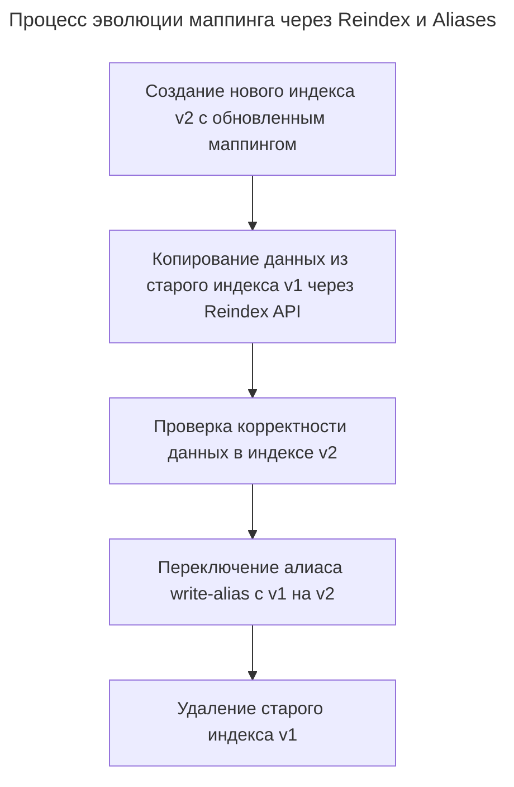

---
aliases:
  - Aliases
  - Analyzer
  - Document
  - Dynamic mapping
  - Dynamic templates
  - Explicit mapping
  - Field
  - Field type
  - Index
  - Index Template
  - Index Templates
  - JSON
  - keyword
  - Mapping
  - Mapping types
  - Nested
  - Object
  - Reindex
  - Reindex API
  - text
  - алиасы
  - анализатор
  - вложенные поля
  - динамические шаблоны
  - динамический маппинг
  - документ
  - индекс
  - маппинг
  - объектные поля
  - переиндексация
  - разрастание маппинга
  - тип поля
  - типы документов
  - шаблон индекса
  - шаблоны индексов
  - явный маппинг
---

## Маппинг в OpenSearch

**Маппинг (mapping)** — это схема документа: она описывает, какие поля есть в индексе и какого они типа, чтобы OpenSearch знал, как индексировать и искать данные.

## Зачем нужен mapping

- **Определяет типы данных.** Например, поле `price` как `float`, а не как текст — чтобы можно было делать агрегации и сравнения.
- **Влияет на поиск.** Для текстовых полей mapping задаёт анализаторы (токенизацию, стемминг и т. п.) — от этого зависит, по каким словам будет находиться документ.
- **Экономит место и ускоряет запросы.** Чёткие типы и настройки (например, `keyword` вместо `text` для точных совпадений) делают индекс эффективнее.
- **Предотвращает ошибки.** Если в документ приходит поле не того типа, OpenSearch может отклонить его или обработать предсказуемо.

---

## Основные понятия

- **Field type** — тип поля: `text` (для полнотекстового поиска), `keyword` (для точных совпадений и агрегаций), `date`, `integer`, `float`, `boolean`, `geo_point` и др.
- **Analyzer** — как обрабатывается текст: разбивается на токены, приводятся к нижнему регистру, удаляются стоп‑слова и т. д. У `text` обычно есть analyzer, у `keyword` — нет.
- **Dynamic mapping** — автоматическое создание полей, если документ содержит новые поля. Удобно, но иногда лучше явно задать mapping, чтобы контролировать типы.
- **Explicit mapping** — ручное описание схемы при создании индекса. Это даёт предсказуемость и контроль.

---

## Простой пример mapping (JSON)

```json
PUT /products
{
  "mappings": {
    "properties": {
      "title": { "type": "text", "analyzer": "standard" },
      "brand": { "type": "keyword" },
      "price": { "type": "float" },
      "in_stock": { "type": "boolean" },
      "created_at": { "type": "date" }
    }
  }
}
```

Здесь:

- `title` — для поиска по словам;
- `brand` — для фильтров и группировок (точно, без анализа);
- `price`, `in_stock`, `created_at` — для сортировок, диапазонов и агрегаций.

---

## Важные нюансы

- **Типы нельзя менять после создания индекса.** Если нужно поменять тип поля, обычно создают новый индекс с правильным mapping и переиндексируют данные.
- **Поля с одинаковым именем, но разными типами в разных индексах — нормально.** Но внутри одного индекса тип должен быть единым.
- **Можно задавать динамические шаблоны (dynamic templates)**, чтобы автоматически применять нужные типы и анализаторы к группам полей по имени или паттерну.

## Архитектура и эволюция маппингов в OpenSearch

### Связь маппинга и индекса

В OpenSearch маппинг жестко и однозначно привязан к индексу. Концепция "типов документов" (mapping types), которая ранее позволяла иметь несколько логических маппингов внутри одного индекса, была полностью удалена. Каждый индекс содержит ровно одно определение маппинга.

Нельзя создать один файл маппинга и напрямую применить его к нескольким уже существующим индексам. Однако для обеспечения согласованности структуры данных при создании новых индексов используются шаблоны индексов (Index Templates). Шаблон позволяет задать единый маппинг, который будет автоматически применяться ко всем новым индексам, подходящим под заданный шаблон имени.

### Количество маппингов на один индекс

В одном индексе OpenSearch может находиться только один маппинг. Исторически в старых версиях Elasticsearch можно было создавать несколько типов (например, `user` и `post` в одном индексе `social`), но в OpenSearch эта архитектура не поддерживается.

Если требуется хранить в одном индексе документы с разной или сложной структурой, используются вложенные поля (nested) или объектные поля (object) внутри единого маппинга. Это позволяет логически группировать данные, не нарушая правило "один маппинг на один индекс".

### Обработка документов с незаданными полями

Добавление документов, содержащих поля, которых нет в текущем маппинге, допустимо и регулируется параметром `dynamic`. Этот параметр определяет поведение движка при встрече с неизвестными полями.

Настройка параметра dynamic в маппинге

```json
{
  "mappings": {
    "dynamic": "strict",
    "properties": {
      "title": {
        "type": "text"
      }
    }
  }
}
```

Параметр `dynamic` может принимать три значения:
- `true` (значение по умолчанию): новые поля автоматически добавляются в маппинг, а их тип определяется динамически на основе типа данных в документе.
- `false`: новые поля игнорируются при индексации (не попадают в поисковый индекс), но сохраняются в исходном виде в поле `_source` и могут быть извлечены при поиске.
- `strict`: добавление документа с неизвестными полями завершается ошибкой, и такой документ отклоняется. Это рекомендуется для продакшен-сред, чтобы предотвратить непреднамеренное разрастание маппинга (mapping explosion).

### Эволюция и изменение структуры маппинга

Эволюция маппинга в OpenSearch имеет строгие архитектурные ограничения. Добавлять новые поля в существующий маппинг можно в любой момент через API или динамически. Однако изменить тип уже существующего поля (например, с `text` на `integer`) или удалить поле из маппинга без пересоздания индекса невозможно.

Для изменения типов полей или радикального обновления структуры применяется процесс бесшовной миграции данных с использованием API Reindex и алиасов индексов.

Схема процесса бесшовного изменения маппинга через Reindex и Aliases



Полезная нагрузка для API Reindex

```json
{
  "source": {
    "index": "my-index-v1"
  },
  "dest": {
    "index": "my-index-v2"
  }
}
```

Обновление алиаса для бесшовного переключения

```json
{
  "actions": [
    {
      "remove": {
        "index": "my-index-v1",
        "alias": "my-index-alias"
      }
    },
    {
      "add": {
        "index": "my-index-v2",
        "alias": "my-index-alias"
      }
    }
  ]
}
```

Такой подход позволяет приложениям продолжать работать с алиасом, в то время как на фоне происходит перестроение индекса с новой схемой данных, обеспечивая нулевое время простоя (zero-downtime) при изменении маппинга.
