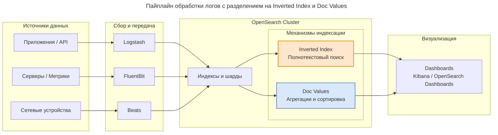

---
aliases:
  - Aggregations
  - Alerting
  - Alerting Plugin
  - Audit
  - Beats
  - Dashboard
  - Data Prepper
  - Doc Values
  - Elastic License
  - Elasticsearch
  - ELK
  - Embedding
  - Encryption
  - EQL
  - ES|QL
  - Faceted search
  - Fluent Bit
  - FluentBit
  - Full-text search
  - Inverted Index
  - k-NN
  - k-NN Plugin
  - Kibana
  - LDAP
  - Logstash
  - Lucene
  - Observability
  - OpenSearch
  - OpenSearch Dashboards
  - Postgres
  - PostgreSQL
  - RAG
  - RBAC
  - REST API
  - SAML
  - Search engine
  - Security Plugin
  - Semantic Search
  - Shard
  - Shards
  - SQL Plugin
  - SSPL
  - Traces
  - Vector search
  - Watcher
  - X-Pack
  - агрегации
  - алертинг
  - аудит
  - векторный поиск
  - дашборд
  - инвертированный индекс
  - наблюдаемость
  - поисковый движок
  - полнотекстовый поиск
  - реплики
  - семантический поиск
  - трейсы
  - фасетный поиск
  - шарды
  - шифрование
  - эмбеддинг
  - эмбеддинги
---
**OpenSearch** — это **поисковый и аналитический движок** с открытым исходным кодом, предназначенный для полнотекстового поиска, анализа логов, метрик и векторного поиска (AI/ML).

> [!success] Elasticsearch
> OpenSearch — это **community-driven форк [[elastic-search|Elasticsearch]] 7.10.2**, созданный в 2021 году после изменения лицензии Elasticsearch на SSPL. OpenSearch сохранил лицензию **Apache 2.0** и развивается независимо.

---

## Для чего нужен

| Сценарий                 | Описание                                                           |
| ------------------------ | ------------------------------------------------------------------ |
| **Полнотекстовый поиск** | Нечёткий поиск, автодополнение, фасеты, релевантность              |
| **Observability**        | Централизованный сбор и анализ логов, метрик, трейсов (замена ELK) |
| **Векторный поиск**      | Хранение эмбеддингов для RAG, семантический поиск, k-NN            |
| **Безопасность и аудит** | Встроенные RBAC, SAML/LDAP, шифрование, audit log (бесплатно!)     |
| **Аналитика данных**     | Агрегации, дашборды, алертинг                                      |

---

## Как работает (архитектура)



**Ключевые компоненты:**

- **Lucene** — низкоуровневый движок индексации и поиска
- **Inverted Index** — маппинг термин → документы (быстрый полнотекстовый поиск)
- **Doc Values** — колоночное хранение (быстрые агрегации и сортировки)
- **Shards & Replicas** — горизонтальное масштабирование и отказоустойчивость
- **REST API** — все операции через HTTP/JSON

---

## OpenSearch vs Elasticsearch

| Критерий | OpenSearch | Elasticsearch |
|----------|-----------|---------------|
| **Лицензия** | Apache 2.0 | SSPL / Elastic License |
| **Security (RBAC, Audit)** | Бесплатно | Платно (X-Pack Basic+) |
| **Alerting** | Бесплатно | Платно (Watcher) |
| **Управление** | Community + AWS | Elastic NV |
| **Новые фичи** | Консервативнее | Быстрее (ES\|QL, EQL, ML) |
| **Совместимость** | API ES 7.x | Собственная эволюция |
| **Облако** | Amazon OpenSearch Service | Elastic Cloud |

> **Важно:** Начиная с версии 8.x, API Elasticsearch и OpenSearch **расходятся**. Прямая миграция между новыми версиями требует адаптации.

---

## Экосистема

| Компонент | Аналог в Elastic | Назначение |
|-----------|-----------------|------------|
| **OpenSearch** | Elasticsearch | Поисковый движок |
| **OpenSearch Dashboards** | Kibana | Визуализация и UI |
| **Logstash / Data Prepper** | Logstash | ETL и ingestion |
| **FluentBit / Beats** | Beats | Легковесные агенты |
| **SQL Plugin** | — | SQL-запросы к индексу |
| **k-NN Plugin** | — | Векторный поиск |
| **Security Plugin** | X-Pack Security | RBAC, SAML, LDAP, Audit |
| **Alerting Plugin** | Watcher | Уведомления и триггеры |

---

## Когда выбирать OpenSearch

**Выбирайте, если:**

- Нужен production-grade поиск без лицензионных рисков
- Строите observability-платформу и не хотите платить за X-Pack
- RAG / AI-приложения с векторным поиском
- Миграция с Elasticsearch 7.x без смены API
- Работаете в AWS (Amazon OpenSearch Service — managed)
- Требования compliance (нужен бесплатный аудит и RBAC)

**Не выбирайте, если:**

- Нужны самые новые фичи Elastic (ES|QL, EQL, latest ML)
- Уже глубоко интегрированы в экосистему Elastic 8.x+
- Нужна официальная коммерческая поддержка от вендора (есть, но меньше провайдеров)

---

## Версии и совместимость

| OpenSearch | Базируется на | Совместимость API |
|------------|--------------|-------------------|
| 1.x | ES 7.10.2 | Полная с ES 7.x |
| 2.x | Собственная ветка | Частичная с ES 7.x, расходится с 8.x |
| 3.x (beta) | Новая архитектура | Несовместима с ES |

---

## Быстрый старт (Docker)

Запуск контейнера OpenSearch:

```bash
docker run -d --name opensearch \
  -p 9200:9200 -p 9600:9600 \
  -e "discovery.type=single-node" \
  -e "OPENSEARCH_INITIAL_ADMIN_PASSWORD=MyStr0ngP@ss!" \
  opensearchproject/opensearch:2.18.0
```

Проверка:

```bash
curl -k -u admin:MyStr0ngP@ss! https://localhost:9200
```

## OpenSearch vs Postgres

**PostgreSQL (Postgres)** — классическая реляционная база данных, а **OpenSearch** — поисково-аналитический движок. Они не заменяют друг друга, а часто отлично дополняют.

| Критерий | PostgreSQL | OpenSearch |
|----------|------------|------------|
| **Основная задача и модель данных** | Обработка структурированных данных, транзакционные нагрузки (OLTP): CRUD, JOIN, ACID, транзакции | Поиск и аналитика по полуструктурированным и неструктурированным данным (логи, тексты, JSON), инвертированный индекс на базе Lucene |
| **Масштабируемость** | Вертикальная (добавление CPU, RAM, дисков); горизонтальная (шардинг) требует дополнительных усилий | Изначально распределённая система: добавление узлов автоматически распределяет шарды, обеспечивая горизонтальное масштабирование и отказоустойчивость |
| **Поиск** | Встроенный полнотекстовый поиск для небольших и средних наборов данных | Фасетный поиск, агрегации, подсветка, продвинутые анализаторы, векторный поиск через плагины |
| **Сложность и операционность** | Проще в настройке и управлении для типичных прикладных задач | Требует экспертизы: шардирование, реплики, мониторинг кластера, настройка памяти |
| **Типичные сценарии** | CRM, ERP, банковские системы, где критична целостность данных | Лог-аналитика (ELK-стек), поисковые интерфейсы, мониторинг инфраструктуры, дашборды на больших объёмах телеметрии |

### Совместное использование

Часто встречается паттерн: **PostgreSQL** как источник истины для транзакционных данных, а **OpenSearch** — как отдельный слой для поиска и аналитики по этим данным. Данные из Postgres можно периодически или в реальном времени синхронизировать в OpenSearch.

### Критерии выбора

Необходимо оценить, что важнее: строгая целостность и транзакции или скорость и гибкость поиска по большим объёмам. Если первое — берите Postgres, если второе (особенно при росте данных) — OpenSearch, если нужны оба свойства — комбинируйте.

---
