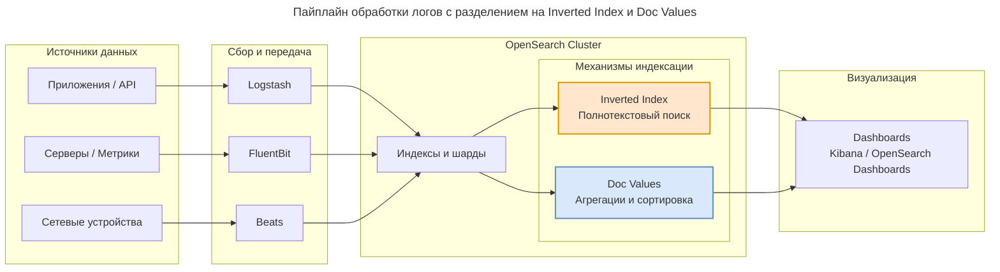

---
aliases:
  - Data Prepper
  - k-NN
  - Logstash
  - OpenSearch
  - OpenSearch Dashboards
  - OpenSearch Service
---

**OpenSearch** — это **поисковый и аналитический движок** с открытым исходным кодом, предназначенный для полнотекстового поиска, анализа логов, метрик и векторного поиска (AI/ML).

Это **community-driven форк [[Elasticsearch]] 7.10.2**, созданный в 2021 году после изменения лицензии Elasticsearch на SSPL. OpenSearch сохранил лицензию **Apache 2.0** и развивается независимо.

---

## Для чего нужен

| Сценарий | Описание |
|----------|----------|
| **Полнотекстовый поиск** | Нечёткий поиск, автодополнение, фасеты, релевантность |
| **Observability** | Централизованный сбор и анализ логов, метрик, трейсов (замена ELK) |
| **Векторный поиск** | Хранение эмбеддингов для RAG, семантический поиск, k-NN |
| **Безопасность и аудит** | Встроенные RBAC, SAML/LDAP, шифрование, audit log (бесплатно!) |
| **Аналитика данных** | Агрегации, дашборды, алертинг |

---

## Как работает (архитектура)



**Ключевые компоненты:**

- **Lucene** — низкоуровневый движок индексации и поиска
- **Inverted Index** — маппинг термин → документы (быстрый полнотекстовый поиск)
- **Doc Values** — колоночное хранение (быстрые агрегации и сортировки)
- **Shards & Replicas** — горизонтальное масштабирование и отказоустойчивость
- **REST API** — все операции через HTTP/JSON

---

## OpenSearch vs Elasticsearch

| Критерий | OpenSearch | Elasticsearch |
|----------|-----------|---------------|
| **Лицензия** | Apache 2.0 | SSPL / Elastic License |
| **Security (RBAC, Audit)** | Бесплатно | Платно (X-Pack Basic+) |
| **Alerting** | Бесплатно | Платно (Watcher) |
| **Управление** | Community + AWS | Elastic NV |
| **Новые фичи** | Консервативнее | Быстрее (ES\|QL, EQL, ML) |
| **Совместимость** | API ES 7.x | Собственная эволюция |
| **Облако** | Amazon OpenSearch Service | Elastic Cloud |

> **Важно:** Начиная с версии 8.x, API Elasticsearch и OpenSearch **расходятся**. Прямая миграция между новыми версиями требует адаптации.

---

## Экосистема

| Компонент | Аналог в Elastic | Назначение |
|-----------|-----------------|------------|
| **OpenSearch** | Elasticsearch | Поисковый движок |
| **OpenSearch Dashboards** | Kibana | Визуализация и UI |
| **Logstash / Data Prepper** | Logstash | ETL и ingestion |
| **FluentBit / Beats** | Beats | Легковесные агенты |
| **SQL Plugin** | — | SQL-запросы к индексу |
| **k-NN Plugin** | — | Векторный поиск |
| **Security Plugin** | X-Pack Security | RBAC, SAML, LDAP, Audit |
| **Alerting Plugin** | Watcher | Уведомления и триггеры |

---

## Когда выбирать OpenSearch

**Выбирайте, если:**

- Нужен production-grade поиск без лицензионных рисков
- Строите observability-платформу и не хотите платить за X-Pack
- RAG / AI-приложения с векторным поиском
- Миграция с Elasticsearch 7.x без смены API
- Работаете в AWS (Amazon OpenSearch Service — managed)
- Требования compliance (нужен бесплатный аудит и RBAC)

**Не выбирайте, если:**

- Нужны самые новые фичи Elastic (ES|QL, EQL, latest ML)
- Уже глубоко интегрированы в экосистему Elastic 8.x+
- Нужна официальная коммерческая поддержка от вендора (есть, но меньше провайдеров)

---

## Версии и совместимость

| OpenSearch | Базируется на | Совместимость API |
|------------|--------------|-------------------|
| 1.x | ES 7.10.2 | Полная с ES 7.x |
| 2.x | Собственная ветка | Частичная с ES 7.x, расходится с 8.x |
| 3.x (beta) | Новая архитектура | Несовместима с ES |

---

## Быстрый старт (Docker)

```bash
docker run -d --name opensearch \
  -p 9200:9200 -p 9600:9600 \
  -e "discovery.type=single-node" \
  -e "OPENSEARCH_INITIAL_ADMIN_PASSWORD=MyStr0ngP@ss!" \
  opensearchproject/opensearch:2.18.0
```

Проверка:

```bash
curl -k -u admin:MyStr0ngP@ss! https://localhost:9200
```

## OpenSearch vs Postgres

**PostgreSQL (Postgres)** — классическая реляционная база данных, а **OpenSearch** — поисково-аналитический движок. Они не заменяют друг друга, а часто отлично дополняют.

### 1. Основная задача и модель данных

- **PostgreSQL** создан для работы со **структурированными данными**. Он отлично справляется с транзакционными нагрузками (OLTP): CRUD-операции, сложные JOIN, строгая целостность данных (ACID), транзакции.
- **OpenSearch** заточен под **поиск и аналитику**, особенно когда данные полуструктурированные или неструктурированные (логи, тексты, JSON). Он использует инвертированный индекс (на базе Lucene), чтобы очень быстро находить фрагменты текста и делать сложные агрегации.

### 2. Масштабируемость

- **PostgreSQL** хорошо масштабируется вертикально (добавляем CPU, RAM, диски). Для горизонтального масштабирования (шардинг) нужны дополнительные усилия и инструменты.
- **OpenSearch** изначально построен как **распределённая система**. Вы просто добавляете узлы в кластер — и система сама распределяет данные (шарды), обеспечивая горизонтальное масштабирование и отказоустойчивость. Это критично для больших объёмов (миллионы записей и выше).

### 3. Поиск

- В **PostgreSQL** есть встроенная функция полнотекстового поиска. Она удобна для небольших и средних наборов данных, но при росте объёма или при необходимости очень сложных сценариев (фасетный поиск, подсветка совпадений, продвинутые анализаторы) может стать узким местом.
- **OpenSearch** предлагает мощную экосистему для поиска: фасетный поиск, агрегации, подсветку, продвинутые анализаторы текста. Плюс в последних версиях через плагины добавлена поддержка **векторного поиска** (для ИИ-задач: семантический поиск, рекомендации).

### 4. Сложность и операционность

- **PostgreSQL** проще в настройке и управлении для типичных прикладных задач.
- **OpenSearch** из-за распределённой архитектуры требует больше экспертизы: нужно продумывать шардирование, реплики, мониторинг кластера, настройку памяти (чтобы не было «thrashing» при векторных запросах).

### 5. Типичные сценарии использования

- **PostgreSQL** — ваш выбор для CRM, ERP, банковских систем, где критична целостность данных и нужны сложные транзакции.
- **OpenSearch** идеален для лог-аналитики (ELK-стек, но с OpenSearch вместо Elasticsearch), поисковых интерфейсов, мониторинга инфраструктуры, построения дашбордов на больших объёмах телеметрии.

### Совмещение

Часто встречается паттерн: **PostgreSQL** как источник истины для транзакционных данных, а **OpenSearch** — как отдельный слой для поиска и аналитики по этим данным. Данные из Postgres можно периодически или в реальном времени синхронизировать в OpenSearch.

### Как принять решение?

Спросите себя: что для вас важнее — строгая целостность и транзакции или скорость и гибкость поиска по большим объёмам? Если первое — берите Postgres. Если второе (особенно при росте данных) — OpenSearch. Если нужны оба свойства — комбинируйте.
