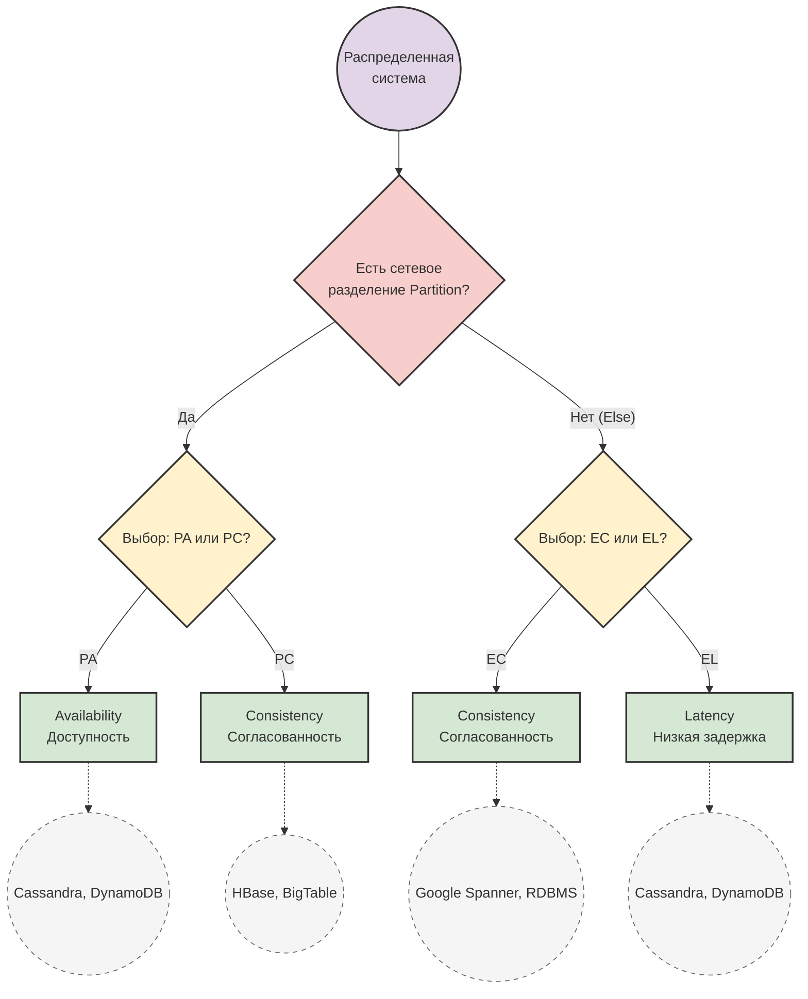

---
aliases:
  - PACELC
---
**PACELC** — это расширение теоремы [[cap-theorem|CAP]], которое описывает компромиссы в распределённых системах не только во время сетевых сбоев, но и в нормальном режиме работы.

## Расшифровка акронима:
- **P** (Partition) — разделение сети.
- **A** (Availability) — доступность.
- **C** (Consistency) — согласованность.
- **E** (Else) — иначе (когда разделения сети нет).
- **L** (Latency) — задержка отклика.
- **C** (Consistency) — согласованность.

## Два сценария выбора:
1. **Если есть разделение сети (P)**: система должна выбрать между Доступностью (**A**) и Согласованностью (**C**). Это классическая дилемма теоремы CAP.
2. **Иначе (E)**, когда сеть работает нормально: система должна выбрать между Низкой задержкой (**L**) и Согласованностью (**C**).

## Почему это важно?
Теорема CAP описывает только поведение системы *при сбоях*. PACELC добавляет критически важное наблюдение: даже в идеальных условиях обеспечение строгой согласованности (например, через синхронную репликацию или блокировки) неизбежно увеличивает задержку (Latency).

## Примеры архитектур:
- **PA/EL** (жертвует C в обоих случаях): Amazon DynamoDB, Apache Cassandra. При сбое остаются доступными, а в нормальном режиме отдают данные быстро, допуская временную рассинхронизацию.
- **PC/EC** (жертвует A и L ради C): Google Spanner, традиционные реляционные СУБД (PostgreSQL, MySQL с синхронной репликацией). Гарантируют строгую согласованность всегда, ценой возможной недоступности при сбое или более высокой задержки в норме.

**Итог:** PACELC даёт более полную и реалистичную картину для проектирования распределённых систем, напоминая, что компромисс между скоростью и точностью данных существует всегда.

Вот графическое представление теоремы PACELC в виде диаграммы принятия решений:

**Краткая легенда:**
- **PA/PC**: При сбое сети выбираем между доступностью (PA) и согласованностью (PC).
- **EC/EL**: В штатном режиме выбираем между строгой согласованностью (EC) и низкой задержкой (EL).
