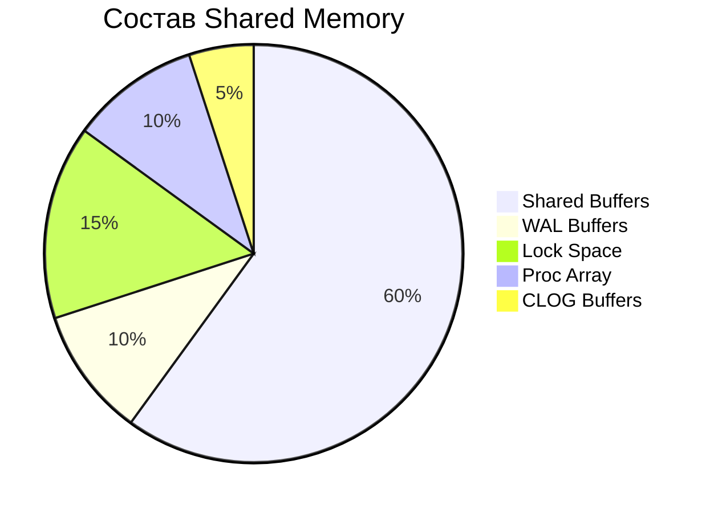

---
aliases:
  - PG
  - PgBouncer
  - PL/pgSQL
  - Postgre
  - Postgres
  - PostgreSQL
  - Реляционная база данных
---

## PostgreSQL

### Команда Explain

| Команда       | Описание                                                                             |
| ------------- | ------------------------------------------------------------------------------------ |
| **`EXPLAIN`** | Показывает **предполагаемый план** выполнения запроса (без реального выполнения).    |
| **`ANALYZE`** | **Выполняет запрос** и добавляет в вывод реальные метрики (время, количество строк). |

**Пример**

```sql
-- Только план (без выполнения)
EXPLAIN SELECT * FROM users WHERE id = 1;
-- План + реальные метрики (запрос выполняется)
EXPLAIN ANALYZE SELECT * FROM users WHERE age > 30;
```

```text
Seq Scan on users (cost=0.00..15.00 rows=500 width=68)
                  (actual time=0.012..0.245 rows=500 loops=1)
  Filter: (age > 30)
  Rows Removed by Filter: 500
Planning Time: 0.045 ms
Execution Time: 0.267 ms
```

```sql
-- План + все метрики (запрос выполняется)
EXPLAIN (ANALYZE, BUFFERS, VERBOSE, FORMAT JSON) SELECT * FROM users WHERE age > 30;
```

```json
{
  "Plan": {
    "Node Type": "Seq Scan",
    "Parallel Aware": false,
    "Relation Name": "users",
    "Alias": "users",
    "Startup Cost": 0.00,
    "Total Cost": 22.50,
    "Plan Rows": 500,
    "Plan Width": 120,
    "Actual Startup Time": 0.025,
    "Actual Total Time": 0.150,
    "Actual Rows": 450,
    "Actual Loops": 1,
    "Output": ["id", "name", "age", "email", "... другие столбцы ..."],
    "Filter": "(age > 30)",
    "Rows Removed by Filter": 50,
    "Shared Hit Blocks": 10,
    "Shared Read Blocks": 2,
    "Shared Dirtied Blocks": 0,
    "Shared Written Blocks": 0,
    "Local Hit Blocks": 0,
    "Local Read Blocks": 0,
    "Local Dirtied Blocks": 0,
    "Local Written Blocks": 0,
    "Temp Read Blocks": 0,
    "Temp Written Blocks": 0
  },
  "Planning Time": 0.125,
  "Execution Time": 0.175
}
```

**Разделы вывода плана запроса**

1. Дерево операций:
   - **`Seq Scan`** — тип сканирования (последовательное чтение таблицы).
   - **`cost=0.00..15.00`** — оценка стоимости (условные единицы):
     - `0.00` — стоимость начала операции.
     - `15.00` — общая стоимость.
     - **`rows=500`** — ожидаемое количество строк.
2. Фильтрация и потери:
   - **`Filter: (age > 30)`** — условие, применённое к данным.
   - **`Rows Removed by Filter: 500`** — сколько строк отброшено из-за условия.
3. План-фактный анализ времени выполнения:
   - `Planning Time` — время, затраченное на построение плана.
4. Метрика **`ANALYZE`** добавляет к плану фактические данные:
   - `actual time=0.012..0.245` — реальное время выполнения (в миллисекундах):
     - `0.012` — время до первой строки.
     - `0.245` — время до последней строки.
   - `rows=500` — реальное количество возвращённых строк.
   - `loops=1` — сколько раз выполнялась операция.
   - `Execution Time` — общее время выполнения запроса.
5. Метрика **`BUFFERS`**: `Buffers: shared hit=10 read=5`:
   - `shared hit` — данные взяты из кэша PostgreSQL.
   - `read` — данные прочитаны с диска (медленнее).
6. Метрика **`VERBOSE`** добавляет имена столбцов, типы данных и т.п.
7. Метрика **`FORMAT`** позволяет выбрать вывод `TEXT` (по умолчанию), `JSON`, `YAML`.

> [!tip] Выполнить `VACUUM ANALYZE` перед `EXPLAIN`
> **`VACUUM ANALYZE`** обновляет статистику таблицы, что помогает планировщику запроса выбирать оптимальный план.
> Без актуальной статистики `EXPLAIN ANALYZE` может показывать неточные `cost` и `rows`.

#### Проблемы и решения

| **Симптом**                        | **Причина**               | **Решение**                              |
| ---------------------------------- | ------------------------- | ---------------------------------------- |
| **Высокий `cost`**                 | Плохой план запроса.      | Добавьте индекс, перепишите запрос.      |
| **Много `Rows Removed by Filter`** | Неэффективная фильтрация. | Добавьте индекс на условие (`age`).      |
| **`read` > `shared hit`**          | Мало данных в кэше.       | Увеличьте `shared_buffers`.              |
| **Долгий `Execution Time`**        | Ресурсоёмкий запрос.      | Оптимизируйте JOIN, `ORDER BY`, `LIMIT`. |

### Методы поиска строки по условию

| **Тип сканирования** | **Когда используется?** | **Оптимизация** | **Скорость** |
| -------------------- | ----------------------- | --------------- | ------------ |
| **Seq Scan** | Нет индекса или много строк | Добавить индекс, увеличить `work_mem` | Самый медленный, так как требует последовательного сканирования всей таблицы, независимо от того, нужны ли все строки |
| **Index Scan** | Точечные/диапазонные запросы | Оптимизировать индекс | Достаточно быстрый, так как использует индекс для нахождения нужных строк, но может потребовать обращения к таблице для получения всех необходимых столбцов |
| **Index-Only Scan** | Все данные есть в индексе | Создать покрывающий индекс | Быстрый, так как извлекает данные непосредственно из индекса, не обращаясь к таблице, если все запрашиваемые столбцы есть в индексе |
| **Bitmap Scan** | Множественные условия (`OR`, `AND`) | Переписать запрос, добавить индекс | Относительно быстрый, поскольку использует битовую карту для поиска соответствующих строк в таблице, что позволяет обрабатывать большие объёмы данных |
| **Tid Scan** | Работа с `ctid` | Редко требует оптимизации | Наиболее быстрый, так как использует прямой доступ к кортежу по его идентификатору (TID), что позволяет сразу найти нужную строку в таблице |
| **Parallel Scan** | Большие таблицы + параллельные запросы | Настроить `max_parallel_workers_per_gather` | Скорость зависит от количества параллельных процессов, которые могут быть запущены для сканирования таблицы. В целом, параллельное сканирование может быть быстрее последовательного |

1. **`Seq Scan`** — медленно, но эффективно для больших таблиц без индексов.
2. **`Index Scan`** — быстро для точечных запросов.
3. **`Index-Only Scan`** — самый быстрый, если все данные есть в индексе и не происходит обращений в таблицу.
4. **`Bitmap Scan`** — компромисс между `Seq Scan` и `Index Scan`. При данном методе сканирования таблица структурируется на страницы, по страницам создаётся битовая карта.
5. **`Parallel Scan`** — ускоряет обработку больших данных.

Расположение типов сканирования в порядке убывания скорости:

```text
Tid Scan → Index-Only Scan → Bitmap Scan → Index Scan → Parallel Scan → Seq Scan
```

#### Bitmap Scan

Вначале создаётся битовая карта, на которой отмечены страницы, которые могут содержать строки, соответствующие фильтру, после чего происходит линейное сканирование каждой страницы.

Фазы сканирования битовой карты:

1. **Bitmap Index Scan**:
   - PostgreSQL читает индекс и создаёт битовую карту, где каждый бит соответствует странице (блоку) данных в таблице.
   - Бит устанавливается в 1, если на странице есть хотя бы одна строка, удовлетворяющая условию.
2. **Bitmap Heap Scan**:
   - Система последовательно читает только те страницы таблицы, которые помечены в битовой карте.
   - Для каждой загруженной страницы проверяются отдельные строки на соответствие условиям.
3. **Recheck** (при необходимости):
   - Дополнительная проверка условий для строк в отобранных страницах.

> **Совет:** Всегда проверяйте план запроса через `EXPLAIN ANALYZE`, чтобы понять, какой тип сканирования используется, и оптимизируйте индексы/запросы под вашу нагрузку.

### Write-Ahead Logging (WAL)

Write-Ahead Logging (WAL) — это фундаментальный механизм PostgreSQL, обеспечивающий надёжность и целостность данных.

Основные задачи WAL:

1. **Восстановление после сбоя** — при перезапуске после аварии PostgreSQL анализирует WAL-логи и повторяет зафиксированные транзакции.
2. **Репликация данных**.
3. Обеспечение **транзакционной целостности**.
4. **Point-in-Time Recovery (PITR)** — механизм восстановления базы до заданной даты/транзакции.

**Как работает WAL**


1. Транзакция изменяет данные в буферах памяти.
   > `WAL Buffer` — буфер в shared memory для временного хранения записей
2. PostgreSQL записывает изменения в WAL (на диск).
3. Позже обновляет основные файлы данных (heap-файлы).

**Структура WAL-записей**

Каждая запись содержит достаточно информации для повторения операции, в т.ч.:

- Идентификатор транзакции `txid`
- Изменяемые блоки данных `tid`
- Старые и новые значения

### Point-in-Time Recovery (PITR)

Point-in-Time Recovery (PITR) — это механизм восстановления PostgreSQL до **любого конкретного момента времени** с точностью до транзакции.

Как работает: на базовый бэкап будут добавлены все транзакции из WAL.

PITR — это «последняя линия обороны» базы данных. При правильной настройке он позволяет откатить даже катастрофические изменения с минимальными потерями данных.

### Shared Memory — разделяемая память

Shared Memory (разделяемая память) — это специальный сегмент оперативной памяти, который используется PostgreSQL для **эффективного взаимодействия между процессами**. Это критически важный компонент архитектуры СУБД.

**Структура Shared Memory**

PostgreSQL организует shared memory в несколько основных областей:

| Компонент | Описание |
| --------- | -------- |
| **Shared Buffers** | Кэш данных (страницы таблиц/индексов) |
| **WAL Buffer** | Буфер для записей WAL (Write-Ahead Logging) |
| **Lock Space** | Хранение информации о блокировках |
| **Proc Array** | Данные о активных процессах/транзакциях |
| **CLOG Buffer** | Кэш статусов транзакций (committed/aborted) |
| **MultiXact Buffers** | Данные о мультитранзакциях (для сложных блокировок) |
| **Cached Plans** | Кэшированные планы запросов |



### Файловая структура PostgreSQL

```plain
$PGDATA/                          # Корневой каталог кластера PostgreSQL
│
├── base/                         # Основные данные всех баз данных
│   ├── <database_oid>/           # Каталог конкретной БД (OID из pg_database)
│   │   ├── <table_oid>           # Основной файл таблицы (heap-файл)
│   │   ├── <table_oid>_toast     # TOAST-таблица для больших значений
│   │   ├── <table_oid>_idx1      # Файл первого индекса таблицы
│   │   ├── <table_oid>_idx2      # Файл второго индекса таблицы
│   │   ├── pg_filenode.map       # Соответствие OID → имена файлов
│   │   └── pg_internal.init      # Кеш системного каталога для БД
│   └── <oid_template0>/          # Специальная БД template0
│   └── <oid_template1>/          # Специальная БД template1
│
├── global/                       # Глобальные системные таблицы
│   ├── pg_control                # Контрольная информация кластера
│   ├── pg_filenode.map           # Глобальный маппинг OID → имена файлов
│   ├── pg_internal.init          # Глобальный кеш системного каталога
│   ├── pg_authid                 # Данные аутентификации
│   └── pg_database               # Информация о базах данных
│
├── pg_wal/                       # WAL-логи (Write-Ahead Logging)
│   ├── 000000010000000000000001  # Сегмент WAL (16MB)
│   ├── 000000010000000000000002  # Следующий сегмент
│   ├── archive_status/           # Статус архивированных WAL-файлов
│   │   ├─ <wal_segment_oid>.done # Успешно архивирован
│   │   └─ <wal_segment_oid>.ready# Готов к архивации
│   └── *.history                 # История временных шкал (timeline)
│
├── pg_tblspc/                    # Табличные пространства
│   └── 12345 →/path/tablespace1  # Симлинк к внешнему табличному пространству
│
├── pg_stat_tmp/                  # Временная статистика активности
│   ├── db_0.stat                 # Статистика по БД
│   └── global.stat               # Глобальная статистика
│
├── pg_replslot/                  # Слоты репликации
│   └── slot_name/                # Именованный слот репликации
│       ├── state                 # Состояние слота
│       └── xid-N-lsn             # Информация о позиции репликации
│
├── pg_snapshots/                 # Снимки данных
│   └── 0A/                       # Идентификатор снимка
│       └── xid-N-lsn             # Информация о снимке
│
├── postmaster.pid                # PID главного процесса и параметры
├── postmaster.opts               # Параметры запуска сервера
├── pg_hba.conf                   # Настройки аутентификации хостов
├── pg_ident.conf                 # Маппинг пользователей
├── postgresql.conf               # Основные настройки сервера
├── postgresql.auto.conf          # Автоматически генерируемые настройки
├── standby.signal                # Файл для перевода в режим standby
├── recovery.signal               # Файл для режима восстановления
├── recovery.conf                 # Параметры восстановления (устарел в v12+)
├── backup_label                  # Информация о резервном копировании
└── PG_VERSION                    # Версия PostgreSQL
```

**Шаблоны баз данных**

- `template1` используется как **шаблон по умолчанию** при создании новых баз данных:
  - всё содержимое переносится при вызове `CREATE DATABASE new_db;`
  - `template1` можно изменить и настроить под задачу.
- `template0` предназначен для восстановления в случае коррупции template1. Не изменяется в отличие от template1.

**Симлинк к внешнему табличному пространству**

Символическая ссылка, которая связывает:

- каталог внутри `$PGDATA/pg_tblspc/` (например, `12345`) с физическим путём к внешнему хранилищу (например, /mnt/ssd/pg_tablespace1) вне каталога $PGDATA;
- например, `$PGDATA/pg_tblspc/12345 -> /mnt/ssd/pg_tablespace1`.

**`pg_stat_tmp` — временная статистика активности**

Временная статистика активности — это набор служебных данных, которые PostgreSQL собирает в реальном времени для мониторинга и оптимизации работы сервера. Эти данные хранятся в каталоге `$PGDATA/pg_stat_tmp/`.

**Replication Slots — слоты репликации**

Слоты репликации — это механизм PostgreSQL, который гарантирует сохранение WAL-логов (Write-Ahead Logs), необходимых для репликации, даже если реплика временно недоступна. Механизм слотов обеспечивает:

- гарантированную доставку WAL-логов;
- управление жизненным циклом логов.

#### Heap Files — файловое хранение PostgreSQL

```plain
База данных (base/<db_oid>/)
│
├── Файлы таблиц (Heap Files) (<table_oid>)
│   ├── Страницы (8KB блоки)
│   │   └── Строки (Tuples)
│   │       ├── Заголовок (HeapTupleHeader)
│   │       └── Данные столбцов
│   │
│   └── TOAST-файлы (<table_oid>_toast)
│
├── Файлы индексов (<table_oid>_idx1, <table_oid>_idx2...)
│   └── Страницы индекса (8KB блоки)
│       ├── Мета-информация (для B-tree)
│       ├── Внутренние узлы
│       └── Листовые узлы (ключ + TID)
│
└── Visibility map файлы (<table_oid>_vm)
```

> *oid — Object Identifier*
> например, `base/16384/12345_56789`, где 16384 — oid БД, 12345 — oid таблицы, 56789 — oid PK

**Основные файлы таблиц — Heap Files**

- Расположение: `base/<database_oid>/<table_oid>`
- Каждая версия строки хранится **в том же файле**, что и текущие данные
- Каждая таблица имеет минимум один файл
- При превышении 1GB создаётся новый файл (`table_oid.1`, `table_oid.2` и т.д.)

**Страницы heap-файлов**

Файлы структурированы в страницы (блоки по 8КБ):

```plain
+------------------------+
| Заголовок страницы     | -- LSN, флаги, указатель на свободное пространство
+------------------------+
| Массив указателей      | -- ItemId array (смещения строк в странице)
+------------------------+
| Свободное пространство |
+------------------------+
| Строки данных          | -- Версии строк (включая старые для MVCC)
| ├─ Версия строки 1     |
| ├─ ...                 |
| └─ Версия строки n     |
+------------------------+
```

**Строки Tuples**

```plain
+---------------------+
| HeapTupleHeader     | -- xmin, xmax, ctid, флаги (23 байта)
+---------------------+
| NULL bitmap         | -- Опционально (1 бит на столбец)
+---------------------+
| Данные столбцов     | -- Значения в порядке объявления в таблице
+---------------------+
```

- Максимальный размер ~6KB (из-за ограничений страницы)
- Большие значения выносятся в TOAST
- NULL-bitmap:
  - если в таблице есть NULL, добавляется NULL bitmap (1 бит на столбец);
  - NULL не занимает место в данных столбца.
- Данные столбцов:
  - значения хранятся **подряд** внутри строки;
  - порядок соответствует определению таблицы.

**TOAST-файлы (для больших значений)**

- Для значений, не помещающихся в страницу
- Расположение: `base/<database_oid>/<table_oid>_toast`

**The Oversized-Attribute Storage Technique — TOAST**

Механизм PostgreSQL для эффективного хранения значений, которые слишком велики для обычных страниц данных (обычно > 2KB):

- **автоматическое сжатие и разделение** больших значений;
- **вынос данных за пределы** основной таблицы;
- **прозрачность** — работает автоматически без участия пользователя.

**TOAST-стратегии**

PostgreSQL использует 4 стратегии, определяемые при создании таблицы:

| Стратегия | Код | Действие | Пример использования |
| --------- | --- | -------- | -------------------- |
| `PLAIN` | `p` | Запрет TOAST (хранение inline) | `CREATE TABLE (...) WITH (toast_tuple_target=0)` |
| `EXTENDED` | `e` | Сжатие + вынос (по умолчанию) | Большинство типов данных |
| `EXTERNAL` | `x` | Вынос без сжатия | `TEXT`, `BYTEA` |
| `MAIN` | `m` | Попытка inline, потом сжатие/вынос | Редкие случаи |

**Управление TOAST**

```sql
-- Просмотр TOAST-статистики:
SELECT
  relname,
  pg_size_pretty(pg_total_relation_size(reltoastrelid)) AS toast_size
FROM pg_class
WHERE relkind = 'r' AND reltoastrelid <> 0;

-- Изменение стратегии:
ALTER TABLE table_name ALTER COLUMN column_name SET STORAGE EXTERNAL;

-- Принудительная очистка:
VACUUM FULL table_name;  -- Очищает основную TOAST-таблицу
VACUUM FULL VERBOSE ANALYZE table_name;  -- Полная перезапись
```

**Файлы индексов**

Мета-информация и структура индексов зависят от [[index|типа индекса]].

**Visibility map файлы**

Visibility Map (карта видимости) — это специальная битовая карта, которая **оптимизирует работу механизма MVCC** в PostgreSQL, отмечая страницы данных, где все строки видны всем активным транзакциям. Это критически важный компонент для производительности.

**Назначение Visibility map:**

- **ускорение VACUUM**: помечает страницы, которые не нужно проверять;
- **оптимизация Index-Only Scan**: позволяет использовать только индекс без чтения heap-файла;
- **снижение нагрузки на I/O**: уменьшает количество чтений при проверке видимости строк.

Пример:

```plain
Страницы таблицы: [0][1][2][3][4][5][6][7]
Visibility Map:   1 0 1 1 0 1 0 1  (биты)
```

- Страницы 0, 2, 3, 5, 7 можно пропускать при VACUUM
- Страницы 1, 4, 6 требуют проверки

### Multiversion Concurrency Control — MVCC

При изменении (update/delete) данных PostgreSQL происходит многоэтапный процесс, оптимизированный для производительности и поддержки MVCC (Multiversion Concurrency Control).

- При выполнении DELETE-команды Postgres не удаляет строку, а помечает её как «удалённую» (устанавливает флаг xmax в заголовке строки). Старая версия остаётся на месте (для MVCC).
- При изменении строки создаётся новая версия, а в ctid указывается ссылка на актуальную версию строки.

Версии строк, создаваемые механизмом MVCC, хранятся **непосредственно в файлах данных таблиц**, но с особым организационным подходом.

- Каждая версия строки хранится **в том же файле**, что и текущие данные
- Старые версии остаются на месте до очистки VACUUM

MVCC распространяется на все операции, которые изменяют данные либо влияют на их видимость: DML, TCL.

Манипуляция версиями происходит через поля `txid`, `ctid`, `xmin`, `xmax`, `snapshot`:

- `snapshot` — слепок данных, который создаётся при выполнении TCL BEGIN
- `xmax` **Transaction ID Maximum** — ID транзакции, которая **удалила** или **заменила** эту версию
- `xmin` **Transaction ID Minimum** — ID транзакции, которая **создала** эту версию строки
- `ctid` **Current Tuple ID** — физическое расположение строки в формате `(page_number, tuple_index)`
- **Флаги** (удалена, заморожена и др.)

**Freeze-процесс**

Для предотвращения переполнения ID транзакций:

- старые версии помечаются специальным флагом FROZEN;
- хранятся в тех же файлах с xmin=2 (специальное значение).

#### Операция VACUUM

**`VACUUM`**

- Помечает пространство как доступное для новых данных
- Не возвращает память операционной системе

**`VACUUM FULL`**

- Полностью перезаписывает таблицу
- Возвращает память ОС
- Блокирует таблицу на время выполнения

**AUTOVACUUM**

Фоновый процесс, который:

- регулярно проверяет таблицы на наличие «мёртвых» строк;
- автоматически выполняет VACUUM для таких таблиц;
- предотвращает накопление «мёртвых» строк.

**Особые случаи**

- `TRUNCATE` — удаляет все строки сразу, минуя MVCC (быстрее, но не поддерживает ROLLBACK)
- Очистка от старых версий (freeze) — при длительной работе БД старые версии «замораживаются»

### Кэширование — shared buffers

Буферный кэш **Shared Buffers** — это область оперативной памяти, выделенная PostgreSQL для хранения часто используемых данных и уменьшения количества обращений к диску. Это ключевой механизм ускорения работы СУБД.

- **Shared Buffers** — выделяется при старте PostgreSQL (настраивается в `postgresql.conf`).
- **Дополнительно** используется кэш файловой системы ОС (если данных больше, чем `shared_buffers`).
- **Кэш данных** для хранения часто используемых страниц таблиц и индексов.
- Основной механизм ускорения доступа к данным.

#### Управление кэшем

Оптимальная настройка `shared_buffers` и мониторинг `hit_ratio` критически важны для производительности.

**1. Настройка размера (`shared_buffers`)**

```ini
## postgresql.conf
# Рекомендуется 25-40% от RAM для сервера БД
shared_buffers = 4GB

# Ориентировочный размер доступной памяти (shared buffers + OS cache)
effective_cache_size = 12GB
# Память для операций сортировки и хэширования
work_mem = 64MB
# Память для операций обслуживания (VACUUM, CREATE INDEX)
maintenance_work_mem = 1GB
```

- **Слишком мало** → частые чтения с диска → медленные запросы.
- **Слишком много** → конкуренция с кэшем ОС → неэффективное использование памяти.

**2. Предзагрузка данных (`pg_prewarm`)**

```sql
CREATE EXTENSION pg_prewarm;
SELECT pg_prewarm('таблица');  -- Загружает таблицу в кэш при старте
```

**3. Мониторинг эффективности**

```sql
-- Hit Ratio (доля попаданий в кэш)
SELECT
    sum(heap_blks_read) AS disk_reads,
    sum(heap_blks_hit) AS cache_hits,
    round(sum(heap_blks_hit) / (sum(heap_blks_hit) + sum(heap_blks_read)), 4) AS hit_ratio
FROM pg_statio_user_tables;

-- Какие таблицы в кэше?
SELECT c.relname AS table_name, count(*) AS buffers_used
FROM pg_buffercache b
JOIN pg_class c ON b.relfilenode = c.relfilenode
GROUP BY c.relname
ORDER BY 2 DESC;

-- Просмотр статистики буферного кэша
SELECT * FROM pg_buffercache;
```

- **Hit Ratio > 0.99** — отлично (почти все данные в памяти).
- **Hit Ratio < 0.90** — нужно увеличить `shared_buffers` или оптимизировать запросы.

#### Как работает буферный кэш?

1. **Хранение страниц данных**
   - PostgreSQL хранит данные в виде **страниц (блоков)** по 8 КБ.
   - Эти страницы копируются с диска в буферный кэш при первом чтении.
   - Последующие запросы к тем же данным обращаются уже к кэшу, а не к диску.
2. **Механизм чтения/записи**
   - **Чтение**: если данные есть в кэше — PostgreSQL берёт их оттуда. Если нет — загружает с диска.
   - **Запись**: сначала изменения вносятся в буферный кэш, а затем асинхронно сбрасываются на диск (через **Checkpointer** и **Background Writer**).
3. **Алгоритм вытеснения (LRU)**
   - Когда кэш заполнен, PostgreSQL вытесняет редко используемые страницы по алгоритму **LRU (Least Recently Used)**.
   - Важные данные (например, часто запрашиваемые индексы) остаются в памяти.

PostgreSQL использует **буферный кэш** (shared buffers) для хранения часто используемых данных в памяти. Это многоуровневая система:

1. **Shared Buffers** (основной кэш):
   - общая область памяти для всех процессов сервера;
   - хранит страницы таблиц (8KB блоки) и индексов;
   - размер задаётся параметром `shared_buffers`.
2. **Операционная система кэш**:
   - PostgreSQL активно использует файловый кэш ОС;
   - данные, не поместившиеся в shared buffers, кэшируются ОС.
3. **Кэш планов запросов**:
   - хранит скомпилированные планы выполнения запросов;
   - управляется параметрами `plan_cache_mode` и другими;
   - кэш планов запросов хранится на уровне сессий.

**Кэширование планов запросов**

- **Глобального кэша планов** в PostgreSQL нет, но есть **сессионные Prepared Statements**.
- **[[PL-pgSQL|PL/pgSQL]] функции** кешируют планы внутри себя.
- **Настройка `plan_cache_mode`** влияет на выбор generic/custom планов.
- **Пулинг соединений (PgBouncer)** помогает переиспользовать Prepared Statements.

### Query Plan — план запроса

План запроса — это последовательность операций, которую PostgreSQL генерирует для выполнения SQL-запроса. Это «инструкция» СУБД о том, как наиболее эффективно получить запрашиваемые данные.

**Как формируется план запроса?**

1. **Парсинг SQL**
   PostgreSQL разбирает текст запроса и строит синтаксическое дерево.
2. **Анализ и реврайтинг**
   - Проверка прав доступа
   - Преобразование подзапросов (например, `IN` → `JOIN`)
   - Оптимизация логических условий
3. **Планирование**
   Планировщик (Query Planner) рассматривает разные варианты выполнения и выбирает самый эффективный на основе:
   - статистики таблиц (`pg_stats`);
   - наличия индексов;
   - параметров сервера (`work_mem`, `random_page_cost`).
4. **Исполнение**
   Исполнитель (Executor) выполняет запрос по сгенерированному плану.

План запроса в PostgreSQL состоит из набора операций (узлов), которые показывают, как СУБД будет выполнять запрос. Основные типы операций:

**1. Операции доступа к данным (Scan Nodes)**

Эти операции определяют, как PostgreSQL читает данные из таблиц и индексов.

| Операция | Описание | Когда используется |
| -------- | -------- | ------------------ |
| **Seq Scan** | Полное сканирование таблицы | Для маленьких таблиц или неселективных условий |
| **Index Scan** | Чтение через индекс (поиск по ключу) | Когда индекс может эффективно сократить выборку |
| **Index Only Scan** | Чтение только из индекса (без обращения к таблице) | Если все нужные поля есть в индексе |
| **Bitmap Heap Scan** | Использует битовую карту для фильтрации страниц | Для условий с умеренной селективностью |
| **TID Scan** | Чтение по физическому идентификатору строки (CTID) | Для запросов с `WHERE ctid = ...` |
| **Subquery Scan** | Сканирование результата подзапроса | Для вложенных SELECT |
| **Function Scan** | Чтение данных из функции (например, `generate_series`) | Для функций, возвращающих таблицы |

**2. Операции соединения (Join Nodes)**

Определяют, как PostgreSQL объединяет данные из нескольких таблиц.

| Операция | Описание | Когда используется |
| -------- | -------- | ------------------ |
| **Nested Loop** | Вложенные циклы (для каждой строки A ищет в B) | Для маленьких таблиц или с индексами |
| **Hash Join** | Строит хэш-таблицу для одной из таблиц | Для средних/больших таблиц без индексов |
| **Merge Join** | Сортирует обе таблицы и объединяет «потоком» | Когда данные уже отсортированы или есть индекс |
| **Materialize** | Сохраняет результат подзапроса во временной структуре | Для сложных подзапросов |

**3. Операции агрегации и сортировки**

| Операция | Описание | Когда используется |
| -------- | -------- | ------------------ |
| **Sort** | Сортировка результатов (для `ORDER BY`) | При явной сортировке или для Merge Join |
| **HashAggregate** | Группировка через хэш-таблицу (для `GROUP BY`) | Для агрегации без сортировки |
| **GroupAggregate** | Группировка через предварительную сортировку | Когда данные уже отсортированы |
| **WindowAgg** | Оконные функции (`OVER()`, `PARTITION BY`) | Для аналитических запросов |

**4. Операции модификации данных (DML)**

| Операция | Описание |
| -------- | -------- |
| **Insert** | Вставка данных (`INSERT`) |
| **Update** | Обновление данных (`UPDATE`) |
| **Delete** | Удаление данных (`DELETE`) |
| **ModifyTable** | Общий узел для модификации данных |

**5. Прочие операции**

| Операция | Описание |
| -------- | -------- |
| **Limit** | Ограничение числа строк (`LIMIT`) |
| **Unique** | Удаление дубликатов (`DISTINCT`) |
| **Append** | Объединение результатов (`UNION ALL`) |
| **Result** | Возврат константного результата (например, `SELECT 1`) |

#### Query Planner — планировщик запросов

[[rdbms#✅ 6. **Оптимизация запросов и план выполнения**|Планировщик]] (Query Planner) — это ключевой компонент СУБД PostgreSQL, который преобразует SQL-запрос в оптимальный план выполнения, определяя наиболее эффективный способ доступа к данным.

**Основные функции планировщика**

1. **Анализ запроса**: разбор SQL-запроса и определение требуемых операций
2. **Генерация планов**: создание различных вариантов выполнения запроса
3. **Оценка стоимости**: расчёт «стоимости» каждого варианта плана
4. **Выбор оптимального плана**: выбор плана с наименьшей расчётной стоимостью
5. Планировщик запросов **полностью определяет** вывод `EXPLAIN`

### Статистика таблиц в PostgreSQL

PostgreSQL хранит статистику таблиц для оптимизации своей работы, в т.ч. для:

- выбора между последовательным сканированием и использованием индексов;
- оценки количества возвращаемых строк (EXPLAIN);
- выбора алгоритмов соединения таблиц (JOIN);
- эффективности параллельного выполнения запросов.

Статистика хранится в системных каталогах PostgreSQL:

1. **pg_class** — общая информация о таблицах:
   - `reltuples` — оценочное количество строк;
   - `relpages` — количество страниц (блоков по 8KB).
2. **pg_statistic** — детальная статистика о распределении данных:
   - статистика по отдельным столбцам;
   - гистограммы распределения значений;
   - частота встречаемости NULL-значений;
   - корреляции между физическим и логическим порядком.
3. **pg_stats** — удобное представление pg_statistic для пользователей:
   - можно запросить через `SELECT * FROM pg_stats WHERE tablename='your_table'`.

Просмотр статистики:

```sql
-- Общая информация о таблице
SELECT relname, reltuples, relpages FROM pg_class WHERE relname = 'users';
-- Детальная статистика по столбцам
SELECT * FROM pg_stats WHERE tablename = 'users';
-- Статистика по конкретному столбцу
SELECT attname, n_distinct, most_common_vals, histogram_bounds
FROM pg_stats
WHERE tablename = 'users' AND attname = 'age';
```

### PgBouncer — пулинг соединений

**PgBouncer** — это легковесный **менеджер соединений** (connection pooler) для PostgreSQL, который:

- **переиспользует соединения** к БД вместо создания новых для каждого клиента;
- **снижает нагрузку** на сервер PostgreSQL, уменьшая количество процессов;
- **улучшает отзывчивость** приложений, особенно в высоконагруженных сценариях.

**Как работает PgBouncer?**

1. **Приложение подключается** к PgBouncer (а не напрямую к PostgreSQL).
2. **PgBouncer берёт свободное соединение** из пула и перенаправляет запрос.
3. **После выполнения** соединение возвращается в пул (а не закрывается).

**Режимы работы PgBouncer**

| Режим | Описание | Когда использовать |
| ----- | -------- | ------------------ |
| **Session pooling** | Соединение привязано к клиенту на всю сессию | Для долгих транзакций (OLAP) |
| **Transaction pooling** | Соединение возвращается в пул после каждой транзакции | Для коротких запросов (OLTP) |
| **Statement pooling** | Соединение освобождается после каждого запроса | Для микросервисов с быстрыми запросами |

> В большинстве OLTP-сценариев лучше **Transaction pooling**.

### Репликация PostgreSQL

Репликация индексов — это процесс автоматического копирования структуры и данных индексов с **основного сервера (мастера)** на **реплики** в режиме реального времени. В PostgreSQL это часть механизма **Streaming Replication** (потоковой репликации), который обеспечивает синхронизацию не только таблиц, но и связанных с ними индексов.

#### Как работает репликация индексов

1. **На мастере** создаётся или изменяется индекс:
   - `CREATE INDEX idx_users_email ON users(email);`
2. Изменения записываются в WAL (Write-Ahead Log) — журнал транзакций.
3. **WAL-записи потоково передаются на реплики** через механизм **Streaming Replication**.
4. **Реплики применяют изменения**, включая создание/обновление индексов, сохраняя их идентичность мастеру.

Репликация индексов не работает для Hash на PostgreSQL < 10 по причине отсутствия логирования в WAL.

#### Типы репликации, влияющие на индексы

1. **Физическая репликация (Streaming Replication)**
   - Копирует **байт-в-байт** изменения с WAL, включая индексы.
2. **Логическая репликация (Logical Replication)**
   - Передаёт только изменения данных (DML), но **не структуру индексов**.
   - Индексы на реплике нужно создавать вручную или через скрипты.

### TID — Tuple ID

**TID** (Tuple Identifier) — это внутренний уникальный идентификатор строки (кортежа) в таблице PostgreSQL. Он указывает на **физическое расположение строки** в файле данных и используется для быстрого доступа к ней без необходимости сканирования индексов.

- TID может меняться при:
  1. `VACUUM FULL` (перезапись данных);
  2. `UPDATE` (если новая версия строки не помещается в старый блок);
  3. перестройке таблицы.
- Нельзя использовать TID как первичный ключ (он не гарантирует уникальность после изменений).
- Полезен для отладки и оптимизации.
- TID не подходит для бизнес-логики, т.к. может меняться и содержать дубли при перестройке базы.

**TID** — это низкоуровневый идентификатор строки, используемый PostgreSQL для **физического доступа к данным**.

**Структура TID**

TID состоит из двух частей:

- **Номер блока (page number)** — указывает на страницу данных (обычно размером 8 КБ).
- **Смещение в блоке (item pointer)** — позиция строки внутри блока (от 1 до 291).

Формат: `(номер_блока, смещение)`.

Пример: `(42, 3)` — строка находится в 42-м блоке, 3-я по счёту.

**Применение TID**

- Применение TID в индексах (B-Tree, GIN, GiST):
  - индексы хранят пары:
    - **ключ индекса** (например, значение столбца `email`);
    - **TID** — ссылка на физическое место строки в таблице.

  ```sql
  -- Запрос с использованием индекса
  EXPLAIN SELECT * FROM users WHERE id = 100;
  ```

  Вывод:

  ```text
  Index Scan using users_pkey on users  (cost=0.29..8.31 rows=1 width=68)
    Index Cond: (id = 100)
  ```

  Здесь индекс `users_pkey` (B-Tree) находит TID для `id = 100` и сразу переходит к строке.

- Применение TID в системных представлениях:
  - `ctid` — столбец, содержащий TID текущей строки. Можно использовать в запросах:

  ```sql
  SELECT ctid, * FROM users LIMIT 5;
  ```

  Результат:

  ```text
  ctid   | id | name
  -------+----+------
   (0,1) | 1  | Alice
   (0,2) | 2  | Bob
  ```

- Применение TID для оптимизации запросов:

  ```sql
  -- Прямой доступ по TID (быстрее, чем индексное сканирование):
  SELECT * FROM users WHERE ctid = '(42, 3)';
  ```

### Full Text Search — полнотекстовый поиск

Инструменты PostgreSQL для полнотекстового поиска включают:

1. тип **`tsvector`** — подготовленный тип для поиска текста (лексемы + позиции);
2. структура запроса **`tsquery`** — поисковый запрос с условиями (`AND`, `OR`, `NOT`);
3. оператор **`@@`** — оператор проверки соответствия;
4. GIN-индекс — `Generalized Inverted Index` для быстрого поиска на больших данных.

Используйте их для сложного поиска, где `LIKE` и регулярные выражения недостаточны. Для максимальной скорости добавляйте **GIN-индексы**.

Типы `tsvector` и `tsquery` — это специализированные типы данных для **полнотекстового поиска** (FTS — Full Text Search). Они позволяют искать не просто подстроки, а **осмысленные совпадения** с учётом морфологии языка, стоп-слов и ранжирования результатов.

### Операторы PostgreSQL

В зависимости от задачи можно использовать:

- **Арифметические**: `+`, `-`, `*`, `/`, `SQRT`, `CBRT`, `ABS`, …
- **Логические**: `AND`, `OR`, `NOT`.
- **Сравнения**: `=`, `<>`, `!=`, `>`, `<`, `>=`, `<=`, `BETWEEN`, `IS NULL`, `IS DISTINCT FROM`.
  - `<>` / `!=` — не равно.
- **Строковые**: `LIKE`, `~`, `||`, …
  - `CONCAT` — конкатенация строк.
  - `LIKE` — поиск по шаблону (регистрозависимый).
  - `ILIKE` — поиск по шаблону (регистронезависимый).
    - `SELECT 'AbC' ILIKE 'a%';` → `true`
  - `~` — регулярное выражение (POSIX).
  - `~*` — регулярное выражение (регистронезависимое).
  - `!~` — не соответствует регулярному выражению.
  - `SIMILAR TO` — SQL-подобный шаблон.
    - `SELECT 'abc' SIMILAR TO 'a%';` → `true`
  - `SUBSTRING` — извлечение подстроки.
  - `LENGTH` — длина строки.
- **Операции с массивами**:
  - `=` — равенство массивов.
  - `&&` — пересечение массивов.
  - `@>` — содержит массив.
  - `<@` — содержится в массиве.
  - `ARRAY_CAT` — объединение массивов.
  - `ARRAY_LENGTH` — длина массива.
- **JSON-операции** (`->`, `@>`, `||`):
  - `->` — доступ к ключу JSON (возвращает JSON).
  - `->>` — доступ к ключу JSON (возвращает текст).
  - `#>` — доступ по пути (JSON).
  - `#>>` — доступ по пути (текст).
  - `@>` — JSON содержит другой JSON.
  - `<@` — JSON содержится в другом JSON.
  - `jsonb_concat` — объединение JSON.
- **Геометрические**: `<->`, `&&`, `+`, `-`, `*`.
  - Сложение векторов: `SELECT point(1,2) + point(3,4);` → `(4,6)`
  - Умножение на скаляр: `SELECT point(1,2) * 3;` → `(3,6)`
  - Расстояние между объектами: `SELECT point(1,2) <-> point(4,6);` → `5`
  - Пересечение bounding box: `SELECT box '((0,0),(2,2))' && box '((1,1),(3,3))';` → `true`
- **Операции времени**: `+`, `-`, …
  - `OVERLAPS` — проверка пересечения интервалов:
    - `SELECT ('2023-01-01', '2023-01-10') OVERLAPS ('2023-01-05', '2023-01-15');` → `true`
- **Сетевые операции (CIDR, INET)**:
  - `<<` — входит в подсеть.
  - `>>` — содержит подсеть.
  - `&&` — пересечение сетей:
    - `SELECT '192.168.1.0/24'::inet && '192.168.1.128/25'::inet;` → `true`
- **Триграммные** (`%`, `<->`):
  - `<->` — расстояние триграмм: `SELECT 'кот' <-> 'кит';` → `0.66`
  - `%` — проверка схожести строк: `SELECT 'hello' % 'helo';` → `true`
  - `similarity()` — коэффициент схожести: `SELECT similarity('кот', 'кит');` → `0.33`
- **Полнотекстовый поиск** (`@@`):
  - `@@` — соответствие tsquery: `SELECT to_tsvector('hello') @@ to_tsquery('hello');` → `true`
  - Логические операции полнотекстового поиска для типа tsquery:
    - `&&` — И: `SELECT to_tsquery('cat & dog');`
    - `\|` — ИЛИ: `SELECT to_tsquery('cat \| dog');`
    - `!!` — НЕ: `SELECT to_tsquery('!dog');`

#### Содержит `@>` / содержится `<@`

`A @> B` → проверяет, содержит ли `A` все элементы/свойства `B`.

- Например: `ARRAY[1,2,3] @> ARRAY[2,3]` — вернёт true, если массив [1,2,3] включает элементы [2,3].

#### Регулярное выражение `~`

**Применение:**

- Используется для **сопоставления строки с регулярным выражением**.
- Доступны варианты:
  - `~` — чувствительное к регистру сравнение;
  - `~*` — без учёта регистра;
  - `!~` — не соответствует регулярному выражению (с учётом регистра);
  - `!~*` — не соответствует (без учёта регистра).

**Примеры:**

```sql
-- Найти email, содержащий "gmail.com"
SELECT * FROM users WHERE email ~ 'gmail\.com';
-- Найти имена, начинающиеся на "А" (кириллица)
SELECT * FROM users WHERE name ~ '^А';
-- Без учёта регистра
SELECT * FROM articles WHERE title ~* 'postgresql';
```

#### Пересечение множества `&&`

- Проверяет, **пересекаются ли два массива/диапазона/геоданные**.
- Работает с типами:
  - **массивы** (`integer[]`, `text[]`);
  - **диапазоны** (`int4range`, `tsrange`);
  - **геоданные** (полигоны, боксы — `&&` для проверки перекрытия).

**Примеры:**

```sql
-- Найти товары с тегами "electronics" И "sale"
SELECT * FROM products WHERE tags && ARRAY['electronics', 'sale'];
-- Проверить пересечение временных интервалов
SELECT * FROM events WHERE period && '[2023-01-01, 2023-12-31]'::tsrange;
-- Геопересечение: найти полигоны, пересекающиеся с заданным
SELECT * FROM polygons WHERE geom && ST_MakeEnvelope(10, 10, 20, 20);
```

**На что влияет?**

| Параметр | Влияние |
| -------- | ------- |
| **Скорость запроса** | Быстрый, если есть **GIN/GiST-индекс** для массивов/геоданных |
| **Использование индекса** | Требует специализированных индексов (`GIN` для массивов, `GiST` для геоданных) |
| **Гибкость** | Позволяет эффективно работать с составными типами |

**Оптимизация**

```sql
-- Для массивов:
CREATE INDEX idx_products_tags ON products USING GIN (tags);

-- Для геоданных:
CREATE INDEX idx_polygons_geom ON polygons USING GiST (geom);
```

#### Соответствие tsquery `@@`

Оператор `@@` в PostgreSQL используется для **полнотекстового поиска** и проверки соответствия между:

- **типом `tsvector`** (документ с лексемами и их позициями);
- **типом `tsquery`** (поисковый запрос с условиями).

Он возвращает `true`, если `tsvector` соответствует `tsquery`, и `false` в противном случае.

- **Только для `tsvector`/`tsquery`** — не работает с обычным текстом.
- **Языковая зависимость** — результаты зависят от выбранной конфигурации (например, `'english'` игнорирует стоп-слова like "the").
- **Скорость** — без индекса работает медленно на больших данных.
- Требует **GIN/GiST-индексов** для скорости.

**Примеры**

```sql
-- Создание индекса для ускорения
CREATE INDEX idx_articles_content ON articles
USING GIN(to_tsvector('english', content));
-- Запрос с использованием индекса
SELECT title FROM articles
WHERE to_tsvector('english', content) @@ to_tsquery('AI & (neural | network)');
-- to_tsquery автоматически нормализует слова
SELECT to_tsvector('The cats are running') @@ to_tsquery('cat & run');  -- true

CREATE INDEX idx_gist ON table USING GiST(to_tsvector('english', text_column));
SELECT to_tsvector('russian', 'коты бегут') @@ to_tsquery('кот & бежать');  -- true
```

Оператор `@@` проверяет, соответствует ли `tsvector` условию `tsquery`:

```sql
-- Проверка соответствия
SELECT to_tsvector('The cat sits on the mat') @@ to_tsquery('cat & mat') AS result; -- true

-- Поиск в таблице
SELECT title FROM articles
WHERE to_tsvector('english', content) @@ to_tsquery('PostgreSQL & (optimize | tune)');
```

#### Замер расстояния `<->`

**Оператор `<->`** в PostgreSQL используется для вычисления **расстояния** между двумя объектами.

Результат операции замера расстояния зависит от типа данных:

- **Для геометрических типов (`point`, `polygon`)** — вычисляет **евклидово расстояние** между объектами.
- **Для текста (`text`, `varchar`)** — вычисляет расстояние между строками как [[Метрика триграмм|метрику триграмм]]. Используется с расширением `pg_trgm` для **нечёткого поиска**.
- **Для временных типов (`timestamp`, `date`)** — вычисляет разницу в секундах/днях.

**Оптимизация**

- Для ускорения запросов с `<->` используются **GiST** или **SP-GiST** индексы.
- Индекс позволяет PostgreSQL быстро отсекать дальние объекты без полного перебора.
- Без индекса работает за O(N), с GiST — за O(log N).

**Типовые сценарии использования**

1. **Поиск ближайших соседей ([[KNN]])** — например, «найти 5 ближайших кафе к точке».
2. **Кластеризация данных** — группировка схожих объектов.
3. **Рекомендательные системы** — поиск похожих товаров/документов.

**Примеры**

```sql
-- Вычисление расстояния
-- Расстояние между точками (2D)
SELECT point '(1,2)' <-> point '(4,6)' AS distance;
                                            -- Результат: 5 (т.к. √(3² + 4²) = 5)
-- Расстояние от точки до полигона
SELECT point '(1,2)' <-> polygon '((0,0), (3,0), (3,3), (0,3))' AS distance;
-- Расстояние между строками (метрика триграмм)
CREATE EXTENSION pg_trgm;
SELECT 'hello' <-> 'hell' AS similarity;  -- Чем меньше, тем ближе строки
-- Расстояние между датами
SELECT timestamp '2023-01-01' <-> timestamp '2023-01-05' AS days_diff;
                                            -- Результат: 4 дня

-- Использование индекса
-- Для точек
CREATE INDEX idx_points_gist ON points USING GiST(coord);
-- Поиск 3 ближайших точек к (10,20)
SELECT * FROM points
ORDER BY coord <-> point '(10,20)'
LIMIT 3;
```

### Типы данных в PostgreSQL

**Числовые типы**

- `SMALLINT` — целое 2 байта
- `INTEGER (INT)` — целое 4 байта
- `BIGINT` — целое 8 байт
- `DECIMAL(p,s)` — точные числа (фикс. точка)
- `NUMERIC(p,s)` — аналог DECIMAL
- `REAL` — число с плавающей точкой (4 байта)
- `DOUBLE PRECISION` — число с плавающей точкой (8 байт)
- `SERIAL` — автоинкремент (4 байта)
- `BIGSERIAL` — большой автоинкремент (8 байт)

**Строковые типы**

- `CHAR(n)` — фиксированная длина (дополняется пробелами)
- `VARCHAR(n)` — строка переменной длины (до n символов)
- `TEXT` — строка неограниченной длины
- `CITEXT` — регистронезависимый текст (требует citext)

**Бинарные типы**

- `BYTEA` — бинарные данные (аналог BLOB)

**Дата и время**

- `DATE` — дата (год, месяц, день)
- `TIME` — время (часы, минуты, секунды)
- `TIMESTAMP` — дата + время (без таймзоны)
- `TIMESTAMPTZ` — дата + время с таймзоной
- `INTERVAL` — временной интервал

**Логический тип**

- `BOOLEAN` — логическое значение

**Перечисляемые типы (ENUM)**

- `ENUM` — пользовательский список значений

**Составные типы (Composite)**

- Пользовательский тип — создаётся через `CREATE TYPE`:
  - `CREATE TYPE person AS (name TEXT, age INT);`

**JSON-типы**

- `JSON` — текстовый JSON (без валидации)
- `JSONB` — бинарный JSON (оптимизирован)

**Геометрические типы**

- `POINT` — точка на плоскости: `(2.5, 3.8)`
- `LINE` — бесконечная прямая: `{A, B, C}`
- `LSEG` — отрезок: `[(1,1), (2,2)]`
- `BOX` — прямоугольник: `(2,2), (4,4)`
- `PATH` — многоугольник или кривая: `[(1,1), (2,2), (3,1)]`
- `POLYGON` — замкнутый многоугольник: `((0,0), (1,1), (1,0))`
- `CIRCLE` — окружность: `<(0,0), 5>`

**Сетевые типы**

- `CIDR` — IPv4/IPv6 сеть (с маской): `192.168.1.0/24`
- `INET` — IPv4/IPv6 адрес (с маской): `192.168.1.1/24`
- `MACADDR` — MAC-адрес: `08:00:2b:01:02:03`

**Массивы**

- `INT[]` — массив целых чисел: `{1, 2, 3}`
- `TEXT[]` — массив строк: `{"a", "b", "c"}`
- `JSONB[]` — массив JSON-объектов: `[{"a":1}, {"b":2}]`

**Специализированные типы**

- `UUID` — уникальный идентификатор: `a0eebc99-9c0b-4ef8-bb6d-6bb9bd380a11`
- `TSVECTOR` — для полнотекстового поиска: `hello`:1 `world`:2
- `TSQUERY` — поисковый запрос: `hello & world`
- `RANGE` — диапазон (int4range, tsrange): `[2023-01-01, 2023-12-31]`
- `HSTORE` — хранение пар ключ-значение: `"a"=>"1", "b"=>"2"`

#### `tsrange` — диапазон даты и времени

**`tsrange`** — это тип данных в PostgreSQL, предназначенный для хранения **диапазонов дат и времени** (timestamp ranges). Он позволяет эффективно работать с временными интервалами, проверять их пересечение, вхождение и другие операции.

> **Совет**: Для временных рядов с таймзонами используйте `tstzrange`.

Тип `tsrange` полезен в сценариях, где требуется:

- **хранение периодов**: бронирования, рабочие смены, акции;
- **проверка пересечений**: например, избежать двойного бронирования;
- **запросы по временным интервалам**: «Какие события происходят с 10:00 до 12:00?».

**Примеры использования:**

- системы бронирования (отели, билеты);
- логирование временных событий;
- анализ данных временных рядов.

Внутреннее представление `tsrange`:

1. **нижняя граница** (`lower bound`);
2. **верхняя граница** (`upper bound`);
3. **флаги включения/исключения границ**.

Диапазон задаётся в формате: `[нижняя_граница, верхняя_граница]::tsrange`:

- **`[ ]`** — включает границу;
- **`( )`** — исключает границу.

**Оптимизация**

- Для ускорения запросов используют **GiST-индексы**.

**Примеры**

```sql
-- Основные операции с `tsrange`
-- Создание диапазона
-- Явное приведение
SELECT '[2023-01-01, 2023-01-31]'::tsrange;
-- Через функции
SELECT tsrange('2023-01-01', '2023-01-31', '[]');

-- Проверка пересечения (`&&`)
-- Есть ли пересечение у двух диапазонов?
SELECT tsrange('[2023-01-01, 2023-01-15]') && tsrange('[2023-01-10, 2023-01-20]');
-- Результат: true

-- Проверка вхождения (`@>`, `<@`)
-- Содержит ли диапазон дату?
SELECT tsrange('[2023-01-01, 2023-01-31]') @> '2023-01-15'::timestamp;
-- Результат: true
-- Входит ли один диапазон в другой?
SELECT tsrange('[2023-01-10, 2023-01-20]') <@ tsrange('[2023-01-01, 2023-01-31]');
-- Результат: true

-- Получение границ
SELECT
  lower('[2023-01-01, 2023-01-31]'::tsrange) AS start_date,
  upper('[2023-01-01, 2023-01-31]'::tsrange) AS end_date;

-- Длина интервала
SELECT upper(tsrange) - lower(tsrange) AS duration
FROM events;

-- Индексы для `tsrange`
CREATE INDEX idx_booking_dates ON bookings USING GiST(booking_period);

-- Пример запроса с индексом
-- Найти все бронирования, пересекающиеся с 1 января 2023
SELECT * FROM bookings
WHERE booking_period && '[2023-01-01, 2023-01-02]'::tsrange;

-- Пример использования
-- Бронирование комнат
CREATE TABLE bookings (
  id SERIAL PRIMARY KEY,
  room_id INT,
  booking_period TSRANGE,
  EXCLUDE USING GiST (room_id WITH =, booking_period WITH &&)  -- Запрет пересечений
);
-- Попытка добавить пересекающееся бронирование вызовет ошибку
INSERT INTO bookings (room_id, booking_period)
VALUES (1, '[2023-01-01, 2023-01-10]');

-- Анализ временных интервалов
-- Найти все события, которые начались в январе 2023
SELECT * FROM events
WHERE event_period && '[2023-01-01, 2023-02-01)'::tsrange;
```

#### `tsvector` — текстовый вектор

`tsvector` — это структура, которая:

1. разбивает текст на **лексемы** (нормализованные слова, например, "бегут" → "бежать");
2. удаляет **стоп-слова** (артикли, предлоги — "и", "в", "the");
3. сохраняет **позиции лексем** в исходном тексте.

**Пример**

```sql
SELECT to_tsvector('english', 'The quick brown fox jumps over the lazy dog') AS tsvector;
```

Результат:

```text
'brown':3 'dog':9 'fox':4 'jump':5 'lazi':8 'quick':2
```

- Лексемы приведены к базовой форме (`jumps` → `jump`, `lazy` → `lazi`).
- Цифры — позиции слов в тексте.

Тип `tsvector` используется для индексирования текстовых полей (`GIN`/`GiST`-индексы) в комбинации с `tsquery` для поиска.

#### `tsquery` — поисковый запрос

`tsquery` — это структура для:

1. задания условий поиска (`AND`, `OR`, `NOT`);
2. нормализации ключевых слов (аналогично `tsvector`).

**Пример**

```sql
SELECT to_tsquery('english', 'fox & dog') AS tsquery;
```

Результат:

```text
'fox' & 'dog'
```

**Операторы в `tsquery`**

| Оператор | Пример | Описание |
| -------- | ------ | -------- |
| `&` | `'cat & dog'` | И (оба слова должны быть) |
| `\|` | `'cat \| dog'` | ИЛИ (хотя бы одно слово) |
| `!` | `'!dog'` | НЕ (исключить документы с "dog") |
| `()` | `'(cat \| dog) & !mouse'` | Группировка условий |

**Примеры**

```sql
-- Простой поиск
-- Найти статьи о "базах данных" на русском
SELECT title FROM articles
WHERE to_tsvector('russian', content) @@ to_tsquery('база & данных');

-- Поиск с исключением
-- Документы про "кошек", но не "собак"
SELECT * FROM posts
WHERE to_tsvector('russian', text) @@ to_tsquery('кошка & !собака');

-- Комбинированные условия
-- Искать "AI" И ("neural" ИЛИ "network")
SELECT * FROM papers
WHERE to_tsvector('english', abstract) @@ to_tsquery('AI & (neural | network)');
```

#### JSON vs JSONB

В PostgreSQL есть два типа для работы с JSON-данными: **`JSON`** (текстовый формат) и **`JSONB`** (бинарный формат). Они различаются по внутреннему представлению, производительности и функциональности.

> **Совет:** В 95% случаев выбирайте `JSONB` — он поддерживает индексы и операции, критические для производительности. Для логов или аудита, где важен исходный формат, используйте `JSON`.

- **`JSON`** — для «сырого» хранения без обработки.
- **`JSONB`** — для поиска и манипуляций с данными.

**Хранение данных**

| **Критерий** | **JSON** | **JSONB** |
| ------------ | -------- | --------- |
| **Формат** | Текстовый (как строка) | Бинарный (оптимизированная структура) |
| **Порядок ключей** | Сохраняется | Не сохраняется |
| **Пробелы/отступы** | Сохраняются | Удаляются |
| **Дубликаты ключей** | Сохраняются (последний перезаписывает предыдущий) | Ошибка при вставке (если не разрешено) |

**Производительность**

| **Операция** | **JSON** | **JSONB** |
| ------------ | -------- | --------- |
| **Чтение** | Медленнее (парсинг при каждом обращении) | Быстрее (данные уже структурированы) |
| **Запись** | Быстрее (просто текст) | Медленнее (конвертация в бинарный формат) |
| **Индексирование** | Только с `GIN` и `pg_trgm` | Поддерживает `GIN`-индексы (оптимально для поиска) |

**Пример индекса для `JSONB`**

```sql
CREATE INDEX idx_user_profile ON users USING GIN (profile_jsonb);
```

**Доступные операции**

- **Общие для обоих типов**
  - Извлечение значений: `->`, `->>`, `#>`, `#>>`
  - Проверка наличия ключа: `?`, `?|`, `?&`
  - Модификация (PG 12+): `jsonb_set()`, `jsonb_insert()`
- **Только для `JSONB`**
  - **Сравнение**: `=` (у `JSON` нет встроенного сравнения)
  - **Объединение**: `||` (слияние объектов/массивов)
  - **Удаление ключей**: `-` (например, `profile_jsonb - 'old_key'`)

**Ограничения**

- **`JSON`**:
  - нет встроенных операций сравнения;
  - медленный поиск (без индексов `pg_trgm`).
- **`JSONB`**:
  - нет сохранения порядка ключей;
  - большие накладные расходы при вставке.

**Примеры**

```sql
-- Извлечение значения (разные операторы)
SELECT
  '{"a": 1}'::json -> 'a',   -- Возвращает JSON: 1
  '{"a": 1}'::json ->> 'a';  -- Возвращает текст: "1"

-- Объединение JSONB
SELECT '{"a": 1}'::jsonb || '{"b": 2}'::jsonb;  -- {"a": 1, "b": 2}

-- Удаление ключа
SELECT '{"a": 1, "b": 2}'::jsonb - 'a';  -- {"b": 2}

-- Поиск по JSONB
-- Найти пользователей, у которых в профиле есть ключ "premium":
SELECT * FROM users WHERE profile_jsonb ? 'premium';
-- Найти пользователей с role = "admin":
SELECT * FROM users WHERE profile_jsonb @> '{"role": "admin"}';

-- Модификация JSONB
-- Добавить ключ "subscription":
UPDATE users
SET profile_jsonb = jsonb_set(profile_jsonb, '{subscription}', '"premium"')
WHERE id = 1;
-- Удалить ключ "temp":
UPDATE users SET profile_jsonb = profile_jsonb - 'temp';
```

**Sequences в PostgreSQL** — это независимые объекты базы данных, предназначенные для автоматической генерации уникальных числовых значений.

### Sequences

**Основное назначение**

Чаще всего sequences используют для:

- генерации значений первичных ключей (`PRIMARY KEY`);
- создания уникальных идентификаторов записей;
- обеспечения упорядоченной нумерации в различных бизнес-логиках.

**Ключевые особенности**

1. **Независимость от таблиц.** Sequence существует отдельно и может использоваться несколькими таблицами одновременно.
2. **Гарантированная уникальность.** Каждое значение генерируется только один раз в рамках последовательности.
3. **Настраиваемость.** Можно задать шаг, начальное значение, границы и другие параметры.
4. **Производительность.** Механизм кэширования (`CACHE`) уменьшает нагрузку на диск.

**Создание последовательности**

Базовый синтаксис:

```sql
CREATE SEQUENCE [IF NOT EXISTS] seq_name
    [AS data_type]
    [INCREMENT [BY] increment]
    [MINVALUE minvalue | NO MINVALUE]
    [MAXVALUE maxvalue | NO MAXVALUE]
    [START [WITH] start]
    [CACHE cache]
    [[NO] CYCLE]
    [OWNED BY {table_name.column_name | NONE}];
```

**Пример**

```sql
CREATE SEQUENCE user_id_seq
    INCREMENT BY 1
    START WITH 1000
    MINVALUE 1000
    MAXVALUE 999999
    CACHE 10;
```

**Основные функции работы**

1. **`nextval('seq_name')`** — получает и возвращает следующее значение последовательности.

   ```sql
   SELECT nextval('user_id_seq');
   ```

2. **`currval('seq_name')`** — возвращает текущее значение последовательности в текущей сессии (только после вызова `nextval`).
3. **`setval('seq_name', value, is_called)`** — устанавливает текущее значение.

#### Связь с таблицами

Sequence можно привязать к колонке таблицы через параметр `OWNED BY`:

```sql
CREATE SEQUENCE order_seq OWNED BY orders.order_id;
```

При удалении колонки или таблицы последовательность также будет удалена.

**Альтернативы**

Для автогенерации ключей часто используют типы `SERIAL` или `IDENTITY`, которые автоматически создают и управляют последовательностью:

```sql
CREATE TABLE users (
    id SERIAL PRIMARY KEY,
    name VARCHAR(100)
);
```

**Итог:** sequences — гибкий инструмент PostgreSQL для генерации уникальных числовых последовательностей с широкими возможностями настройки и контроля.
