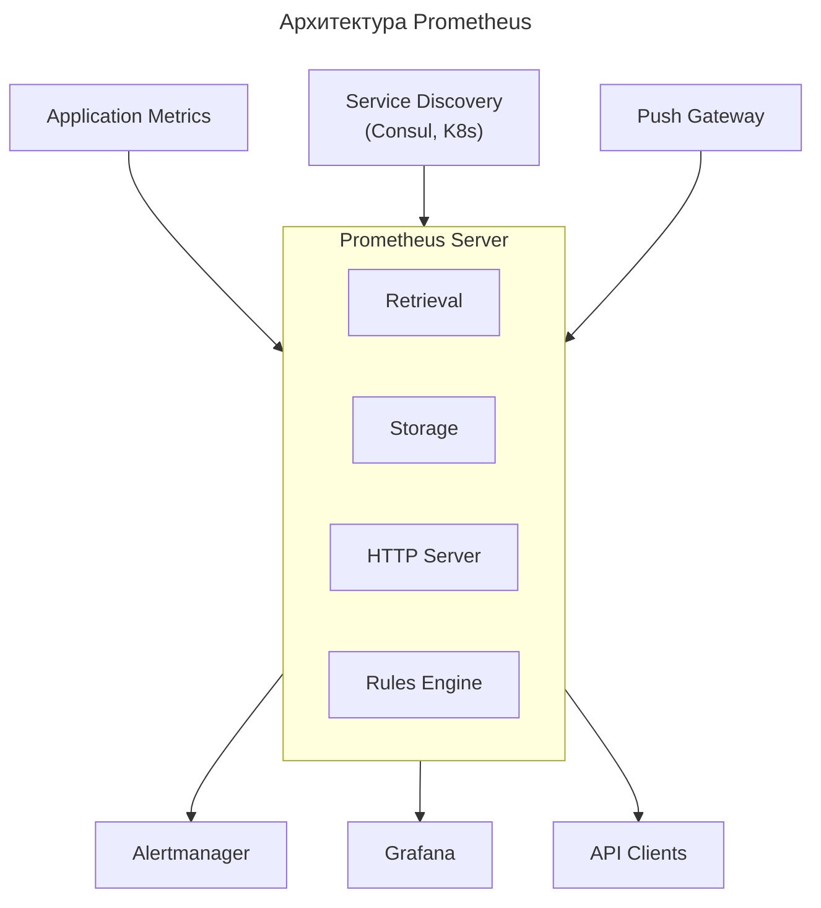

---
aliases:
  - Alertmanager
  - Prometheus
  - PromQL
  - Service Discovery
  - Spring Boot Actuator
  - Time-series database
  - TSDB
  - Метрики
  - Мониторинг
  - Оповещения (Alerting)
  - Система мониторинга
---
**Prometheus** — это open-source система мониторинга и оповещения, первоначально разработанная в SoundCloud в 2012 году. Сегодня это стандарт де-факто для мониторинга в [[cloud-native|Cloud Native]] средах.

## Что такое Prometheus

Это **база данных временных рядов** (time-series database – [[time-series-database|TSDB]]), собранная вокруг мощной модели данных и языка запросов, со простой и надежной архитектурой.

**Ключевые характеристики**
- **Мультимерная модель данных** - данные идентифицируются по имени метрики и набору key-value пар (labels)
- **Эффективный язык запросов** PromQL
- **Автономная работа** - не зависит от распределенных систем
- **HTTP pull модель** - сам собирает метрики с targets
- **Встроенная поддержка service discovery**

---

## Для чего нужен Prometheus

### Сбор метрик

Сбор показателей со всех компонентов системы:

- **Приложения**: бизнес-метрики, ошибки, latency
- **Инфраструктура**: CPU, memory, disk, network
- **Сервисы**: [[data-base|базы данных]], очереди, кэши
- **Конечные пользователи**: user experience metrics

### Хранение временных рядов

```promql
# Пример метрики с labels
http_requests_total{method="POST", handler="/api/users", status="200"}
```

### Анализ и визуализация

- **Язык запросов PromQL** для анализа данных
- **[[grafana|Grafana]]** для визуализации и дашбордов
- **Встроенный Expression Browser**

### Оповещения (Alerting)

```yaml
# Пример правила оповещения
groups:
- name: example
  rules:
  - alert: HighRequestLatency
    expr: job:request_latency_seconds:mean5m{job="myjob"} > 0.5
    for: 10m
    labels:
      severity: page
    annotations:
      summary: "High request latency"
```

### Расследование инцидентов

- Исторические данные для [[Postmortem|Postmortem]] анализа
- Быстрое определение root cause

---

## Архитектура Prometheus



Данные с актуаторов (точнее — с endpoints **Spring Boot Actuator**) попадают в Prometheus по стандартной для этого стека схеме сбора метрик. Разберём пошаговый процесс.

### Что такое Spring Boot Actuator

Это модуль Spring Boot, который:

- добавляет в приложение HTTP‑endpoints с метриками и состоянием (например, `/actuator/metrics`, `/actuator/health`);
- выдаёт данные в формате, понятном Prometheus (через endpoint `/actuator/prometheus`).

### Как настроить экспорт в формат Prometheus

В приложении Spring Boot:

1. Добавьте зависимости:
   ```xml
   <dependency>
       <groupId>org.springframework.boot</groupId>
       <artifactId>spring-boot-starter-actuator</artifactId>
   </dependency>
   <dependency>
       <groupId>io.micrometer</groupId>
       <artifactId>micrometer-registry-prometheus</artifactId>
   </dependency>
   ```

2. В `application.properties` или `application.yml` включите endpoint Prometheus:
   ```properties
   management.endpoints.web.exposure.include=health,info,metrics,prometheus
   management.endpoint.prometheus.enabled=true
   management.metrics.export.prometheus.enabled=true
   ```

3. После запуска приложение будет отдавать метрики по URL:
   `http://<ваш-хост>:<порт>/actuator/prometheus`

### Как Prometheus забирает данные

Prometheus **опрашивает** endpoints по расписанию (через механизм *scraping*).

**Шаги**

**Шаг 1. Конфигурация Prometheus (`prometheus.yml`)**
В секции `scrape_configs` добавьте job для вашего приложения:

```yaml
scrape_configs:
  - job_name: 'spring-boot-app'
    static_configs:
      - targets: ['host.docker.internal:8080']  # адрес и порт вашего приложения
```

Или, если используете сервис‑дисковери (Kubernetes, Consul и т. п.), настройте соответствующий `relabel_config`.

**Шаг 2. Периодический scraping**
Prometheus:

- по расписанию (например, раз в 15 сек) отправляет HTTP‑GET на `http://host:8080/actuator/prometheus`;
- получает текст в формате Prometheus Exposition Format (набор строк `metric_name{labels} value timestamp`);
- сохраняет метрики в свою TSDB.

**Шаг 3. Обработка и хранение**
Prometheus:

- парсит полученные метрики;
- связывает их с метками (`job`, `instance`, добавленными в конфигурации);
- кладёт в хранилище временных рядов.

### Что именно отдаёт Actuator

Endpoint `/actuator/prometheus` возвращает:

- стандартные метрики JVM (память, потоки, GC);
- HTTP‑запросы (количество, длительность, коды ответов);
- метрики кэша, БД, очередей (если подключены);
- кастомные метрики, добавленные в коде через `MeterRegistry`.

Пример строки из ответа:

```text
http_server_requests_seconds_count{method="GET",uri="/api/users",status="200"} 42
```

### Дополнительные настройки (опционально)

- **Аутентификация**: если endpoint защищён, укажите `basic_auth` или `bearer_token` в `scrape_configs`.
- **TLS**: используйте `scheme: https` и настройки сертификатов.
- **Фильтрация метрик**: в `management.metrics.filters` можно включать/исключать конкретные метрики.
- **Сэмплирование**: в больших системах ограничивайте частоту scraping’а или объём метрик.

### Проверка работоспособности

1. Откройте в браузере `http://ваш-хост:порт/actuator/prometheus` — должен увидеть текст с метриками.
2. В интерфейсе Prometheus (`http://prometheus:9090/targets`) проверьте, что endpoint отмечен как *UP*.
3. В Prometheus выполните запрос на любую метрику (например, `http_server_requests_seconds_count`) — должны появиться данные.

### Итог

**Схема потока данных**
1. Spring Boot Actuator → endpoint `/actuator/prometheus` (HTTP).
2. Prometheus → scraping по расписанию (HTTP GET).
3. Prometheus → парсинг, хранение, агрегация метрик.

**Ключевые моменты**
- нужен `micrometer-registry-prometheus` для форматирования;
- в `prometheus.yml` должен быть job, указывающий на endpoint;
- endpoint должен быть доступен и отвечать кодом 200.
