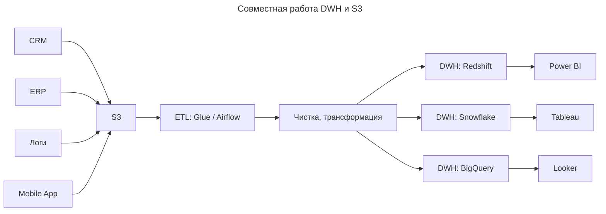
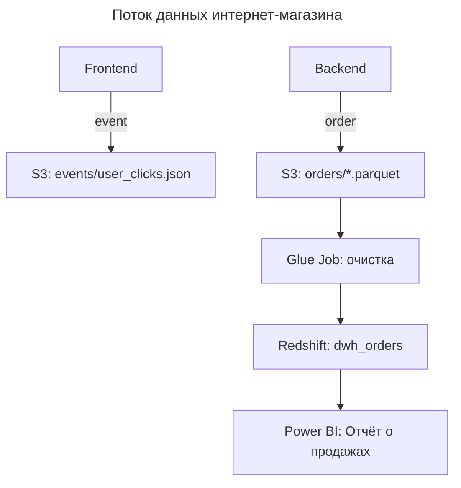

---
aliases:
  - Data Marts
  - Data Vault
  - Data Warehouse
  - Dimension Tables
  - dimensional modeling schemas
  - DV
  - DWH
  - Fact Table
  - Hubs
  - Inmon
  - Kimball
  - Links
  - OLAP
  - Satellites
  - Snowflake Schema
  - Star Schema
  - Витрины данных
  - Звезда
  - Инмон
  - Кимбалл
  - Снежинка
  - Таблица фактов
  - Таблицы измерений
  - Хранилище данных
---
## Cхемы размерного моделирования

> dimensional modeling schemas

Оба подхода относятся к **размерному моделированию** — методологии проектирования хранилищ данных, ориентированной на аналитические запросы ([[OLAP|OLAP]]). Их ключевые общие черты:

- **Центральность таблицы фактов** (Fact Table) — хранит количественные показатели (продажи, количество, суммы).
- **Использование таблиц измерений** (Dimension Tables) — содержат описательную информацию (продукт, время, регион).
- **Ориентированность на бизнес-аналитику** — упрощают построение отчётов и дашбордов.
- **Поддержка агрегации** — оптимизированы для подсчёта сумм, средних, максимумов и т. п.

### Схемы «Звезда» и «Снежинка»

**Звезда (Star Schema)**

Это **денормализованная модель**, где:
- Центральная **таблица фактов** (Fact Table) содержит измерения и метрики.
- Окружают её **таблицы измерений** (Dimension Tables) — по одной на каждый тип данных.

**Пример**

```text
Fact_Sales → Dim_Date, Dim_Product, Dim_Customer
```

**Особенности**
- ✅ Просто понять и использовать
- ✅ Быстрые запросы
- ✅ Подходит для бизнес-аналитики

**Снежинка (Snowflake Schema)**

Это **нормализованная версия звезды**, где таблицы измерений разбиты на подтаблицы.

**Пример**

```text
Fact_Sales → Dim_Customer → Dim_City → Dim_Country
           → Dim_Product → Dim_Category → Dim_Subcategory
```

**Особенности**
- ✅ Высокая целостность данных
- ✅ Меньше дублирования
- ✅ Лучше для больших объёмов данных
- ❌ Сложнее запросы (много JOIN)
- ❌ Медленнее, чем звезда

### Выбор схемы

| Сценарий | Рекомендация |
|----------|--------------|
| Быстрая аналитика, отчёты | **Звезда** |
| Большие объёмы данных, высокая целостность | **Снежинка** |
| Начинающий аналитик | **Звезда** |
| Профессиональный DW-инженер | **Снежинка** |

**Вывод**

**Звезда** — это **простота и скорость**. **Снежинка** — это **целостность и масштабируемость**.

> 💬 _«Star is for speed. Snowflake is for structure.»_

## Методологии проектирования хранилищ данных

> data warehouse design methodologies

Три ключевые модели для построения Data Warehouse:

- **Инмон (Inmon)**
- **Data Vault (DV)**
- **Кимбалл (Kimball)**

Все три подхода:

- решают задачу **централизованного хранения и интеграции данных** из разнородных источников;
- ориентированы на **аналитические нагрузки** (OLAP), а не на транзакционные операции;
- предусматривают **[[ETL|ETL-процессы]]** (Extract, Transform, Load) для загрузки и трансформации данных;
- формируют **единую версию правды** (single source of truth) для бизнес-аналитики и отчётности;
- различаются **уровнем нормализации**, **структурой моделей** и **подходом к интеграции**.

### Модель Инмона — Bill Inmon

Создатель: Bill Inmon #👨. Философия: Top-down, нормализованная, централизованная.

**Основные принципы**
- Сначала строится **центральный, нормализованный репозиторий данных** (Enterprise Data Warehouse — EDW).
- Затем из него создают **данные для бизнеса** (Data Marts).
- Данные хранятся в **нормализованной форме** (3NF и выше).
- Фокус на **целостность, качество, долгосрочное хранение**.

**Пример**

```text
Организация → EDW (нормализованные таблицы) → Data Mart для HR → Отчёты для HR
```

**Особенности**
- ✅ Высокое качество данных
- ✅ Централизованное управление
- ✅ Подходит для больших корпораций
- ❌ Долго строить
- ❌ Тяжело масштабировать
- ❌ Медленно реагирует на изменения бизнеса

### Модель Data Vault — Dan Linstedt

Создатель: Dan Linstedt #👨. Философия: Bottom-up, фактическая, гибкая.

**Основные принципы**
- Строится **снизу вверх** — сначала подключаются источники.
- Использует **три типа таблиц**:
  - **Hubs** — ключи (например, `Customer_Hub`);
  - **Links** — связи между объектами (например, `Order_Link`);
  - **Satellites** — атрибуты (например, `Customer_Satellite`).
- Данные **не нормализуются**, но структурируются логически.
- Поддерживает **историю изменений** ([[data-vault|Data Vault]], slowly changing dimensions).

**Пример**

```text
Источник → HUB (Customer) → LINK (Order) → SATELLITE (Customer_Attributes)
```

**Особенности**
- ✅ Гибкость — легко добавлять новые источники
- ✅ Хранит историю изменений
- ✅ Подходит для больших объёмов данных
- ❌ Сложнее понять
- ❌ Требует специальных навыков
- ❌ Не все знают эту модель

### Модель Кимбалла — Ralph Kimball

Создатель: Ralph Kimball #👨. Философия: Bottom-up, денормализованная, ориентированная на бизнес.

**Основные принципы**
- Сначала строятся **Data Marts** для конкретных бизнес-подразделений.
- Используются **звездные схемы (star schema)**: факты + измерения.
- Данные **денормализованы** — для быстрого чтения.
- Фокус на **отчётах, KPI, аналитике**.

**Пример**

```text
HR Data Mart → Fact_Employee_Hours → Dim_Employee, Dim_Date, Dim_Department
```

**Особенности**
- ✅ Быстро строить
- ✅ Легко понять
- ✅ Идеально для бизнес-аналитики
- ❌ Нет централизации
- ❌ Может быть дублирование данных
- ❌ Сложно масштабировать

### Сравнение методологий

| Критерий | **Инмон** | **Data Vault** | **Кимбалл** |
|----------|-----------|----------------|-------------|
| **Философия** | Top-down | Bottom-up | Bottom-up |
| **Структура** | Нормализованная (3NF+) | Hubs/Links/Satellites | Звёздные схемы (Star Schema) |
| **Фокус** | Целостность, качество | Гибкость, история | Бизнес-аналитика |
| **Скорость развертывания** | Медленно | Средне | Быстро |
| **Масштабируемость** | Хорошо | Отлично | Средне |
| **Подходит для** | Большие корпорации | Big Data, много источников | Бизнес-аналитика, отчёты |
| **Управление данными** | Централизованное | Распределённое | Локальное (по мартам) |
| **Пример использования** | ERP-системы, финансовые отчёты | IoT, CRM, ETL-процессы | Продажи, маркетинг, HR |

### Выбор методологии

| Ваша цель | Рекомендация |
|----------|--------------|
| Построить единую систему для всей компании | **Инмон** |
| Объединить данные из 10+ источников | **Data Vault** |
| Создать отчёт для отдела продаж за 2 недели | **Кимбалл** |
| Хранить историю изменений | **Data Vault** |
| Упростить для бизнеса | **Кимбалл** |
| Гарантировать качество данных | **Инмон** |

**Вывод**

| Модель | Для кого? | Какой стиль? |
|--|----------|---------------|
| **Инмон** | Корпорации, IT-директора | Центральный, строгий |
| **Data Vault** | Big Data, инженеры | Гибкий, исторический |
| **Кимбалл** | Аналитики, бизнес-пользователи | Простой, ориентированный на отчёты |

> 💬 _«Inmon is for control. Kimball is for speed. Data Vault is for flexibility.»_

## [[data-warehouse|Data warehouse]]

**DWH (Data Warehouse)** и **[[S3|S3]] (Amazon S3)** — это два ключевых компонента современных **data-платформ**, но они **разных типов**: один — архитектура, другой — хранилище.

**Что такое DWH**

**DWH (Data Warehouse)** — это **централизованная система хранения и анализа данных**, собранных из разных источников: CRM, ERP, логи, веб-аналитика, мобильные приложения.

**Цель**

Позволить **делать бизнес-отчёты**, **анализировать продажи**, **строить BI-дэшборды**.

**Примеры DWH**

- Amazon Redshift
- Google BigQuery
- Snowflake
- Microsoft Azure Synapse
- Oracle Exadata

**Характеристики DWH**

| Признак | Объяснение |
| --- | --- |
| **[[OLAP|OLAP]]** | Для аналитических запросов (много JOIN, агрегаций) |
| **Схема «звезда» или «снежинка»** | Dimension → Fact |
| **ETL/ELT** | Данные чистятся и загружаются заранее |
| **Высокая производительность для SELECT** | Миллионы строк за секунду |
| **Структурированные данные** | Чёткая схема, типы, метаданные |

**Что такое S3**

**S3 (Simple Storage Service)** — это **объектное хранилище от AWS**, где можно хранить **любые файлы**:
- JSON, CSV, Parquet;
- логи, видео, бэкапы;
- фотографии, дампы БД, JAR-файлы.

**Пример**

```bash
s3://my-company-data/users.json
s3://my-company-data/logs/app.log.2025-04-10.gz
s3://my-company-data/raw/transactions.parquet
```

**Характеристики S3**

| Признак | Объяснение |
|--------|------------|
| **Масштабируемость** | Храните 1 ТБ или 10 Эксабайт — без разницы |
| **Низкая стоимость** | $0.023/ГБ/мес — дешевле, чем HDD |
| **Durability 99.999999999%** | Почти невозможно потерять файл |
| **API доступ** | `PUT`, `GET`, `LIST` через REST |
| **Поддержка [[data-lake|Data Lake]]** | Основа для **Lakehouse** (Redshift Spectrum, Athena) |

**Сравнение DWH vs S3**

| Критерий | **Data Warehouse (DWH)** | **Amazon S3** |
|----------|---------------------------|--------------|
| **Тип** | Аналитическая база данных | Объектное хранилище |
| **Хранение** | Внутренние таблицы | Бакеты + объекты |
| **Формат** | Таблицы, колонки, схема | Произвольные файлы |
| **Цена** | Выше (на вычисления) | Очень низкая (хранение) |
| **Запросы** | Через SQL (SELECT, JOIN) | Только если использовать **Athena, Redshift Spectrum, Spark** |
| **ETL** | Загрузка → очистка → анализ | Хранение сырья → потом обработка |
| **Использование** | Отчётность, BI, Power BI | Data Lake, бэкапы, стейджинг |

> ✅ **S3 — это как склад сырья.**
> **DWH — как цех по переработке.**

### Как они работают вместе

**Схема потока данных**



**Этапы**

1. Все системы пишут сырые данные в **S3**.
2. **ETL-процесс** (например, AWS Glue) преобразует их в структурированный вид.
3. Данные загружаются в **DWH** для анализа.
4. **BI-системы** подключаются к DWH.

**Современная модель: Data Lake на S3 + DWH поверх**

**Lakehouse Architecture**

| Компонент | Роль |
|----------|------|
| **S3** | Хранит **сырые, полусырые, чистые данные** |
| **Glue Catalog / [[Iceberg|Iceberg]] / [[delta-lake|Delta Lake]]** | Управляет схемой |
| **Athena / Spark / Trino** | SQL-запросы прямо к S3 |
| **Redshift / Snowflake** | Мощные запросы, сложная аналитика |

Это гибрид:
- **DWH** — для быстрых BI-запросов;
- **S3** — как data lake.

### Выбор хранилища

| Ваша цель | Используйте |
|----------|-------------|
| Хранить всё | **S3** |
| Быстрые отчёты по продажам | **DWH** |
| Стоимость ниже — лучше | **S3 + Athena** |
| Нужны сложные JOIN и оконные функции | **DWH** |
| Масштабирование до петабайтов | **S3** |
| Реальные пользователи (менеджеры, CEO) | **DWH + Tableau** |
| Архив, бэкапы | **S3** |

**Преимущества комбинации S3 + DWH**

| Плюс | Объяснение |
|------|------------|
| **Разделение сырого и чистого уровня** | S3 = raw, DWH = curated |
| **Гибкость** | Можно менять ETL, не теряя исходные данные |
| **Воспроизводимость** | Все данные в S3 → можно пересобрать историю |
| **Компенсация** | Если DWH упал — есть резерв в S3 |
| **Cost-effective** | Дорогое DWH — только для анализа, дешёвое S3 — для всего остального |

### Пример: интернет-магазин



**S3** — источник всех событий.
**DWH** — готовый набор для BI.

**Вывод**

| | **S3** | **DWH** |
|--|--------|---------|
| **Что?** | Хранилище объектов | Аналитическая база |
| **Какие данные?** | Любые: JSON, Parquet, CSV | Структурированные, оптимизированные |
| **SQL?** | Только с внешним движком (Athena) | Да — встроен |
| **Цена** | Очень низкая | Выше (вычисления + лицензии) |
| **Производительность** | Зависит от движка | Высокая (columnar storage) |
| **Где используется** | Data Lake, бэкапы | BI, аналитика, ML |

> ✅ **S3 — это «где хранится», DWH — «где анализируется»**

**Цитата**

> _«S3 is the new data warehouse landing zone.»_
> — AWS Best Practices

---
