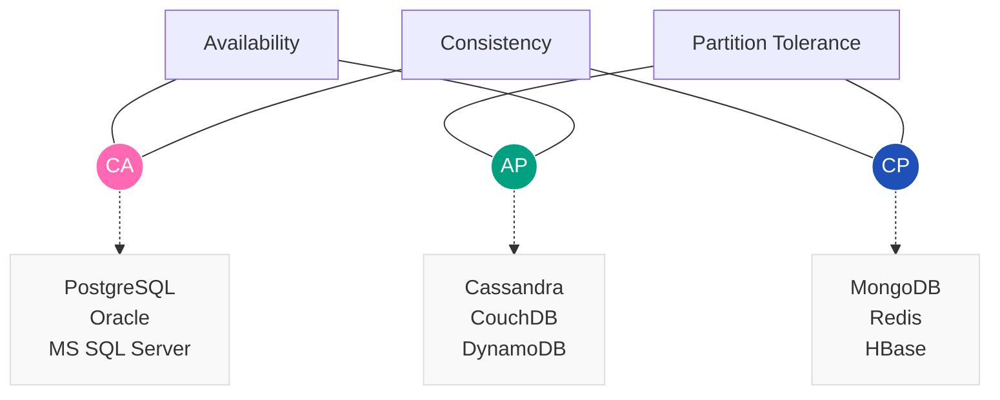
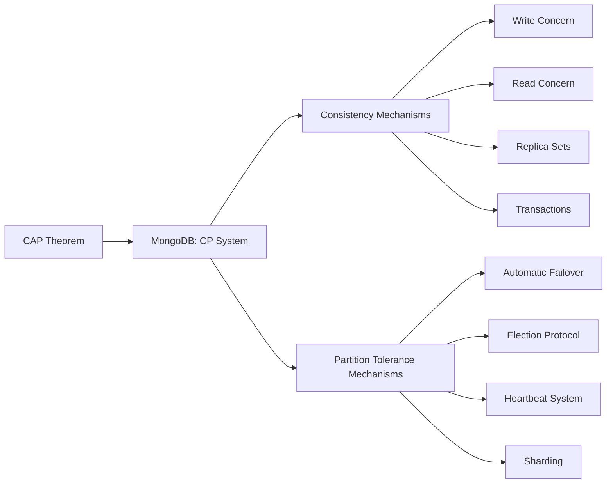
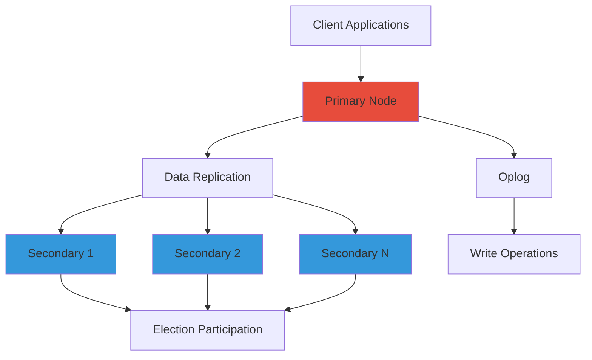
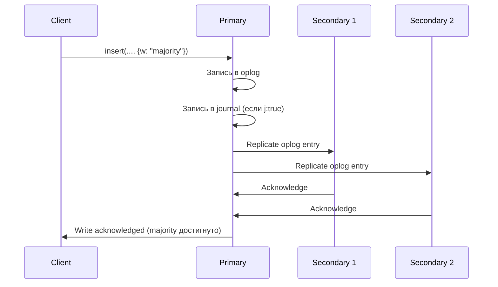
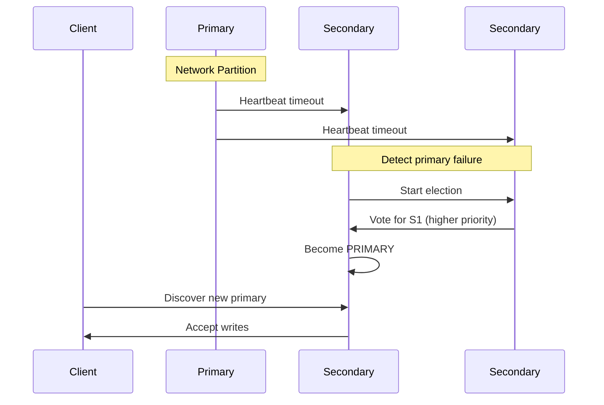
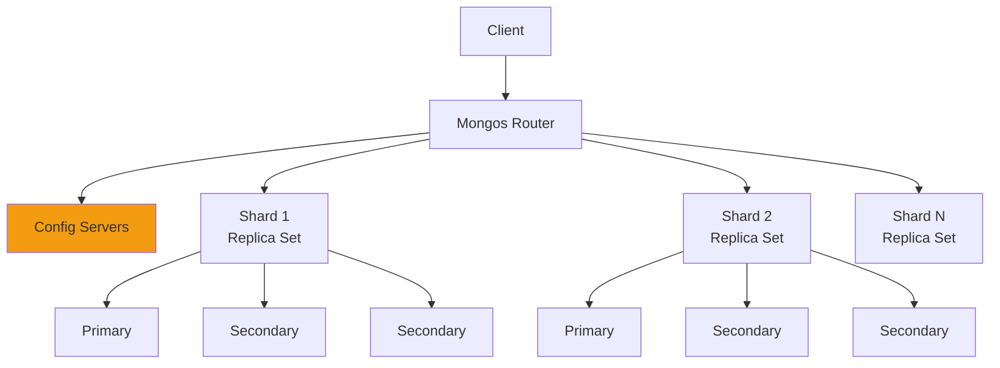
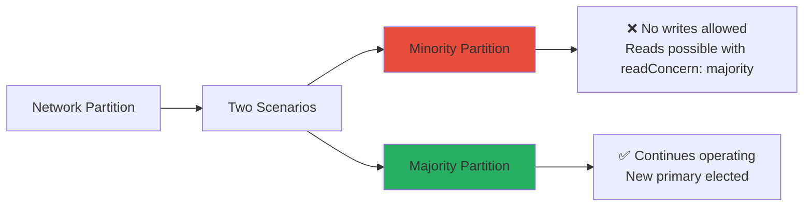

# CAP-теорема

В любой распределенной информационной системе возможно обеспечить не более 2 из 3 следующих свойств

1. **consistency** — **согласованность данных**— во всех вычислительных узлах в один момент времени данные не противоречат друг другу;
2. **availability — доступность** — любой запрос к распределённой системе завершается откликом, однако без гарантии, что ответы всех узлов системы совпадают;
3. **partition tolerance — устойчивость к разделению** — расщепление распределённой системы на несколько изолированных секций не приводит к некорректности отклика от каждой из секций.

Примеры баз данных

consistency +  availability:
* [[PostgreSQL]]
* Oracle
* MS SQL

consistency + partition tolerance
* [[MongoDB]]
* [[Redis]]
* HBase

availability + partition tolerance
* Cassandra
* CouchDB
* DynamoDB





___

## Архитектура обеспечения CP в MongoDB



## 1. **[[Replica Set|Replica Sets]] - основа CP**

### Архитектура [[Replica Set]]


### Конфигурация Replica Set
```javascript
// Инициализация replica set
rs.initiate({
  _id: "rs0",
  members: [
    { _id: 0, host: "mongo1:27017", priority: 2 },
    { _id: 1, host: "mongo2:27017", priority: 1 },
    { _id: 2, host: "mongo3:27017", priority: 1 },
    { _id: 3, host: "mongo4:27017", priority: 0, arbiterOnly: true }
  ],
  settings: {
    "heartbeatTimeoutSecs": 10,
    "electionTimeoutMillis": 10000,
    "catchUpTimeoutMillis": 60000
  }
})
```

## 2. **Write Concern - гарантии записи**

### Уровни Write Concern
```javascript
// 1. Минимальная гарантия (только primary)
db.orders.insert({
  orderId: "123",
  amount: 100
}, { writeConcern: { w: 1 } })

// 2. Majority - гарантия согласованности
db.payments.insert({
  paymentId: "pay789",
  status: "completed"
}, { 
  writeConcern: { 
    w: "majority", 
    j: true,           // Журналирование на диск
    wtimeout: 5000     // Таймаут 5 секунд
  }
})

// 3. Конкретное количество узлов
db.audit.insert({
  event: "user_login",
  timestamp: new Date()
}, { writeConcern: { w: 3, j: true } })
```

### Как работает Write Concern


## 3. **Read Concern - гарантии чтения**

### Уровни Read Concern
```javascript
// 1. Local (по умолчанию) - последние данные primary
db.products.find().readConcern("local")

// 2. Majority - только данные, подтвержденные большинством
db.accounts.find({ balance: { $gt: 0 } })
  .readConcern("majority")

// 3. Linearizable - строгая линейная согласованность
db.criticalConfig.find({ _id: "system" })
  .readConcern("linearizable")

// 4. Snapshot - консистентный снапшот для транзакций
db.orders.find({ status: "pending" })
  .readConcern("snapshot")
```

### Комбинация для сильной согласованности
```javascript
// Гарантия "read-your-writes"
db.users.insert(
  { _id: "user123", name: "John" },
  { writeConcern: { w: "majority", j: true } }
)

// Чтение гарантированно увидит запись
db.users.find({ _id: "user123" })
  .readConcern("majority")
  .readPref("primary")  // Только с primary
```

## 4. **Election Protocol - обеспечение Partition Tolerance**

### Процесс выборов при сетевом разделении


### Критерии выбора Primary
```javascript
// Проверка статуса replica set
rs.status().members.forEach(member => {
  console.log(`Node: ${member.name}`);
  console.log(`- State: ${member.stateStr}`);
  console.log(`- Priority: ${member.priority}`);
  console.log(`- Optime: ${member.optime.ts}`);
  console.log(`- Last heartbeat: ${member.lastHeartbeat}`);
});
```

## 5. **Механизмы обеспечения Consistency**

### Oplog (Operation Log)
```javascript
// Каждая операция записывается в oplog
{
  "ts": Timestamp(1627832147, 1),     // Временная метка
  "h": NumberLong("1234567890"),      // Хэш операции
  "v": 2,                             // Версия
  "op": "u",                          // Тип операции: u=update
  "ns": "bank.accounts",              // Namespace
  "o2": { "_id": "acc123" },          // Критерий поиска
  "o": { "$set": { "balance": 500 } } // Изменения
}
```

### Read Preference + Read Concern комбинации
```javascript
// Сценарий 1: Сильная согласованность
db.products.find()
  .readPref("primary")
  .readConcern("linearizable")

// Сценарий 2: Чтение с secondary с гарантиями
db.products.find()
  .readPref("secondary")
  .readConcern("majority")  // Только данные, реплицированные на большинство

// Сценарий 3: Максимальная доступность
db.products.find()
  .readPref("nearest")
  .readConcern("local")
```

## 6. **Transactions - распределенные транзакции**

### Multi-Document ACID Transactions
```javascript
const session = db.getMongo().startSession();
session.startTransaction({
  readConcern: { level: "snapshot" },
  writeConcern: { w: "majority", j: true },
  readPreference: "primary"
});

try {
  const accounts = session.getDatabase("bank").accounts;
  const transactions = session.getDatabase("bank").transactions;
  
  // Списание со счета отправителя
  accounts.updateOne(
    { _id: "acc1", balance: { $gte: 100 } },
    { $inc: { balance: -100 } }
  );
  
  // Зачисление на счет получателя
  accounts.updateOne(
    { _id: "acc2" },
    { $inc: { balance: 100 } }
  );
  
  // Запись транзакции
  transactions.insertOne({
    from: "acc1",
    to: "acc2", 
    amount: 100,
    timestamp: new Date()
  });
  
  session.commitTransaction();
  console.log("Transaction committed");
} catch (error) {
  session.abortTransaction();
  console.error("Transaction aborted:", error);
}
```

## 7. **Partition Tolerance в шардированном кластере**

### Архитектура шардинга


### Настройки для CP в шардированном кластере
```javascript
// Баллансировка шардов с учетом согласованности
sh.startBalancer();
sh.setBalancerState(true);

// Настройки для операций в шардированном кластере
db.adminCommand({
  setDefaultRWConcern: 1,
  defaultReadConcern: { level: "local" },
  defaultWriteConcern: { w: "majority" }
});
```

## 8. **Heartbeat и обнаружение сетевых разделений**

### Механизм heartbeat
```javascript
// Настройки heartbeat в конфигурации
rs.conf().settings = {
  "heartbeatIntervalMillis": 2000,      // Каждые 2 секунды
  "heartbeatTimeoutSecs": 10,           // Таймаут 10 секунд
  "electionTimeoutMillis": 10000,       // Таймаут выборов 10 секунд
  "catchUpTimeoutMillis": 60000         // Таймаут догона 60 секунд
}
```

### Мониторинг состояния сети
```javascript
// Проверка статуса репликации
db.serverStatus().repl.heartbeatIntervalMs
// 2000

// Статус соединений между узлами
rs.status().members[0].lastHeartbeat
// ISODate("2023-01-01T10:00:00Z")

rs.status().members[0].lastHeartbeatRecv
// ISODate("2023-01-01T10:00:01Z")
```

## 9. **Практические сценарии настройки CP**

### Сценарий 1: Финансовая система
```yaml
# mongod.conf
replication:
  replSetName: "bank-rs"
  oplogSizeMB: 2048
  enableMajorityReadConcern: true

storage:
  journal:
    enabled: true
    commitIntervalMs: 100

writeConcernMajorityJournalDefault: true
```

### Сценарий 2: Электронная коммерция
```javascript
// Заказ с гарантией согласованности
db.orders.insert({
  orderId: "ord-123",
  items: ["item1", "item2"],
  total: 199.99,
  status: "confirmed"
}, {
  writeConcern: {
    w: "majority",
    j: true,
    wtimeout: 10000
  }
});

// Списание库存 с транзакцией
const session = db.getMongo().startSession();
session.startTransaction({
  readConcern: { level: "snapshot" },
  writeConcern: { w: "majority" }
});
```

## 10. **Компромиссы и trade-offs**

### При сетевом разделении



### Настройка времени выборов
```javascript
// Более быстрые выборы (меньшая availability, выше consistency)
settings: {
  "electionTimeoutMillis": 5000,    // 5 секунд
  "heartbeatTimeoutSecs": 5         // 5 секунд
}

// Более устойчивые к временным сбоям сети
settings: {
  "electionTimeoutMillis": 15000,   // 15 секунд  
  "heartbeatTimeoutSecs": 12        // 12 секунд
}
```

## Итог

**MongoDB обеспечивает CP через:**

### ✅ **Consistency:**
- **Write Concern "majority"** - запись подтверждается большинством узлов
- **Read Concern "majority"/"linearizable"** - чтение только согласованных данных
- **Replica Sets** - синхронная репликация через oplog
- **ACID Transactions** - распределенные транзакции

### ✅ **Partition Tolerance:**
- **Automatic Failover** - выбор нового primary при сетевых разделах
- **Election Protocol** - консенсус-based выбор лидера
- **Heartbeat Mechanism** - обнаружение сетевых проблем
- **Replica Sets** - избыточность данных на multiple узлах

### ⚠️ **Компромисс:**
- При сетевых разделах **жертвуется Availability** - minority partition становится недоступной для записи
- **Более строгие гарантии** увеличивают задержки
- **Требуется кворум** для операций записи

MongoDB предоставляет гибкие настройки для балансировки между строгой согласованностью и доступностью в зависимости от требований приложения.