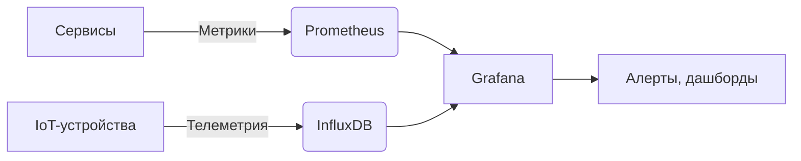

---
aliases:
  - TSDB
  - Time-Series Database
---
**Time-Series Database (TSDB)** — это **специализированная база данных**, оптимизированная для хранения и анализа **временных рядов** — данных, которые **привязаны ко времени**.

> 📊 Пример временного ряда:  
> `2025-05-27 10:00:00 → CPU = 45%`  
> `2025-05-27 10:00:01 → CPU = 47%`  
> `2025-05-27 10:00:02 → CPU = 52%`

---

## 🎯 Зачем нужны TSDB?

Обычные СУБД (PostgreSQL, MySQL) **плохо справляются** с временными рядами, потому что:

- Они не оптимизированы для **массовой вставки** (тысячи/миллионы точек в секунду).
- Хранение временных данных **нецелесообразно**: много дублирующихся меток (`service=api`, `host=server1`).
- Запросы типа **"среднее за последний час по всем хостам"** выполняются медленно.

**TSDB решает эти проблемы**:

✅ **Высокая пропускная способность записи**  
✅ **Эффективное сжатие данных**  
✅ **Оптимизированные запросы по времени**  
✅ **Встроенные функции для анализа временных рядов**

---

## 🧱 Ключевые особенности TSDB

### 1. **Метрика + Метки + Время + Значение**

Каждая запись состоит из:
- **Метрика (measurement)** — что измеряется (`cpu_usage`, `http_requests`)
- **Метки (tags/labels)** — контекст (`host=web01`, `region=eu`, `status=200`)
- **Временная метка (timestamp)** — когда измерено
- **Значение (value)** — само измерение (`45.2`, `1200`)

> 💡 Пример в формате InfluxDB Line Protocol:
> ```
> cpu_usage,host=web01,region=eu value=45.2 1712345678000000000
> ```

---

### 2. **Оптимизация для записи (write-optimized)**

- **Журнал на диске (WAL)** — данные сначала пишутся в журнал → потом в память → затем на диск.
- **Компакция (compaction)** — фоновое объединение мелких файлов в крупные.
- **Columnar storage** — данные хранятся по столбцам (а не по строкам), что ускоряет агрегацию.

→ Возможна **запись миллионов точек в секунду** на один сервер.

---

### 3. **Эффективное сжатие**

- **Временные метки** → дельта-кодирование (`t2 - t1`, `t3 - t2`)
- **Значения** → Gorilla-сжатие (Facebook), delta-of-delta
- **Метки** → словарное сжатие (один раз хранится `host=web01`, далее — ссылки)

> 💾 Пример:  
> 1 млн точек → **в 10–100 раз меньше места**, чем в PostgreSQL.

---

### 4. **Встроенные функции временных рядов**

- `rate()` — скорость изменения (запросов/сек)
- `irate()` — мгновенная скорость
- `avg_over_time()` — среднее за интервал
- `predict_linear()` — линейный прогноз
- `histogram_quantile()` — перцентили

> 📈 Пример запроса (PromQL):
> ```promql
> rate(http_requests_total{job="api"}[5m]) > 100
> ```

---

## 📊 Популярные TSDB

| База данных         | Описание                                           | Используется в                |
| ------------------- | -------------------------------------------------- | ----------------------------- |
| **[[Prometheus]]**  | Пул-архитектура (pull-based), встроенная TSDB      | Мониторинг микросервисов      |
| **InfluxDB**        | Пуш-архитектура (push-based), мощный язык Flux     | IoT, телеметрия               |
| **TimescaleDB**     | Расширение PostgreSQL → SQL + TSDB                 | Аналитика, гибридные нагрузки |
| **VictoriaMetrics** | Высокая производительность, совместимость с PromQL | High-load мониторинг          |
| **OpenTSDB**        | Построена на HBase                                 | Big Data, Hadoop-экосистема   |

---

## 🌐 Где применяются TSDB?

| Сфера | Примеры |
|------|--------|
| **Мониторинг** | CPU, память, latency, ошибки (Prometheus) |
| **IoT** | Датчики температуры, влажности, GPS-треки |
| **Финансы** | Котировки акций, валютные курсы |
| **Аналитика** | Клики, просмотры, события в приложении |
| **Телеметрия** | Логи, метрики, трейсы (OpenTelemetry) |

---

## 🔁 TSDB vs Обычная СУБД

| Характеристика | TSDB | PostgreSQL/MySQL |
|----------------|------|------------------|
| **Запись** | Миллионы точек/сек | Тысячи строк/сек |
| **Чтение по времени** | Очень быстро | Требует индекса, медленнее |
| **Сжатие** | 90–95% | 10–30% |
| **Язык запросов** | PromQL, Flux, SQL | SQL |
| **Масштабирование** | Горизонтальное (шардирование) | Сложнее |

> 💡 **TimescaleDB** — гибрид: остаётся SQL, но с TSDB-оптимизациями.

---

## 📉 Пример архитектуры



---

## ⚠️ Ограничения TSDB

- **Не для транзакций** — нет ACID (кроме TimescaleDB).
- **Не для сложных JOIN'ов** — ориентированы на агрегацию одного ряда.
- **Время — главный ключ** — плохо подходят для данных без временной привязки.

---

## 💡 Заключение

> **TSDB — это "микроскоп для времени"**:  
> она позволяет видеть, как меняется система **миллионы раз в секунду**, и принимать решения на основе этих данных.

Без TSDB не было бы:
- Современного мониторинга (Prometheus + Grafana)
- IoT-платформ
- Финансовой аналитики в реальном времени

> 🚀 Если ваши данные имеют **временную природу** — TSDB почти всегда лучше, чем обычная СУБД.

---
